# 通达OA ispirit上传/gateway包含及补丁分析

## 条目说明

- 对象与具体问题：通达OA；ispirit上传/gateway包含及补丁分析
- 版本、配置及部署条件：11.3实测，其余多个系列来源声明
- 认证与权限前提：未授权；Windows/PHP环境
- 核验边界：已完成原始 Markdown 的文本审阅；未执行 PoC、未访问目标、未视检截图。来源所述影响与复现结果不等于本库独立验证。

## 证据边界与更正

以下记录原始资料的证据边界。可以由原文确定的产品、编号及格式问题已在本条修订；没有原始证据的版本、响应和补丁信息仍待核实。

- 有补丁前后认证及路径过滤对比与官方news/673链接，适合作互补证据
- 所有关键代码/请求主要截图，文字p/P大小写应规范
- 后缀解释称倒数3位，实际看最后点后3位；所述源码待截图核对
- SMB CVE-2020-0796仅推广引用，不能主编号

## 操作风险

文件写入/上传示例可能留下文件、覆盖数据或触发脚本执行。保留原示例供静态分析；仅可在明确授权的隔离测试环境验证，事先准备备份与回滚。

## 技术资料与来源记录

> 本文由 [简悦 SimpRead](http://ksria.com/simpread/) 转码， 原文地址 [mp.weixin.qq.com](https://mp.weixin.qq.com/s/w9k1pi0HtuznKAv9fGgw_g)

更多全球网络安全资讯尽在邑安全

www.eansec.com

一、漏洞简介
------

通达 OA（Office Anywhere 网络智能办公系统）是由北京通达信科科技有限公司自主研发的协同办公自动化软件，是与中国企业管理实践相结合形成的综合管理办公平台。3 月 13 日，通达 OA 在官方论坛发布通告称，近日接到用户反馈遭到勒索病毒攻击，攻击者通过构造恶意请求，上传 webshell 等恶意文件，并对入侵的服务器进行文件加密，勒索高额匿名货币赎金。笔者长期从事二进制漏洞的研究，写此文旨在学习 web 漏洞的研究方法并以此漏洞为实践，强化对 web 漏洞利用技术的认识，记录之。

二、漏洞分析
------

资料显示，该漏洞影响范围较广，影响的版本有：V11 版、2017 版、2016 版、2015 版、2013 增强版、2013 版。

本文为了复现方便，下载使用了通达 OA V11.3 版本。下载链接：

> https://pan.baidu.com/s/1QFAoLxj9pD1bnnq3f4I8lg
> 
> 提取码：ousi

#### 2.1 初步的代码审计

安装好通达 OA v11.3 版本，安装后在 webroot 目录下找到源代码，查看源码，发现都是乱码，都是经过 zend 加密的，需要解密。解密工具可使用 SeayDzend，因为源码是 php 写的，最简单的是用 seay 源码审计工具粗略筛选一下，查找潜在的漏洞，代码审计时间较长，审计结果取了开头一小段，说明思路而已。如图 1 所示：

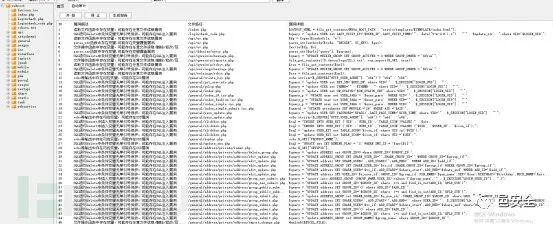

图 1：代码审计

#### 2.2 文件上传漏洞

根据网上公开资料，直接定位到源码路径 C:\phpStudy\WWW\tongdaoa\webroot\ispirit\im\upload.php，查看源码, 如图 2：

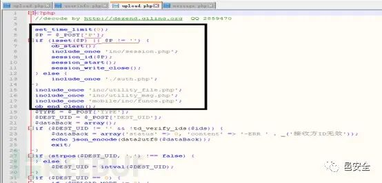

图 2：upload.php 文件上传漏洞源码

该段源码黑框内部分，传入参数 p, 当参数 p 非空时进入会话页面，否则就进入认证页面。该处漏洞比较明显，只要参数 p 非空就可以绕过认证。继续阅读该段代码，绕过认证后就可以直接上传文件。如图 3 所示：

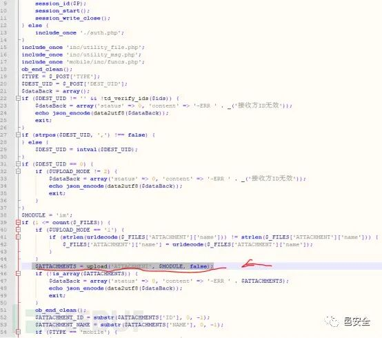

图 3：文件上传

跟进 inc\utility_file.php 的 upload 方法, 发现有个文件名校验函数 is_uploadable。查看该函数的代码逻辑，如果文件名从最后一个位置倒数三个是 “php”，那么返回 false，也就是不可以上传以 php 结尾的文件。参考源码，这里也有多种黑名单绕过的方法，略过。源码如下图 4：

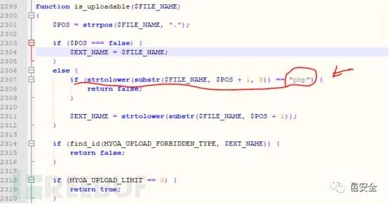

图 4：文件名黑名单

#### 2.3 文件包含漏洞

参考资料，该文件包含漏洞存在于源码 ispirit/interface/gateway.php。查看该处源码，如图 5：

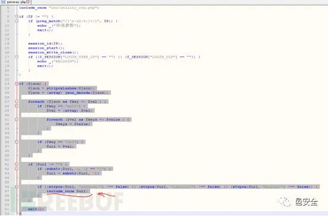

图 5：文件包含漏洞代码

通过 foreach 循环解析 json，如果 key 和 url 相等，那么获得 url, 判断 url 是否为空，如果不为空且 url 中包含 general/、ispirit/、module/，就调用 include_once 函数。试想，如果 url 构造成../../ 类型，执行完文件包含后，就可以访问到我们之前上传的文件了，一个../ 向上一级目录移动一下，两个../ 刚好退到 tongdaoa 的安装目录, 后面紧接着之前上传的文件目录就可以。此处漏洞关键就在于构造 url。

三、漏洞复现
------

#### 3.1 复现环境

测试主机：Win10 x64 english

通达 OA 11.3

抓包软件： Burpsuite v1.737

浏览器 Firefox 41.0

下面我们分别对两个漏洞分别进行复现。

#### 3.2 复现文件上传漏洞

通过通读 upload.php 源码，复现该漏洞需要满足以下条件：

> （1）参数 p 非空；
> 
> （2）DEST_UID 非空且为数字；
> 
> （3）UPLOAD_MODE 为 1 或者 2 或者 3；
> 
> （4）attachment 的文件名不可以为 php；

构造文件上传 payload1 如图 6：

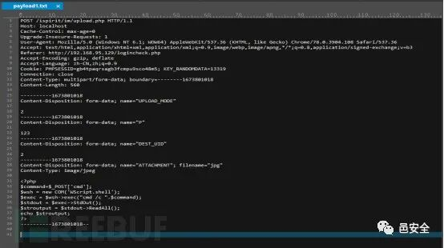

图 6：文件上传 payload1

用 Burpsuite 抓包，修改当前 payload 为 payload1 并重放，文件上传成功。如图 7 所示：

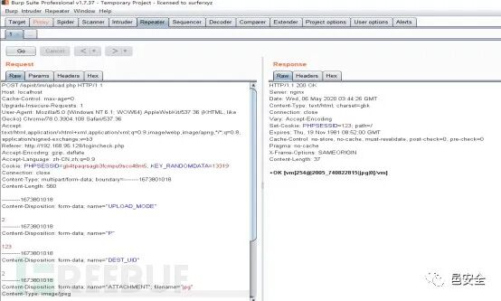

图 7：文件上传复现

上传的文件保存在目录 c:\phpstudy/www/tongdaoa/attach/im/2005 / 路径下，如图 8 所示：

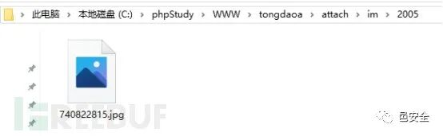

图 8：上传成功

验证文件上传成功。此时有一个问题，就是上传的文件不在 webroot 目录下，远程是访问不了的。这是需要配合另一个漏洞 - 文件包含漏洞来完成路径穿越，访问到上传的文件。

#### 3.3 复现文件包含漏洞

按照之前代码分析，主要是构造 url 的 payload。假设访问 http://localhost/ispirit/interface/gateway.php, 用 burpsuite 截包，发送到 repeater, 构造文件包含漏洞的 payload2，payload2 里注意两处，一处是增加 Content-Type: application/x-www-form-urlencoded，另一处是 json 处 url 的构造。如图 9 所示，文件包含漏洞执行成功。

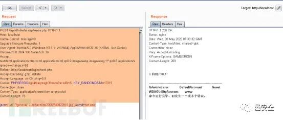

图 9：文件包含漏洞复现

#### 3.4 获取目标 shell

两个漏洞结合使用，可以远程获取 shell。提前准备好 php 木马以及冰蝎等远程连 shell 工具。思路：利用文件上传漏洞上传 php 木马，然后再利用文件包含漏洞，使得 web 访问到该 php 文件，再用冰蝎连接。(注意：不可以直接为. php, 根据代码分析结果，结尾为 php 的文件上传不上去）如图 10 所示：

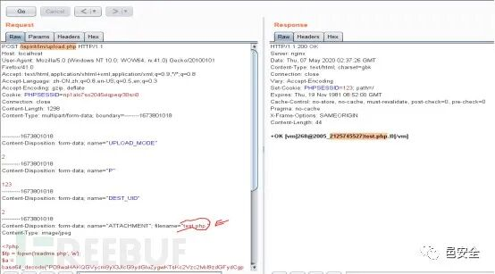

图 10：获取 shell 步骤 1

在文件夹路径 “C:\phpStudy\WWW\tongdaoa\attach\im\2005” 下找到了该文件，上传成功。如图 11：

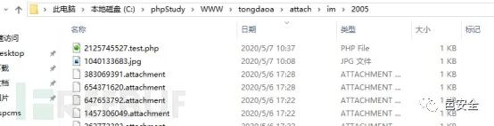

图 11：上传成功

然后通过文件包含漏洞访问到刚刚上传的 2125745527.test.php 文件。如图 12 所示：

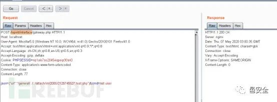

图 12：访问已上传的文件

访问成功后，在 \ ispirit\interface\ 目录下会生成 readme.php , 用冰蝎 webshell 连接，成功获取 shell。如图 13：

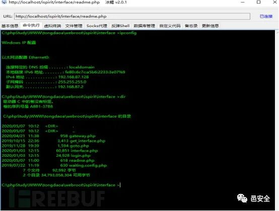

图 13：成功获取 shell1

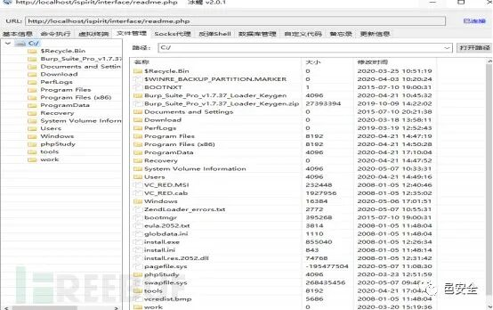

图 14：成功获取 shell2

最后剩下的就是构造 exploit 了，网上已经给出很多该漏洞远程利用程序，大家可以用来测试。

四、补丁比较 & 加固建议
-------------

#### 4.1 补丁比较

笔者本着学习的目的，下载了通达 OAv11.3 的补丁，并做了补丁比较，比较的结果如下：

第一处补丁补上了文件上传漏洞，无论参数是否为空，都要进行认证。如图 15 所示：

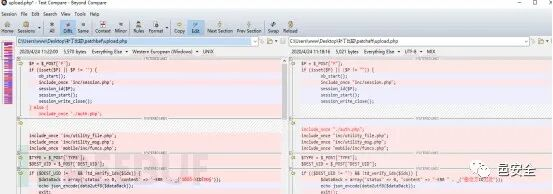

图 15：第一处补丁

第二处补丁将 “..” 过滤掉了，如果 url 中出现该符号，认为是错误的 url。这样就不可以执行路径穿越，也就访问不到非 webroot 目录下的文件了。如图 16 所示：

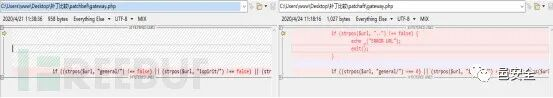

图 16：第二处补丁

#### 4.2 加固建议

建议使用受影响版本的通达 OA 用户登录通达 OA 官网，获取最新补丁。请根据当前 OA 版本选择所对应的程序文件，运行前请先做好备份。安全更新下载地址：http://www.tongda2000.com/news/673.php

转自 FreeBUF.COM  

欢迎收藏并分享朋友圈，让五邑人网络更安全  

欢迎扫描关注我们，及时了解最新安全动态、学习最潮流的安全姿势！  

  

  

推荐文章

1

[新永恒之蓝？微软 SMBv3 高危漏洞（CVE-2020-0796）分析复现](http://mp.weixin.qq.com/s?__biz=MzUyMzczNzUyNQ==&mid=2247488913&idx=1&sn=acbf595a4a80dcaba647c7a32fe5e06b&chksm=fa39554bcd4edc5dc90019f33746404ab7593dd9d90109b1076a4a73f2be0cb6fa90e8743b50&scene=21#wechat_redirect)  

2

[重大漏洞预警：ubuntu 最新版本存在本地提权漏洞（已有 EXP）](http://mp.weixin.qq.com/s?__biz=MzUyMzczNzUyNQ==&mid=2247483652&idx=1&sn=b2f2ec90db499e23cfa252e9ee743265&chksm=fa3941decd4ec8c83a268c3480c354a621d515262bcbb5f35e1a2dde8c828bdc7b9011cb5072&scene=21#wechat_redirect)

---

> 来源：MrWQ/vulnerability-paper（https://github.com/MrWQ/vulnerability-paper）
