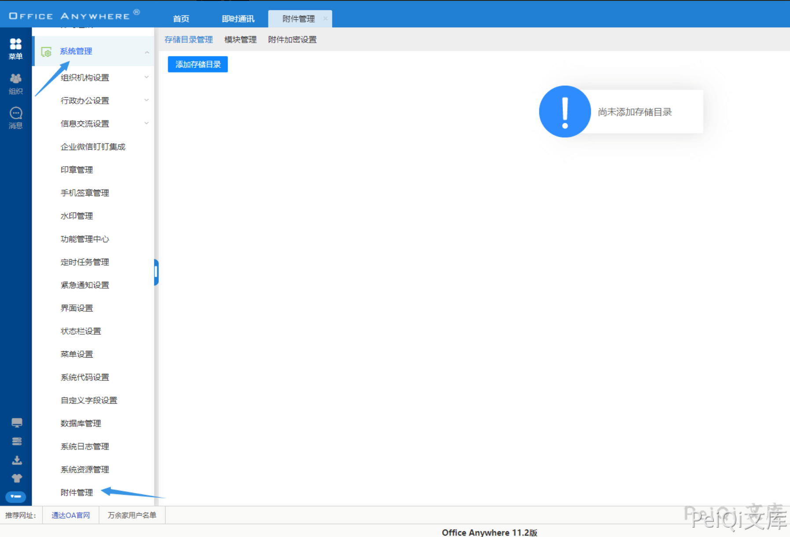
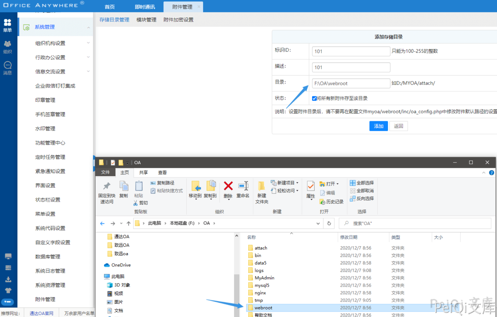
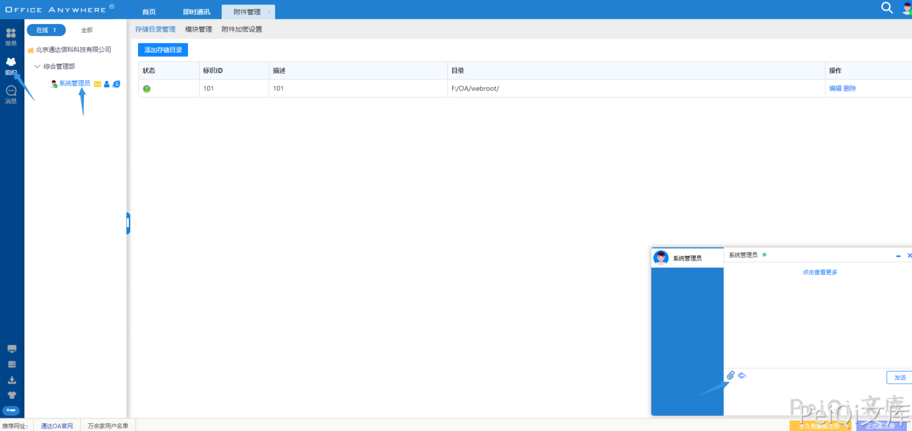
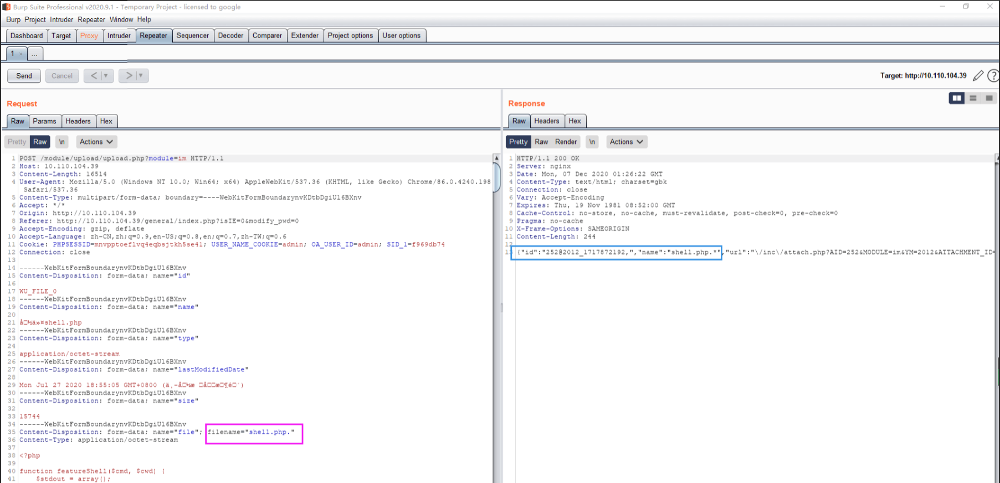
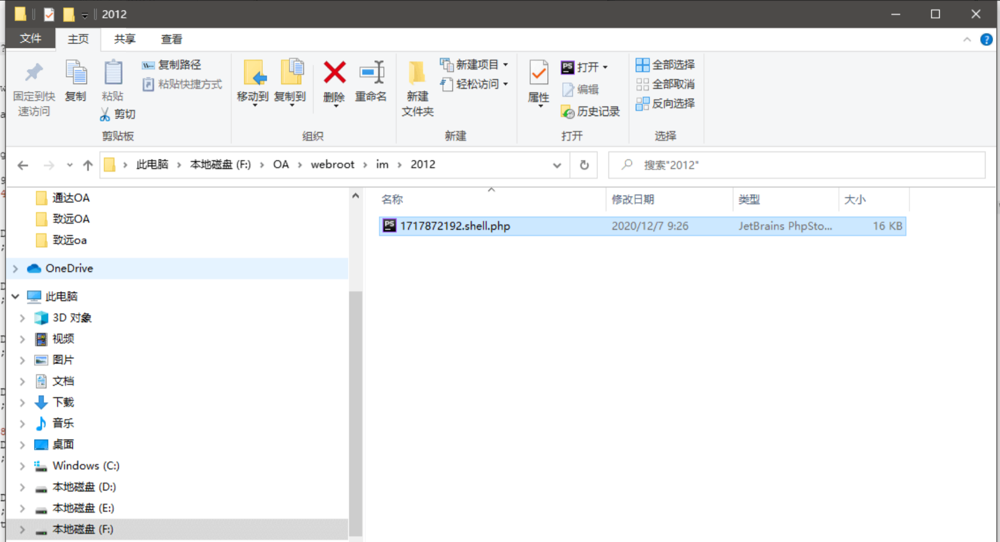
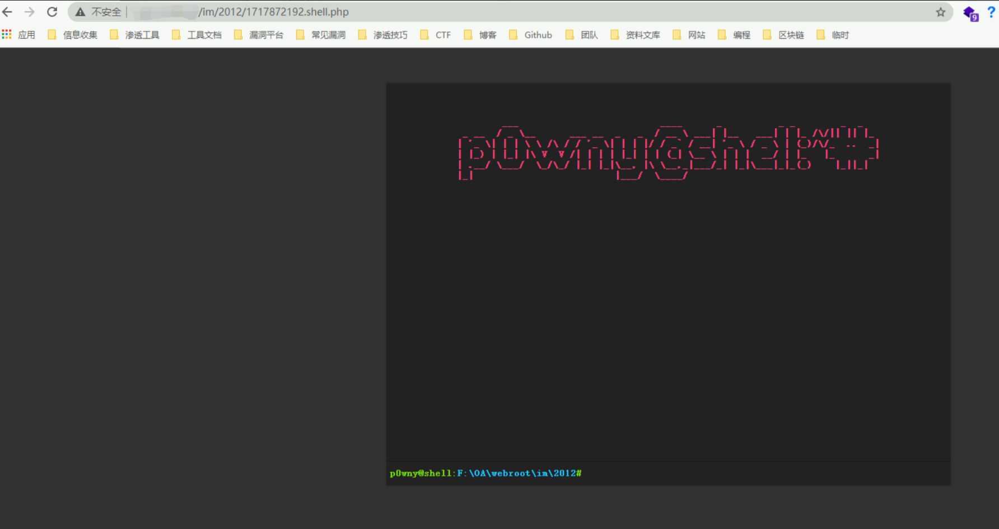

# 通达OA 后台附件目录配置+Windows后缀上传

## 条目说明

- 对象与具体问题：通达OA；后台附件目录配置+Windows后缀上传
- 版本、配置及部署条件：11.2 Windows；附件存储可设Webroot
- 认证与权限前提：需要登录且可管理附件存储目录
- 核验边界：已完成原始 Markdown 的文本审阅；未执行 PoC、未访问目标、未视检截图。来源所述影响与复现结果不等于本库独立验证。

## 证据边界与更正

以下记录原始资料的证据边界。可以由原文确定的产品、编号及格式问题已在本条修订；没有原始证据的版本、响应和补丁信息仍待核实。

- 标题仅upload.php未给完整路由，关键请求/响应只有图
- 不能简化任意用户登录即可RCE，需管理目录权限和可执行位置
- 日期2012及随机前缀为样例，不是固定路径；无修复依据

## 操作风险

文件写入/上传示例可能留下文件、覆盖数据或触发脚本执行；命令/代码执行示例可能改变主机状态。保留原示例供静态分析；仅可在明确授权的隔离测试环境验证，事先准备备份与回滚。凭据示例如含星号，仅保留首尾用于说明，不能直接使用。

## 技术资料与来源记录

### 漏洞描述

通达OA v11.2后台存在文件上传漏洞，允许通过绕过黑名单的方法来上传恶意文件，导致服务器被攻击

### 漏洞影响

```
通达OA v11.2
```

### 环境搭建

[通达OA v11.2下载链接](https://cdndown.tongda2000.com/oa/2019/TDOA11.2.exe)

下载后按步骤安装即可

### 漏洞复现

该漏洞存在于后台，需要通过登录后才能进行使用

登录后点击 **菜单 -> 系统管理 -> 附件管理**



点击添加附录存储管理添加如下(存储目录为 webroot 目录，默认为 **D:/MYOA/webroot/**)



点击 **组织 -> 系统管理员 -> 上传附件**



抓包使用 windows 的绕过方法 **shell.php -> shell.php.**



2012 为目录

1717872192 为拼接的文件名

最后的shell名字为 1717872192.shell.php



访问木马文件



---

> 来源：Threekiii/Vulnerability-Wiki（https://github.com/Threekiii/Vulnerability-Wiki）
