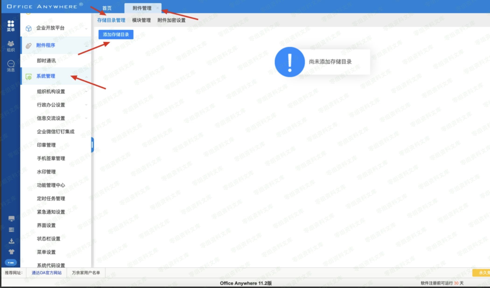
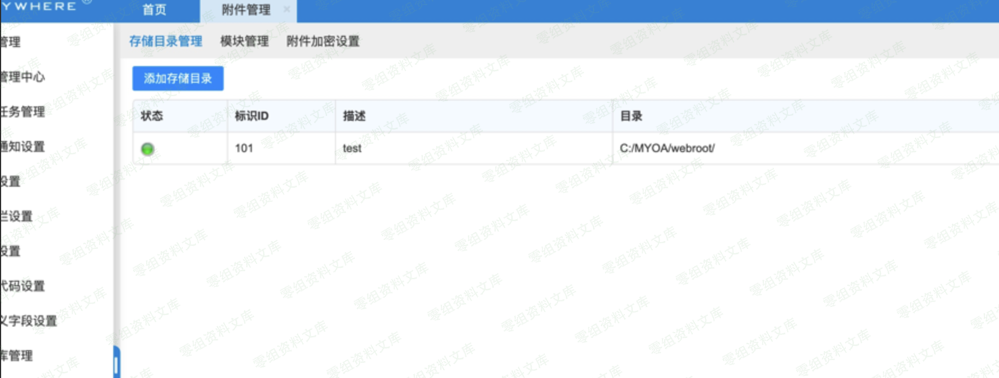
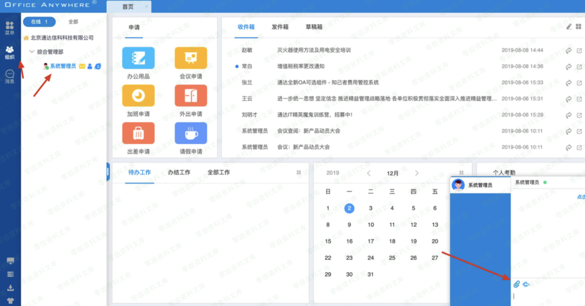
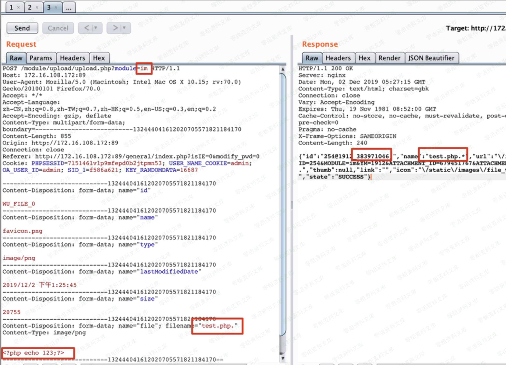
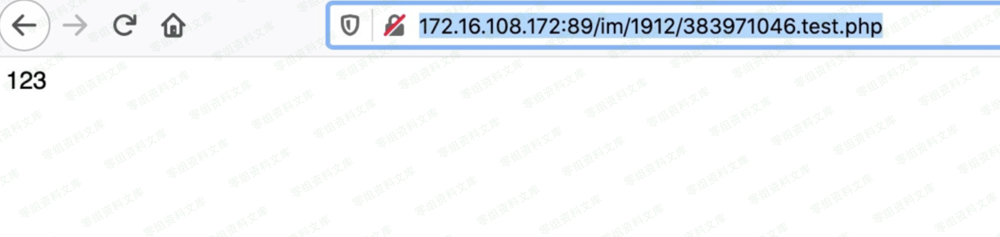

# 通达OA 后台附件目录+后缀上传

## 条目说明

- 对象与具体问题：通达OA；后台附件目录+后缀上传
- 版本、配置及部署条件：11.2 Windows
- 认证与权限前提：管理附件存储权限
- 核验边界：已完成原始 Markdown 的文本审阅；未执行 PoC、未访问目标、未视检截图。来源所述影响与复现结果不等于本库独立验证。

## 证据边界与更正

以下记录原始资料的证据边界。可以由原文确定的产品、编号及格式问题已在本条修订；没有原始证据的版本、响应和补丁信息仍待核实。

- 简介/范围空，核心请求全图；末尾image占位缺路径取证

## 操作风险

文件写入/上传示例可能留下文件、覆盖数据或触发脚本执行。保留原示例供静态分析；仅可在明确授权的隔离测试环境验证，事先准备备份与回滚。凭据示例如含星号，仅保留首尾用于说明，不能直接使用。

## 技术资料与来源记录

一、漏洞简介
------------

二、漏洞影响
------------

三、复现过程
------------

系统管理-附件管理-添加存储目录

设置存储目录 （一般默认网站安装目录为 D:/MYOA/webroot/
最后也有路径获取的地方，如果不设置会不在网站根目录下，无法直接访问附件）

寻找附件上传

通过.php. 绕过黑名单上传

根据返回结果拼接上传路径：/im/1912/383971046.test.php
直接访问（im是模块）

最后这有绝对路径的获取

image
