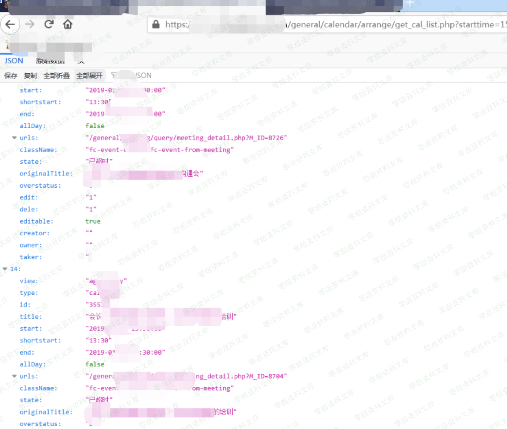

# 通达OA get_cal_list日程未授权

## 条目说明

- 对象与具体问题：通达OA；get_cal_list日程未授权
- 版本、配置及部署条件：11.5
- 认证与权限前提：声称未授权
- 核验边界：已完成原始 Markdown 的文本审阅；未执行 PoC、未访问目标、未视检截图。来源所述影响与复现结果不等于本库独立验证。

## 证据边界与更正

以下记录原始资料的证据边界。可以由原文确定的产品、编号及格式问题已在本条修订；没有原始证据的版本、响应和补丁信息仍待核实。

- 仅URL及截图，无响应类型/数据范围/鉴权对照
- 226第5项同端点，简介空无修复版本

## 操作风险

现有材料未完整列明副作用；示例不保证只读或无状态变化。保留原示例供静态分析；仅可在明确授权的隔离测试环境验证，事先准备备份与回滚。凭据示例如含星号，仅保留首尾用于说明，不能直接使用。

## 技术资料与来源记录

一、漏洞简介
------------

二、漏洞影响
------------

通达oa 11.5

三、复现过程
------------

    http://www.0-sec.org/general/calendar/arrange/get_cal_list.php?starttime=1548058874&endtime=1597997506&view=agendaDay

