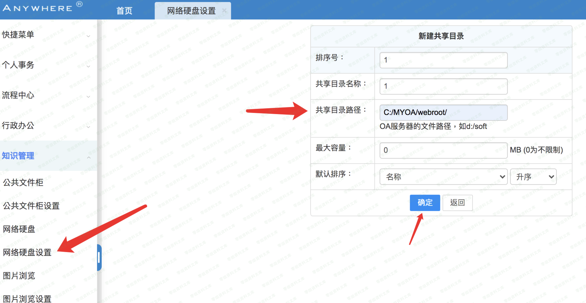
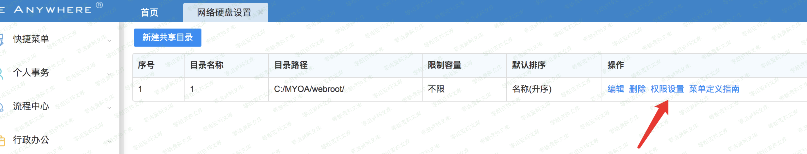
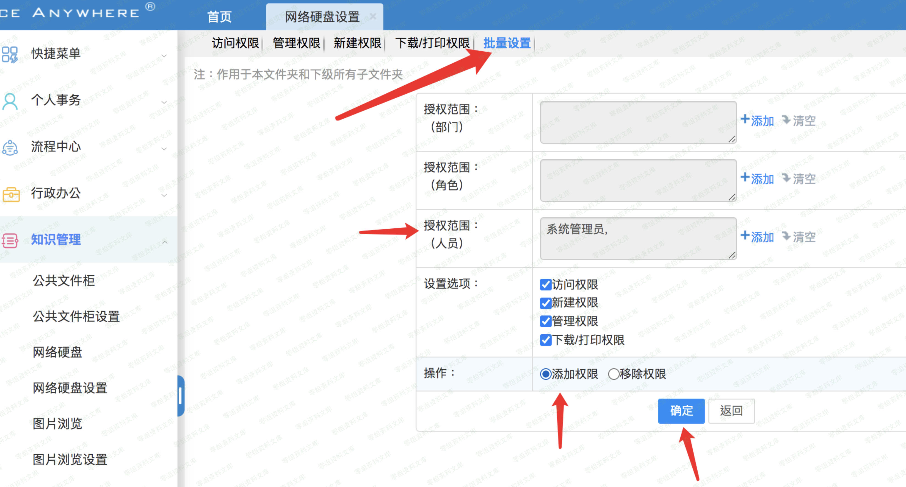
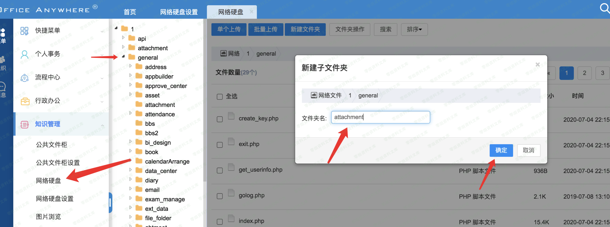
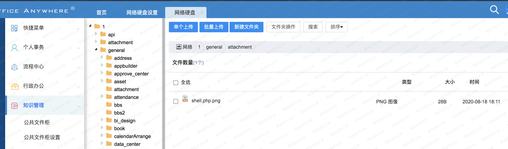

# 通达OA 网络硬盘目录配置+gateway包含链

## 条目说明

- 对象与具体问题：通达OA；网络硬盘目录配置+gateway包含链
- 版本、配置及部署条件：11.7，PHP/路径条件
- 认证与权限前提：后台管理权限
- 核验边界：已完成原始 Markdown 的文本审阅；未执行 PoC、未访问目标、未视检截图。来源所述影响与复现结果不等于本库独立验证。

## 证据边界与更正

以下记录原始资料的证据边界。可以由原文确定的产品、编号及格式问题已在本条修订；没有原始证据的版本、响应和补丁信息仍待核实。

- 与11.2附件上传渠道不同，不能仅同getshell标题折叠
- 需创建目录权限及PNG含PHP正文，未给完整上传请求/文件内容
- 万年不变措辞代替版本证据，缺修复说明

## 操作风险

文件写入/上传示例可能留下文件、覆盖数据或触发脚本执行。保留原示例供静态分析；仅可在明确授权的隔离测试环境验证，事先准备备份与回滚。凭据示例如含星号，仅保留首尾用于说明，不能直接使用。

## 技术资料与来源记录

一、漏洞简介
------------

需要后台管理权限

二、漏洞影响
------------

通达oa 11.7

三、复现过程
------------

找到网络硬盘，创建共享目录为webroot目录地址

进行权限设置

然后general在这里需要创建一个叫attachment的文件夹进行绕过

在attachment这个文件夹就可以上传png了

下面用通达万年不变的文件包含，格式为这个`https://www.0-sec.org/ispirit/interface/gateway.php?json={%22url%22:%22general/attachment/shell.php.png%22}&cmd=echo%20hhhhhh;`
