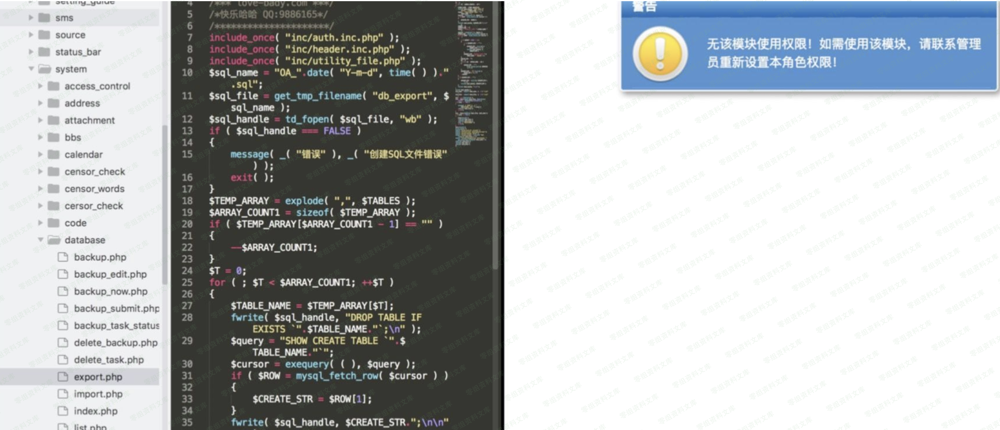
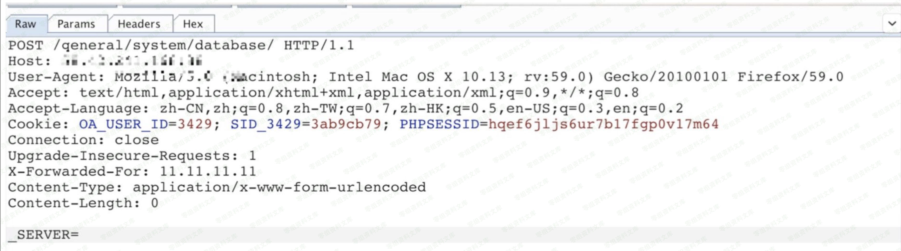
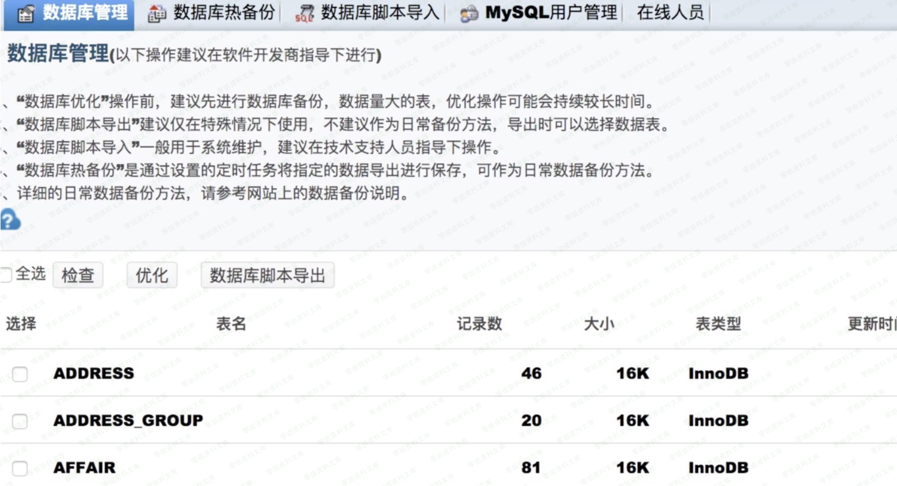

# 通达OA _SERVER参数管理员页面越权

## 条目说明

- 对象与具体问题：通达OA；_SERVER参数管理员页面越权
- 版本、配置及部署条件：2013/2015
- 认证与权限前提：普通用户/未登录未分清
- 核验边界：已完成原始 Markdown 的文本审阅；未执行 PoC、未访问目标、未视检截图。来源所述影响与复现结果不等于本库独立验证。

## 证据边界与更正

以下记录原始资料的证据边界。可以由原文确定的产品、编号及格式问题已在本条修订；没有原始证据的版本、响应和补丁信息仍待核实。

- 只有POST _SERVER说明无完整包/值，结尾截断
- 几乎所有页面泛化无逐端点证据；需区分权限提升和认证绕过

## 操作风险

现有材料未完整列明副作用；示例不保证只读或无状态变化。保留原示例供静态分析；仅可在明确授权的隔离测试环境验证，事先准备备份与回滚。

## 技术资料与来源记录

一、漏洞简介
------------

二、漏洞影响
------------

2013、2015版本

三、复现过程
------------

将get型访问转换成post,并且post参数\_SERVER,即可越权访问admin才能访问的⻚面。根据⽹上的通达
OA的源码找这些敏感地址,如: /general/system/database/

根据源码,几乎所有敏感的⻚面都可以使用这种方式进行越权访问,⽐如说设置⻆色权限的⻚面啊什么的。这个⻚
