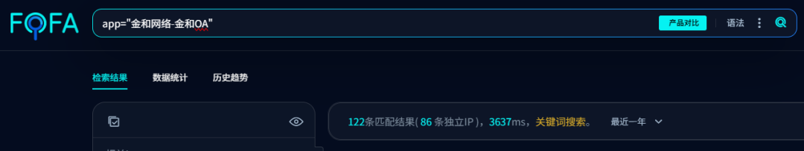
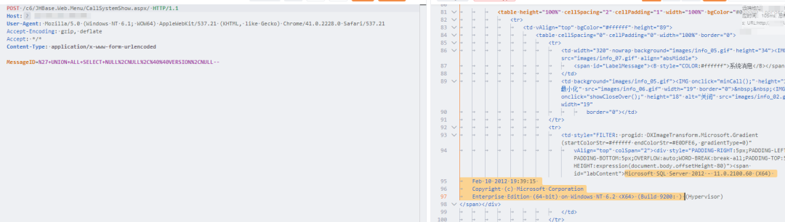
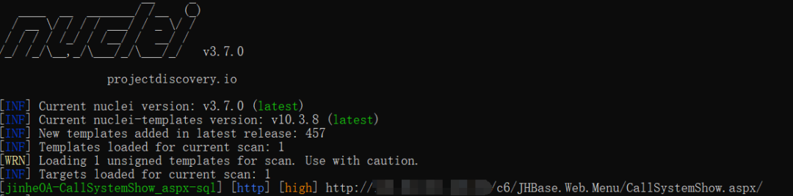
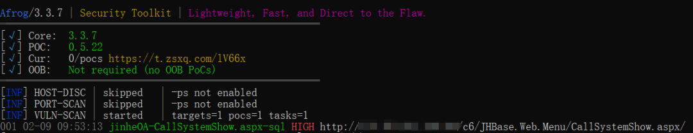
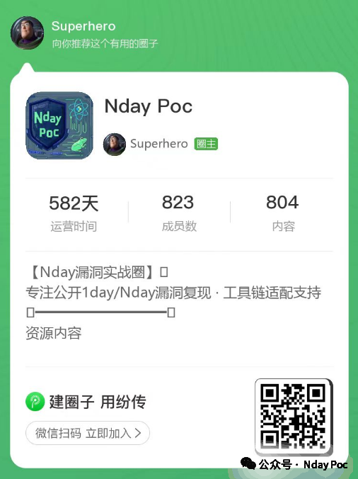

# 金和C6 CallSystemShow SQL 注入线索

## 条目说明

- 对象与具体问题：金和C6；CallSystemShow SQLi线索
- 版本、配置及部署条件：未披露
- 认证与权限前提：未披露
- 核验边界：已完成原始 Markdown 的文本审阅；未执行 PoC、未访问目标、未视检截图。来源所述影响与复现结果不等于本库独立验证。

## 证据边界与更正

以下记录原始资料的证据边界。可以由原文确定的产品、编号及格式问题已在本条修订；没有原始证据的版本、响应和补丁信息仍待核实。

- 技术请求/参数/nuclei/afrog内容全截图未视检，正文无可核PoC
- 无修复build，宣称高权限写木马只是潜在后果
- 大量收费圈广告，原文链接未给

## 操作风险

现有材料未完整列明副作用；示例不保证只读或无状态变化。保留原示例供静态分析；仅可在明确授权的隔离测试环境验证，事先准备备份与回滚。

## 技术资料与来源记录

Superhero
                    Superhero  Nday Poc   2026-02-09 01:58  
  
  
  
  
  
  
  
内容仅用于学习交流自查使用，由于传播、利用本公众号所提供的  
POC  
信息及  
POC对应脚本  
而造成的任何直接或者间接的后果及损失，均由使用者本人负责，公众号Nday Poc及作者不为此承担任何责任，一旦造成后果请自行承担！  
  
  
**01**  
  
**漏洞概述**  
  
  
金和OA CallSystemShow.aspx 接口存在SQL注入漏洞，攻击者除了可以利用 SQL 注入漏洞获取数据库中的信息（例如，管理员后台密码,站点的用户个人信息）之外，甚至在高权限的情况可向服务器中写入木马，进一步获取服务器系统权限。  
**02******  
  
**搜索引擎**  
  
  
fofa:  
```
app="金和网络-金和OA"
```  
  
  
  
  
**03******  
  
**漏洞复现**  
  
  
  
  
**04**  
  
**自查工具**  
  
  
nuclei  
  
  
  
afrog  
  
  
  
  
**05******  
  
**修复建议**  
  
  
1、关闭互联网暴露面或接口设置访问权限  
  
2、升级至安全版本  
  
  
**06******  
  
**内部圈子介绍**  
  
#### 【Nday漏洞实战圈】🛠️  
  
专注公开1day/Nday漏洞复现 · 工具链适配支持  
  
✧━━━━━━━━━━━━━━━━✧  
  
🔍 **资源内容**  
  
▫️ 整合全网公开1day/Nday漏洞POC详情  
  
▫️ 适配Afrog/Nuclei检测脚本  
  
▫️ 支持内置与自定义POC目录混合扫描  
  
🔄 **更新计划**  
  
▫️ 每周新增7-10个实用POC（来源公开平台）  
  
▫️ 所有脚本经过基础测试，降低调试成本  
  
🎯 **适用场景**  
  
▫️ 企业漏洞自查 ▫️ 渗透测试 ▫️ 红蓝对抗 ▫️ 安全运维  
  
✧━━━━━━━━━━━━━━━━✧  
  
⚠️ **重要声明**  
  
▫️  
仅限合法授权测试，严禁违规使用  
  
**▫️虚拟资源服务，购买后不接受任何形式退款**  
  
▫️  
付款  
前请评估需求，慎重考虑  
  
  
  
  


---

> 来源：gelusus/wxvl（微信公众号漏洞文章自动归档，原文见文首链接）
