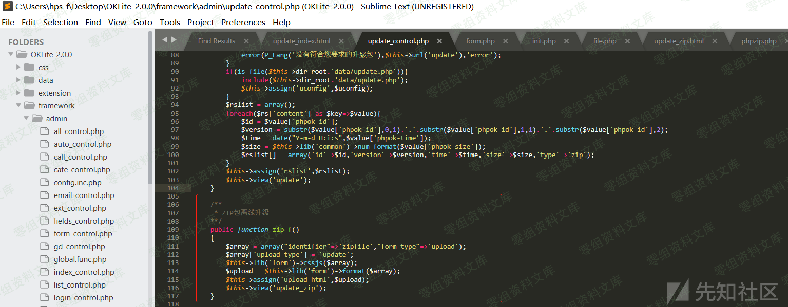
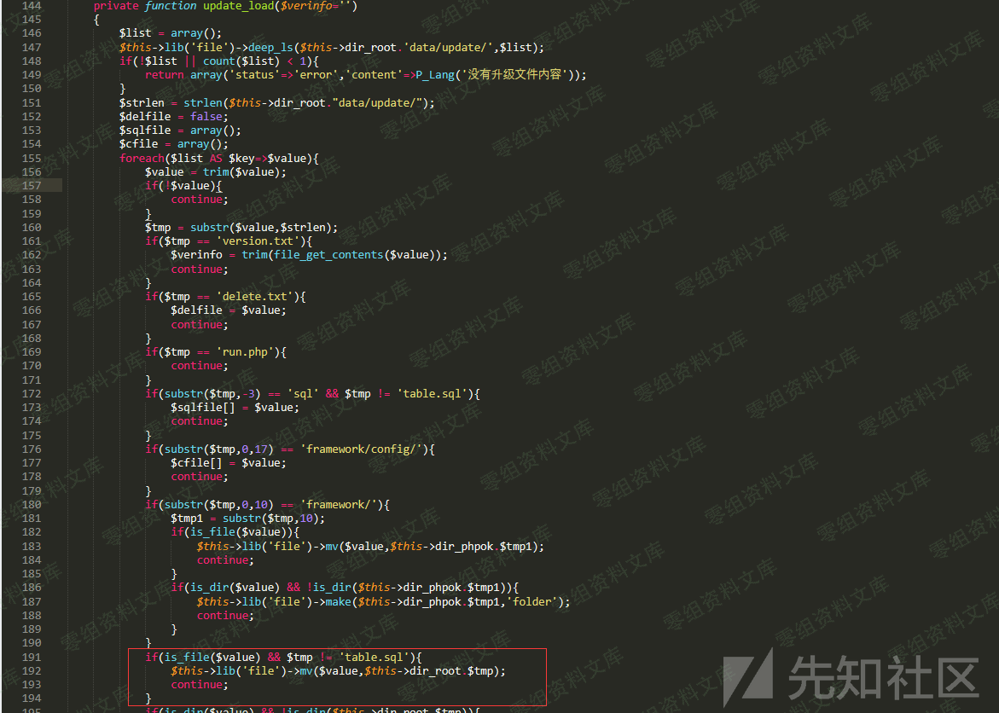

OKLite v2.0.0 后台更新压缩包导致getshell
========================================

一、漏洞简介
------------

OKlite
2.0.0管理后台支持压缩包升级，攻击者可以构造包含一句话木马的压缩包文件之后上传到目标服务器，目标服务器在升级过程中会自动解压该压缩包，将一句话木马解压出来，从而导致Getshell。

二、漏洞影响
------------

OKLite v2.0.0

三、复现过程
------------

### 漏洞分析

文件位置：`OKLite_2.0.0\framework\view\update_index.html`逻辑代码：zip压缩包升级时会自动调用update类中的zip函数来构造上传表单：

文件位置：`OKLite_2.0.0\framework\admin\update_control.php`代码逻辑：调用zip函数来构造zip上传表单

文件位置：`OKLite_2.0.0\framework\libs\form.php`代码逻辑：格式化表单信息

文件位置：`OKLite_2.0.0\framework\view\update_zip.html`代码逻辑：使用上传的zip文件进行升级

文件位置：`OKLite_2.0.0\framework\admin\update_control.php`代码逻辑：解压压缩包进行升级

文件位置：`OKLite_2.0.0\framework\libs\phpzip.php`代码逻辑：解压缩更新包，在解压时未做任何检查操作

文件位置：`OKLite_2.0.0\framework\admin\update_control.php`代码逻辑：执行程序升级

之后会逐一匹配压缩包中的文件，如果未匹配到会直接解压到根目录下面，所以我们这里可以构造一个shell.zip，之后在压缩包中放置包含一句话木马的shell.php文件，之后进行更新，直接可以Getshell\~

### 漏洞复现

构造shell.zip文件如下：

之后选择压缩包升级，上传压缩包

之后点击"开始升级"进行升级：

之后在网站根目录下可以看到shell.php文件生成：

之后使用菜刀远程连接：

成功getshell

参考链接
--------

> https://xz.aliyun.com/t/8130\#toc-3
