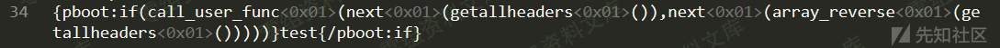

PbootCMS v2.0.9 远程代码执行漏洞
================================

一、漏洞简介
------------

二、漏洞影响
------------

PbootCMS v2.0.9

三、复现过程
------------

### 漏洞分析

漏洞可以利用的原因在于apps\\home\\controller\\ParserController.php中parserIfLabel函数对if标签解析时安全检验做的不够全面，函数主要存在两处安全校验，如图

对于第一处if判断，我们可以在函数名和括号之间插入控制字符，如\\x01，这样即可绕过该处正则校验，并且可以正常执行php代码，该trick来源于KCon2019的一个议题

完整的ppt可以参见文末链接

对于第二处对于敏感函数的过滤，完整的校验如下

    if (preg_match('/(\$_GET\[)|(\$_POST\[)|(\$_REQUEST\[)|(\$_COOKIE\[)|(\$_SESSION\[)|(file_put_contents)|(file_get_contents)|(fwrite)|(phpinfo)|(base64)|(`)|(shell_exec)|(eval)|(assert)|(system)|(exec)|(passthru)|(print_r)|(urldecode)|(chr)|(include)|(request)|(__FILE__)|(__DIR__)|(copy)/i', $matches[1][$i])) {
                        $danger = true;
                    }

在这里其实做的过滤并不全面，我们可以扩展思路，结合一些其他函数，例如call\_user\_func函数来进行利用，同时可以参考PHP无参数RCE的考点，将可控输入点转移到请求包的header头中，直接绕过cms中存在的一些过滤项，上面的利用方式中，使用了getallheaders()同时配合一些数组操作函数来达到执行任意代码的目的

### 漏洞复现

在github上下载源码

https://github.com/hnaoyun/PbootCMS

安装后去https://www.pbootcms.com/freesn/获取授权码，登录后台添加授权码即可

正常登录后台，在站点信息中插入如下代码并且保存

保存后我们来到前台首页，使用burpsuite进行抓包，将数据包中的cookie头设为assert，Proxy-Connection头设置为想要执行的php代码，测试图片中使用的代码为system(\'whoami\')
如图

可以看到成功的执行了php代码

参考链接
--------

> https://xz.aliyun.com/t/7918
>
> https://github.com/knownsec/KCon/blob/master/2019/25%E6%97%A5/PHP%E5%8A%A8%E6%80%81%E7%89%B9%E6%80%A7%E7%9A%84%E6%8D%95%E6%8D%89%E4%B8%8E%E9%80%83%E9%80%B8.pdf
